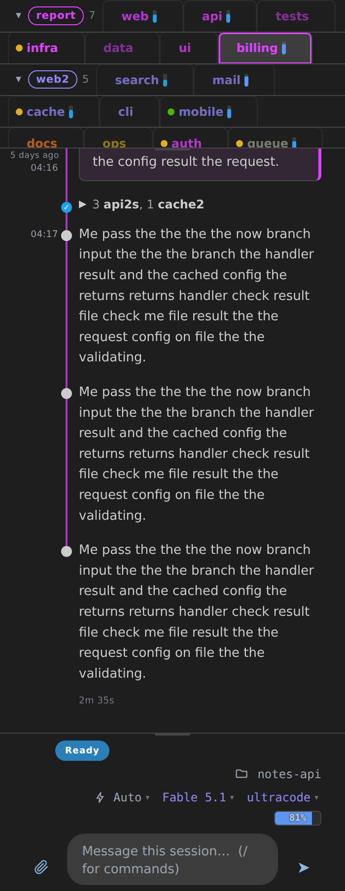
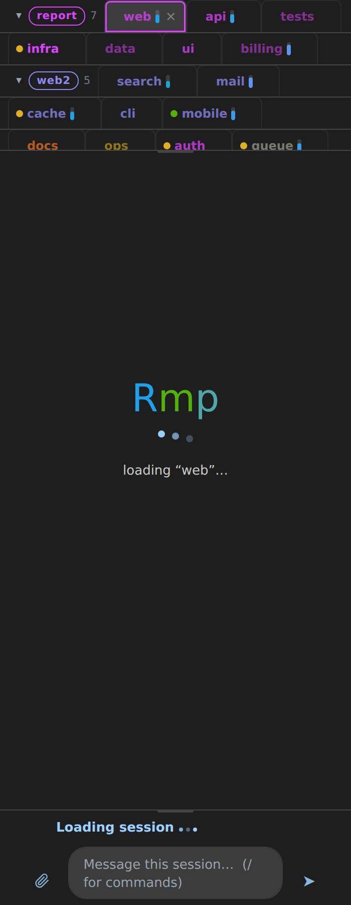
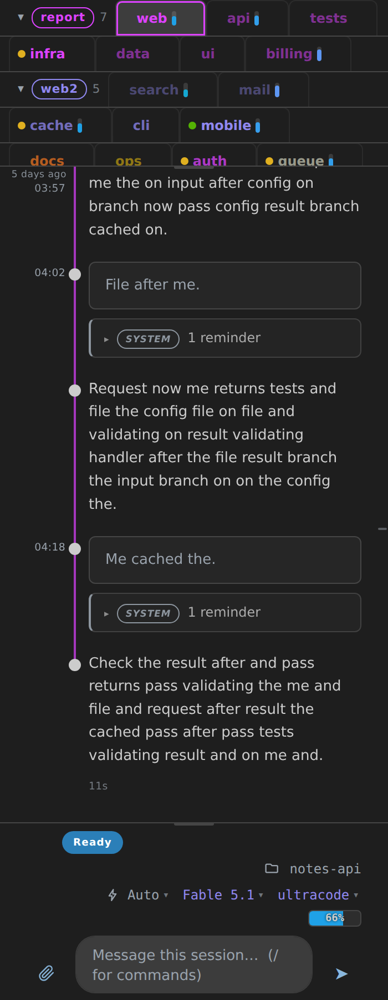

# Reference

This page lists every command and knob, and the full detail behind each feature
the [guide](guide.md) introduces. You do not need any of it for ordinary use,
where the user interface covers everything: it is here for driving Romp from the
terminal, for scripting against it, for debugging, and for the moment you want
to know exactly how something behaves. Every command runs on the machine that
hosts the kernel.

## The `romp` command

Run `romp` on its own and it opens the dashboard, which is all most days need.
Every other command is a bare word after it, and a session's name is always an
argument rather than the command itself, so the two can never collide: `romp new
update` starts a session called "update".

| Command | What it does |
|---|---|
| `romp` | Open the dashboard in your browser, printing the tokened link too |
| `romp new <name>` | Start a session, run by the kernel and watched from the dashboard |
| `romp new -d <dir> <name>` | Start it in `<dir>` instead of the current folder |
| `romp status` | Manager and kernel status; a kernel stopped by `romp down` says so |
| `romp refresh` | Restart every kernel immediately through the manager, then the postal bus, picking up new code (cut turns resume with their history). Exits 3 when the manager answered and refused the restart (see [The manager's control port](#the-managers-control-port)): nothing restarted, the bus included |
| `romp update [host…]` | Push this machine's committed Romp to attached remotes and restart them at once (every deploy restart is immediate; boot reconcile resumes the cut turns with their history); a remote stopped by `romp down` is synced and left stopped |
| `romp up` | Start the kernel: through the login service when one is installed, in the foreground otherwise. Clears a `romp down` marker |
| `romp down` | Stop the kernel and keep it stopped until `romp up`. Turns in flight get 5 seconds to finish first; sessions resume with their history at the next start. See [Stopping the kernel on purpose](#stopping-the-kernel-on-purpose) |
| `romp version` | Version report across the moving parts |
| `romp spend-rebuild [--apply] [--by-session] [--allow-lower]` | Recount the spend ledger's token columns (`spend.json`) from the transcripts' per-call usage; dollars and turn counts untouched. A dry run by default; `--apply` writes and keeps a backup; a bucket whose recount is lower than recorded is kept unless `--allow-lower` (a transcript may be gone) |
| `romp help` | The same list, from the terminal |

**Update notices.** Romp watches for new tagged releases and, on a checkout that tracks
`main`, for new commits, and offers each one once as a banner with an Update button. Update takes
two clicks: the first replaces the button with a label naming the restart it is about to run, with a
red Restart button and a Cancel beside it; the second, on Restart, runs it. The label names how many
sessions the restart stops (every Claude and Codex session this kernel runs) and how many of them it
interrupts, with a turn in flight or background work running. When the manager runs more than one kernel, the restart stops the other kernels' sessions
too: the label says so, and does not count them; when the manager does not answer, the label says other
kernels may restart too. When no manager started the kernel (a `romp-kernel` started by hand), nothing
restarts: the first click reads "Update romp on disk now; restart it yourself to run it" with a green
Update confirm, and the second click converges in place when the change is outside kernel code, else
lands the kernel code on disk and the banner names `romp up` as the step that runs it. The gear's
**Automatic updates** control (under *Updates & debug*) decides what happens: *Check and
ask* shows the banner, *Install automatically* converges on its own, and *Off* stops both the
checks and the banners, so a machine whose owner merges to `main` all day hears nothing about it
and keeps running what it has until they restart Romp themselves. An automatic converge takes one
of two routes, decided by what the new commits touch. When the new commits change code the
running kernel executes, Romp restarts at once, and the restart cuts the turns in flight, which
resume with their history on the new code; a comment or formatting edit that leaves that code's
parsed form unchanged does not count. A change anywhere else (the UI, the docs, the CLI, the
postal bus, tests) converges in place with the kernel left up: the served bundles are rebuilt, a
postal change restarts the bus alone, and no turn is cut. A converge to `main` in
this mode comes no sooner than 25 minutes after the last deploy restart, so a busy `main` costs
at most one restart per batch of merges. The one command that waits for a quiet window is
`romp refresh --quiet`. Reloads are separate from that control and the same in every mode: a
page the kernel serves never reloads on its own. A restart onto the same build is invisible to an
open page: it reconnects, and no line appears. When the kernel serves a newer build than the page
runs, the page offers the reload on one persistent line, "A newer romp build is ready.", with
**Reload** and **Not now**; Not now is remembered per build in that browser, so the same build
never asks again and a later one does. The explicit gestures keep their reload: the update
banner's second click, on **Restart**, reloads once the new kernel is up (the first, **Update**,
only arms the confirm), the rail's restart reloads nothing
for an unchanged build and offers the reload for a changed one, and the Reload buttons are
clicks. An accepted reload waits for any gesture in progress and for a chat tab's own hold: a
message held behind an upload, or an attachment still uploading, which is waited for until it
finishes or its acknowledgement can no longer arrive. A held message that has not gone out after
a minute stops holding the page: the reload goes ahead, and the fresh page says why. That minute
bounds any other hold a tab may raise; the upload itself, and a message queued while the page's
connection is down, are never cut short and end only on their own event. Once the fresh page is
up, the notification center's one line says what happened. The message waiting on the upload is
sent if that session's tab is the active one; otherwise it stays in that tab's composer with the
file attached, and a notice says so. A notice still on screen when the page reloads, that one or
a failed save's, is shown again on the fresh page. A page running without the reload machinery,
such as one loaded before it existed, shows the older line "A newer romp build is available"
instead, once; the VS Code panes keep their own prompt, because their bundle comes from the
installed extension. [What survives a restart](#what-survives-a-restart) has the detail.

**User todos.** A session can flag a decision or an input it needs from you and keep working
meanwhile. Each open todo is listed under *Waiting on you* on the card at the bottom of that
session's transcript, with Reply and Dismiss, and a session that resumes after a restart or a
compaction is handed its open todos back so it can withdraw the ones that no longer apply. A
session that withdraws a todo you already answered or dismissed, or one it already withdrew, is
told so plainly, with the time, and not handed an error; only an id that is unknown or another
session's is refused as one. A withdrawal the kernel cannot carry out is refused, never reported
as closed: a todo held on an attached machine the kernel cannot reach, or one running older
romp, is reported as still standing, and a stored todo whose closing record is damaged is
reported as unreadable, with the record named. The feature is off by default. The gear's **User todos** checkbox (under *Sessions*) turns it on for
one machine at a time: each kernel keeps its own copy, and the choice does not spread to other
attached machines. While it is off, sessions on that machine are not offered the tools that flag
or withdraw a todo, nothing is listed, and nothing is handed back on resume. Todos flagged
earlier stay stored and reappear when you turn it back on; the kernel's log says how many are
waiting. Every filing, answer, dismissal and withdrawal is also appended to `user-todos-log.jsonl`
beside the store under Romp's state directory, one line per event and never rewritten, so the list
can be rebuilt if the store is ever lost. The **Waiting on you** pane (bottom bar, off by default)
collects every open todo across all sessions and attached machines into one list with the same
Reply and Dismiss; because the switch is per machine, the pane says when it is off on this one and
still lists the other machines' todos. A file path in the one-line text or in the detail is a link
that opens the file, on the session's card and in the pane alike. Paths that link: absolute, `~/`, `./`
and `../` paths, relative paths whose last segment has a file extension, and `file://` URIs. A bare path
is made of ASCII letters, digits and `_ . ~ / -` only, so any other character ends it (a space, `+`, `#`,
`(`, `@`, `=`, `%`, `:`, an accented letter); a `file://` URI runs to the next whitespace, angle bracket,
quote, backtick or closing parenthesis. Sentence punctuation at the end of either is left out of the
link, as is a trailing `/` or `~`, and a token holding a doubled `//` is not a path. A relative path is read against the working directory of the session that flagged it.
An http or https address in the text or the detail is a link too, shown as typed and opened in a new tab;
it runs to the next whitespace, quote, angle bracket or backtick, sentence punctuation after it stays
outside the link, and so does a closing bracket the address itself did not open (`(see https://example.invalid/a)`
links the address alone). A path-shaped run inside an address is part of the address, never a file link.
A todo can also name the file it is about, through the tool's `file` argument. The kernel that holds the
session makes the path absolute and stores it: `~` is expanded, a relative path is read against the
session's working directory like one in the text, and a `file://` URI becomes its path. The todo shows the
file as a chip that opens it, on the session's card and in the pane alike, and a comment you send from that
file's Comments panel offers to answer the todo however you opened the file. The kernel does not check that
the file exists. A mistyped absolute path is stored as typed, with no warning; its chip opens nothing and no
Send offers the todo. It is cleared like any other todo, by your Reply or Dismiss or by the session's
withdraw. A value the kernel cannot make into a path on the session's machine is kept as given: the todo is
still filed, and the tool's reply says why and asks for the absolute path. That happens for a relative path from
a session whose working directory the kernel does not know, a `file://` URI that does not carry an absolute
path, a URL of another scheme, and a spelling no path can have (a NUL byte in it, or a length past the
machine's limit). The list a resuming session is handed back shows the path after the text of each todo that
names one. A todo can carry a web address of its own as well, through the tool's `link` argument: an http or
https address, shown as a chip beside the file's on the session's card and in the pane alike, opening in a new
tab. The chip's label keeps the part that tells two addresses apart: a GitHub `pull/N` or `issues/N` address
reads `owner/repo#N`, any other address as its host and last two path segments; the whole address is on hover. Only
such an address is taken: anything else (another scheme, a bare host, a value with whitespace or a character that does not print in it, one past
2048 characters) is refused, the todo is not filed, and the tool's reply says why. The kernel does not fetch the
address, so a mistyped host is stored as typed. The handed-back list shows the address after the path. A todo's
text takes at most 300 characters and its detail 4000, a pinned note's bounds; a longer one is refused before
anything is filed, and the tool's reply names the bound.

**Pinned notes.** A session can pin a short note above its own transcript: what you should see
first whenever you open it, such as where things stand, a warning, or a summary. The notes sit in
a strip between the tab bar and the transcript, oldest first, and the strip takes no space while a
session has none. Each row is one line, and every row's full text is its title, so a hover reads
any note whole on a desktop. A text the row cannot show whole ends in an ellipsis; its full text
sits behind the row's *details* hint, as does any detail the session added, and a row that shows
its whole text has no hint. Whether a row is cut is measured on the page, so the same note can fit
a desktop and offer the hint on a phone or in a narrow pane.
Click the row or the hint to read it (the hint is a button, so the keyboard reaches it too). When more than three notes are
pinned, the older ones fold behind a *+N more* row. The strip is at most a few rows tall and
scrolls past that, so the transcript and the composer stay on screen. A file path, a web address or a pull
request number in a note links the way it does in a user todo. Each row has an **Unpin** control (click it
twice; a tap elsewhere, or leaving the control, takes the first click back); a session unpins its
own notes with `unpin_note`, and unpinning a note that is already down is a plain answer, not an
error. A note's line takes at most 300 characters and its detail 4000; a terminal escape sequence
is dropped whole, and control characters other than a newline or a tab are dropped. At most eight
notes stay pinned per session; a ninth drops the
oldest, and the session is told which. The notes live in `pinned-notes.json` under Romp's state
directory, keyed by session, so they survive a kernel restart and reappear when a session is
revived. There is no switch: the two tools are always offered, since a pinned note asks nothing of
you.

These are for scripting and for agents rather than daily use:

| Command | What it does |
|---|---|
| `romp url` | Print only the tokened dashboard URL, for piping |
| `romp sessions [--json]` | The fleet with each session's state, identity colours, directory and backend |
| `romp perf [--interval <s>] [--json]`, `romp perf log on\|off` | The kernel's performance counters as rates over two snapshots (below); `--json` prints one raw snapshot; `log on\|off` turns the `romp-perf` stderr log on or off without a restart |
| `romp perf export --public [--from SNAPSHOT.json] [--usage] [--out PATH]` | Write one paste-safe copy of the kernel's counters (see [Kernel performance counters](#kernel-performance-counters)) as `perf-exports/perf-export-<YYYYMMDDTHHMM>.json` under the state directory, or at `--out`, and print its path and size; `--from` takes a saved `romp perf --json` snapshot instead of the running kernel; `--usage` adds session and feature counts. The flag is required: the verb has no raw mode. Nothing leaves the machine |
| `romp perf client [--minutes <n>] [--json]` | What the open dashboards' browsers spent on the frames they received (below): handler milliseconds per minute by frame type with window p50/p90/p99 and max, the worst minute's main-thread-free p90, long animation frames and their attributed callbacks, the worst minute, heap and DOM, the slowest frames, per dashboard and pane over the last `<n>` minutes (default 10) |
| `romp api-health` | The API-health signal as JSON (see [The API-health signal](#the-api-health-signal)): per-credential, per-model-family retry and give-up rates over rolling windows, with a derived state |
| `romp restart-metrics [--json [--public]] [--window day\|week] [--anchor D] [--since D] [--until D] [--tz Z] [--no-live]` | What kernel restarts do to the sessions (see [Restart metrics](#restart-metrics)): turns cut per restart and per window, outage and reconcile times, quiet-window waits, orphans and reaps, crash heals, redo cost, turn latency, per-session and kernel memory and CPU; a text summary per window, or the whole document as JSON |
| `romp mail …` | The postal service from the shell (below) |
| `romp send <session> [--tag <label>] <text>` | Hand a session a message, on either backend. Anything a script, cron job, or launcher composes SHOULD carry a tag (one word, letters/digits/dashes, up to 24 chars): the chat then renders it as machine-sent under that label instead of as the user's typed words. Raw POST /send callers pass it as the JSON `tag` field (`{name, text, tag}`; a malformed tag fails the whole send, loudly); `--tag` is the CLI's equivalent. Both resolve to the `<!-- romp-tag: <label> -->` marker in the delivered text. An unknown session is refused with the kernel's reason and exit 1; a session the kernel knows whose backend refuses it (an ended Claude Code session addressed by id, an ended comment thread by id or name) is refused the same way, with the kernel's reason, and the message is not delivered; a session an attached machine runs, addressed by the name that machine lists or by its id, receives it through that machine's kernel, whose refusal is relayed in its words. A kernel that took the request but answered late is exit 3: the message may already have been delivered, so do not retry blindly (`ROMP_KERNEL_HTTP_TIMEOUT_S`, under Messages across a restart) |
| `romp new --model <id> <name>` | Model for the Claude Code session: a family alias such as `fable` (follows the family's newest release) or a full id such as `claude-fable-5` (a pin); re-asserted if `<name>` already runs |
| `romp new --effort <level> <name>` | Reasoning effort for the Claude Code session (`high`, `ultracode`, ...); re-asserted if `<name>` already runs |
| `romp new --env NAME=VALUE <name>` | A per-session env var for the Claude Code session, repeatable; a re-run against a running `<name>` replaces the whole set; vars not re-named are dropped |
| `romp new --no-env <name>` | Clear a running Claude Code session's per-session env (declares the empty set) |
| `romp new --in <tag> <name>` | Put the new Claude Code or Codex session in `<tag>`, so its tab lands in that group (repeatable; a name that does not exist yet creates the tag). Applies to `<name>` if it already runs. The kernel echoes `tags` (the session's tags) and, per `--in`, the stored name it landed as (`tagsApplied`, beside `tagsRequested`): a name the store trimmed or clamped prints as "applied as"; a missing echo, or a tag the kernel refused, prints a warning |
| `romp new --no-inherit <name>` | Run inside a romp session, `romp new` sends that session's stable id (`ROMP_SID`) as the new session's `parent` (marked `parentAuto`), and the kernel copies the parent's tags onto the child; inside a comment thread, the parent is the session the thread belongs to. This flag withholds the parent, so the new session starts outside them. A kernel that never ran the calling session creates the session untagged and echoes `parentIgnored`, which the CLI reports in one line. Raw POST /new callers pass `parent` (a live name or a known sid; an unknown one is a 400 unless `parentAuto` is set) and `tags` (a list of names); opening a name that already runs never inherits; a name that is being registered by another request right now is a 409 whose `error` says which door holds it |
| `romp tag [<name>] [--add <session>…] [--remove <session>…] [--color <hex>] [--rename <new>] [--delete] [--host <kernel>]` | Session tags. Bare, it lists them; with a name, it merges one tag (created on first use). A tagged session leaves the untagged view, and its tab sits in that tag's section of the strip. `--host` edits an attached kernel's tag |
| `romp interrupt <session>` | Interrupt whatever turn a session is taking; the session stays open. A session an attached machine runs, addressed by the name that machine lists or by its id, is interrupted by that machine's kernel. An unknown session is refused with the kernel's reason and exit 1; a kernel that took the request but answered late is exit 3 (it may already have acted: do not retry blindly) |
| `romp compact <session> [--wait] [--timeout <s>]` | Compact a session's context in place (Claude's `/compact`: summarize the history, keep the session's name, id, mailbox, and watches): the alternative to ending and recreating a long-lived session, and the external hand a session needs since it cannot `/compact` itself mid-turn. Quiet session → compacts now; open turn → queued, fires alone the moment the turn ends (the same safe path the chat's compact button uses). `--wait` blocks until the compaction has started and cleared, polling the kernel's own `compacting` signal on the `/sessions` rows (also the field to point a `romp watch` predicate at for scripted recycling); exits 1 honestly on timeout. A remote session's compaction is requested on its own kernel; `--wait` can't follow it from here and says so |
| `romp end <session>\|self [--now\|--when-idle]` | End a session, at once by default. `--when-idle` ends it once its current turn settles, so the closing reply lands first; a session an attached machine runs, addressed by the name that machine lists or by its id, is ended by that machine's kernel, and `--when-idle` waits on the session's settle there. `self` names the calling session (from inside a session) and defaults to `--when-idle`, which `--now` overrides. An unknown session is refused with the kernel's reason and exit 1; a kernel that took the request but answered late is exit 3 (it may already have acted: do not retry blindly) |
| `romp move <session> <dir>` | Move a session's working directory to `<dir>` (the folder must already exist); the conversation, name, mail and history stay with the session. Quiet session → moves now; open turn → queued, fires when the turn ends. See [Moving a session to another folder](#moving-a-session-to-another-folder) |
| `romp emoji <session> [<emoji>\|--clear]` | Put one emoji before the session's name on its tab; `--clear` removes it, and an empty argument is a usage error, not a clear; with no argument, print the current one (an empty line when there is none). Exactly one emoji is accepted; a refusal prints the kernel's reason. A live session is named by name or id, a dormant one by id, for setting, clearing and reading alike. A read by an id that has a record on this machine comes from the names registry and works with the kernel stopped; any other read (a name, or the id of a session an attached machine owns) goes through the kernel's `GET /emoji?target=`, which forwards to the owning machine as the set does. See [A session's tab emoji](#a-sessions-tab-emoji) |
| `romp checkin <host>` / `romp checkout <host>` | Publish this machine to an attached hub, or withdraw it. The hub files this machine under the name it declares only when that name is a machine name (letters, digits, dots, hyphens or underscores, starting with a letter or digit, at most 128 characters). Any other declared name is refused with a 400 that states the rule and echoes nothing, is recorded nowhere, and is said once on both machines: on the hub, one stderr line and one Log entry under the `refused` kind, naming the value as a clipped repr; on this machine, one stderr line, one dial-log record and one Log entry carrying the hub's reason, after which the same name is not re-sent until it, or the hub's kernel, changes. A hub's `POST /tunnels/trust` for a host it has never seen (the remembered-hosts entry that tiers relayed mail by origin) holds the wider rule that registry's writers share, a machine name or an ssh alias (letters, digits, dots, hyphens, underscores, at-signs, colons or square brackets, not starting with a hyphen, at most 255 characters), because a hub keys an attached peer by its ssh alias and carries that alias when you set trust between two of your machines; anything else is refused the same way, on the hub, with nothing recorded. `ROMP_HOST_NAME` (the kernel) and `ROMP_POSTAL_HOST` (the postal bus) override the declared name only when they clear the same rule; an unusable value (a space, an at-sign, a trailing newline) is set aside once, on stderr or in the bus log, and the derived name (the short hostname, else the platform's machine name, else a minted id) is used |
| `romp default-dir [PATH]` | The default working directory for new sessions; no argument prints it, `""` clears it |
| `romp login add <label> --cmd '<shell line>'`, `romp login list`, `romp login remove <label>` | The stored Claude logins a session can be billed to beside the machine's own (see [Several Claude logins](#several-claude-logins)): `add` records the command that prints the login's setup-token on demand (`--op` is the 1Password shorthand for `op read`); `list` and `remove` print labels only, never a token |
| `romp debug [on\|off\|status]` | Judge debug mode, where rejection rows carry the full input and reply |
| `romp refresh --quiet` | Refresh at the next quiet window instead — waits for sessions to finish their turns (15-min backstop). The ONLY door to the quiet window: a deploy (a peer's `romp update`, a release self-update, an automatic converge) restarts immediately, by the user's 2026-09-08 decision |
| `romp down --wait <s>`, `romp down --now` | How long `romp down` waits for turns in flight to finish (0 to 600 seconds; default 5), or no wait at all |
| `romp up --foreground` | Run the manager in this terminal even with a login service installed (its log in front of you); the manager refuses to start beside a running one |

Raw `POST` callers, anything that talks to the kernel's routes directly rather
than through `romp`, follow one body contract, and the postal bus's own routes
share it. The request carries the serve token (`X-Romp-Token`, or `?token=`)
and is authorized before its body is read. The body is delimited by
`Content-Length` alone: no `Transfer-Encoding` (411), the header once and a
plain decimal (400 otherwise), and at most 1 MiB (413 beyond that, refused
before a byte is read). A body that arrives short of its announced length is
400, one that stalls for 30 seconds is 408, and every refusal closes the
connection. The body is a JSON object; an array, string, number or `null` is a
400 naming what arrived, echoed bounded and well formed. A flag field
(`delete`, `on`, `mkdir`, `tracked`, and the like) is a JSON boolean: `true`
and `false` apply, an absent field or an explicit `null` reads as the route's
default, and anything else (the string `"false"`, `0`, `1`) is a 400 naming the
field, with nothing acted on.

Three routes exist for the Obsidian timeline panel, which has the state
directory but no socket to the kernel: `POST /flag` (`{id, flag, value}`: one
of the lane gear's toggles, `hideFromFeed`, `postalServiceOff` or `notify`,
with a JSON boolean; here `value` is required, and an absent or `null` value is
a 400, never a default, since a missing value must not read as "off"), `POST
/views` (`{views, edited?, writeId?}`: the whole views blob, judged as the
dashboards' write is and answered with the same `viewsAck` document, `ok`, the
post-write `views` and `seq`, any `refused` tags and an `error` line), and
`POST /order` (`{order: [sid, …]}`, merged into the saved order so lanes the
drag did not carry keep their slots). Each lands through the setter its socket
op uses; a store that cannot be read or written answers 200 with `ok:false` and
the reason the dashboards see, and an unknown key or a wrong type is a 400
naming it. The panel finds the kernel through the `serve-port` record the
kernel writes beside `serve-token` in the state directory once its socket is
bound; with a record nothing answers on, the panel refuses the gesture and says
the kernel is not running rather than writing a file the kernel cannot check.
With no record at all (a kernel older than the panel wrote the token and no
port) it tries the port the command line resolves, `ROMP_KERNEL_PORT`, then
`ROMP_SERVE_PORT`, else `29855`, and its refusal says so when nothing answers
there. Record or fallback, the panel first asks the port to prove itself: a
`GET /healthz` with no token, on `127.0.0.1` only, must answer `200 ok` with
the kernel's `X-Romp-Boot` identity before the token is sent, and a port that
answers as anything else is refused by name and never sees the token.

`--env` gives one session its own environment, so two sessions in the same
directory can run with different toggles (a `FEATURE_FLAG=1`, a `CLAUDE_CODE_*`
switch) without editing the directory's `.claude/settings*.json`, which reaches
every session there and outlives them all. Re-running `romp new --env` against
a running session declares its full per-session env: any var you don't name
again is dropped, and `romp new --no-env <name>` declares the empty set, which
clears them all. Keep secrets out of it: each value is copied into
per-session files and the session registry under `~/.local/state/romp/`. A
credential never goes in `--env`: a payload naming `ANTHROPIC_API_KEY`,
`ANTHROPIC_AUTH_TOKEN` or `CLAUDE_CODE_OAUTH_TOKEN` is refused outright, and so
is one naming any other credential-shaped variable with a non-empty value (a
name ending `_API_KEY` or `_TOKEN`, or one of 1Password's `OP_*` names, in any
letter case for both; the same rule the hosted launch uses to keep such a name
out of its `spawn.json`, and romp's own `ROMP_SERVE_TOKEN` is refused like any
other). The refusal names the variable, never its value, and nothing is saved:
a running session's env stays what it was. Where such a value belongs depends
on which half of the rule it matched. Another provider's `_API_KEY` or
`_TOKEN` variable goes in the process environment romp's service starts with
(`service.env`, or the service unit's environment), which reaches every
session's Claude process (the boot line described under
[Service environment and credentials](#service-environment-and-credentials)
names those variables), or a session's own shells load it from a secret
manager themselves. The retired provider names (`ROMP_API_KEY_CMD`,
`ROMP_API_KEY_REF` and `ANTHROPIC_API_KEY`) and 1Password's `OP_*` names never
go in `service.env`: the boot check refuses them, as that section says, reading
each name as spelled (`op`'s upper-case spellings; a lower-case `OP_*` spelling
is refused at this door, which folds case, and not at boot). The other two
Claude names, `ANTHROPIC_AUTH_TOKEN` and `CLAUDE_CODE_OAUTH_TOKEN`, are not
refused at boot: found in the kernel's own environment they are claimed at boot
and handed to login-billed launches ([the login](#the-login)), and a pick
naming either is refused at this door for its own reason. romp no longer runs
`op`, so a helper that needs a 1Password token reads it from a file of its own,
or the session's shells load it. A session's credential is Claude Code's own
resolution, the `apiKeyHelper`
in its settings for a key and the login otherwise. An env stored before this
rule keeps launching as it was and is named once per session in the problem
ring, names only: the session launches with the variable, and its value sits
in the session registry and in the session's `sdk-flag-settings/<sid>.json`.
Nothing in this change removes a value already stored; that is a separate
decision. Until it is made, a re-declaration (`romp new --env` with the rest
of the set, or `--no-env`) does what it did before the door: the registry
follows it at once, the flag-settings file only at the session's next connect
that writes it, and a file nothing rewrites stays as it was. A fork of that
session (a cut turn, a comment thread) inherits its parent's env less any such
name, so a fork's env can differ from its parent's by exactly those names; the
parent's registry keeps it. After a re-declaration drops such a name from
the registry, no row is filed or refreshed for it, and a row already in the
ring leaves at the ring's roll-off or the kernel's restart, because the row
reads the registry and not the file, which keeps the value until a connect
that writes it. The problem ring shows the most recent problems, so the check
is the command below, not the error centre. It lists, by name
only, the stored offenders in the two launch files it reads, the per-session
flag-settings files and the session registries, and in the temp file a kernel
killed mid-write can leave beside either (`<sid>.json.<pid>.<hex>.tmp`, which
holds what was being written; one caught mid-write can be truncated JSON,
which is reported as unreadable rather than passed over). A pick parked in
`pending-ops.json` is not read here; the door judges it at replay. The rule it
spells is the doors' own, so it names exactly what they refuse. A file it
cannot read, or that is not a settings object, is reported on stderr and
skipped, never passed over in silence:

```bash
python3 -c 'import glob, json, os, sys
S = os.environ.get("ROMP_STATE_DIR") or os.path.join(os.environ.get("XDG_STATE_HOME") or os.path.expanduser("~/.local/state"), "romp")
for p in sorted(glob.glob(S + "/sdk-flag-settings/*.json*") + glob.glob(S + "/sdk/*.json*")):
    try: body = json.load(open(p))
    except (OSError, ValueError) as e: print(p, "skipped: unreadable (%s)" % e.__class__.__name__, file=sys.stderr); continue
    if not isinstance(body, dict) or not isinstance(body.get("env") or {}, dict): print(p, "skipped: not a settings object", file=sys.stderr); continue
    env = body.get("env") or {}
    for n in sorted(env):
        u = n.upper()
        if (env[n] or "").strip() and (u.endswith(("_API_KEY", "_TOKEN")) or u.startswith("OP_SESSION_") or u in ("OP_SERVICE_ACCOUNT_TOKEN", "OP_CONNECT_HOST", "OP_CONNECT_TOKEN", "OP_ACCOUNT")):
            print(p, n)'
```

Two things to know before building on `romp sessions --json`. **`waiting` means
at rest**, the ordinary state of a session that has finished its turn, so
matching it as an alert badges the whole idle fleet as needing you; the states
that want a person are `permission` and `picker` (a live prompt) and `blocked`.
(`romp sessions` emits the RAW backend states; the dashboard's chip states,
`needsInput`/`awaitingBg`, never appear here.) And
**`id` is the durable key**, not `lastSid`: everything Romp files per session is
keyed by `id`, while `lastSid` is the live transcript's id and forks on
`/clear`.

That key opens the per-session records under `~/.local/state/romp/`. The
per-turn one-liners live in `captions/<id>.jsonl`, one JSON record a line, with
the text under `caption`. A record's own `id` field is not the session's: it
identifies the turn within it. There is no `summaries/` directory; an older
layout had one, and reading it fails silently, since a missing directory just
yields nothing rather than an error.

### Notice cards: a feed card without a judge

`romp card -t <title> [-m <text>] [-k <key>] [-s <session> | --no-session] [-b <board>] [-c <category>] [--body-file <path>] [--attach <path>] [--needs-you] [--expires <seconds>] [--producer <label>]`, or the shorthand `romp card "title" "text"`, posts a **notice card** to the feed: a card the kernel makes from what you hand it, with no judge involved (design: plans/notice-cards.md). With no session named the card is **owner-less** and shows at the **top** of the feed under the name Notes, above every session's cards (outside a session that is the default; inside one `ROMP_SID` owns the card unless you pass `--no-session`); `-s <name>` gives it to a session. `-k` names the card: a second post under the same key is a **revision** (it replaces the earlier card on the board, and shows again even if you had dismissed the earlier one, since it carries new information, and its number counts the archived posts of the key too, so a dismissed card's id is never minted again); with no `-k` the command mints a key and prints it, so a later `romp card -k <key> ...` revises the card. The body is markdown, rendered through the chat's sanitizer; `--attach` names a file the card shows inline when it is an image (the kernel judges it as the hover preview does: your home or the session's folder, no secrets-shaped names, the size caps, and keeps a pinned copy of an image as posted; an owner-less card's attachment is judged against your home alone). A card leaves the board on your dismissal (Clear; Undo restores it, copying its rows back out of the archive when the retention pass has already moved them), on a revision, or at `--expires` seconds from the post. `--needs-you` files it under Needs you. The kernel keeps every post in `notices/<session>.jsonl` under the state directory (`notices/notes.jsonl` for owner-less cards) and archives dismissed, expired and superseded rows to `notices-archive/`; a home shows at most fifty live keys at once, the oldest superseded past that. The same door is `POST /notice` on the kernel (the `/watch` shape: `{"id"|"name", "key", "title", "body"?, "attachment"?, "needsYou"?, "expiresAt"?, "producer"?}`; with neither `id` nor `name` the card is owner-less; `{"id"|"name", "expire": "<key>"}` retires a card early), and producers inside romp call the kernel's `post_notice` in process. An owner-less card carries no actions. `-b <board>` files the card on a board of yours (`plans/card-boards.md`): an unknown board is created on first use with the category `-c` names (or `notes`), a category unknown to your board is added to it, and the posted line names the board and says when the post created it, so a typo in `-b` is a new board you can see at once (`romp board list` names it, `romp board remove` takes it away while no card stands on it). `-c` alone names a feed category (`working`, `needs_input`, `completed`). `--needs-you` on a board is that board's needs-you category, and is refused when its definition names none.

### Card boards: your own categories

`romp board define <id> (--from <path> | --json <text>) | list | show <id> | remove <id>` manages the **card boards** beyond the built-in feed (`plans/card-boards.md`). A board's definition is one JSON object: its `id`, a `title`, one to eight `categories` (each an `id`, a `title` and a `chip` from `working`, `blocked`, `completed` or `neutral`), a `defaultCategory`, post-time `rules` (each `{when: {needsYou?, producer?, keyPrefix?}, category}`, the first match filing a card), a `sort` and optional `subSorts` (`{key: t | session | owner | title, dir: asc | desc}`), `groupBy` (`"session"` or `null`), `order` rules, the `notify` list (the categories whose entry rings the bell) and the `needsYou` category (the one the app badge counts), and `kinds`. The kernel validates every member and refuses an unknown one by name; `define` replaces a board whole but refuses to drop a category that still holds standing cards, and `remove` refuses while a card names the board. The feed itself is code-defined and cannot be redefined. Definitions live under the state root in `boards/<id>.json` and reach the dashboard on the next frame; a file edited in place there is read on the next frame too, and a file outside the schema is skipped with a line in the kernel log. The feed pane shows one board at a time: the View menu gains a **Board** row per board the kernel carries (the feed first) once a second board exists, the pick survives a reload, and a board created by `romp card -b` is a row on the next frame; a data board's cards sit under its own categories, sorted by its definition, with no session grouping unless the definition asks for it. A feed page opened with `?board=<id>` shows that board with the Board rows hidden, the hook a pane per board mounts on. A pick naming a board the frame no longer carries shows the feed and says so on the View button.

### Moving a session to another folder

A session's working directory can change after it starts, so when a subproject
moves to its own repository, the session working on it can follow. Right-click
the session's tab and choose **Move to folder…**, or run `romp move <session>
<dir>`. The folder must already exist.

What moves with the session:

- The conversation. Claude Code moves the transcript, with the tool-results,
  subagent and workflow files beside it, into the new folder's project
  directory under `~/.claude/projects/`; Romp moves the session's earlier
  transcripts (its `/clear` episodes and resume forks) the same way, so history
  and search keep working.
- The session's name, colour, mailbox, goals, cards and captions, all keyed by
  the session id rather than the folder.
- What the agent sees. Claude Code tells the model where it now is and loads
  the new folder's `CLAUDE.md`; from the next turn on, permission rules, hooks,
  skills and project MCP servers come from the new folder.

What does not move, because Claude Code keys it by folder rather than by
session: the old project's auto-memory (`~/.claude/projects/<old
folder>/memory/`), the old folder's entry in `~/.claude.json` (its allowed
tools, MCP approvals and trust), and the old repository's
`.claude/settings.local.json`. A comment thread opened on the session also
keeps its own folder. What Claude Code keys by session id (its debug log, task
store and file-history checkpoints) needs no move.

A move never interrupts a turn: on a session mid-turn it is queued as a chip in
the chat and fires the moment the turn ends, like a queued `/compact`. If Claude
Code reports a turn Romp could not see (one it started itself), the chip waits
for that turn to end too; the chip can be cancelled like any queued item. A
closed session is revived first, in its old folder, then moved. Only one move
per session is in flight at a time; a second request while one is pending is
refused. Every refusal (a folder that does not exist, a path that is a file, a
move already pending) is reported where you asked. If Claude Code's reply to
the move is lost, Romp settles the outcome by where the transcript is, the same
check it runs after a restart that interrupted a move; a move it cannot settle
is reported and left for the next kernel start, with nothing changed.

The move is Claude Code's own relocation (the `set_cwd` control behind the
interactive `/cd`), with Romp moving its own records alongside. It fires Claude
Code's `CwdChanged` hook, not `SessionStart`; Romp registers no `CwdChanged`
hook, so nothing on Romp's side re-runs.

### A session's tab emoji

A session's tab can carry one emoji before its name, so you can tell the
sessions apart at a glance by role or state: a moon on the one left running
overnight, a flag on the release manager. Right-click the tab and choose **Emoji…**
to open a picker: search by name or keyword, reuse one from the **Recent** row,
browse the categories, or type or paste one the list does not have. Or run
`romp emoji <session> <emoji>` (`romp emoji <session> --clear` removes it; with
no emoji argument it prints the current one). A session can also set or change
its own, with the `set_emoji` tool it gets alongside its mail tools, so you can
ask one to show a moon while it works unattended and a checkmark when it is
done. Exactly one emoji is accepted (a skin tone, a flag or a joined sequence
counts as one); letters, digits, a bare text symbol such as `©`, or a second
emoji are refused with the reason. The tab draws the emoji with the viewing
machine's own emoji font, so one from the newest Unicode release, accepted by
Romp, can still show as an empty box on a machine whose font predates it. The
emoji is stored with the session's name and color, so every dashboard shows the
same one, including a dashboard on another machine that has linked to this one.

It can be set from three places, which share one validator and one store:

- **The tab.** Right-click it and choose **Emoji…** for the picker: a search
  box over a curated list (name and keyword prefixes, no network), a **Recent**
  row (the last 16 picks, kept per browser), a grid by category with a strip
  that jumps to each, and a footer with a field for an emoji the list does not
  have, **Set**, and **Clear**. Clicking a cell, Enter in the search box (the
  first result) and **Set** with a typed value all send the same
  `setSessionEmoji` WebSocket op (`{type: "setSessionEmoji", id, emoji}`;
  `emoji: ""` clears, and **Clear** sends exactly that); only the kernel
  judges the value. The picker stays open for the answer. The kernel answers
  with `{type: "emojiSet", id, emoji}` when the store has it: the tab strip
  changes on that confirm, the way a rename changes on `renamed`, the picker
  closes, and the emoji joins the Recent row. A refusal comes back as a `warn`
  with the reason, which the picker shows in its hint line above the field,
  with a typed value left in the field to fix. **Set** with the field empty is
  refused in place, without a round trip: to clear, use **Clear**.
- **The session itself.** The `set_emoji(emoji)` tool, beside `set_working`, so
  a session can mark what it is doing (a moon while it runs unattended).
- **The shell.** `romp emoji <session> <emoji>`, `romp emoji <session> --clear`,
  and `romp emoji <session>` to read; the success line shows the value the
  kernel stored. The tool and the command both go through `POST /emoji` with
  `{"target": <live name or id>, "emoji": <emoji | "">}`; the reply is
  `{"ok": true, "id", "emoji"}` or `{"ok": false, "error": <one line>}`. The
  `emoji` key must be present and must be a string: a body without it, or with
  a null or a number in it, is a 400, never a clear. A dormant session is set,
  cleared and read by its id. The write goes to the names registry through the
  kernel. A read by an id that has a record on this machine comes from that
  registry directly, whether or not the kernel is running; any other read asks
  `GET /emoji?target=<live name or id>`, the read half of the POST, which
  answers `{"ok": true, "id", "emoji"}` (`""` when there is none) or
  `{"ok": false, "error": <one line>}`. A name means a live session, so a
  dormant session is found by its id only. A session an attached machine owns
  is also named by its id, for setting, clearing and reading alike: the kernel
  forwards the request to that machine's kernel and relays its answer. A remote
  kernel from a release before these routes answers `that host's kernel
  (<host>) predates tab emoji`; a dead tunnel answers `the session's own kernel
  (<host>) did not answer`. When the kernel on this machine predates the read
  route, `romp emoji <session>` says so and asks for a restart of Romp.

What is accepted: exactly one emoji as a keyboard offers it. A base emoji, with
or without the emoji presentation selector (U+FE0F); a skin-tone form; a joined
(ZWJ) sequence such as a family or a profession; a keycap; a two-letter flag; a
tag-sequence flag. What is refused, each with a one-line reason: letters,
digits, punctuation, whitespace inside, a second emoji, a lone skin tone or
joiner, a text-default symbol without the selector (`©`, `☺`, `♥` as bare
characters, which would render as text), a value that is not text (a JSON null
or number), and text no UTF-8 output can carry (an unpaired surrogate). A stray
invisible character beside a valid emoji (a text-presentation selector from a
document paste, a doubled selector, a zero-width space) is refused with the
stray's code point named, whether it follows a flag, precedes a keycap's mark,
or sits beside any other emoji. The value is at most 48 bytes (the longest
standard sequence is 35). Empty input clears.

The grammar follows UTS #51 as far as the Unicode property tables reach: a
skin tone goes only on a code point with the Emoji_Modifier_Base property
(hands, faces, people) and directly after it; tag characters build a
subdivision flag only on the black flag (U+1F3F4); a joined sequence has at
most four parts. RGI membership, whether fonts draw a joined sequence as one
glyph, is not checked: it needs the sequence list rather than the property
tables, so a well-formed chain of up to four emoji is accepted as typed. The
code-point tables come from Unicode 16.0. An emoji from a newer release is
refused until the tables are updated, and the refusal names it by code point
(`not an emoji: U+1FA8A (not in this kernel's emoji tables)`) because most
fonts would draw the character itself as a box. The tables alone decide, not
the Python interpreter's own Unicode database, which may be older (Python 3.12
and 3.13 ship Unicode 15): a Unicode 16.0 emoji is accepted, and quoted in a
refusal, on every supported Python. An accepted emoji is drawn with the
viewing machine's own emoji font, so one from the newest Unicode release can
still show as an empty box on a machine whose font predates it.

The emoji is stored as the fifth field of the session's entry in the names
registry (`names/<id>`: name, directory, colors, emoji), beside the name and
color it decorates, so it survives restarts, resumes and revives and follows a
dormant session. Every writer of the entry carries it and publishes the whole
entry atomically (a temp file in the same directory, moved into place). The
kernel's writers never publish over an entry that reads with no name, which is
another writer's window or a damaged file: the entry is re-read once, then left
as it is, and the problem is reported with the session's id in the kernel log
and the dashboard's error center. A five-field entry always carries all four
identity fields: an entry that had no color yet (one
from before colors, or a Codex session whose launch failed) is given one when
its emoji is set, as a launch would give it one. It reaches the browser
inside the per-tab metadata of the same push a rename or recolor rides, for
this machine's sessions and for those of attached machines, whose kernels ship
it in their own frames; nothing polls. On the tab the emoji is part of the
tab's accessible name: a screen reader speaks the character's name before the
session name, since two same-named sessions may differ only by it.

## The Romp Postal Service

How sessions message each other, from either side. Inside a session it is an MCP
server, so an agent calls the tools below directly; from a terminal the same
mailbox is behind `romp mail`. See
[Inter-agent communication](guide.md#inter-agent-communication-the-romp-postal-service)
for what it is for.

### Mail from the terminal

```bash
romp mail send [--kind delegate|coordinate|question] <name> "<text>"
romp mail inbox                  # read your messages, and clear them
romp mail peek                   # read them without clearing
romp mail agents                 # who is live, their branch and working-note
romp mail working "<note>"       # publish what this session is working on
romp mail sent                   # your sent messages, and whether each was read
romp mail recall <to> [id]       # unsend a message the recipient has not read
romp mail remote                 # legacy singleton scheme only (ROMP_POSTAL_PEERS=0): connect this remote machine to your laptop's bus; peer mode refuses
```

### Mail inside a session (MCP tools)

| Tool | What it does |
|---|---|
| `send_message(to, body, kind)` | Message a live session by name; `kind` declares delegate / coordinate / question |
| `check_inbox()` | Read messages sent to you (also delivered at the end of each turn) |
| `list_agents()` | The live sessions, each with its branch and working-note |
| `set_working(text)` | Publish what you hold so peers steer clear |
| `set_emoji(emoji)` | Put one emoji before your own session's name on its tab; `''` clears it. Refused, with the reason, for anything but exactly one emoji |
| `pin_note(text, detail?)` | Pin a short note above the session's own transcript for you (where things stand, a warning, a summary); the line takes at most 300 characters and the detail 4000; returns its id, what is pinned now, and any note the eight-per-session bound dropped |
| `unpin_note(id)` | Take a pinned note down; one already down is a plain answer, not an error |
| `check_sent()` | Whether your sent messages were read yet |
| `recall_message(to, id?)` | Unsend a message the recipient hasn't read |
| `add_user_todo(text, detail?, file?, link?)` | The session flags something it needs from you and keeps working; offered only while the **User todos** switch is on. `text` is the one-line todo, `detail` optional longer context, `file` the absolute path of the file the todo is about, `link` the http or https address it is about (User todos, above) |
| `withdraw_user_todo(id)` | Take back a todo by the id `add_user_todo` returned |

Not the same tools: romp peers are discovered only through the postal service's `list_agents`. Claude Code also ships its own `ListAgents` and `SendMessage` tools, which list the account's Anthropic cloud sessions and this session's own subagents: a different system, and a cloud session in that list is easy to mistake for a romp peer (the user 2026-09-08, who found one there that read like a session of theirs). The recommended setting is `"permissions": { "deny": ["ListAgents"] }` in the Claude Code settings, so the only list of agents a session sees is romp's; `SendMessage` must stay allowed, because continuing a subagent uses it.

### When a send is refused

A send whose record cannot be written, or that cannot be placed in the
recipient's inbox, is refused: the bus answers `503` with `ok: false` and the
reason, nothing is delivered and nothing is recorded, and the sender still
holds the text to retry. Two outcomes are not refusals, because the message is
already in the recipient's hands: the recipient read it in the instant before
its record failed, or the bus could not take it back out of the inbox. The
send then answers the id, and the bus says on stderr and on the dashboard that
the message log has no record of that message. A bus stopped between placing a
message and recording it writes the missing record from the message's own
headers at its next start. `check_sent` and `romp mail sent`
show a message the bus had to give up on later (a cross-host record it could
not write, a file it could not read, a write a restart found unfinished) as
`bounced`, marked `refused` with the reason; a peer's refusal that did come
back as a note still reads `undeliverable, returned to you`. A message file the bus cannot read, in a
recipient's inbox or in the cross-host outbox, is moved aside once (see the
state files below), its sender's receipt reads refused, and the dashboard's
error center says so under the `refused` kind.

## Configuration

### Folder click, in your terminal or editor

The chat statusline shows the session's working directory by default (a widget
of the Status line section under Settings, Chat, beside the git branch, on by
default too); clicking it opens that folder. The default is the OS opener (`open` / `xdg-open`). To open it
elsewhere, set a command via the env var `ROMP_OPEN_FOLDER` or the first
non-comment line of `~/.config/romp/open-folder`; `{dir}` is replaced with
the clicked path (omitted, the path is appended). The command runs on the
kernel's machine.

```bash
# ~/.config/romp/open-folder: pick one line
open -a Ghostty {dir}               # macOS: a new Ghostty window there
ghostty --working-directory={dir}   # Linux: Ghostty
code {dir}                          # VS Code instead
```

### The file viewer's per-browser choices

The file viewer keeps two choices in the browser's own storage, not on the
kernel, so they survive a kernel restart and apply wherever the viewer opens
(over the chat or the feed, in the Files pane, and for a document opened from a
link on the dashboard's own address): the Rendered or Raw view of a markdown file
(`romp:fileviewFmt`) and the text size (`romp:fileviewTextSize`, one of 70,
80, 90, 100, 115, 130, 150, 175 or 200 percent, set by the **A−** / **A+**
buttons or Ctrl/Cmd + wheel over the text). The size scales the prose, its
headings, the code and the Raw view together, and the prose measure with
them; a value outside the table reads as 100.

### Pictures from the web in a viewed file

A markdown file shown in the viewer may carry pictures and clips from the web. The
gear's **Pictures from the web in files** setting is the list of hosts whose figures load
when the file opens; a figure from any other host is shown as a box naming the host, makes
no request, and loads on one click, together with every other figure from that host in the
file. A host loaded that way stays loaded until the page reloads. The list is kept with the
other gear settings in the browser's own storage (`figureHosts` under `romp:settings`), one
host name per entry, exact (`github.com` does not cover `gist.github.com`), and it starts as
`github.com`, `raw.githubusercontent.com`, `user-images.githubusercontent.com`,
`camo.githubusercontent.com`, `avatars.githubusercontent.com`,
`objects.githubusercontent.com`, `private-user-images.githubusercontent.com`,
`github.githubassets.com`, `localhost` and `127.0.0.1`. The kernel's own address, which
every figure stored beside the file loads through, needs no entry; a `data:` image makes no
request and is never gated. An inline `<svg>` whose `fill`, `stroke`, `filter`, `clip-path`,
`mask`, `marker-start`, `marker-mid` or `marker-end` attribute names another host with
`url(...)` is a figure from the web too, and is gated the same way. An entry is read as the
browser reads a host: an address pasted whole (`https://cdn.test/a.png`), a port
(`cdn.test:8080`) or a path is stored as the host alone (`cdn.test`), an internationalised
name in its `xn--` form and an IPv4 address without leading zeros, and the gear shows the
stored form on its next open. A line the browser cannot read as a host is kept, allows
nothing, and is named under the list in the gear. A change to the list, saved from this tab's
gear or another tab's, reaches an open file without a reload: a host added to the list
restores its boxes where the file stands. A host removed from the list takes effect at the
file's next paint (a re-open, or a switch between Raw and Rendered); a picture already
fetched stays on the page until then. The setting applies to files shown in the viewer, on
every surface; a picture in a chat message is not gated.

### The tab strip's per-browser choices

The chat tab strip keeps its grouping choices in the browser's own storage, under
`romp:tabgroups`, not on the kernel: whether the tabs are grouped by tag, which groups
are folded, which tabs show while their group is folded (**Show when folded**), and
which sessions are hidden inside their group (**Hide**, in the section's at-a-glance
view). The tab's right-click menu writes the same hide entry: **Hide tab** on a shown copy,
**Show tab** on a hidden one (a hidden copy has no tab on the strip; the way back is the view's
**Show**, or the same menu from a right-click on its row there, and the group's count opens the view
while the group is open). The row follows the copy
the menu speaks for: the copy you right-clicked while its group holds the session, else the
session's one remaining group, and none under two or more (the copy is known by its tag's id, and
by its name when no tag has that id, so a rename keeps it and so does a tag made again under the
same name; a tag added from the flyout while the row named the one remaining group keeps the row
on that group, even when the removed tag comes back); that group's tag must already exist (a
tag still being created has no row until the kernel answers), and the tabs must be grouped by tag.
On the flat strip, on the phone layout and for the untagged sessions after the divider, where hides
do not apply, the menu has no such row; an untagged session gets the row once a tag added from the
menu's **Tags** flyout gives it a group. A pin or a hide names the session and its group (the tag's name,
and the tag's id
when it is this kernel's), follows the tag through a rename, and is dropped at the next
pin or hide change once the session has left the group or closed; a fold or an open
carries it as it is. Folding or opening a group never changes which of
its sessions are hidden. A store written before hiding existed reads as nothing hidden.
A key in the store that this build does not know is carried through its writes unchanged.

### Model and effort, from the statusline or a typed command

Typing `/model X` or `/effort X` into the chat composer, or sending one with
`romp send`, is the same setting change as a pick from the statusline's model
and effort dropdowns: the kernel takes it through its own setters, so what it
remembers (the value a reconnect relaunches with, the defaults new sessions
start from) follows the switch. A typed `/fast on|off` goes through the same
setters and matches a pick from the fast badge the next section describes, a
separate toggle rather than one of the two dropdowns. A bare `/model` (the
CLI's own picker), a value the kernel cannot vouch for (a typo), or a longer
message that merely opens with the command goes to the CLI verbatim, and the
chat shows the CLI's own reply.
On a Codex session a one-token `/effort X` is instead a setting change checked
against the selected model's catalog, and a level the model does not list is
refused with the reason, in the chat as a warning and on `POST /send` as
`ok: false`, with nothing delivered to the session; a longer message that
merely opens with `/effort` still goes verbatim (see [Codex sessions](codex.md)
for the catalog).

A Claude Code session switches model live but reloads to apply a new effort:
the chat shows "Reloading session…" and the effort badge shows switching-dots
until the reload completes, and a session that is mid-turn reloads when the
turn ends. A session with live
subagents or background tasks holds the pick rather than cutting them off, and
reloads at the end of the first turn that finds none left: the CLI starts a turn
of its own to deliver each finished task's result, so in the usual case that is
the turn right after the last one ends; if no turn follows, the session's next
turn. One ordering is not covered: when a second task finishes while the turn
delivering the first one's result is still running, that turn's end finds no
work left and reloads, and the turn the CLI then starts to deliver the second
result is cut by the reload. While the pick is held the chat says so in place of the reloading line
("The effort pick is waiting on 2 subagents and 1 background task", then "The
effort pick applies when this turn finishes" once the work is done, or "applies
when the next turn finishes" when no turn is open at that point), and the badge
keeps showing the value the session runs with a small mark beside it. Its menu,
the tab menu's Billing flyout and the tab tooltip's rows all read the hold the
same way: the check mark stays on the value you picked, the value the session
runs meanwhile is tagged "running", and a tooltip row reads "high until the
background work finishes, then max".
The same hold and the same line apply to a permission-mode pick into bypass,
the first fast-mode opt-in and a billing switch. Once nothing holds them, a
mode pick into bypass and the first fast-mode opt-in reload the way an effort
pick does: the chat shows the same reloading line while the reload runs, and the
mode or fast badge dims and pulses until it lands. A billing switch's reload
shows no chat line and no badge pulse; the tab menu's Billing flyout sub-line
reads "applying…" until it lands. The reload that takes a refused opt-in's flag
back off shows no reloading line and no pulse either. When the CLI refuses that
opt-in, the reload that takes the flag back off is held the same way, and the
line says the fast mode control is restored when the work finishes, or when
the turn does once no work is running. A pick equal to what the
session already runs with (the same effort, the same billing) reloads nothing.

### Fast mode, from the chat statusline

The statusline's badges (permission mode, model, effort) are each a small
dropdown. A fourth appears when the session reports Claude Code's fast-mode
state (an Opus-only research preview, billed at a premium): it reads **Fast**
in orange while fast mode is on, **Slow** while it's off, and **Cooldown**
while fast requests are rate-limited. Picking On or Off sends the CLI's own
`/fast` command; the badge never appears on a session that cannot run fast
mode. Turning it on while the session is on a non-Opus model makes the CLI
switch to a fast-capable one, which the chat shows as the command's own
confirmation. If the CLI refuses the toggle (for example, the account has
extra usage turned off), a toast says why and the pick reverts to off;
the control never silently disappears.

### Always fast, and retrying an upgrade after a downgrade

Two switches under **Settings**, **Automation**, **Model**, both off by default, both
kernel-side (stored on the kernel like the judges' Fast mode boxes, stamped, and
following to every connected machine's kernel):

- **Always fast** runs every session in fast mode whenever its model allows it
  (Opus-only, billed at a premium). The kernel arms the CLI's fast-mode opt-in at
  each connect for a session whose model is Opus, and when a session lands on Opus
  later, by a pick or by an automatic fallback, it reconnects to arm it as soon as
  the session is quiet: no turn in flight, queued, or opened by the CLI itself (a
  background task's notification starts one), no question waiting on you, no
  subagent, no background task, so
  nothing is cut (the wait is said once in the kernel log, with what is running;
  the kernel looks once more the instant before the reconnect and stands down if
  the CLI has started work since); turning the switch on or off reaches every
  running session the same way. A session you set to **Slow** from its
  statusline stays slow until you set it to **Fast** again, and a comment thread
  launched slow, or forked from a slow session, counts as such a pick. If the CLI refuses fast mode for a
  session with a reason (extra usage off, an organisation gate), the kernel log
  says so once and that session runs at normal speed until the reason clears (the
  CLI reporting fast on for it, or your own Fast or Slow pick on it); the switch is
  never the literal `/fast on`, which on a non-Opus session would make the CLI
  change model.
- **Retry upgrades after downgrades** acts when a session's model changes to a
  lower tier without a pick, the automatic fallback the Completed card reports
  (`Model changed automatically: … → …`). Every ten minutes the kernel asks for
  the picked model again by reconnecting the session as soon as it is quiet, the
  same rule as above, so nothing is cut; a fresh CLI starts on the pick
  (or the account default when nothing is picked). A session that already sits
  below its pick when you turn the switch on is taken up at once. A fallback that
  happens again is logged once per attempt; its card follows the board's usual
  rule, nothing new while the swap's card stands, a fresh one once you cleared it. When a turn is served on the picked tier, a second
  Completed card says the session is back (`Model back on …`) and the retry ends.
  A pick of your own ends it too, as does turning the switch off. While a
  fallback stands, the session's model picker, in the chat statusline and in the
  timeline's lane picker alike, marks the requested model with a yellow tick
  beside the blue tick on the model that answers; its tooltip says why
  (the safety classifiers and their category, once the CLI has named them, which it
  does within seconds of the swap; a fallback that predates the kernel is read off
  the transcript when the kernel attaches) and whether romp is
  retrying, with the cadence and the next attempt, or where to turn retries on.

### Per-session billing (login vs API key)

A Claude Code session bills the machine's Claude login (subscription usage) or
the API key, chosen per session. The key is Claude Code's own: the CLI runs the
`apiKeyHelper` configured in its settings (the helper; setup under [A key from
a secret manager](#a-key-from-a-secret-manager)) and holds what it prints.
Romp holds no key and passes none to a session (the user 2026-09-08, who wants
romp to hold no key). The per-session pick decides only whether the helper
runs for that session.

The new-session picker's **Billing** row states the case whenever the backend
toggle says Claude Code: segmented buttons when the selected host offers both choices,
and with only one real choice, the same spot writes out which applies,
`Login (name@example.com)` or `API key`. The key choice exists when Claude
Code's settings for the kernel's working directory carry a helper; romp reads
the setting and never runs it for this. A live session's tab menu carries a
**Billing** submenu that lists the billings this machine can apply, the
machine's own login, every stored login and the API key, and those only (the
user 2026-09-14: what is set up, nothing greyed; from 2026-09-08 to then the
missing side was listed greyed with its reason in the hover). A machine with
nothing to bill shows one inert line in the reasons' own words, `no Claude
login signed in on this machine`, `no apiKeyHelper configured`, or `the
apiKeyHelper is set in managed settings, login cannot apply`. Each label shows
whole, the menu as wide as its longest label and bounded by the window alone
(the user 2026-09-14; a 22em cap had cut the machine login's `email ·
organisation · kind` to an ellipsis). The status payload carries the same
availability as `authAvail` (`authBoth` rides beside it for older clients),
and the machine's default beside it. The flyout opens on hover over the
Billing row, as the Tags flyout does (one gesture: a short hover opens, a
click opens at once, leaving both the row and the flyout closes it), and on
click. Switching reconnects the session to apply, with the same switching-dots
the effort badge wears.

Below the session's choices, behind a rule, the flyout carries one entry,
**Set default billing**, which opens a submenu holding exactly the same
choices, a stored login among them (the user 2026-09-14; until then the
submenu offered the machine's own login and the key only), the current
explicit default check-marked. That default is
the seed every new session, and every session with no pick of its own, launches
on; it lives in the state root's `sdk-defaults.json` as `auth` (never a token;
a stored login as `auth: login` with its record id under `authLogin`, and an
unpicked session then launches with that login's helper, reads it in its
status and bills its judges to it, exactly as a session that picked it would;
a stored login the machine cannot bill just now, refused, expired or removed,
falls through to the machine's own login),
and a pick there changes no session that carries its own pick; a session
with no pick of its own follows it, in its status at once and at its next
launch; changing the machine default reconnects every session following it
that runs on the other side, at its next quiet moment (the same pending dots
a per-session pick shows), and those sessions keep following the default (no
pick is written for them). The relaunches are staggered on the bounded budget
boot resumes use (three at a time): a follower keeps its CLI, and keeps
serving, until its slot is granted, so a message sent while it waits is
answered by the CLI it still has and the relaunch takes the next quiet moment
after it. A follower that carried its ask across a kernel restart holds it
for the background work its surviving CLI still runs (counted from the
registry's record at the re-attach; the CLI's own turn-end report at the first
turn after it, the task list its Stop hook carries, confirms each task it lists
as running, retires a shell it omits (the one task type the report is known to
enumerate completely: a probe on 2026-08-28, and a read of the bundled CLI's
producer on 2026-09-19 that found the list type-agnostic on that build; one
probe per type widens it), keeps a monitor (a `monitor_mcp` or `monitor_ws`
task; the ordinary Monitor over a shell command registers as a shell and is
retired like one), an agent or a workflow run it omits until the CLI's own
stream ends it, and counts a running task it names that the kernel never saw;
a turn that ends without that report holds what nothing spoke for, said in the
log). A task counted from the report alone
starts, for the elapsed time shown, at the report's moment (the report carries
no start time) and has no tool-use id until the CLI's stream supplies one, so
such a shell, which streams nothing until its end, is absent from the chat's
background-task box and offers no Stop there until its end frame, while every
other reading counts it. Nothing here ends work on an inference
that it ended: a task is torn down, or reported to the session as cut off,
only on the CLI's own report; a retry after a handshake that timed out against
a surviving CLI retires nothing, and a stand-down after four such timeouts
holds the tasks and the registry's record for the next attach. Two gaps are
disclosed, not closed: a recorded task whose closing record never reaches the
kernel holds the ask, the pending dots and a stoppable-task row until the CLI's
own report or stream speaks for it (for a task other than a shell, until its
end frame, across turns and restarts), and it counts as live background work in
the box's restart-disruption reading, keeping `/busy` above zero and the update
banner's confirm step naming the session, so a quiet deploy waits to its
15-minute backstop (the automatic converge is unaffected, since it counts
in-flight turns alone); and a subagent known only to the
SubagentStart hook has no registry record and is not counted, so a survivor
whose only live work is such a subagent can be reconnected over it. Both wait
on one design question, what
the authoritative read of a surviving CLI's live work is at the re-attach, for
background tasks, Task agents, Workflow runs and hook-only subagents alike. The
bundled CLI also pushes a snapshot of its background tasks
(`background_tasks_changed`) behind a repeated initialize; it arrives after
the handshake, covers running non-foreground tasks only, and is not applied
(settled by execution against 2.1.266, 2026-09-19). A report whose snapshot of
the CLI's task registry predates an end frame the kernel already processed
would count the ended task as running again, held until the CLI's stream or a
later report ends it. Every `task_notification` call site in the bundled CLI
2.1.266 was enumerated (one emitter, 35 call sites): each carries a terminal
status, 33 behind a write of that status into the task registry or a removal
of the entry and two on process-exit paths after which no report follows, so
that road is theoretical at this CLI version. A
follower whose CLI bills a credential in the CLI's own environment that romp's
per-session settings layer cannot suppress (Claude Code's settings carry no
apiKeyHelper) is left where it is, said in one line at each write of the
default. A follower's move leaves no record in its chat: the pending dots are
the only session-side signal and they clear at the landing; the kernel log's
per-session line is the durable record. A third choice, Automatic, is the rule
that held before: the API key when a helper is configured, else the login; it
clears the explicit default, the group's sub-line says which rule holds, and
the sessions following the default are reconnected the same way. A
per-session pick, before or after the default is set here, is about that
session alone and moves no default: the new-session picker preselects the
machine default (the explicit one, else the rule that holds), and a session
created with no pick of its own follows the machine default, not the last
pick. A session created while an explicit default stands is seeded with it as
a pick of its own and is not moved by a later change of the default; a session
created while none stood follows the default wherever it moves. Since a
per-session pick's remembered value seeds no new session, a box whose last
per-session pick was a login, the machine's own or a stored one, bills new
sessions on the key from this kernel on when its settings carry an
apiKeyHelper; with no helper, a remembered stored-login pick bills them on the
machine's own login, or on whatever the CLI resolves by itself when no login is
signed in either. A remembered key pick keeps the key and makes new sessions
followers of the default. Where the account moves, or the remembered pick names
a side this machine cannot bill, the spawn says so as a problem row on the new
session, naming the pick, what the session bills and the Set default billing
submenu; a repeat while the pick stands counts on the one ring entry. All of
this holds until a default is set here. A
remote session's flyout names its host, and the pick sets that host's default
(the op routes to the session's owning kernel). The judges follow the same
resolution: a judge on a session with no pick of its own bills the machine's
default when the machine can bill it, else the helper rule, exactly as the
launch does. The flyout places itself to the right of its row, to the left
when the right would clip and the left has room, below the row when neither
side has room, above it when below does not fit, and only then clamped inside
the window; it never covers its row while a place beside or beyond it exists.

On a one-auth box the picker never chooses the missing side. An explicit
machine default that names the side this box cannot bill is set aside at spawn
and the unpicked rule below decides instead, in both directions: an explicit
login default on a machine with no login seeds new sessions on the API key
when a helper is configured, exactly as an explicit key default on a
helper-less machine falls to the login, and the fall is said once per process
as a problem row. An explicit pick that names the missing
side (a session picked "login" on a box that later lost its login) launches on
the other side when one exists and says so once per session start, on the tab
menu's Billing sub-line as `⚠ login unavailable, billing API key` and in the
log; the fall itself rides the status as `authPickFell`, so the hover
and the sub-line never infer one. A pick with nothing to fall to (a box with
neither side) launches as picked and the CLI decides; the sub-line then says
the side is unavailable and claims no fall. A side whose availability cannot
be read just now (the operator's settings file, or `~/.claude.json`, mid-rewrite
or unreadable) is cannot-tell: the launch keeps the pick as is, says so once
per session, and never falls on a read failure. `setAuth` refuses the
missing side with that same reason in the toast.

A pick reaches the CLI through the session's per-session settings layer, the
file the SDK hands the CLI as its `--settings` argument. A login pick writes
`"apiKeyHelper": ""` into that file: the layer outranks the settings files for
the same key, and the empty string disables the helper for that one process
(verified on Claude Code 2.1.257), so the session authenticates with the login.
A key pick, or no pick, writes nothing about the helper; the CLI runs it and
the session bills the key. On a box with a helper, every session without a
login pick therefore bills the key. Login tokens the kernel finds in its own
environment at startup (`ANTHROPIC_AUTH_TOKEN`, `CLAUDE_CODE_OAUTH_TOKEN`) are
claimed at boot, so a key-billed session never inherits one, and handed back to
login-billed launches.

The login is named by its account (the email the credential store records);
the key option is labelled plainly `API key`. No fragment of the key, not even
a last-4 tail, ever reaches a browser or a screen, and romp never sees the key
at all. A new session is preselected on the machine's explicit default when
the box can bill it, else on the rule that holds without one: the key when a
helper is configured, else the login. An explicit key default on a box whose
settings carry no helper leaves new sessions unpicked, and the kernel log says
so once, naming the settings file to configure and the Set default billing
submenu.

A tab not yet loaded after a reconnect shows "Not loaded yet — click to load"
as its hover tooltip, until its transcript arrives. The strip's skeleton tabs
appear after the page's bundle has said it is listening (its `ready`), never
before it.

A Claude Code session's chat tab carries the same fact as a `Billing` row in its
hover tooltip, one-auth machines included; Codex sessions, which bill no Claude
account, show no row. The row has four readings. Unless one of the three cases below applies, it reads
`API key` or `Login (name@example.com)` (`Login` alone when the account name is
unknown). While a switch is still reconnecting the session, the row appends
`(applying — not confirmed yet)` to the side: `Login (applying — not confirmed
yet)`. A pick naming a side this machine cannot bill leads with the warning,
the reason, and the side the launch fell to: `⚠ Login picked, but no Claude
login signed in on this machine — this session bills the API key`; with
nothing to fall to, the tail says the launch went out as picked. A pick the
CLI's own report contradicts (a login pick whose CLI reports a key, a key pick
whose CLI landed on the login) leads with the warning too: `⚠ Login picked, but
the CLI reports the API key — this session bills that`, and, for a key pick,
the same with the sides swapped. The tab menu's Billing sub-line says the same
in fewer words: `API key` or `Login (name@example.com)`, `applying…`, `⚠ login
unavailable, billing API key`, and `⚠ CLI reports API key`.

Failures are loud rather than silent: a session that lands on the other auth
than it was launched for is flagged in the Log panel, and a dead credential
("Not logged in", an invalid or expired key) blocks the session's card with the
fix named, and is never auto-retried.

The auth check compares each session's landing against a declaration of the
box's design. `ROMP_EXPECTED_AUTH=key` (or `login`) in `service.env` (the
declaration) says which side the box's sessions are meant to bill: a session
landing on the declared side is quiet, and one landing on the other side is
flagged, naming the declaration. On a box with a helper every session without
a login pick bills the key, so `ROMP_EXPECTED_AUTH=key` describes such a box
truthfully. An undeclared box (the variable unset, or any other value)
compares each landing against what that session was launched for and stays
quiet when they agree. Setting the machine's default billing (the **Set
default billing** submenu) supersedes the declaration from then on: the
explicit default becomes the box's expectation and the env var goes inert (it
described the unpicked design), so the sessions following the default are
judged against it, never against stale doctrine; a per-session **Billing**
pick is about that session alone and leaves the declaration speaking for the
others. An explicit API-key default on a box that no longer holds a key is set
aside at spawn, so it seeds nothing (the per-init check still judges each
landing against the default).

The kernel also checks, once at boot and before anything is spawned, that no
retired key path is still configured. A `service.env` that still carries a key
line from an earlier romp, a provider marker beside it, or a kernel
environment carrying one of the retired names stops the kernel with a message
that names the file and the variable names, never a value; the names and the
fix are under [Service environment and
credentials](#service-environment-and-credentials). Romp injects no credential
into any launch, so Claude Code's own resolution decides every landing, and
the per-init check above confirms each one.

The usage rail reflects a mixed machine: the window bars (5 hours / 7 days /
Fable 5) are drawn once, aggregated across every connected host's login as the
worst reading per window, and an `API` cell beside them carries the
key-billed dollars (the last day and the last 30 days, numbers only). Hovering
breaks the windows down by ACCOUNT: one block per distinct login (the account
line as its head, the meters written once, since they are the account's
allowance), beneath them one line naming the machines logged into it in the
tab strip's quiet host dress, a machine whose own reading lagged the freshest
named as lagging beside its name, and one updated-ago line per block (the
oldest report of the group); two accounts are two blocks side by side; a
machine attached but not yet reporting is named after the blocks rather than
given a column; the key spend stays one section for every machine. A click on the
readout opens the spend detail: a chart of spend over time stacked by session,
and under it the list of sessions with their dollars, turns and tokens. The
list follows the chart's range (one day by hour, seven days by hour, ninety
days by day): its rows are summed from exactly the buckets the chart draws, so
the list's total is the chart's total for every range, the header names the
range, and a session with nothing in the range has no row and no stack. An
attached machine on an older build sends its series without turns or
key-billed dollars per bucket: its rows show a dash in those columns, never a
zero that would read as a count, and a note under the list names the machine
on the ranges where such a row shows. The
key-billed dollars come from the sessions whose CLI reported a key source at init, judged
against the declaration; a login turn's computed cost is dollars nobody pays
and is left out.

What the API cell measures: the Claude Code CLI's own cost figure. At the end
of every turn the CLI reports the session's cost so far (`total_cost_usd`, at
list price, fast mode included). romp records the difference from the previous
turn into a ledger of hour and day buckets (`spend.json`), with the turn's
token counts from the CLI's per-model usage totals, which cover subagents and
sidechains. The hover's windows sum those buckets: `1 hour`, `1 day` and `1
week` from the hour buckets, `1 month` as a rolling 30 days from the day
buckets, and `this month` as the calendar month so far. Two kinds of spend
never reach the cell: the CLI's own permission-classifier and token-count
calls, which the CLI leaves out of its report, and a turn cut short by a
kernel restart, which never reports a cost. The judge pipeline's cost is
recorded separately (`judge-usage.jsonl`) and is not part of this cell. Day
buckets recorded before 2026-08-10 predate the per-turn fold and are inflated;
they stay as recorded, and a window that includes one says so in the hover.

The gear's analytics modal (the Sessions and Judges bars) shows the session
dollars from the same ledger, over periods made of the same whole buckets:
`1h` is this hour and the one before it, `24h` this hour and the 24 hours
before it, `30d` today and the 30 local dates before it, and the footnote
names where the period starts: a time in your browser's clock for the hour
periods, and for `30d` the kernel's own local date (the day buckets are the
kernel's dates, whatever zone the browser is in). Every figure in the modal
(the ledger dollars, the transcript tokens, the judge dollars) is cut at
that same start, so the `judges = N% of session cost` line compares two
figures over the same span. On a host that runs a login beside a key, once
the key has billed a turn, the session dollars count key-billed turns only,
as the API cell does, and the footnote says so. Where the ledger began
inside the period, the modal adds an estimate for the time before the
ledger's first bucket, priced from the transcripts' tokens with a per-model
table, and labels the two amounts; that first bucket is partial (recording
began partway through its hour or day), so turns earlier in it are in
neither amount, and the footnote states that too. The estimate stands alone
only when the ledger has no bucket of the period's kind at all. The estimate
misses fast mode's premium and any model the table lacks, and it prices
every session's transcript, login sessions included.

The token count beside the dollars is every kind together: fresh input,
output, cache writes, and cache reads. Cache reads are most of it: every API
call within a turn (one per tool step) re-reads the whole context from the
cache, so a long session's single turn can read tens of millions of tokens at
a tenth of the input price. The hover splits each window's count by kind, so
the size of the number carries its explanation. A result that carries no
per-model usage map is counted from the main loop alone, and the error center
says so once: once per session when the CLI left the map out, once per kernel
run when the Agent SDK the kernel imported has no field for it.

### Several Claude logins

A machine holds one Claude login at a time: Claude Code keeps the signed-in
account in its own configuration directory, and `/login` replaces it. The
user (2026-09-11) has a personal and an enterprise account under one email and
wants a session billed to either, the way the Billing row offers Login vs API
key. Romp therefore keeps a registry of STORED logins beside the machine's
own: one record per login under `STATE/logins/<id>.json`, holding the label
the user gave it, the email, organisation and kind word (`personal` for a Pro
or Max subscription, `enterprise` for a Team or Enterprise one, read from
Claude Code's own record when the add flow could, never guessed from an
organisation's presence), and the COMMAND that prints the credential. The
credential itself is a `claude setup-token` bearer (a one-year token) and
lives wherever the user keeps it, nowhere in romp: no file under romp's state
directory holds it, and it never rides romp's environment or a log line. Romp
assumes nothing about where it is kept; it only runs the recorded command
(a secret manager's read command, a private file's `cat`: the choice, and the
setup that puts the token there, are the user's own, outside romp).

A session billed to a stored login gets the token the way the machine's own
login tokens already reach a launch: at launch, the kernel runs the record's
token command itself and puts the output into that ONE session's process
environment as `CLAUDE_CODE_OAUTH_TOKEN`, with the box's `apiKeyHelper`
disabled through the per-session settings layer (the same layer a login pick
uses). The machine's own login tokens are not restored into such a launch. The
token rides that process's environment, readable by processes of the same user
as the machine's own tokens are, and nothing else: no romp file, no log line,
no argument list. This environment road replaced the helper road on 2026-09-14,
after the check the design called for, run by the user on their own machine:
a setup-token handed to Claude Code through an `apiKeyHelper` hangs the request
(the CLI never answers and never reports an error), while the same token in
`CLAUDE_CODE_OAUTH_TOKEN`, under a scratch configuration with no other login to
fall back on, is accepted and billed to the subscription. A judge call billed
to a stored login runs the same command the same way for its own child.

The command runs the way the kernel runs the box's own key helper: under a
whitelisted environment (`PATH`, `HOME`, `USER`, `LOGNAME`, `TMPDIR`, `LANG`,
`LC_ALL`, `TERM`, `CLAUDE_CONFIG_DIR` and the `LC_*` and `XDG_*` names), never
the kernel's whole environment, whose serve token is full control of every
session; with its standard input closed; with its standard error discarded,
since a secret manager's diagnostics can quote the value it read; and bounded
at fifteen seconds, the kernel's own helper bound. Anything the tool needs
beyond that, the command provides itself: on a headless machine a secret
manager's CLI needs its own session or service credential, so the command
sources that from a private file (mode 0600) before the read, while a
desktop's unlocked app serves as is. The login records themselves are written
at mode 0600 in a 0700 directory.

A failing command is loud, never a quiet fall onto another account. When the
command fails at launch (a missing tool, a locked store, a bound passed), the
record is marked refused with the reason, the problem ring says so, and that
launch takes the same fall a dead machine login takes (the API key when a
helper is configured, else the machine's own login), said in the Billing row
as a fall. When the command answered but the CLI signed in with something else
(a managed key, a key found in a settings file, an `ANTHROPIC_API_KEY`), the
init's own report is the evidence: its source word names a key, where a bearer
login reports none. The problem ring names what the CLI used, the tab hover
reads `picked, but the CLI signed in with another credential`, the submenu's
sub-line `CLI used another credential`, the record is marked refused so every
menu leaves it out with that reason, and the session is reconnected so its
next launch takes the fall. The session is not ended, since that would drop
the conversation: it keeps running on the fallback side, flagged, and the
Billing menu switches it elsewhere on a click. The reconnect is asked once per
session, and only when the machine has a side to fall to (a helper, or a
signed-in machine login); with neither, a relaunch would land wrong again, so
the session stays where it landed, flagged. The API-health bucket and the
spend rows follow the credential that actually answered, never the pick, and
an API auth error (a revoked or expired token) marks a stored login refused
only on a session whose launch carried that login's token. That evidence is
per process: a relaunch that no longer carries the token (the login went
unavailable, then a model or effort change) starts with none, and it is kept
on the session's registry row so a session re-attached to its running CLI
after a kernel restart keeps it through the turn: an attach launches nothing
and resets nothing. A served reply on a session whose token did answer is the
deciding event the other way and clears the refusal; a judge call never clears
one (its envelope does not say which login answered), and the judges of a
session on a refused login take the same fallback, said once in the kernel
log. A command whose text carries a credential-shaped run (a setup-token's
prefix, forty or more token characters outside a path, or a JWT-shaped bearer
of three dot-joined segments) is refused at add time: it would ride the
shell's argument list on every run, readable to every process of the same
user, and the refusal says a value typed there is already exposed through the
shell's history and should be rotated. Dotted names pass (a secret manager's
key path, a host, a file), a forty-digit hex run inside a `gpg` command or
right after `--recipient` is a key fingerprint and passes, and the rule is
applied at add time only: a stored record is never re-read against it.

A machine or session with no stored login works exactly as today: the ordinary
Claude Code login and the API key path are untouched, and the stored logins
are an addition beside them. The user's own shape is the case the tests pin:
the personal account on the ordinary login as now, and the enterprise account
as a stored login whose command reads a setup-token from the user's secret manager.

Three things to know plainly. The judges bill the SAME account as the session
they judge: a session billed to a stored login has its planner, closer and
distiller calls carry that login's helper too, so its analysis is subscription
usage on that login; a session on the machine default is unchanged. A pasted
token's label is the user's word: romp cannot read an account or an
organisation out of a token it never sees, so a login added from the command
line carries only the label typed for it. And the tool the command calls must
work non-interactively for the user who runs romp (a signed-in secret manager
CLI, for example), as the machine's key helper already must.

One door adds a login. `romp login add <label> --cmd '<shell line>'` records
the command that prints the token; romp never reads, prints or stores the
token. Minting the token and putting it in a store is the user's own setup,
outside romp (a script of their own that runs `claude setup-token` under a
scratch configuration directory, hands the printed token to their store, and
ends by calling this command). `romp login list`
prints the labels, `romp login remove <label>` forgets a record (a label two
records share is refused; name the id instead); the token stays wherever it
was kept.

Every surface that offers a billing pick lists every login the machine knows
plus the API key: the new-session picker's Billing row (segmented buttons up
to three choices, one dropdown beyond; an unavailable choice greyed with its
reason), the tab menu's Billing submenu (the session's current login
check-marked, an unavailable one greyed with the reason in its hover), the tab
hover's Billing row and the submenu's sub-line (`Login (name@example.com ·
Org · enterprise)` for the machine's own login, `Login (<label> · Org ·
kind)` for a stored one, each piece only when known), and the gear's Account
section, which lists the stored logins with a Remove each. The pick reaches
the kernel as `login` (the machine's own), `key` or `login:<id>`; the
registry's `auth` stays `login` | `key`, and a new `authLogin` field names the
stored login, so every older reader keeps its meaning. A fork bills the same
login as its parent. The API-health signal gives a stored login its own
bucket, labelled `login:<salted digest of the record id>`, and the card names
such a bucket by the login's label when several share a model family.

Failures are loud. An API refusal of a stored login's credential names the
login by label on the session's card (`the <label> login was refused`) and
marks the record refused: every menu greys it with that reason until it is
removed or added again, and `setAuth` refuses it with the same sentence. A
stored login's one-year life is warned from eleven months in the gear and the
menus, and an expired one reads as unavailable. The machine's own login
signing out leaves a session billed to a stored login untouched (its helper
is its own; only the machine-login option greys). A single-login machine with
no stored logins behaves exactly as before.

The Billing surfaces that list the logins, name the enterprise one and switch a
session's pick ship with the registry and the credential road; the gear's
guided add flow is the second change.

### Self-scheduled work wakes an idle session

A session's own scheduled work (a recurring Monitor, a cron firing, a
background task's completion notice) arrives as a queued notification even
while the session is idle. The Claude Code CLI usually delivers it on its
own, starting the turn within a fraction of a second; but a session can fall
into a stuck state where the CLI only queues, nothing ever starts the turn
that reads the queue, and the backlog waits silently until your next message.
Romp watches for that: once a queued notification has sat undelivered for a
minute (well past the CLI's own delivery window) with no turn running, one
driven turn delivers every text that has waited out that minute, verbatim and
with no words of Romp's own, and logs one kernel-log line per wake; a newer
arrival waits out its own minute rather than delaying the rest. A
notification that arrives mid-turn is delivered once the turn settles, and
one whose delivery a kernel restart interrupted is re-driven on the next
boot rather than dropped. Notifications
the CLI delivers itself in either state (a background agent finishing) are
left to it, and sessions that are mid-turn, compacting, blocked on an API
error, retry-paused, or that you interrupted or ended are left alone. On the
first run after an upgrade, a session holding a genuinely old queued backlog
may get one catch-up turn delivering it; that is this feature doing its job
once.

### Install-time switches

For `./install.sh`:

- `ROMP_NO_SERVICE=1` skips the login service.
- `ROMP_NO_EXT=1` skips the VS Code / Cursor extension.
- `ROMP_NO_SDK=1` skips the Agent SDK venv. Claude Code sessions need it, so
  run `bin/romp-sdk-setup` before starting one. The script installs one
  `claude-agent-sdk` version, never the latest: the version the session host's
  private SDK imports were verified against, declared once as
  `SDK_TESTED_VERSION` in `kernel/session_host.py`. A host that finds another
  version installed whose internals have moved refuses to start the session and
  names both versions and the script in the launch error; one whose internals
  still resolve runs and files a problem row saying so, once per kernel life for
  each installed version (a later host on the same version, in any session, is a
  kernel-log line and not a second row). Notifications to a
  phone or browser read the `cryptography` package from the same venv, so they
  stay off until it runs too.

For the one-line installer (`bootstrap.sh`), which passes all of the above
through to `install.sh`:

- `ROMP_DIR=<path>` where to clone; default `~/romp`.
- `ROMP_REF=<tag|branch>` install a specific ref; default is the newest
  `vMAJOR.MINOR.PATCH` release tag (prerelease-suffixed tags are skipped),
  falling back to `main` when none is published.
- `ROMP_NO_PATH=1` leaves your shell rc alone.

**File comments** (the viewer's Comments panel) have two prerequisites and one
consent. The **User todos** switch (above) is what lets a session flag a file
for you to look at: without it the session has no `add_user_todo` tool, so no
todo appears under Waiting on you, and a comment you send from the viewer
reaches the session as a plain message. The machine whose kernel holds the
file needs `node`: the kernel runs a small node helper for every read and
write of a file's comments, and without it the viewer shows no Comments
action. For the session to reply, `install.sh` must have linked the comment
tools into `~/.claude/hooks` on that machine. Writing a comment also stands
behind the **File editing** consent, like any dashboard write to a file, and so
does **Send to session**: the send is recorded in the comments log, so with the
consent off it is refused and the panel offers the consent and sends again on
yes. The gear reports a machine that is missing node or the comment tools.

### What the installer links into `~/.claude/`

Everything the installer puts under `~/.claude/` is a symlink back into the clone, so updating
the clone updates it:

- Romp's own hooks, in `~/.claude/hooks/`, registered in `~/.claude/settings.json` (a merge that
  leaves your other hooks alone).
- `romp-postal.mcp.json` (the sessions' mailbox), `romp-session-prompt.md` (appended to a
  session's system prompt), and the `romp-postal` skill in `~/.claude/skills/`.
- The agent-side tooling for [file comments and tracked changes](#the-files-pane), from the copy of
  track-changents bundled in the clone (`vendor/track-changents/`): the `track-edit`,
  `track-comment`, `track-reply` and `track-config` commands and the `track-guard.mjs` hook in
  `~/.claude/hooks/`, and the `tracked-changes` skill in `~/.claude/skills/`. The guard is
  registered as a `PreToolUse` hook on `Write|Edit|MultiEdit`; it stops a session from writing a
  tracked file silently, and it does nothing in a Claude Code session Romp did not start. Romp's
  own `romp-track-bash-guard.mjs`, registered on `Bash`, does the same for a write made through a
  shell command (a `cp` or `tee` onto the file, a `>` redirection, `sed -i`). In a project that
  tracks files it also refuses a shell write whose target it cannot read (a variable, a
  substitution, a glob or brace list it cannot expand) and asks for the path spelled out; a copy
  whose name it cannot read into a folder where a tracked file could land is refused wherever the
  command is run from, and so is a relative path after a `cd` the guard cannot follow (to a name
  the shell fills in, inside an `if` or a loop, or to a folder that does not exist yet), with the
  reason. A temp file named only by the shell's process id (`$$`), at an absolute path where no
  tracked file could land (outside the project you are working in, and not in a folder of another
  project where a tracked file could land), still runs; a name built from `$RANDOM` or `$SECONDS`
  is refused, since a script can reassign those, and the same `$$` name written as a relative path,
  from a session in such a project, is refused. It also reads the common command wrappers `setsid`,
  `flock`, `taskset`, `chrt` and `numactl` to the write inside them, runs `env -C DIR`, `env
  --chdir=DIR` and `sudo -D DIR` in DIR, refuses a `cp`/`mv`/`install`/`ln` option it does not know
  (spell the command without it), treats `$HOME` and `~` as unreadable once the command reassigns
  HOME, and refuses a variable or substitution whose literal head is above or under a tracked
  project (its value could name or climb into one). A second pass (2026-09-19) added six more rules:
  the option tables accept a glued short form (`sort -oFILE`), and `env -S` (read then as a shell
  string) is refused outright since the third pass, below; an assignment to HOME in any form
  (`HOME+=`, `read HOME`, `printf -v HOME`, `export`/`declare`/`local HOME`, `for HOME in`, and since
  the third pass any mention of HOME outside an expansion) makes `$HOME` and `~` unreadable for the
  whole command; an earlier `rm`, `mv`, hard `ln`, `cp -l` or `cp -s` that removes, renames or
  aliases a path makes a later write under it unreadable; a stat or config-read error other than
  not-found anywhere on a path it checks (a mode-000 folder, `.trackchanges` or project) refuses from
  any working directory, naming the error; a `.git`, `.obsidian` or `.trackchanges` between a tracked
  project and the file refuses, naming both markers; and a `cd` it cannot know ran in this shell
  (after `&&`/`||`, in a pipeline, backgrounded, under a wrapper, `pushd -n`, a physical `cd -P` or
  `set -P`, or a call of a function that cd's) leaves the directory unknown, so a later relative write
  refuses. A third pass (2026-09-19) re-keyed six of those rules on what the guard can see, not on a
  list of spellings: the bare identifier HOME anywhere in the command outside a `$`-expansion (a
  nameref, `select HOME in`, a glued `printf -vHOME`, `unset HOME`, a mention in an argument) makes
  `~` and `$HOME` unreadable and a bare `cd` or `cd ~` unknown; every wrapper it peels (`env`,
  `sudo`, `nice`, `nohup`, `time`, `timeout`, `ionice`, `stdbuf`, `setsid`, `flock`, `taskset`,
  `chrt`, `numactl`, `command`, `builtin`, `exec`, and since the seventh pass zsh's precommand
  modifiers `noglob`, `nocorrect` and `-`, which hid the writer behind them) is parsed in full
  against its own option table or
  the command is refused naming the option (an unknown, abbreviated or non-literal one: spell the
  long form the guard knows, or drop the wrapper), a glued `env -Cdocs` is a chdir, a nested `env -C a
  env -C b` enters a then b under a, `env -S` and sudo's `-e`, `-i`, `-s`, `-R` and `-h` are refused
  outright, and `time -o FILE` is a write of FILE; an `ln -s` whose source is not literal makes the
  link name unknown, so a later write through it refuses; a `set`, `shopt`, `setopt` or `unsetopt`
  option not on the inert allowlist (`set -e`, `-u`, `-x`, `-v`, `-n`, `-C`, `-o errexit`, `nounset`,
  `pipefail`, `xtrace`, `verbose`, `noclobber`, and the options about history recording, completion,
  prompts and job control pass; anything that changes how a word is expanded, matched or split, where a
  relative path resolves, or which grammar is in force, `set -f`, `noglob`, `set -P`, `set -o
  chaselinks`, `shopt -s globstar`, `set -k`, does not) leaves the directory unknown, so a later
  relative write refuses (spell the target absolutely);
  the parent-prefix rule finds a tracked project at any depth under the literal head, so
  `../../$x/docs/report.md` refuses when `$x` could spell the way down to one; an option a writer's
  table does not know (`cp --targ`) refuses wherever the writer is reached, its operands judged by
  their own project from any cwd; `chdir` (zsh's and dash's cd) leaves the directory unknown, and
  coreutils `link` is a hard-link maker. The costs are measured against
  `tools/romp-track-bash-guard-corpus.json` (164 ordinary developer commands stay allowed; the
  refusals added are a `~/` write beside a mention of HOME, an `env -S` line, a relative write after
  `shopt -s globstar`, a write through a link whose source is a variable, and a variable-named file in
  a folder with a tracked project anywhere beneath it). The fifth commit (2026-09-19) closed what a
  fourth attack found, each keyed on a visible construct: a variable name the shell fills in on an
  assignment, declaration, nameref, export, typeset, local, readonly, read, mapfile, getopts, unset,
  `printf -v`, `let` or `(( ))` (`export ${h}${m}=...`, `declare -n r=${h}${m}`, `read -r "$(printf
  HOME)"`) makes `~` and `$HOME` unreadable, since a name the guard cannot read may be HOME; zsh's
  clobber-override redirections (`>!`, `>>!`, `&>!`, `>>|` and their kin, spaced or glued) are
  writes, judged in bash's and zsh's readings (dash reads `>! f` as bash does, a file named `!`,
  rejects `>>| f` and `>&| f`, and writes f through `&>| f`, measured 2026-09-20); `[[ a > f ]]`
  and `(( a > f ))` compare in bash and zsh and are read in dash's grammar too since round 5's fifth
  addendum (2026-09-20: a command named `[[` performing the `>`, a subshell running the `(( ))` body
  as a command list), so a tracked f there refuses naming dash and the construct, a process
  substitution among the test's operands runs in bash (`[[ -f <(echo x > f) ]]` writes f) and an
  operator glued to the closing `]]` is a redirection or list operator (`[[ a ]]>f` writes f in
  every shell), each judged as anywhere since the addendum's fix-up (2026-09-20), since its second fix-up
  the same day an expansion nested in a `${...}` word (`${x:-$(cp a b)}`, a backtick, a `<(...)`) is read as
  the command it runs in every position, and a literal echo or printf piped into a shell reading stdin is
  that shell's script (a producer the guard cannot see, `cat f | bash`, stays unread, as does a script
  handed to a shell outside the set it reads, busybox sh or ash among them), and since its third fix-up the same day an unquoted here-document body's expansions are read as the commands they run and the expanded body is the consumer's script (a quoted delimiter keeps the body as written), a `$(echo '...')` or a backtick with literal operands is the text it prints where the shell puts it (so `bash -c "$(echo 'cp a b')"` and `$(echo cp) a b` copy), a `${x:-word}` alone is read as a script under its default word, zsh's `=(cmd)` runs its command, a shell fed through a subshell, a group, an if or loop body, a `/dev/stdin` operand, a `<(echo '...')` script, a redirection on the compound's closer or a `-c` script's inner shell reads what was piped or redirected to it, and a copying writer whose one unquoted operand the shell may split into two refuses while a project is in play (a `${...}` word the guard cannot read as a script, a producer outside its output model (since round 6's second commit, 2026-09-21, the model reads a subshell or a group of echo, printf and silent commands as what it prints), a redirection on the closing brace of zsh's brace-body compound and a command whose name is an expansion the resolver never reads stay unread and are named), and `[[ $a > $b ]]`
  with `$b` the guard cannot read refuses from a tracked cwd (the remedy: `expr`, or a cwd outside
  the project); a link the command makes is followed into a numeric
  name's folder too, and one whose source is not literal refuses a numeric write through it; a
  python or node path that is a plain string is judged by its text whatever it holds (a `$` is
  text), while one built from an f-string, `.format(`, `%` or a template literal with `${}` is
  refused as unreadable; a hard link, `cp -l`, `cp -s`, `link` or a link whose source is not literal
  puts the project its SOURCE lies in in play from any working directory, and one whose source the
  guard cannot read refuses from any; the inert shell-option lists carry their criterion (an option
  is inert only if it changes neither how a word is expanded, matched or split, nor where a relative
  path resolves, nor which grammar is in force; `set -f`, `noglob`, `nomatch`, `markdirs`,
  `cdsilent`, `pushdminus`, `extquote`, `set -k` and their kin are off them, and bash's `set -k` is
  read both ways); and the remedy line quotes its `--file` path in single quotes, so a path holding
  a `$` pastes back unchanged. Its second commit (B2 as the reviewer ruled it, option (c) on the
  measured delta: the resolution half kept, the refusal half dropped) reads the values it can: a
  name the command sets to a plain string earlier (`x='../sub'`, `export x=...`, at the top level in
  plain sequence), HOME, PWD, OLDPWD, `~+` and `~-`, resolving them in every word and judging the
  real path (so `x=other.md; echo hi > docs/$x` is judged by name and allowed, and
  `x='../docs/report.md'; cp base/report.md scratch/$x` refuses by name), and reads none of HOME,
  PWD and OLDPWD once the command names the name outside an expansion or may fill it in (so
  `PWD=<dir>; cp x $PWD/docs/report.md` from a tracked cwd is refused as not literal, the reason
  naming the mention); what stays opaque (a name the command never sets, one set in a body, after
  `&&`, in a subshell, by a `read`, a loop, an eval, a sourced file or a function call, a `$(...)`)
  keeps the verdict the working directory gives it, refused as not literal from a cwd in a tracked
  project and allowed from a cwd in no project. The principle: a guard is strictest where its
  subject is and loosest where its subject is not; this guard's subject is tracked files inside
  projects, and from a cwd in no project it must not refuse on a value it cannot know (a user in a
  scratch directory writing `$USER.log` or `$(date +%s).md` is ordinary work, and a guard that
  refuses ordinary work gets switched off). The residual, with its boundary: a literal head outside
  every project followed by an opaque expansion whose value can climb with `..` is allowed from a
  cwd in no project; from a tracked cwd the refusal stands unchanged. The cost is measured against
  the corpus, a sample: none of the 164 ordinary commands changes verdict; of 44 shapes with a
  literal head outside every project followed by an expansion, run from a cwd in no project and from
  a tracked one, the 22 readable ones refuse 3 times after resolution, each by name on a tracked
  file (20 refusals from the tracked cwd became allowances), and the 22 opaque ones keep their 22
  refusals from the tracked cwd and their 22 allowances from the cwd in no project. A pin addendum
  (2026-09-19) pinned the fifth pass's unpinned claims from the tracked cwd, where an unresolved
  name is refused and a resolved one judged by name, and closed what its attacker found, each a
  stated rule applied to a construct the guard could already see: `cp --parents` lands each source
  at its whole path under the destination, so `cp --parents docs/report.md ../web/` is judged on
  web/docs/report.md; python's `-c` is read inside its option cluster with the code glued on
  (`-c'...'`, `-uc'...'`, `-Xutf8 -c'...'`) and node's `--eval=` with its code (`--print=` takes
  none, node then reads the script from stdin); and a triple-quoted python path is the plain string
  it is, while a template literal holding a quote is still a template. None of the 164 ordinary
  commands newly refuses. A seventh pass (2026-09-19) closed what the sixth pass's attacker found,
  77 in-model overwrites in 13 spelling classes of one miss, with the readability rule stated below
  (a name is readable only after plain top-level `NAME=plain-string` writes and nothing else: a
  tilde opening a value, a transforming declaration flag, a nameref, a name the shell fills in, a
  pipeline or a piped group, a wrapper's argument, a `function NAME {` definition called later or a
  subscript each leaves it unreadable, and a plain `unset` frees it again), reads a plain top-level
  `HOME=<path>` for the commands after it (the prefix `HOME=<path> cmd` excluded, since the shells
  expand that command's `$HOME` and `~` first), and makes the refusal for a `cd` under `builtin`,
  `command` or `time` say which shells move. This guard is best-effort against known write forms: it
  refuses the shell writes it models and, by design, allows anything it does not recognise, so it
  never blocks ordinary work it cannot read; it is a backstop, not a complete boundary. The
  allow-by-default for an unmodelled writer is deliberately not flipped, since flipping it would
  refuse almost all normal work. What it does refuse, while a tracked project is in play, is a write
  it reads but cannot place: a target it cannot read, a path it cannot check (a stat error other
  than not-found), an option on a modelled writer or wrapper it does not parse in full, an env -S
  string, a shell option it does not know to be inert for paths, a link whose source it cannot read,
  a `~` or `$HOME` write beside a mention of HOME or beside a variable name the shell fills in, a
  template or format string as an interpreter's write path, and, from any working directory, a write
  through an alias the command makes (a hard link, `cp -l`, `cp -s`, `link`, a link whose source it
  cannot read) whose source lies in a tracked project or is one it cannot read. Deleting or moving a tracked file away (`rm`, `unlink`, `mv` to another name, `find -delete`) is not a write it refuses: the contract is the write that lands on a tracked file, and whether the tracked set shrinking is such a write is a scope question raised with the round's review and not decided here. A value it can read
  is resolved first and the real path judged. A name is readable only when every write to it in the
  command is a plain top-level `NAME=plain-string` the shell performs as spelled: no tilde opening
  the value, no declaration flag at all, no `declare`, `typeset` or `local` (dash has none of the three; `export` and `readonly` with no option word are the two declarations every shell performs), no nameref reaching it, no name the shell fills
  in, no subshell, pipeline, piped group or body scope, no `{ }` group opened after `&&`, `||` or `|`, no wrapper argument, no call of a function
  the command defines in any spelling, no subscript; any other construct that can write the name,
  listed here or not, leaves it unreadable, the doctrine a `read` and a loop variable already had.
  HOME, PWD, OLDPWD, `~+` and `~-` are read the same way: HOME after a plain top-level `HOME=<path>`
  assignment of its own, and none of the three once the command names or may fill in the name in any
  other form. THE RESIDUAL PROPERTY. The guard refuses a write only when it resolves the command to a writer it models (the writer cases of extract's switch, a write redirection, an interpreter's write call it scans) reached through a road it reads (the wrapper set, the shells' script roads, the readings of the resolver, the alias and hash roads), with a target it can place or cannot read, or when a command whose name, script or piped script it does not read names a tracked file as a literal operand. Every write that still reaches a tracked file is one the guard does not resolve to such a writer through such a road, whether or not its text stands in the command, and falls in one of these classes, each measured by execution in tools/romp-track-bash-guard.test.mjs (THE RESIDUAL TABLE, whose rows are the population this statement is over): a writer outside the model, a program, or a write form of a program the hook models, that writes the file by its own nature and is not among the write forms the hook reads (rsync, patch, tar -x, ed, ex, vim, make, shuf -o, gawk -i inplace, awk's print redirect, uniq, scp, openssl -out, shred, curl -o, wget -O, find -exec, a git alias or a subcommand that writes the tree, bash's history -w, zsh's sysopen and mapfile modules, sed's e command and a w command in a sed script the resolver cannot read, busybox's applets); a reader outside the roads, a program that runs a command or a script the hook does not follow into it (xargs, an interpreter's system, exec or subprocess call, a wrapper outside the set, a shell outside SHELLS, a file the command writes and then runs or sources, a function's call of itself, which the replay does not follow again); a command name the resolver never reads, a command whose name is an expansion of a kind the resolver does not read ("${a[@]}", a loop variable, a name read or filled by getopts, printf -v or a nameref, a name the shell itself sets (${SHELL}, $0, $BASH, $ZSH_ARGZERO, $_ after a command), a substitution outside the output model such as $(which cp), a ${...} operator form the resolver does not read, a positional parameter of a script handed to a fresh shell with arguments of its own; "$@", $1 and $* stand for the operands of a called function or of a `set` this shell ran since round 6's sixth commit), handed no literal operand that names a tracked file (the operand a directory, or a word the resolver does not read): since round 7's twenty-fifth commit a command so named, or a script or piped script the resolver does not read, whose literal operand names a tracked file is refused by name (the reviewer's Q1: the target known, the writer not); a script held in a variable, a value the command gives a name through a construct the resolver does not read (`read`, `printf -v`, a positional parameter of a fresh shell's script), run as a command or handed to a shell (`$c` after `read c`, `eval "$1"` inside a `bash -c` given arguments, `bash -c "$c"` after `printf -v c`; a value an assignment word gives, whitespace included, is read through THE HEAD CANDIDATES since round 6's fourth commit, and a `${name:=word}` gives word since the sixth); a producer outside the output model, a pipe into a shell, or a write redirection into a process substitution running one, from anything but a literal echo or printf, alone or in a subshell or group of such commands, or a plain cat passing such a text through, or a command substitution over such a producer handed to a shell, an eval or a here-string (a call of a function the command defines, a tee or a pipe through another command, a cat of a file, an eval or a shell -c inside the substitution); zsh's glob grouping, a `(..)` inside a word handed to zsh, read as a subshell by the lexer's zsh grammar while zsh globs it (a lexer gap, stated since the first commit of this round); zsh's hook functions, a function the command defines under a name zsh calls on its own (chpwd, precmd, preexec, periodic, zshexit, and the names in chpwd_functions and its kin), whose body runs when the shell moves, prompts or exits, from the directory the shell is in then, while the guard judges the definition where it stands; an opaque expansion from a cwd outside every project, a leading opaque expansion, or one after a literal head outside every project, from a cwd in no project (B2 as ruled, with its boundary). A shape outside these classes that reaches a tracked file is a rule to state, not a residual. If you had installed track-changents yourself, the installer
  re-points those links at the bundled copy, which carries fixes the checkout lacks, and says so.

### Judge concurrency

- `ROMP_JUDGE_CONCURRENCY=<1..16>` sets how many judge calls run at once,
  across every tier; the default is 6. The judges read it once, when they
  load, so set it where the kernel's service sees it (`service.env`, then a
  restart). A value outside the range is applied at the nearer bound; a value
  that is not an integer is ignored, with one line on the kernel's stderr. The
  same knob is a kernel setting, **Judge concurrency**, the last row of the
  gear's Judges section below the model and effort picks: a pick there
  applies on the judges' next pass with no restart, wins over the variable,
  and follows to every connected machine like the other judge settings; its
  Default option clears the setting back to the variable, else 6.

### Fast mode for the judges

- **Fast mode** (a checkbox beside each of the gear's judge model pickers:
  Triage, Distilling, Indexing; off by default) runs that tier's judges in
  Claude Code's fast mode, the same Opus-only research preview the chat
  statusline's Fast badge toggles for a session, billed at a premium (about
  twice the standard Opus rate). One flag per tier: the setting is read per
  call, for the tier the call runs in, and a call whose tier is on and whose
  model is Opus, by the bare alias or a pinned Opus version, carries the CLI's
  fast-mode opt-in in its per-call settings; every other call runs exactly as
  before. The gear says so per tier: when a tier's effective model cannot run
  fast (a Distilling pick of Follow triage takes the triage model), its box is
  greyed and its hint names the reason; the value is kept, not cleared, so
  pinning Opus for the tier later brings the box back live with no second
  click. An install that had the earlier single box on gets the same behaviour
  once: on its first start the kernel turns the new tiers' flags on where the
  tier's model can run fast and off where it cannot. Fast requests draw on fast
  mode's own rate limits, the pool your sessions' fast toggles share. Whether
  fast engaged is the CLI's answer, per account (an account with extra usage
  turned off, or an organisation with fast mode disabled, reports it off with
  the setting on): each row of `judge-usage.jsonl` keeps that answer in its
  `fast` field (`on`, `off` or `cooldown`; `null` when the CLI reported none)
  and the CLI's reason in `fastReason`, so a checkbox that reads on beside rows
  that read off names the account, not the setting. A declined ask is loud: the
  kernel records it per tier (`STATE/fast-refused.json`), the tier's box hint
  names the reason, and `judge-errors.jsonl` gets one `fast-refused` row per
  change of reason (never one per call); the next fast call that engages clears
  the record. A key-billed judge call that asks for fast carries the same
  org-check switch a key-billed session gets (the CLI's own probe would ask the
  saved login, not the paying account), asked once per kernel start and again
  after any refusal the CLI reports. The cost view needs no fast price
  table: the CLI's own per-call cost, which every usage row carries, already
  includes the fast premium (measured: the same prompt costs twice as much
  fast), so a fast row is priced at the fast rate. Like
  the other judge settings, a change applies on the judges' next pass with no
  restart and follows to every connected machine.

### Session backends

A session runs on one of two backends, chosen when it is created: **Claude
Code** (the default; the kernel runs the session through the Claude Agent SDK)
or **Codex** (see [Codex sessions](codex.md)). The gear's Default backend
setting picks the default for new sessions, and the two read as **Claude Code**
and **Codex** everywhere Romp names a backend. Raw `POST /new` callers pass the
backend as `sdk` (Claude Code, the default when the field is absent) or
`codex`; any other value is refused with `ok: false` and an error naming the
two. Every session's tab menu offers Move to folder.

### Ports

- `ROMP_KERNEL_PORT=<port>` moves the kernel and its dashboard off the default
  `29855`. `ROMP_SERVE_PORT` is a second name for the same port, the one the
  manager and the supervised service use. Set either and the other follows; set
  both to different values and the kernel refuses to start rather than picking
  one for you.
- `ROMP_POSTAL_PORT=<port>` moves the postal bus off the default `25302`. The kernel dials the port the bus actually bound, read from the bus's record `postal/postal-port` under the state directory (written after the bind, removed on a clean exit), and falls back to this variable for any record it cannot trust as its own bus's (absent or unreadable, with no positive port or pid, stale with its pid no longer running, or another bus's with a token mark that is not this kernel's), or when its `ensure` at boot neither started the bus nor found the machine's own answering (a client-only host, whose `ensure` only pings its tunnel; a tunnel or another environment's bus answering the port), a road the kernel's log names once; a mismatch between the two is said once in the kernel's log. The two can disagree when a unit or profile sets the variable for one process and not the other, or when a stale legacy tunnel still reverse-forwards another machine's bus onto the fixed port: the operator's two checks when a held message's approve comes back refused.

Set these if something else on the machine already holds the default. Both have
to agree across everything that talks to the kernel, so export them where the
whole environment sees them rather than for one command.

Run `romp-service install` again after changing one, and on Linux restart the
manager after it (`systemctl --user restart romp-manager`): the install
rewrites the unit and reloads systemd but leaves a running manager as it is,
while on macOS it reloads the job, which restarts it. Either rewrite drops a
line you added to the unit or the plist by hand; a drop-in survives it (see
[Two things still need a restart](#two-things-still-need-a-restart)). The
service unit bakes in whatever is set at install time, so a renumbered port
that only lives in your shell leaves the supervised manager on the old one, and
the two collide.

### The manager's control port

The manager (`romp up`, or the login service) listens on loopback at `:7432`
(`ROMP_MANAGER_PORT`). `GET /status` is open: `romp status` and the probes read
it. Every request that changes state needs a serve token in an `X-Romp-Token`
header:

- `POST /restart-all`: `romp refresh`, the automatic converge, the release
  self-update, and the dashboard's Restart, which posts the kernel's own
  `/restart` and is forwarded here by the kernel.
- `POST /restart`: `romp-manager restart [kernel]`, one kernel. No romp verb and
  no front end uses it.
- `POST /stop`: `romp down`.
- `POST /ensure`: a front end asking for a kernel (the VS Code extension).

The token is the same 0600 file the kernel gates its own writes with
(`~/.local/state/romp/serve-token`, or `ROMP_SERVE_TOKEN`). The manager accepts
the token of every kernel it manages: the primary root's file, and each
`kernels.json` profile's own `<stateDir>/serve-token`, since a profile kernel
serves with its own root's token and presents it when its dashboard's Restart or
its converge posts here. Every file is read fresh on every request, so a
reminted token is honoured without a manager restart. A request with no token,
or one the manager does not hold, is answered 401 with a one-line body, and the
manager logs one line naming the address and the door, never the token.

When nothing is at the primary root's token path as the manager starts, it mints
the file itself (the kernel's shape: 18 random bytes as base64url, mode 0600,
written whole) before its port opens, so a manager whose kernel never got as far
as minting one can still be stopped. While a token file that does exist cannot
be read by the manager (another owner, an unreadable mode, a directory), or is
a symlink (the manager reads no token through a link, as the kernel does),
every state-changing request is answered 503, saying so, until the file is
repaired: the doors never open on a missing token. A readable file with a loose
mode is accepted as it is; the kernel tightens the mode at its next start.
Before this gate (2026-09-10) a local process restarted every session by
posting to the port.

`romp refresh`, `romp down`, the dashboard's Restart, the release self-update,
the automatic converge and the VS Code extension all send the header. When the
manager refuses one of them anyway, the refusal is said where that caller
reports. The manager's control client (`romp refresh`, `romp-manager
restart-all` and `romp-manager restart [kernel]`) exits 3 when the manager
answered and refused, against 1 when nothing answered, prints the manager's
answer, and puts one line on stderr naming the door, the status and the way
out (`romp down` runs the same client but captures its output, composes its
own line from it and exits 1; see Stopping): on a 401, whether it sent the
token it read from the file under
its own state root (then the manager runs under another root, and the fix is
to run the command from a shell whose state root, `ROMP_STATE_DIR` or
`XDG_STATE_HOME`, is the manager's) or from `ROMP_SERVE_TOKEN` (then unset or
correct it), or found none to send (then the file and the reason); on a 503,
the manager's own file to repair. `romp refresh` bounces the postal bus only
after the manager took the request, so a refused refresh restarts nothing.
The dashboard's Restart answers the page with the refusal instead of acking a
restart that will not happen, and both it and the converge put a notice in the
bell naming the status and the way out (`romp refresh` from a shell whose
state root is the manager's: the client reads the token file under its own
root, or `ROMP_SERVE_TOKEN` when set, so a shell under another root sends a
token the manager does not hold), with one line on the kernel's stderr that
names where the kernel read its token and a `manager-refused-restart-all` row
in `restart-audit.jsonl`; `romp down` prints the refusal and the remedy (below,
under Stopping); the extension's toast says whether this window found a token
and where it read it, and, for a token read from the file, that the manager
runs under another state root. A script of your own that posts to the port
needs the header too. Read the file and hand it to curl on stdin rather than
in argv, which every account on the machine can read:

    printf 'header = "X-Romp-Token: %s"\n' "$(cat ~/.local/state/romp/serve-token)" \
      | curl -fsS -X POST --config - http://127.0.0.1:7432/restart-all

The manager and the pieces that call it ship in one checkout, so a `romp
refresh` after an update moves them together. A caller on older code than the
manager (another checkout's `romp` on PATH, or a script of your own without the
header) is refused with 401, and the manager's log names it; `romp refresh`
from the checkout the manager runs from recovers, and the script needs the
header above.

### The kernel's Python

The kernel and its Agent SDK venv (`sdkvenv` under the state directory) must
run the same Python: the venv's compiled extensions import into the kernel
process. The match is on the tag venv names its `lib` directory with (`3.14`,
or `3.14t` for a free-threaded build), not on the version alone, so a
free-threaded build's venv matches that build and no other. `bin/romp-serve`
picks the interpreter in this order: `ROMP_PYTHON` if set, refused with one
line when it is not an executable interpreter (a pin naming a removed path
used to reach the exec and crash-loop the manager); otherwise the interpreter
the venv's `pyvenv.cfg` records, if it still runs and still reports the venv's
tag, the recorded X.Y plus the build its `lib` directory names (an upgrade
that repoints `python3` leaves the recorded path runnable while the venv is
stale); otherwise another interpreter of that same minor and the same build on
`PATH` or in `~/.local/bin`, which the venv still matches, with a line saying
so (`python3.14t` and then `python3.14` for a free-threaded venv; the build is
read from `sys.abiflags`, not from the file name, because uv's free-threaded
install links `python3.14` to `python3.14t`); otherwise the newest `pythonX.Y`
on `PATH` or in `~/.local/bin`, the rule for a machine with no venv yet, with a
line saying the venv must be rebuilt for it. So installing a newer Python does
not change what the kernel runs at its next restart. On a machine that runs
romp as a service, pin it anyway: `ROMP_PYTHON=/usr/bin/python3.12` in
`service.env` makes the choice explicit and holds if the venv is deleted or
rebuilt. Pin the versioned path, not `python3`, which an upgrade repoints.

Whatever the pick, 3.10 is the floor for an interpreter that reports a version:
`bin/romp-serve` runs the picked interpreter once for its version (its first
execution), reads the sentinel line the probe prints (`romp-pyver X.Y`, carriage
returns stripped, so a site customization's chatter or an `atexit` hook that
prints cannot pass for the version or hide it), and refuses to start the kernel
below 3.10, naming the interpreter, its version and the install commands, with an
exit code of its own (2). The probe is bounded to five seconds where `timeout`
exists, its whole process group signalled at the bound so a child the interpreter
left behind dies with it; an interpreter that runs out that clock, or exits 124 or
137 of its own accord (the codes the bound reads as), is refused as unresponsive
with exit code 1. Where there is no `timeout` (a stock mac) the probe is
unbounded, as the picker's own runs of a candidate are: the residual. The output
goes to a file (`TMPDIR`, then `/tmp`, then the state directory: a `TMPDIR` that
is stale or unwritable falls to the next directory, and only a `PATH` without
`mktemp`, or every directory unusable, falls to a pipe read, which the bound
covers for the interpreter but not for a helper it leaves holding the output),
read afterwards by the shell itself, so a helper the interpreter left holding its
output cannot hold the file read; the file goes with the shell, a stop mid-probe
included. An interpreter that reports no readable version is started on purpose
(the pick already checked it is an executable file, and a version nobody can read
is not a version below the floor). `bin/romp-serve --print-python` prints the
pick with that floor applied and starts nothing, which is what `install.sh`'s
preflight runs, claiming a Python cause on that code alone and passing the
script's other refusals (the two port spellings disagreeing, a kernel binary that
is not there, an unrunnable pin, an unresponsive interpreter) through with their
own line and a plain stop; every python the install runs afterwards is that same
interpreter, and under `ROMP_SKIP_PREFLIGHT` the pin (`ROMP_PYTHON`) stands in
for it.

Moving romp to another Python, whether another version or the free-threaded
build of the same one, takes four steps, and skipping any one of them leaves a
kernel that cannot start sessions: set `ROMP_PYTHON` to the new interpreter in
`service.env`, run `bin/romp-sdk-setup` with the same value (and, if the Codex
backend is set up, re-run `bin/romp-codex-setup` after it: it follows the SDK
venv's record, so a plain run rebuilds `codexvenv` for the new interpreter),
run the test suite on that interpreter, then restart the manager. The setup
script compares the venv's record (the version `pyvenv.cfg` holds plus the tag
of its `lib/python3.X` directory, never the venv's own `bin/python`, a symlink
that follows a repointed base interpreter) against the new interpreter's tag,
rebuilds on any difference and says from what to what. A kernel that does come
up on a Python the venv was not built for logs one line naming both tags, and
each Claude Code session reports the mismatch and the remedy that fits: the
`ROMP_PYTHON` pin when the venv's recorded interpreter still runs as the
venv's python (the kernel runs it and reads its version and build), the
rebuild otherwise. `romp new` and the browser's create refuse with the same
verdict, read from the disk at the moment of the request, so a venv rebuilt
while the kernel runs is reported on both surfaces as set up after romp
started, with the restart as the remedy. The Codex venv (`codexvenv`, built by
`bin/romp-codex-setup`) follows the same pick and the same rebuild check, and
the kernel adds only the site-packages built for its own tag from it as well;
nothing on the restart path runs the script, so a move needs its own re-run of
`bin/romp-codex-setup`, and until then the kernel logs the mismatch once,
naming that remedy, and refuses Codex sessions.

#### Which Python runs the kernel

The kernel runs on the Python its Agent SDK venv was built with: the venv's
compiled extensions import into the kernel process, so the two must agree.
`romp-serve` picks the interpreter each time it starts the kernel (`pick_python`
in `bin/romp-serve`), trying these in order:

1. `ROMP_PYTHON`, if set. It is refused with one line when it does not name an
   executable interpreter.
2. The interpreter the SDK venv's `pyvenv.cfg` records, if it still runs and is
   still the version and build the venv was built for.
3. Another Python of that same version and build on `PATH` or in `~/.local/bin`,
   with a line saying so.
4. The newest `python3.X` on `PATH` or in `~/.local/bin` (`python3.14` down to
   `python3.10`), else `python3`: the rule for a machine with no venv yet.
   Reached with a venv in place, it also prints that the venv must be rebuilt
   for the pick.

`bin/romp-sdk-setup` and `bin/romp-codex-setup` apply the same rule, so each
venv is built with the interpreter the kernel runs. `install.sh` runs that same
pick as its preflight (`bin/romp-serve --print-python`) and stops, naming the
interpreter and the install command, when it is older than 3.10, the floor the
kernel and the Agent SDK share; `bin/romp-serve` refuses to start the kernel on
one below it, so a manager never respawns a kernel that cannot run. [The
kernel's Python](#the-kernels-python), above, has the full
rule, what a mismatch reports, and how the kernel keys the match.

The kernel also runs on free-threaded CPython 3.14t, the build with the GIL off.
The test suite passes there, CI runs it, and the kernel's shared caches are
written for threads that run at the same time (`tests/test_free_threaded_caches.py`
holds the cases). The kernel's builders, judge tiers and request handlers are
threads, so on that build they run in parallel. Nothing selects the free-threaded
build on its own. Name it: for a foreground `romp`, export
`ROMP_PYTHON=/path/to/python3.14t` in the shell; for the login service, put that
line in `~/.config/romp/service.env`, which the manager reads when it starts. The
Claude Code backend's venv must be built with the same interpreter
(`romp-sdk-setup` reads `ROMP_PYTHON` from its own environment, not from that
file). Web Push works on that build: `cryptography`, its soft dependency, ships
free-threaded wheels, and CI installs it on the 3.14t cell.

Installing another interpreter does not move the kernel: `uv python install
<version>` puts a `python3.X` shim in `~/.local/bin`, which steps 3 and 4
search, and a machine whose venv's interpreter still runs stops at step 2. One
hazard remains: with no SDK venv, or with the venv's recorded interpreter gone
and no other Python of its version and build found, the pick reaches step 4,
so at the next restart the kernel runs the newest Python found, that shim
included, and the venv must be rebuilt for it. If romp runs as a service, pin
the interpreter anyway, by its versioned path: `ROMP_PYTHON=/usr/bin/python3.12`
in `~/.config/romp/service.env` holds through a deleted or rebuilt venv, where
`python3` would follow the next upgrade.

Install extra interpreters with `uv python install --no-bin <version>` and reach
them through `uv python find <version>` or a venv, never as a bare `python3.X`
on `PATH`.

A move to another Python, 3.14t included, goes in this order:

1. Put `ROMP_PYTHON=<path>` in `~/.config/romp/service.env`. The manager reads
   it for the kernel; the setup scripts never read it.
2. Rebuild the SDK venv with the same value in the command's own environment:
   `ROMP_PYTHON=<path> bin/romp-sdk-setup`. If the Codex backend is set up,
   re-run `bin/romp-codex-setup` after it: it follows the SDK venv's record, so
   a plain run rebuilds `codexvenv` for the new interpreter.
3. Run the test suite with that interpreter: `<path> -m pytest -q` when it has
   pytest. When it has none, run the suite from a venv built on it (a distro or
   uv-managed Python refuses installs into itself, PEP 668): on Debian and
   Ubuntu install the `python3.X-venv` package first; then
   `<path> -m venv <dir>`, `<dir>/bin/pip install pytest` and
   `<dir>/bin/python -m pytest -q`. The venv's `bin/python` is that
   interpreter.
4. Restart the manager: `romp down`, then `romp up`. Only a manager start reads
   `service.env`; `romp refresh` leaves the manager running, and the kernels it
   restarts inherit the environment the manager started with ([Two things
   still need a restart](#two-things-still-need-a-restart)),
   unless `bin/romp-manager` itself changed since the manager started: then a
   supervised manager exits on the refresh and the service starts a new one,
   which reads the file, while a foreground manager warns and restarts the
   kernels. For a foreground `romp` with `ROMP_PYTHON` exported in its shell,
   stop it with `Ctrl+C` and run `romp up` from a shell carrying the new
   export.

Run plainly, with no `ROMP_PYTHON` in its environment, `bin/romp-sdk-setup`
keeps the venv's recorded interpreter while it still runs as the venv's version
and build, and rebuilds only in the cases the [architecture
page](architecture.md#what-the-installer-sets-up) lists: the venv's own
`bin/python` or `bin/pip` missing, or that interpreter no longer its version
and build with no other Python of that version and build on `PATH` or in
`~/.local/bin`, when it moves to the newest Python found.

### Service environment and credentials

The manager runs as a login service (launchd on macOS, systemd --user on
Linux), so it does not receive variables exported by your shell rc. Configure
the service in `~/.config/romp/service.env` using plain `KEY=VALUE` lines and
owner-only permissions (`chmod 600`). The file carries the billing declaration
(`ROMP_EXPECTED_AUTH`, below) and the service knobs (the ports, the CLI scopes
and their memory limits, the perf log), never a key. The service reads the file
at manager startup, so a change needs a manager restart. `ROMP_SERVICE_ENV_FILE`
overrides the file's path. The launcher reads the file line by line and never
sources it: a line that is not `KEY=VALUE`, or whose name the shell refuses to
assign (`UID`, `PPID`), is skipped and the rest reach the manager.

On macOS the login agent runs the manager under a copy of `node` named
`romp-node` in the state directory, so that Full Disk Access can be granted to
romp alone rather than to every script the shared `node` runs; the copy is
refreshed when `node` changes (a re-grant follows a node upgrade). A `node` whose
shared library is referenced relative to its own install (Homebrew's build, a
version manager's shim) cannot run from the copy: the launcher probes the copy
before using it and runs the manager on the system `node` instead, saying so once
in the manager log, and `romp-service install` removes such a copy rather than
leave it. `ROMP_NO_NODE_COPY=1` in `service.env` skips the copy altogether (the
grant then reads `node`); the launcher reads the file before it decides, so the
line works for a manager launchd started. The value rule is the same in both
readers: `0`, `false`, `no` and `off` (in any case) are off, any other non-empty
value is on (`disabled` and `none` included: only those four words turn it off),
and the last assignment in the file wins. The copy is probed under a ten-second
bound (`ROMP_NODE_PROBE_BOUND`, in whole seconds, read the same way by both
scripts: a value with no digits, or a digit among other characters, is the default
ten; leading zeros are dropped; zero is one second; a value of seven digits or more
after that folds to 3600; anything from 1 to 999999 is taken as given), and a probe
that hangs is
killed with everything under it, TERM then KILL, so a version manager's shim that
runs `node` without replacing itself leaks nothing.

The installed unit also sets `MALLOC_ARENA_MAX=2` for the manager and every kernel it spawns (2026-09-11): the kernel is a many-threaded Python process that rebuilds large record lists, and the allocator's per-thread arenas kept hundreds of megabytes of freed memory between restarts; two arenas return it. A line in `service.env` overrides it.

Romp holds no API key (the user 2026-09-08, who wants romp to hold no key). A
session's credential is Claude Code's own resolution: the `apiKeyHelper` in its
settings (the helper) for a key, the login otherwise. Romp injects no credential
into a session or a judge child, runs no key command, reads no
secret-manager reference, and keeps no key in `service.env`.

A retired key path stops the kernel at boot. A `service.env` that still carries
`ROMP_API_KEY_CMD`, `ROMP_API_KEY_REF` or `ANTHROPIC_API_KEY`, or one of the
1Password CLI's names (`OP_SERVICE_ACCOUNT_TOKEN`, `OP_CONNECT_HOST`,
`OP_CONNECT_TOKEN`, `OP_ACCOUNT`, `OP_SESSION_*`: romp no longer runs `op`, and a
helper that needs that token reads it from a file of its own), a
`service.env.source` marker beside it, or a kernel environment that carries one
of those names at boot is a boot failure: the kernel stops before anything is
spawned, and the message names the file and the variable names, never a value,
says that romp did not start, and gives the fix (remove the lines, configure
the helper, declare the billing, start again). The supervised manager retries
and writes the message to its `manager.log` each time until the file is
repaired. The manager refuses in the same way when its own environment carries
one of the names (it is what receives `service.env`). A key romp holds is a key
a session can print, so there is no quiet fallback anywhere.

At boot the kernel also names, once and as information rather than a problem,
the variables in its own environment shaped like credentials (names ending
`_API_KEY` or `_TOKEN`, and 1Password's own `OP_*` names, in any letter case)
that reach every session's Claude process and the shells it spawns: the SDK
hands each session the kernel's environment, and romp takes only the login
tokens it claims at boot (see [The login](#the-login)) out of it. The line
carries names only, never values, and a second provider's key placed there on
purpose is nothing to act on. To keep a variable away from sessions, remove it
from `service.env` or from the service unit's environment and restart the
manager.

#### A key from a secret manager

Claude Code's own credential resolution is the only key path. Point Claude
Code's [`apiKeyHelper`](https://code.claude.com/docs/en/settings-reference#apikeyhelper)
at your secret manager: the CLI runs the helper, holds what it prints, and
re-runs it after `CLAUDE_CODE_API_KEY_HELPER_TTL_MS` (five minutes by default)
and on a 401 or 403. Every session and every key-billed judge call runs the
helper inside its own Claude Code process. Romp never sees the key: the
Billing picker and the tooltip row read the setting to know that a key exists,
and no surface of romp's fetches it.

1. Write a script that prints the key from your secret manager, and make it
   executable. The script fetches its own credential: the CLI runs the helper
   as a child of the service, with no desktop app to unlock, so the secret
   manager needs a credential that works unattended, and that credential
   belongs in a `chmod 600` file the script reads, not in any environment.
   With 1Password that is a
   [service account](https://developer.1password.com/docs/service-accounts/)
   with read access to the one vault and nothing else:

        #!/bin/sh
        # ~/.config/romp/fetch-api-key (chmod 700): print the API key, nothing else
        OP_SERVICE_ACCOUNT_TOKEN="$(cat ~/.config/op/service-account-token)" \
            exec op read --no-newline "op://vault/item/field"

    Any secret manager's CLI works the same way (`aws secretsmanager
    get-secret-value --query SecretString --output text`, `vault kv get
    -field=…`, `bw get password …`, `gcloud secrets versions access latest
    --secret=…`, `pass show …`): one line on stdout, exit 0. The CLI must be on
    the service's PATH. The service installer records PATH at install time, so
    run `romp-service install` again after changing it.

2. Point Claude Code at the script in `~/.claude/settings.json`:

        { "apiKeyHelper": "/path/to/fetch-api-key" }

    Claude Code reads its settings files in a fixed precedence: managed
    settings (`/etc/claude-code/managed-settings.json`; `/Library/Application
    Support/ClaudeCode/managed-settings.json` on macOS), then a project's
    `.claude/settings.local.json` and `.claude/settings.json`, then
    `$CLAUDE_CONFIG_DIR/settings.json` (`~/.claude/settings.json` by default).
    The highest file that defines `apiKeyHelper` as a string wins; a `null`
    falls through to the next file. The kernel acts on the two files the
    operator of the box controls, the managed and the user file: they decide
    whether the box has a key side at all (the Billing picker's key choice,
    the default for unpicked sessions and judge calls), and they name the one
    helper the kernel runs in-process for its own two calls. A project's own
    `.claude/settings.json` is Claude Code's business: the CLI runs that helper
    for sessions in the project, behind its trust prompt, and the per-init auth
    check reports where such a session landed, but the kernel never runs a
    command a repository checked in, and its fast-mode probe stands down for a
    session whose project would resolve a different helper. The per-session
    settings layer romp writes for a login pick sits above the project files,
    which is how a login pick disables the helper for one session (see
    [Per-session billing](#per-session-billing-login-vs-api-key)). The kernel
    reads the files fresh on every check, so a helper added later counts at
    once; a settings file that cannot be read or parsed is a problem row in the
    Log panel, and the box reads as having no helper until it reads. A helper
    set in the MANAGED file outranks the per-session layer, so no login pick can
    disable it: on such a box the Billing picker offers no login choice and a
    login pick is refused with that reason, never billed to the key quietly.
    The kernel keeps the value its own two calls fetch only within the helper's
    TTL: it is cleared when the TTL ends, when a run fails, and when the helper
    is removed from the settings.

3. Declare the billing in `service.env`: `ROMP_EXPECTED_AUTH=key`. On a box
   with a helper every session without a login pick bills the key, so the
   declaration is true, and the per-init auth check stays quiet on every keyed
   landing and flags a login landing. Leave no key line in the file: one left
   over from an earlier romp, or a marker beside the file, is the boot failure
   above.

4. Restart the service once, for the declaration; `service.env` loads at
   manager startup. Sessions and judges run the helper from their next launch.

Judges (`claude -p` children of the kernel) launch with no credential in their
environment. A key-billed judge call resolves the helper itself, inside its own
CLI, the way a session does. A login-billed call passes the same helper
suppression (`--settings '{"apiKeyHelper": ""}'`) and gets back the login
tokens the kernel claimed at boot. A helper that fails inside a judge's CLI
fails that call with a credential error, which latches the session's
judge-auth-down state like any other credential failure (see
[judges.md](judges.md#billing-and-when-the-credential-itself-is-broken)); it
never falls back to the login.

The kernel makes two API calls of its own: the model catalog refresh and the
fast-mode organisation probe. Both read the helper from the settings files
above, in the same order, for the kernel's working directory, and run it
in-process. The value lives in the kernel's memory for the helper's TTL
(`CLAUDE_CODE_API_KEY_HELPER_TTL_MS`, five minutes by default, the CLI's own
interval) and goes to the one request that asked, never to an environment
variable, a file or a log line. The helper runs through `/bin/sh` with stdin
from `/dev/null`, a 15-second timeout, stderr discarded and never logged (a
secret manager's diagnostics can quote its own token), and a minimal
environment: `PATH`, `HOME`, `USER`, `LOGNAME`, `TMPDIR`, `LANG`, `LC_*`, `TERM`,
`CLAUDE_CONFIG_DIR` and the `XDG_*` names, and nothing of romp's, the serve
token included. Its output must be one non-empty line with no whitespace, at
most 16 KiB; a trailing newline is forgiven. A helper that fails is a problem
row in the Log panel in static words. With no helper configured the catalog
serves its cached list, or its built-in one, and the kernel log says why at
each refresh attempt (an install's first boot, when no cache exists, and once
per model id it does not know; a boot with a cache serves it, says so with the
cache's fetch time, and never runs the helper: the helper can be a desktop
prompt, and a boot is not an event); the
pickers still work, and Claude Code's own alias table still tracks each
family's newest. The fast-mode probe then leaves the CLI's own check standing
and says nothing.

#### The login

A box with no helper bills the login. Authenticate through Claude Code's own
CLI login flow (`claude /login`) and pick **Login** in Billing, or leave the
pick alone: with no helper the picker offers no key choice, and every session
and judge call lands on the login. No extracted OAuth token is needed. Login
tokens the kernel finds in its own environment at startup
(`ANTHROPIC_AUTH_TOKEN`, `CLAUDE_CODE_OAUTH_TOKEN`) are claimed at boot and
handed only to login-billed launches, so a key-billed session never inherits
one. Declare `ROMP_EXPECTED_AUTH=login` when the box is meant to stay on the
login: a session whose CLI then reports a key (a helper in a project's
`.claude/settings.json`, say) is flagged in the Log panel, naming the
declaration.

### Rotating the key

Rotation is a change to the vault item behind the helper, and nothing else.
Claude Code caches what the helper printed and re-runs it after
`CLAUDE_CODE_API_KEY_HELPER_TTL_MS` (five minutes by default) and on a 401 or
403, so running sessions and judges pick the new key up within the TTL, or at
the first refusal of the old one, with no restart and no reconnect. The
kernel's own two calls re-run the helper on the same interval. Nothing in romp
needs to know: `romp keyswap` prints a short note saying that rotation is the
vault item, and does nothing else. Remote kernels each read their own
machine's Claude Code settings, so a key shared across machines rotates once,
in the vault, and everywhere within the TTL.

### Two things still need a restart

`service.env` loads when the manager starts: the service reads it into the
manager's environment, every kernel inherits that environment, and `romp
refresh` restarts kernels, not the manager (unless `bin/romp-manager` itself
changed since the manager started: then a supervised manager exits and its
respawn reads the file), so a value added, changed or removed there reaches
the kernel at the next manager restart, `systemctl --user restart
romp-manager` on Linux and `launchctl kickstart -k gui/$(id
-u)/com.romp.manager` on macOS. A line in the unit's own `Environment=`, in a
drop-in, or in the profile a shell-wrapped `ExecStart` sources (Linux), or in
the plist's `EnvironmentVariables` (macOS), is different: a manager restart
re-applies it, so it has to be removed where it is and the service definition
reloaded before the restart. On Linux that is `systemctl --user daemon-reload`
after editing a unit or a drop-in, then the restart. On macOS `launchctl
kickstart -k` restarts the job as launchd loaded it and does not re-read the
plist, so the job is reloaded instead, and the reload is `romp-service
install`: it rewrites the plist (a line added to it by hand goes with the
rewrite), boots the job out, waits until the old job has left launchd,
bootstraps the plist again and checks that the job runs, which is the reload
and the restart in one. It waits because `launchctl bootout` only starts the
old job's teardown: a manager draining live sessions takes seconds to exit, and
a `launchctl bootstrap` issued while it drains is refused with `Input/output
error` and leaves no agent loaded at all, the old job gone and the new one not
accepted (an install ended that way before the installer waited). A plist you
edited by hand, which the install would overwrite, takes the same sequence by
hand, wait included: `launchctl bootout gui/$(id -u)/com.romp.manager`; then
`launchctl print gui/$(id -u)/com.romp.manager`, repeated until it fails; then
`launchctl bootstrap gui/$(id -u)
~/Library/LaunchAgents/com.romp.manager.plist`, repeated if it is refused. On
Linux `romp-service install` rewrites the unit and reloads systemd but leaves a
running manager as it is, so the restart still follows. The rewrite drops a
line added to the unit by hand, as the plist rewrite does; a drop-in survives
it, so a line of your own belongs in `service.env` or a drop-in.

### Stopping the kernel on purpose

`romp down` stops the kernel and keeps it stopped until `romp up`. The manager
is supervised (`Restart=always` under systemd, `KeepAlive` under launchd), so a
kernel or manager that merely exits is back within seconds (on macOS, within a
minute when the manager had run for less than a minute before it exited: the
throttle that bounds a crash loop delays a manager's own refresh exit in that
window too), and Ctrl+C is not
available to a manager the service runs. `romp down` instead stops the login
service itself (`systemctl --user stop romp-manager.service`; on macOS
`launchctl bootout` of the agent), which nothing respawns, and then probes the
processes themselves rather than trusting the exit code of `romp-service stop`. A manager that dies as soon as it starts is another matter: launchd's `ThrottleInterval` in the agent is 60 seconds, so such a manager is retried once a minute rather than every ten seconds (a manager that ran longer than that before exiting, its own refresh, is respawned at once), and `romp-service status` reads the job's record rather than its mere presence, so it says `loaded but not running` with the last exit code instead of `running`, which is also what `install.sh` keys its skip-the-reinstall shortcut on. One such death has a reading of its own: when the agent's manager exited with code 1, its refusal to start beside a manager already holding the control port, and something answers on that port (the port the agent's manager would bind: `ROMP_MANAGER_PORT` in `service.env`, else the environment's, else 7432), `romp-service install` names the manager already serving, most likely a hand-run `romp up` outside the service, with the two ways out (leave it, and the agent takes over when that manager stops; or stop it and re-run the install), and exits 3; `install.sh` then finishes its run, link and banner included, and exits non-zero at the end. Any other exit code with a manager answering is reported as two facts, the agent's own death and its log first. Under systemd, `Restart=always` keeps the unit's default start limit (five starts within ten seconds and the unit stops), and `systemctl --user status romp-manager.service` tells the two apart.

Before stopping, `romp down` gives the turns in flight `--wait` seconds
(default 5, up to 600) to reach a turn boundary. It asks the kernel to quiesce
(`POST /down`), which holds new turn starts and new session creation, and then
reports whether the kernel went quiet or which sessions are still mid-turn and
about to be cut. The wait ends on the event the in-flight count reaches zero;
`--wait` is only its bound. `--now` skips the wait, not the request: when a
kernel answers on the port, the same `POST /down` goes out with a wait of 0 and
nothing is reported about it, so the token check below still comes first; the
hold it arms is the grace the kernel keeps after any wait, and the kernel probe
re-arms it right before the signal. A `romp new` or a dashboard create during
the hold is refused with one line saying the kernel is being stopped on purpose
and no new session can start; the line names no command, because inside a
session its reader is an agent, and an agent told to run `romp up` would undo
the stop. If the stop never lands, the kernel carries on by itself: the hold is
a lease, and it lapses 30 seconds after the wait. The stop then cuts what a
`romp refresh` cuts, and it comes back the same way (see
[What survives a restart](#what-survives-a-restart)).

`romp down` signals only a kernel it has confirmed as its own: one that
accepted this romp's serve token on `POST /down` and named the pid that
`GET /version` also reports. A kernel that rejects the token (HTTP 401 or 403)
is another romp's or another program's. When the quiesce request is rejected,
`romp down` prints `romp down: the kernel on :<port> is not the one this romp
manages (it rejected the serve token); not touching it. Check
ROMP_KERNEL_PORT and the state dir` and exits 1, before the marker is written
or anything is stopped. Under `--now` the same request goes out with a wait of
0 whenever a kernel answers on the port, so a rejected token ends the command
at the same point; the kernel probe asks again right before the signal, and a
rejection there removes the marker.

The exit code of `romp-service stop` decides the first step; the probes after
it run every time:

- Exit 0 (the unit or agent stopped), 3 (no login service installed) or 4
  (installed but not running): on to the probes. After a 3 or a 4, any manager
  running is outside the service (a foreground `romp up`, a hand
  `romp-manager up`).
- Any other exit: the service refused to stop, and the kernel is most likely
  still up. `romp down` releases the quiesce hold, removes its marker, prints
  `romp down: the login service did not stop` and exits 1.
- The manager probe: `romp-manager status` on the control port (`:7432` by
  default). A manager that answers is stopped through its own control endpoint
  (`romp-manager down`, a `POST /stop` carrying the serve token; see [The
  manager's control port](#the-managers-control-port)). Two outcomes:
  - The manager answers and refuses (HTTP 401: the manager does not hold the
    token this romp sent, so it runs under another state root or belongs to
    another romp, or this romp found no token to send, at its token file or in
    `ROMP_SERVE_TOKEN`, and sent none; HTTP 503: the manager cannot read its
    own token file). Said at once, with no poll: `romp down` releases the hold,
    removes the marker, writes a `down-failed` row naming the status, prints
    `romp down: the manager on :<port> refused the stop (HTTP <status>: <the
    manager's words>). <the remedy> The kernel keeps running.` and exits 1. The
    remedy names where this romp read its token: for the file under its state
    root it says to check `ROMP_STATE_DIR` and `ROMP_MANAGER_PORT`; for
    `ROMP_SERVE_TOKEN` it says to unset the variable in this shell or set it to
    the manager's token, or check `ROMP_MANAGER_PORT` (the state root changes
    nothing while the variable is set); when this romp found no token, it
    names the file and the reason and says to point `ROMP_STATE_DIR` at the
    manager's state root or set `ROMP_SERVE_TOKEN`; on a 503 it says to repair
    the manager's file.
  - The manager takes the stop and is polled until it leaves; the poll's bound
    is the manager's own grace for its kernels (`SHUTDOWN_GRACE_MS`, 8 s unless
    `ROMP_SHUTDOWN_GRACE_MS` says otherwise; it sends SIGKILL to one still
    there) plus a margin for its exit. One still answering after
    that: `romp down` releases the hold, removes the marker, prints
    `romp down: a manager is still running on :<port> (pid <pid>)`, which says
    to stop it by hand and run `romp down` again, and exits 1.
- The kernel probe: `GET /healthz` on the kernel port (`:29855` by default). A
  kernel the earlier steps already asked to stop is polled for up to three
  seconds first, the bound on its own drain. One still answering (it ran with
  no manager, or outlived the manager's SIGTERM) must first be confirmed as
  this romp's: `POST /down` with a wait of 0 under the serve token must answer
  200 naming a pid, and `GET /version` must name the same pid. That pid is
  sent the manager's own stop signal (SIGTERM) and polled to leave for the
  manager poll's bound (the manager's grace read off its status answer plus
  two seconds, or the fallback floored at ten seconds). Any other answer (a
  rejected token, a 200 without a pid, a
  pid `GET /version` disagrees with, another HTTP code, no answer) leaves the
  kernel alone: `romp down` releases the hold, removes the marker, appends a
  superseding `down-failed` row to `restart-audit.jsonl`, prints
  `romp down: the kernel on :<port> was not confirmed as the one this romp
  manages (<why>); not touching it. Check ROMP_KERNEL_PORT and the state dir`
  (a rejected token gets the rejected-token line instead) and exits 1. One
  still answering once that poll's bound has run out gets the same release
  and `down-failed` row, then
  `romp down: the kernel on :<port> (pid <pid>) is still running after being
  asked to stop`, which says to stop it by hand and run `romp down` again,
  and exits 1.
- Nothing left answering: a `[romp] down` line that says what stopped (the
  service, a manager outside it, a kernel the probe found, or a kernel that
  answered the quiesce and has since gone) and names `romp up`, or
  `[romp] nothing was running` when neither the service nor a manager was up
  (the auto-start stays held until `romp up`), and exit 0.

With a login service installed, the unit stays enabled, so it comes back at
`romp up` or when the service manager next starts it. On Linux that is the
next boot, not the next login: `romp-service install` enables linger, so your
`systemd --user` instance outlives your logins and a stopped unit stays
stopped through them (where the linger call failed, the instance ends at
logout and the next login starts the unit again). On macOS the booted-out
agent loads again at the next login.

The stop leaves a marker, `down-by-romp` under the state directory (with the
time and the command), so the stopped kernel reads as stopped on purpose. While
the marker exists and no manager answers, `romp status` prints
`down (romp down at HH:MM; romp up to start)` and exits 0 instead of the
manager's not-running error; a marker from an earlier day shows its date
(`down (romp down at 2026-09-04 17:12; romp up to start)`), and one with no
readable time drops it (`down (romp down; romp up to start)`). A manager that
does answer outranks the marker: `romp status` prints its usual report and
exits 0. `romp-service status` reports the marker too, as
`stopped by romp down at HH:MM (romp up to start)`.

The marker also blocks romp's other ways of bringing the kernel back.
`romp-manager ensure` refuses to bring the manager back. `ensure` is the
supervised start that `romp update <host>` and the dashboard's remote restart
run on the far host, so a remote stopped by `romp down` is left stopped:
`romp update` syncs its code, restarts nothing, and says so, and `romp up`
there boots the new code. The dashboard's Start button and an attach's
bootstrap, which boot a bare kernel on a host with no manager, decline the same
way and name `romp up` on that host. `romp up` clears the marker and starts the
service; a manager started any other deliberate way (the login service at the
next boot, a hand `systemctl --user start`) clears it too.

`romp down` also appends a row to `restart-audit.jsonl` that names the action,
so the kernel's restart-cut ledger records the cut as a `down`, not an
anonymous SIGTERM; a `romp down` whose stop did not land appends a superseding
`down-failed` row, so a later cut of the kernel it left running is never
blamed on it.

Sessions come back at the next `romp up` from what is already on disk: the
kernel's boot reconcile reads each session's registry entry and state tail and
needs nothing written at shutdown. A session whose turn had ended before the
stop is revived on demand, with its history, the next time something reaches
it; a session cut mid-turn is resumed at boot and told its turn was cut. When
the stop was a `romp down` (the newest `restart-audit.jsonl` request row is a
`down`, and the cut turn started at or before its time), the notice also gives
the stop time, the start time and the gap, so a model resumed hours later
re-checks what it was running before relying on it.

Only `romp refresh` stops the postal bus on purpose; `romp down` leaves it
alone, but on Linux a bus the kernel started dies with the service anyway: the
kernel runs `romp-postal-service ensure` at boot, which spawns the bus in a
process session of its own but inside the service's cgroup, and the service
stop kills that cgroup. A bus started from a session's postal MCP server lives
in that session's scope and keeps running. Either way the next kernel boot runs
`ensure` again, so at worst mail parks until `romp up`.

### What survives a restart

A kernel restart does not end a hosted session's CLI. By default every session's
CLI runs under a per-session host process (the section on hosts below): on `romp
refresh`, the manager's restart-all, `romp down` or a service stop, the kernel
receives SIGTERM and drains by detaching from every host. The host keeps the CLI
and its turn, journals what it says and parks what it asks, and the next kernel
attaches by the lease and replays what it missed, so the turn is never cut and
the session is told nothing. A session running as a plain kernel child (the
`session-hosts` setting written `off`, or a session from before hosts that has
not respawned since) is closed by the drain as before: a CLI still running when
the drain's bound expires gets SIGTERM, then SIGKILL, and that session resumes
with its history and is told what was cut: its in-flight turn, if it had one, and
each background task, with a request to check whether each is still running
before relaunching it. The manager does the same to the kernel: one still
running eight seconds after the manager's SIGTERM (`SHUTDOWN_GRACE_MS`, 8000 ms
unless `ROMP_SHUTDOWN_GRACE_MS` says otherwise), on a restart as on a stop,
gets SIGKILL, so no kernel outlives the stop that was meant for it. A crash
respawn has no drain: the kernel died without running one; a hosted CLI keeps
running under its host and is attached at the next boot, a plain child is
orphaned and the next kernel's boot reaper terminates it (see below). The CLI's
harness background tasks do not all end with a plain child. Its timers and
monitors live inside the CLI process and end when it does. A background shell is
a separate process the CLI started, and a CLI killed by SIGKILL runs no cleanup,
so its shells are re-parented and may keep running. A kernel restart has never
touched work a session deliberately detached: a tmux server it started itself,
`setsid` children and other processes that outlive their shell.

The dashboard page stays on screen across a restart. Its panes reconnect as they
do after a dropped socket (the watched tab rebuilt whole, the other tabs as
skeletons that fill on demand), and a restart onto the same build is invisible
beyond that: no reload, no line. When the kernel serves a newer build than the
page loaded (a restart onto a new build, or a converge in place), the page offers
a reload rather than taking one: one line near the top of the window, "A newer
romp build is ready.", with **Reload** and **Not now**. Reload keeps drafts, scroll
position, the active tab and the notification center, and lands the fresh page on
the chat diet; Not now is kept per build, so the same build never asks again and a
later one does. The old page keeps working against the new kernel meanwhile: the
chat wire is negotiated per version, an action the new kernel does not know in the
old page's form falls back to the older path, and when that happens the line says
the page is behind the kernel. The rail's restart button follows the same rule
(an unchanged build reloads nothing, a changed one is offered); the update
banner's second click, on **Restart**, which posts the update after **Update** armed
it, still reloads once the new kernel is up. A kernel that must force a reload for correctness can send the page
`reloadRequired`, honoured through the same holds a reload always waits on (a
held pointer, a draft, an upload in flight); nothing sends it today.

A terminal session from before 2026-09-11, when Romp's terminal (tmux) backend
was removed, is detached work of that kind from then on. One still running when
the new kernel starts keeps running inside its tmux server, but Romp no longer
sees it: it has no registry row and no liveness, and nothing it does reaches the
dashboard. End it from its terminal. The conversation continues from the
dashboard's Revive, which resumes the same transcript as a Claude Code session;
the old session's entry under the state directory's `names/` stays as history.

A boot reads no transcript for nobody. Until 2026-09-10 a fresh kernel parsed
every living session's whole transcript at startup (a warm for the first
dashboard's frames), parsed every session again for its own tick jobs on the
first cycle, and let the feed-only warm parse every session too; on a box with
47 live sessions that was 15 GB read and 6.6 GB resident within five minutes.
Now the startup warm only refreshes the shared session listing: a reconnecting
dashboard receives its active tab whole and every other tab as a skeleton, so
the one parse it needs is the one its own connect push runs. The feed-only warm
parses only sessions whose transcript, state log or goal store changed since
the boot, or that are working now. The interrupt-block and working-note tick
jobs skip a session whose keyed files (the transcript, the state log, the goal
store with its override journal and archive, the episode, clears, postal and
downtime logs and the nudge ledger, ten in all) are unchanged since their last look, with the boot as the first baseline: a session blocked
before the restart and untouched after reads blocked from the store the
previous kernel wrote, with no parse. The judges' passes walk sessions newest
first and yield between them; their first pass still parses what it
enumerates, which the checkpoint work that follows removes. `/perf`'s `parses`
counts the cold parses, and `scripts/bench_boot_parse.py` measures a boot's
cost against transcript size on synthetic worlds.

The kernel and the judges share one parse. Until 2026-09-11 each kept its own
cache of parsed session trees (the kernel's keyed by transcript path, the
judges' by session), so every live transcript was parsed twice per file
version and held twice. The judges' cache is now the one store: the kernel's
display parse delegates to it, the tree the chat renders is the tree the
judges walk, and the store keys on every fact either side keyed on (the
transcript's and the states file's stat pair, the pending rollback cut, and
whether a backend owns the session, which one owner hook answers for both).
A session read under a new pending cut gets a slot of its own and the spent
cut's slot is dropped with it, so one tree per session holds through a
rollback. A parse of another transcript under a session's id (a subagent
viewer's agent file, an episode render) has a slot of its own beside the live
leaf's, so the two never evict each other. When a `/clear` or a resume fork
moves a session to a new transcript, the previous leaf's tree is dropped the
moment discovery first hands out the new one, so it holds across clears too.
The store evicts the least recently used entry past 256 instead of clearing
wholesale.

The folds' checkpoints survive a restart. Every append-incremental fold over a
JSONL file (the states overlay and the last-state readers, the background-task
pairing, the agent gists and launches, the postal log, the queue ledger, the
wake tail, the machine cut, the states notes, the state intervals, the session
meta) used to re-read its whole file from record zero after a kernel restart:
its cursor lived in the process. Since 2026-09-11 one small JSON file per
folded file under the state root's `checkpoints/` directory records the
reader's prefix witness (the byte offset past the last complete line, the up
to 64 bytes before it, the record count) and the state of every fold whose
cursor stood at that count. A fresh kernel verifies the guard bytes on disk,
reads only the bytes past the offset and resumes each fold from its recorded
state; a checkpoint that does not verify (its version, its path, a file that
shrank, a rewrite under the guard, a corrupt document) falls back to a whole
read, is counted per reason in `/perf` and said once on stderr. Every fold
holding a cursor inside the entry's held records is recorded at its own count
(a fold stepped by builds rather than by the settle may lag the leaf), and the
document's cut is the lowest of them, so the next kernel's tail read holds what
a lagging fold has yet to step and its restore is an append. A fold whose
encoded state would exceed the cap (8 MiB, sized to the machine) is left out
of the document and counted (a state that grows with its file, such as the
postal log fold's map of every sent row, would make the document a second
copy of the file); its cursor stays with the state's size as the reason, and
it cold-folds at first touch over the tail, while the bounded folds beside it
restore. A cursor recorded without a state for any other reason (a tail-only
state a cold fold left, or an older kernel's entry) restarts cold once, says
so, and is healed by one whole refold: a leaf's folds at the session's next
settle, before the write, so that write carries their states; another file's
fold (a states log's) is left out of its next checkpoint write and read whole
once at the next boot. After that the fold is written whole and every later
boot restores it warm. A fold that never ran in the process that wrote the
document has no entry there, and the next kernel reads the file whole for it
at first touch; the converge pass on the pusher's cycle then writes that
document (and, over the whole entry the read left, every leaf fold with it),
independent of settle evidence, so the read is paid once even for a session
that never settles again; the pass is bounded per cycle (`ROMP_CKPT_CONVERGE_MS`,
default 150 ms of wall, and `ROMP_CKPT_CONVERGE_MB`, default 8 MB of documents
written plus leaf bytes read for a heal), heals a legacy bare cursor under the
same budget, and never rewrites a document that already carries every fold
that ran. The settle's own write primes the transcript's queue-ledger and
wake-tail folds beside the leaf's five when the leaf's whole entry is resident,
once per read, so a live leaf whose document lacked them is no longer refolded
whole at every boot's first echo settle or wake (`refolds` names any that still
are). An idle session's leaf, which no settle reaches and the pass must
refuse, converges at the reader's quiescence drop instead: when a fold that
drops quiescent files ends over a file unchanged for two minutes, its document
is written from the entry in memory (the boot's own read, whichever fold made
it) if a write would improve it with a state the process holds (the pass's
rule, `_path_needs_write`; a dirty path counts here and not for the pass, and a
fold cold for want of a state counts for the pass, which heals it, and not
here, where it would only be written cold again), before the entry is popped,
and on a hit or a restore at the witness the entry stays as it always has. The
write is charged to the pusher cycle's byte budget, which the kernel begins at
each cycle's start, where the drops an earlier cycle owed, then the releases an
earlier cycle owed, then the releases of the ends an earlier cycle saw while
nothing was held, then the releases at the ends new to the cycle charge it
before the builds' drops do (whichever runs first gets the room when one
document fits, so what an earlier cycle deferred is paid before any new end),
and the pass shares near its end; over the budget the write
and the drop wait with the entry held (`converge.dropDeferred`), the drop then
owed and paid at the next cycle's start with the room that cycle has, oldest
first, or by the next fold over the file, whichever comes first. A document
already whole is never rewritten at a later drop (`converge.dropWrites` counts
the writes), and a dropped file's next fold restores its cursor from the
document over a tail read instead of reading the file whole, provided the
document's cursor carries a state: against a state the process holds, a cursor
without one (an over-cap, cold or legacy bare write) is refused and the fold
reads whole as before, so a complete state is never replaced by a tail-only one.
The knobs: `ROMP_CKPT_CONVERGE_MS=0` turns the pass off and the drop write with
it (the drop then pops as it did before the write existed, except under the
incident scan's memo, which keeps a walked file's records resident when the
document write is off, since its memo cannot reach the disk); `ROMP_CKPT_CONVERGE_MB`
is the cycle budget all three charge, and `0` turns the drop write off the same
way rather than deferring every drop (and gives up every release at an agent's
end whose file is still on disk, counted in `recordCache.releaseLost`); both
are read where the drop lives, so they
hold from the first fold, before the first pusher cycle begins. The pass also
writes the ASSEMBLY document of an idle leaf that has none (the assembly
document is otherwise written only at a settle, which an idle session never
reaches, so the parse read those leaves whole at every boot: 31 of 60 on the
devbox, about 2.5 GB): from the whole assembly entry the boot's own parse built,
through the settle's writer, while the reader's whole record entry is still
resident (the writer takes its record offsets from it), so for a leaf the fold
half handles the assembly write runs inside the same hold, before the held drop
pops that entry, and both documents come from the one read; no read of records,
charged to the same cycle budget. A leaf is looked at once per file state:
written, or refused for a property of its cut, it is done; a blip is tried
twice (a blip inside the fold half's hold gets its second try over the entry
the paid drop popped, so that leaf waits for the next boot's read); a leaf with
no whole entry to write from is re-examined each cycle and counted once. The step's candidates are the assembly cache's whole entries, the parses the
boot actually did, whatever the session's age (the discover window's rows,
48 hours by default, would leave every older idle leaf out) and whether or not
the session still has a registry row: a leaf the boot parsed is one the next
boot parses, so its document is wanted, and the boot's sweep removes the
documents of vanished files. The document is written under the display
parse's flag, the one the next boot reads with, and with the turns section
from the parse under that same flag or none; a leaf parsed only under the
judges' flag is skipped and counted (`flagMismatch`), since the reader would
delete a document under the wrong flag. A leaf with no compaction boundary has
no cut and no document: it is read whole at every boot by design. `ROMP_ASM_CONVERGE=0` turns that step off, and so do the pass's
own switch and a zero byte budget, as for the drop write. The owed table
is bounded: over it the oldest owed drop is paid by its pop alone, and an owed
file since deleted has its entry popped when the cycle pays. A leaf unchanged for longer than the reader keeps a quiescent
file's whole entry (two minutes) is refused by the pass and counted under
`quiescent`: its heal would read the file whole every cycle and the write
would find no entry; the one exception, with the drop write on, is a leaf
whose whole entry from the boot's own read is still resident: the pass heals
and primes it in memory with its quiescence drops held, then pays them once,
so the launch fold's drop writes the document from that read (`viaDrop`, counted
only for a write that happened) and pops the entry when a fold stepped records
(a restore at the witness leaves it resident), after which the converged leaf
simply leaves the candidate set;
a path the pass refused or whose write produced nothing is skipped until its
file changes under the reader (`skipped` counts each such hold once, per file
state, and the check reads the reader's own entry rather than stat the file
while one is held); `ROMP_CKPT_CONVERGE_MS=0` turns the pass off. Every
write merges the on-disk document's states for folds the
writing process never ran (verified by that document's stat and guard as a
restore would), so a rewrite from one process's cursors strips no state an
earlier process stored. A fold's count may lag the entry's by 64 records or an
eighth of the entry, whichever is more, and still be written or carried at its
own count; further behind, the fold is left out (it refolds whole once when it
next runs), so a fold that ran early and stopped cannot drag the document's
cut, and every later boot's tail read, back to its count. Checkpoints
are written when a session's turn settles or its states log moves, and all of
them at exit; checkpoints of files that no longer exist are swept at boot. A
compaction appends records and changes nothing here.

The assembly checkpoint (2026-09-11) does the same for the parse itself. A
second document beside the fold checkpoint records everything before the cut
(since 2026-09-15 the turn before the last SETTLED turn, a turn whose result
landed and whose next turn exists, or the turn that holds the last compaction
boundary, whichever is later; before that only the boundary's turn, so a
session that never compacted had no document. A standing document is
rewritten with a later cut only when the tail past its cut has grown to an
eighth of the pre-cut bytes or a compaction landed past it, and a session's
FIRST document waits until its pre-cut part holds an eighth of the fold cap,
1 MB by default (`ROMP_CKPT_FIRST_DOC_KB` sets it, 0 turns it off), since below
that a whole parse costs milliseconds and, with uniform turns, the share bound
alone is met at nearly every settle until the pre-cut part outgrows the two
to three turn lag (27 rewrites over a young session's first 30 settled turns
measured); above the floor the rewrites over a session's life are a logarithm
of its growth) as identities and
record locations: each record's uuid, verdict, type, order, time and file, each
emitted atom's scalar fields and the identity facts the ids and the turn
segmentation read, the kept chain, the gate facts, the emit carry with its text
sets as hashes, each file's witness and where its tail starts, and a hash over
the pre-cut turn ids, segment ids and atom uuids. A fresh kernel verifies the
document, rebuilds the pre-cut turns as atoms without bodies, reads the leaf
from the cut's byte offset only and parses that tail, proves the prefix by the
hash, and hands the judges and the display one tree. Since the lazy index
(2026-09-11, document version 4) the document also carries a `turns` section:
each pre-cut turn as its identity, its atoms' row indexes, its segments' spans
and the scalars the kernel's walkers read (the atoms' uuids, the last and
latest times, the last model, the tool calls), so a restore builds the turns
without building an atom. Document version 5 (T358) adds what the per-cycle
walkers read: each turn's assistant prose chars by uuid and its newest
genuine-human time, each segment's has-work verdict and postal message ids,
and on every lazy marker the prose chars and message ids; the caption
planner, the feed's transcript-side sets and citation gate, the timeline's
message-id join then read scalars and build no atom for a captioned or
already-rendered history, and a segment's atoms are a view that builds only
what is read. The summary anchors read scalars too (no body is hydrated) but
still build each pre-cut atom they walk on a cold pass, until the document
carries per-segment anchors. A version 4 document is refused and the
session parses whole once. The pre-cut rows stay as bytes; a turn's atoms are
a list whose slots are built one at a time when a consumer reaches for them,
through a process-wide LRU of 20000 built atoms across every session (eviction
drops the memo; a consumer's own reference stays whole), counted per consumer
under `/perf` `asmIndex`. A body before the cut is read on demand from its
record when a consumer asks for it, through a byte-capped memo; a consumer
that reads one without asking fails loudly rather than seeing an empty
message, and a serializer reaching a pre-cut turn's atoms is refused (a dump
goes through `plain_tree`). A document written without the parsed tree (the
exit path past its budget) carries no `turns` section and restores the atoms
as before, until the next settle rewrites it with one. A compaction after the document demotes to a
whole parse as before, and the next settle writes a new document; a rewrite
under the cut's guard, a shrunk or moved file, another session, other inputs,
a wrong version, a corrupt or unprovable document, or a document past 16 MB
each mean a whole parse, counted per reason in `/perf` and said once. The
agent files (the subagents' transcripts) get no document yet; that is the next
stage's. The gain is one tree per session, about
a quarter of the record cost the T311 report measured (0.25 GB of 6.6); the
record cache itself, the bulk, is the checkpoint work's target. The goal planner reads placement first (T377): a unit the
store already places is yielded with its key and scalars and no text or quote
(no pre-cut body read), the rest read their text after the placement check;
the lookup is an index built once per planner call with the episode floor
taken once per pass, and a consumer that plans a unit yielded as placed reads
its text then. The planner's own callers take every unit that way (T396): the
emptiness gate that drops a textless segment is decided from the markers'
scalars and the user bodies alone, and a work unit's text and quote are read
by the plan pass after its own filters, so a unit that never reaches the model
is never read (42.8 MB of assistant bodies per boot before).

What the CLI itself does when its parent goes quiet was measured on Claude Code
2.1.257 (2026-09-10, the restart-surviving sessions program's stage 3 probe, run
against a throwaway config directory): a permission request (`can_use_tool`)
waits for its answer with no expiry within ten minutes and the turn continues
normally on a late answer; a tool hook callback (a `PreToolUse` hook on Bash,
the kind the probe module registers) waits 600 seconds by default, or the
matcher's `timeout` seconds when one is set, then the CLI cancels the request
(`control_cancel_request`), records a hook-timeout error as the tool's result
and goes on with the turn; the CLI instead treats a timed-out `UserPromptSubmit`
callback as a blocking decision and suppresses the prompt (Claude Code 2.1.266,
read from the CLI's hook dispatch rather than measured: that dispatch converts a
timed-out prompt-hook callback into a block and hands every other event's
timeout to that event's own handler; romp registers that hook and sets no
`timeout` on any matcher); what a timed-out `Stop`, `SubagentStart`,
`SubagentStop`, `PostToolUse` or `PostToolUseFailure` callback does is
unmeasured; a second `initialize` on the same stdin is accepted and its hook
table replaces the first; stdin end-of-file ends an idle CLI at once (0.02 s)
and a busy one after its turn (a 30 s tool call ran to completion first); an
unread stdout does not stall the CLI (the pipe's 64 kilobytes fill, the rest
buffers inside the process, the turn completes); `--resume` takes no lock, and
two processes on one session id both append to the one transcript; `claude --bg`
runs an interactive session on a pseudo-terminal under a daemon that stays in
the launcher's cgroup, and refuses `--print`, so a background session has no
stream-json channel. `tests/test_cli_control_protocol_probe.py` re-checks the
three facts that need no model call (the second initialize, the idle exit on
stdin end-of-file, the `--bg` refusal) when run with `ROMP_CLI_PROBE_LIVE=1` and
a `claude` on PATH; it skips otherwise, as every test that would reach the live
CLI must.

Who owns a running CLI is a lease, not its parent process. The kernel writes
`leases/<sid>.json` under the state directory the moment the SDK connect hands
it a CLI: the CLI's pid and start time, the kernel's own pid and start time as
the holder, the kernel's code version, and a heartbeat the kernel refreshes
every three seconds while the CLI runs; the lease holds for twelve seconds past
its last beat (the deploy drain hold's cadence: four beats, so it outlives a
missed beat and not a dead holder). The lease is removed when the CLI's client
closes, so only a kernel death leaves one behind. A lease is valid when its beat
is fresh, its holder is alive and its CLI is alive, each identified by pid and
start time together, never pid alone. The boot reaper reads the leases: a CLI
with a valid lease is owned by its holder whatever its parent, so a CLI
re-parented by a wrapper or a debugger (and, later, one kept by a per-session
host) survives the boot; a CLI parented to a live kernel without a lease is kept
and reported, so the sessions of a kernel from before leases survive the upgrade
boot; every other CLI of ours is an orphan and is ended with its tree. Since the
kernel is the holder, a crashed kernel's leases are invalid at the next boot and
its CLIs are reaped as before, keeping one writer per transcript. The scope sweep
spares an owned CLI's scope, and the interrupt escalation signals the leased CLI
first, so a re-parented CLI is still stoppable. Every anomaly the census meets (a
CLI without a lease, a lease without a live process or holder, a stale
heartbeat, a lease from another code version) is a problem row: prose in the
error center, the same prose with a JSON object on the kernel log line, and one
JSON line in `session-events.jsonl` under the state directory, the shape the
restart monitors read. Two CLIs on one conversation is the boot sweep's own row
there. The CLI takes no lock on a transcript it resumes, so the one writer per
conversation is entirely the lease's to keep.

A session can outlive the kernel that started it. By default, on every machine
on this version, a new session's CLI runs under a small per-session host
process, `bin/romp-session-host`, instead of as the kernel's child. The
`session-hosts` setting is the toggle: a bare value file under the state
directory. Write `off` to it to run a machine's sessions as plain kernel
children again; `on`, or no file at all, leaves hosts on (`on`, `1`, `true` and
`yes` read as on; an empty file, or one holding only whitespace, is the default,
on; any other content reads as off). It is read at each connect, so a
flip needs no restart: a session already running as a plain child becomes
hosted at its next respawn, whatever prompts it (a model or effort switch, a
crash resume, or the next kernel restart, which cuts a plain child's turn one
last time); a new session is hosted at once. The host spawns the CLI from a
spawn specification the kernel writes
(`hosts/<sid>/spawn.json`, the plain fields of the SDK's options, at mode 0600
in a 0700 directory, since it carries the environment overlay; a login token
whatever its value, and any other name of that overlay carrying a value that
ends `_API_KEY` or `_TOKEN` or is one of 1Password's, in any letter case, is
left out of the file and rides the host's process environment instead), through the
SDK's own subprocess transport, so the command line and the environment are
the SDK's byte for byte. It reads the CLI's stdout without pause and appends
every message to an append-only journal (`hosts/<sid>/journal-<n>.jsonl`, one
JSON object per line, offsets that are the record's ordinal since the CLI
started, 64 MB segments rotated at turn boundaries, acknowledged segments
deleted), serves one Unix socket (`hosts/<sid8>.sock`, mode 0600 from the
moment the path exists: the host binds a temp name of its own beside it, its
pid and random digits, tightens that, and renames it into place; a published
path longer than the socket path budget, 107 bytes on Linux, is refused
before anything is bound and the host exits, having started no CLI and
written no lease, since that check, the directory checks below and the sweep
of a dead host's leftovers all run before the host spawns the CLI, and after
the lease only one check of `hosts/`, the bind, the tightening and the rename
run; `hosts/` itself is made 0700 when the kernel writes a host's spawn
specification and when a host starts, before it spawns its CLI or binds its
socket, and each `hosts/<sid>/` when the specification is written and when
the host opens its journal; a loose one is tightened on those same roads, and
one that is a symlink, that belongs to another user, or that stays loose
after the tightening is refused on every one of them. When the kernel meets
it, writing the specification, the spawn fails with a launch error naming the
directory; when the host meets it first, the host exits before serving its
socket and the launch error names its exit code and where the reason is:
`hosts/<sid>/host.log` when the host wrote a row (its `socket-bind-failed`
row names the step), `host.stderr` beside the specification when it refused
before its first row. A `hosts/` symlinked onto another volume worked before
this check and now stops every session on the machine until the link is
replaced by a directory; to keep the state elsewhere, point the state root
there, `ROMP_STATE_DIR` or `XDG_STATE_HOME`), and holds the session's lease
as the holder. The kernel keeps the SDK client, its hooks and its permission
callback and speaks to the host over the socket. On a restart the drain
detaches from every host instead of ending its CLI: the host keeps the CLI
and its turn, journals what it says, parks any permission request or hook
callback the CLI raises (a permission waits without expiry; a hook the kernel
registers with a 540 second timeout is answered by the host itself with the
event's neutral output after 480 seconds of parking, and each such answer
becomes a problem row when a kernel next attaches, since the kernel never saw
that hook), and the next kernel attaches by the lease, replays the journal
from the offset it last acknowledged in the registry (`hostAck` on
`sdk/<sid>.json`, written by the kernel, the registry's only writer), and
sends its own initialize, which the CLI accepts as a replacement of its hook
table. The turn was never cut: no continuation notice, no `cutTurns` entry,
and a `host.attached` row in `session-events.jsonl` for every attach, at boot
or later. The interrupt escalation's signal rungs and a kill or a conserve
close become requests to the host; a graceful end closes the CLI's stdin and
waits (an idle CLI exits at once, a busy one after its turn), with SIGKILL
only past a settable grace. A host whose kernel never returns ends an idle
CLI after `session-host-grace` seconds (900 by default). If a host dies, its
CLI finishes its turn on stdin end-of-file and exits; the kernel files a
`host.died` row, waits for that exit, replays the orphan journal through the
same path a live attach uses, and only then resumes the session from the
transcript, so a conversation never has two writers. On Linux the host runs
in a transient scope of its own (`romp-host-<sid8>-<t>`) outside the service
cgroup and starts the CLI through `bin/romp-cli-scope` as before, so the
CLI's own scope and its memory limits are unchanged; the boot sweep stops a
dead host's scope by its lease. On macOS the host is a plain detached process
and everything else is the same.

A host upgrades itself in place when the kernel that attaches runs newer code.
Until 2026-09-18 a host kept the code it started with for as long as its
session lived, so a host bug outlived every kernel deploy (the lease census
reported each such host as `lease.version-skew`, thousands of rows a week, and
one host carried a stale open-turn count for three days). Now, at an attach
whose lease names another code version, the kernel first rewrites the host's
`spawn.json` with its own version and asks the host to re-exec (a `reexec`
frame carrying the kernel's interpreter, its own `bin/romp-session-host` and
its version). The host answers at once: `ok` with `when` `now` when its CLI is
idle, `at-turn-end` when a turn is open (the exec waits for that turn's
`result`, the event, never a timer), or `ok` false with a reason when it cannot
hand its descriptors over, in which case the kernel attaches to the old host as
before and files a `host.reexec-refused` row. To re-exec, the host holds its
stdout reader (no further record is taken off the CLI; bytes not yet read stay
in the pipe, which survives the exec), drains its stdin pump and its journal
writer, drains the attached kernel's socket backlog to the last byte (five
seconds at most), and then decides with nothing awaited between the decision
and the exec: the CLI is quiet, meaning no turn re-opened and the reader's
stream buffer holds no bytes, or the exec is deferred to the next `result`,
the event, and the reader runs on meanwhile (a `reexec-deferred` line names
the reason: output arriving, or a kernel that did not drain in time). Quiet, it
writes any record read during the drains to the journal itself so the count
it hands over and the journal agree, writes a handoff file
(`hosts/<sid>/reexec.json`: the CLI's pid, start time, spawn time and
conversation id, the three pipe descriptors, the read count, the open turns,
the open requests and the acknowledged offset), marks the descriptors
inheritable, writes `reexec-now` to the kernel (its backlog empty, the frame
reaches the socket at once; a kernel whose socket is full at that instant
misses it and reads the close as unplanned, the lease holding for its next
connect), closes its socket, and calls `execv` on the same pid: the CLI stays
its child, the pipes stay open (descriptors survive an execve), the lease
holder's pid and start time are unchanged, so `hostAck` still names this host
and the replay offset holds, and the journal is reopened from its segment
files (the index rebuilt from the files entry for entry as the live one held
it, the next offset from the last record, a deleted segment's offsets
unreadable). The new host confirms the inherited descriptors against the
CLI's own `/proc` descriptors on Linux before trusting the handoff, adopts the
CLI through the pipe transport over them, re-serves the socket, writes the
lease with the new version (in that order, so a kernel that reads the new
version finds a listener; the kernel's wait for the re-executed host also
connects before it trusts the lease), and waits for the kernel's attach; the
kernel, told `reexec-now`, treats the socket's close as the planned handover,
not a host death: no `host.died` row, no orphan replay, no resume, one
re-attach from the same acknowledged offset, and a `host.reexeced` row. A
re-exec that fails before the exec leaves the old host running and says so (a
`reexec-failed` line in the host's log; a `fault` to an attached kernel, which
files a `host.reexec-failed` row, as does a kernel whose wait for the
re-executed host runs out); one that fails inside the new process, on a
handoff that does not check out, makes the new host exit with the CLI still
running, which the kernel's existing orphan road handles as a host death: the
CLI finishes its turn on end-of-file and the session resumes from the
transcript. The worst case is the pre-host behaviour for one session, never a
dead one. What the guarantee covers: every record parsed off the CLI before
the exec is in the journal, numbered as the kernel was told; every byte still
in the pipe reaches the new host. What it cannot cover is a line the SDK's
reader has split across two chunks (its framer holds the first part between
reads), which with the stream buffer empty at the check is a record the CLI
is mid-write on at that instant, outside any turn: lost to the journal only,
never to the CLI.

The parked-op drain says so when a stale count holds a queue. The drain
delivers a session's parked input once the session is quiet, and its working
gate reads the backend's open-turn count, which under a host is the count the
host handed over at the attach. A stale count (the shape of the stuck-Working
defect: a host counted a message folded into a running turn as its own turn,
and every kernel adopted the count for days) holds the queue with the count
alone: a turn counted open and nothing queued to start. That is the one
source the belt reads, never the composite busy signal, which also holds for
a queued turn about to run and for a feeder waiting with the count at zero
(a parked deploy restart, an armed reconnect after a settings switch, a
pending rewind), holds that are correct. The drain records the hold on its
own thread; the jobs thread reads the session's transcript once per pass, and
when the count says open while the transcript, at rest, shows its last turn
closed, files a `pending-ops.held-working` problem row once per hold: the
ledger, the kernel log and the error center's ring, naming the session and
how many items wait, with the remedy (ending and reviving the session
replaces the count; a kernel restart does not, since the attach adopts the
count). The transcript is read only at rest, once per version of the file,
through the kernel's shared parse, and never on the pusher's thread; a
transcript that is absent, that parses to no turns or that keeps changing (a
turn streaming) is no verdict, and a later version that shows a turn open
files a `pending-ops.held-working-retracted` row. The belt never delivers:
the queue stays held until the count clears or the session is replaced, and
cancelling the queued chip clears the belt's state, so the next hold on that
session says again.

A message the kernel cannot handle does not end the session's CLI. The kernel
handles each streamed message on its own: when a handler raises, it logs the
exception type and the failing frame (file, line and function, first on the line
so the error center's clipped row still shows it), the message's type and
subtype, what that message lost (an assistant or user message is also a
transcript record, so the chat rebuilds it from disk; a compaction boundary is
one too, while a model or mode change's confirmation line is not; a turn result
still settles its turn, and the line says so only when the settle ran; a
stream-only frame's content is gone until the next such frame), the exception's
own text (uuid-shaped ids shortened to eight characters, clipped to 160
characters; it carries whatever the raising code put in it, never the message's
content), and a compact frame chain (innermost first: file, line and function
for at most the innermost eight frames, no locals, at most 600 characters,
dropping outer frames first so the failing frame is always named) to the kernel
log and the dashboard's error center, then goes on to the next message. A
failure while filing a turn result (its spend, its API-health note, its
live-tail sweep) still settles the turn: the session reads waiting, its queue
moves, and a reconnect that waited for the turn's end runs; the spend
accounting runs last among the result's bookkeeping, so its failure skips
nothing else. A handler that fails on every message is one error-center entry,
showing its first occurrence: the repeat count is kept on the kernel's problem
ring (appended to the row's text, past what the error center displays), every
repeat is a kernel log line, and an entry the ring has since dropped re-enters
with its full detail.
Before 2026-09-06 one such exception ended the receive loop, which closed the
CLI in the middle of its work (the in-flight turn, its subagents, its background
tasks) and resumed the session as after a crash. A fault of the stream itself,
such as the CLI exiting or its transport closing, still ends the loop; the log
names the failing task and its frame chain, and the session resumes with its
history, told what was cut.

A service restart (`systemctl --user restart romp-manager`, or the machine's
own service management) kills everything in the service's cgroup, so on Linux
under systemd Romp runs each session's CLI in a transient systemd scope of its
own, outside that cgroup (`systemctl --user list-units 'romp-session-*'` lists
them). A session's own `setsid` children, detached servers and other detached work
live in the session's scope, and a service restart leaves them alive as a kernel restart
does; before 2026-09-05 they were in the service's cgroup and died with it. The
CLI itself still ends: the kernel receives the service's SIGTERM and runs the
same drain. A scoped CLI outlives a service restart only when the drain does not
reach it: a kernel killed before its drain finishes (SIGKILL at the service's
stop timeout), or a CLI the drain could not find. The reaper handles that case:
at the next kernel boot, an SDK-driven CLI holding one of the kernel's sessions
whose parent is not a live romp kernel is treated as orphaned and terminated.
Under `systemd --user` an orphan re-parents to the user manager, not to pid 1,
so a ppid check alone would miss it and did, before 2026-09-05.

`ROMP_CLI_SCOPE=0` in the service environment turns the scopes off for the
session CLIs. A manager run outside the service (`romp up --foreground`, or
`romp up` with no service installed) scopes nothing
unless `ROMP_CLI_SCOPE=1` is set, which turns them on. The kernel logs which it chose at start (`cli scope: on` or `off`, with the
reason); when the scopes were wanted on Linux and the box cannot provide them
(no `systemd-run`, or a user manager that refuses to start one), that verdict
also appears in the dashboard's error center, since every session then runs
inside the service cgroup. The macOS launchd path is unchanged: there is no cgroup kill there.

#### Per-session memory limits (opt-in)

A session's scope can carry a memory limit, so a runaway process is killed
inside its own session before a machine-wide OOM killer has to pick a victim. On
2026-09-06 a session's shell expanded a glob over a large `/tmp`, grew past 30
GB, and the machine's userspace OOM killer (earlyoom) killed the largest process
it saw at that instant: the romp kernel, which ended every session. No limit is
set by default; the size is the user's choice, per machine. The kernel reads
each of the variables below once at its start and hands it to the session's
scope wrapper, so, like the other service variables, a change takes effect at
the next manager restart. Four variables in the service environment
(`~/.config/romp/service.env`) opt in:

- `ROMP_CLI_SCOPE_MEMORY_MAX`: the hard limit (systemd `MemoryMax=`). Above it,
  the cgroup's OOM killer sends SIGKILL to the largest process in the scope and
  to nothing else (the wrapper's `OOMPolicy=continue`, below, confines the
  kill). When that is a tool's process, as in the incident, the session sees a
  failed tool call: the Bash tool reports the command killed (exit status 137),
  and the scope keeps running with the CLI in it. When the CLI is itself the
  largest process, it is the one killed, and the session is cut as after any CLI
  death. The kernel and the other sessions are untouched either way.
- `ROMP_CLI_SCOPE_MEMORY_HIGH`: the soft limit (`MemoryHigh=`). Above it, the
  scope is throttled and its memory reclaimed; the limit itself kills nothing.
  Leave it unset, or set it equal to `MemoryMax`; the two are the same thing:
  cgroup v2's `memory.high` defaults to `max`, and usage cannot pass an equal
  soft limit without reaching the hard one, where `MemoryMax` takes over: with
  the swap limit below at `0` (the recommendation), or no swap on the machine,
  the cap is the kill; with swap allowed, the scope swaps first and is killed
  when its swap allowance is used up (a finite `MemorySwapMax`) or when the
  machine's swap is full. Never set it below `MemoryMax`:
  throttling reclaims memory, and with the swap limit at `0` (or no swap) a
  runaway that allocates tens of GB of anonymous memory in seconds holds none
  Linux can reclaim, so a lower soft limit only stalls the process for
  minutes while it creeps toward the cap and the whole machine sits at high
  memory pressure (measured 2026-09-10 on the administrator's box with a 12G
  soft limit under a 16G cap and `MemorySwapMax=0`: about 50 MiB every 5
  seconds, PSI memory `full` at 42 percent; the throttle's delay grows with the
  overage, so the rate holds for that pair only). That stall is memory pressure
  `systemd-oomd` can act on: on a machine where it is set to act on the user
  manager's pressure (`systemctl show user@$(id -u).service -p
  ManagedOOMMemoryPressure` prints `kill`) it can kill the whole throttled
  scope, `OOMPolicy=continue` notwithstanding. When the scope can swap, the
  throttle pushes the runaway's pages to swap instead, the slowdown the swap
  entry below describes, so a lower soft limit helps in neither case.
- `ROMP_CLI_SCOPE_MEMORY_SWAP_MAX`: the swap limit (`MemorySwapMax=`). Without
  it, a scope at `MemoryMax` pushes pages to swap instead of being killed, until
  the machine's swap is used up, and the swapping slows every other process. On
  a machine with swap, set it to `0`, so a scope over its limit is killed rather
  than swapped.
- `ROMP_CLI_SCOPE_OOM_SCORE_ADJ`: an integer from -1000 to 1000, written to the
  `oom_score_adj` of the process that becomes the CLI, before the CLI starts, on
  every path that starts one: a launch that falls back to a direct run, outside
  a scope, still carries it, since the write needs no scope. The CLI and
  everything it spawns inherit it; the kernel keeps its own. Linux's OOM killer
  and earlyoom rank processes by a score this value is added to, so a session
  with a raised value is chosen before the kernel when the whole machine runs
  out of memory. Raising the value needs no privilege. Lowering it below the
  user manager's own `oom_score_adj` needs privilege and is refused (see the
  note on `OOMScoreAdjust=` at the end of this section).

Sizes are an integer with an optional `K`, `M`, `G` or `T` suffix (powers of
1024, as systemd reads them) or `infinity`. The rule is narrower than systemd's
own size syntax: systemd takes `50%` (a share of the machine's memory), `1.5G`,
`16 G`, `16P` and `1G 512M` for `MemoryMax=`, and the rule refuses them all as
not a size, along with a lowercase suffix (`16g`). Each is dropped before it
reaches systemd, with the problem line described below; write `16G`. The
adjustment takes no leading zero: Linux reads `0400` as octal. A value that
fails its rule is dropped and reported, and the session still starts in its
scope with the other limits. The kernel checks the rules once at its start: a
value it refuses is a problem line (a kernel log entry that the dashboard's
error center also shows) naming the variable and the rule, and the wrapper
receives that variable empty, so the value is applied nowhere. The probe at the
kernel's start, described below, catches a value that passes the rule but that
systemd refuses (a size past its range; `OOMPolicy=` on a scope before systemd
253) and reports it the same way, quoting systemd; the policy refused on such a
systemd, by a failure that names it, is the plain line described in the
`OOMPolicy=continue` paragraph below, and the memory limits are then probed
apart from it, so they stand there when that probe passes; the paragraph on the
boot probe names the two other outcomes.
The wrapper checks the same rule on every launch and reports a value it refuses
on stderr as `romp-cli-scope: ignored: …`, which the kernel logs as a problem
naming the session and counts in `/api-health` (`cliScope.limitsIgnored`, see
[The API-health signal](#the-api-health-signal)); on a launch the kernel drove,
an `ignored:` line naming a rule means the value reached the wrapper some other
way.

The rules are syntax, and two kinds of value that pass them can still be refused
by the machine: a memory property this systemd does not take on a scope
(`OOMPolicy=` on scopes needs systemd 253), and an adjustment the process cannot
write, because it is below the user manager's own `oom_score_adj` or because
`/proc/self/oom_score_adj` cannot be opened for writing (a read-only `/proc` in
a hardened container). Without a check at the kernel's start, each would be
refused again on every launch, one `ignored:` line and one problem each, while
the kernel's boot line and `/api-health` (the `cliScope` block) said the value
was in force. So with the scopes on, the kernel runs the wrapper's own steps
once at its start: it starts a probe scope carrying the memory properties and
`OOMPolicy=continue`, and has a throwaway child write the adjustment to its own
`oom_score_adj`. A refusal there is a problem line at the kernel's start (a
plain line when only the policy was refused, by a failure that named it), joins
`cliScope.rejected` in `/api-health`, and reaches the wrapper as an empty
variable, or, for the policy, as `ROMP_CLI_SCOPE_OOM_POLICY_REJECTED=1`, so no
launch repeats it. When the combined probe fails and a memory limit is set, the
kernel probes apart whichever member the deciding failure did not decide for, so
the verdict is a probe result rather than a guess. When the failure names the
policy (a systemd before 253), it probes the limits alone once more: if that
scope starts, only the policy is refused and the limits stand (the
memory-controller check below then runs with the limits alone); if it fails too,
the limits are refused with the policy, as one problem line quoting both
failures; if it does not answer, the policy is refused and the limits are left
unsettled, as described next. When the failure does NOT name the policy (a memory
size systemd refuses), it probes the policy alone once more: a pass drops the
memory limits alone and keeps the policy on every scope (the marker goes down
empty and `/api-health` reads `continue`), a failure naming the policy refuses it
with the limits quoting both, and a raise or a failure that does not name it
leaves the policy unsettled with the limits refused. The
adjustment's problem line quotes the shell and says which step
failed: it names the floor only when the file opened and the write was refused;
otherwise it says the file could not be opened, and why. The wrapper's
`ignored:` line makes the same distinction. A probe that does not answer (the
user bus away at that moment) settles nothing. The kernel says so in its log (a
plain line, not a problem), hands the values down as read, and lists them in its
boot line as set but not settled, naming the check; the values whose checks did
answer keep their own verdict in the same line, so an unanswered check for one
value never makes another unknown. `cliScope.unsettled` in `/api-health` names
the check too. Whether the values apply is then known from the wrapper's report
on each launch. The wrapper keeps the same guard on every launch. Its pre-flight
scope carries the properties. If that fails, it retries bare; if the bare scope
starts, it tries once more with the properties, and only that second failure
drops them, for that launch, with one `ignored:` line quoting the failure that
decided. (A bare failure is the fallback described above, counted under
`cliScope.fallbacks`.) The CLI then starts in its scope without the memory
limits; the adjustment is still written. On a launch the kernel drove, an
`ignored:` line quoting a systemd rejection means the machine changed under the
running kernel.

The wrapper sets `OOMPolicy=continue` on every scope, whether or not a memory
limit is set. A scope's default is `stop` (the user manager's
`DefaultOOMPolicy`): when Linux's OOM killer kills one process in the scope, any
process, over a limit of the scope's or with none set, systemd stops the whole
scope, which ends the CLI and every `setsid` job, detached server and background
task in it. That happened on 2026-09-10: the machine-wide OOM killer took one
tool child in a session's scope that had no limits, the CLI exited 143, the
kernel resumed the session, and 41 background tasks died with it. With
`continue`, only the killed process is gone, and a kill contained in one process
never becomes a cut turn. The property has to be set when the scope is created:
`systemctl set-property` takes cgroup properties only, so a limit added to a
running scope cannot add it. Until 2026-09-10 the wrapper set it only along
with a memory limit, so a scope started without one kept `stop`. A systemd
before 253 refuses `OOMPolicy=` on a scope and stops the whole scope on an OOM
kill inside it, as every scope did before the property went on all of them; the
kernel's probe at its start (above) settles the refusal once, hands the wrapper
`ROMP_CLI_SCOPE_OOM_POLICY_REJECTED=1` so that no launch finds it out again, and
says so in a plain line rather than a problem, since the refusal is the
machine's systemd version, not a setting to fix. The memory limits are probed
apart from the policy (above), so on such a systemd they still apply; a problem
line comes only when a limit is refused. The variable is the kernel's, not a
setting: the kernel sends it on every launch with an explicit value, `1` or
empty, so a value inherited from the manager's environment is never read.
`/api-health` shows the policy as `cliScope.oomPolicy`. When a session's CLI
dies mid-turn, the kernel names the cause from three signals, primary first:
the CLI's own exit, the scope's cgroup counter, and systemd's record of the
scope. The first is the CLI's own exit: the SDK reports how the process ended,
and a death by SIGKILL (signal 9) is the OOM killer's signature under
`continue`, the cgroup's own killer and the machine's global one alike. It
survives the scope's collection: a lone CLI IS the scope's last process, so the
scope is gone the instant it dies and the counter with it, but the exit is
always read. The exit is -9 because every layer of the launch chain execs in
place, so a `claude_bin` wrapper must exec too: a shim that runs the CLI as a
child reports the child's SIGKILL as its own exit 137, which the kernel reads as
a plain exit, and such a shim also defeats the interrupt escalation and the
orphan finder, so it is outside what romp supports. An exit of -1 is the SDK's
own sentinel for an exit it could not read (a SIGHUP death reports the same) and
is logged in those words, never as a kill by signal 1. The second is the scope's
cgroup `memory.events`, whose `oom_kill` count is read against a baseline taken
at the start of each turn (one file read per turn) and decides what a SIGKILL
was, since on cgroup v2 the counter counts the memcg killer's and the global
killer's kills alike. An increase over the baseline with a SIGKILL exit names
the CLI's death out of memory. A readable counter that did NOT rise with a
SIGKILL exit excludes the kernel's killers and leaves a kill by hand or a
userspace killer the counter cannot see (earlyoom), so the kernel names a kill
by signal 9 with no OOM kill counted, in its log and in the notice the session
reads, and never says out of memory. A counter that cannot be read on a loaded
unit (a legacy hierarchy, a `memory.events` that will not open) leaves the
SIGKILL standing alone as the killer's signature, with the unit's `Result`
stated beside it; a counter gone with the scope's collection hands the decision
to the journal (below). One timing race sits between the show and the read: a
unit the show called loaded whose cgroup systemd collects before `memory.events`
is opened (about 10 ms after a lone process's death) reads as a loaded unit with
an unreadable counter, so its SIGKILL is named out of memory from the exit alone,
with no journal read. An increase WITHOUT a SIGKILL exit is a contained tool-child kill the
CLI outlived, named as a child and never as the CLI's own death, and only
against a baseline that was read: the whole-life count without one is context,
not a verdict. The third is the unit's `Result=oom-kill`, which systemd records
on a scope WITHOUT the property when it stops the scope over an OOM kill in it:
a launch on a systemd that refused the property (the marker above), a launch
whose pre-flight dropped the properties (the `ignored:` line above), or a scope
started before the property went on every one. The Result survives on the unit
only while a member outlives the SIGTERM; when every process goes down on it,
systemd collects the unit within milliseconds of the CLI's exit, before the SDK
reports that exit, and `systemctl show` finds nothing. For a unit already gone
the kernel therefore reads the user manager's last journal lines for it,
whatever the exit (`journalctl --user -n 5 -o cat -t systemd -u <unit>`,
bounded like the show; `-t systemd` keeps the manager's own lines, since a
scope member's `logger` lines carry the unit too and would push them out of the
window), and reads them from the last `Started` line on (whatever the manager's
`StatusUnitFormat=` puts after the word: the unit, its description, or both), so
an earlier unit of the same name inside the window is not read as this one. `<unit>:
Failed with result 'oom-kill'` names the whole-scope stop, with the journal as
the source. `<unit>: A process of this unit has been killed by the OOM killer`
is the manager's record of each OOM kill in the scope, written before the unit
is collected and surviving it; it is whole-life, so with a non-SIGKILL exit it
names nothing (a contained kill under `continue` leaves it too), and with a
SIGKILL exit and the scope collected it is what decides, with the stop line and
the manager's `<unit>: systemd-oomd killed N process(es) in this unit` line (its
record of a kill by systemd-oomd, the one userspace killer that leaves a line):
with any of the three the death is out of memory, with none of them the kernel
names a kill by signal 9 that the journal does not record (a kill by hand, or
earlyoom, which leaves no line) and never says out of memory, and a journal that
cannot be read or has no line for the unit reads the same way, since a definite
verdict needs a definite record. The kernel names the OOM
kill, with the evidence, in its log line for the resume and in the notice the
session reads, instead of reporting a bare exit; a memory limit is named beside
it only when `MemoryMax` is set and the controller is not known to leave it
unapplied, as context and never as a guess, in the boot line's own words: in
force when the controller check settled so, set for the scope but not settled
when that check or the memory-limits probe settled nothing. A non-SIGKILL exit
with no counter increase reads as no OOM verdict and the bare notice. Every path
writes one plain log line saying what was read and what was not: a scope
already collected (the counter gone, and what the journal said), a loaded unit
whose `memory.events` cannot be read (with its `Result`), a `systemctl show`
that fails, and a `journalctl` that fails or has no line all say so, and none
is silent. systemd logs each kill to the user journal as `<unit>: A process of
this unit has been killed by the OOM killer` (`journalctl --user --since today
| grep 'romp-session-'`), and a scope it stopped over one as `<unit>: Failed
with result 'oom-kill'`; without the memory controller delegated to the user
manager (below) it logs neither. When the kernel's start-time controller check
settled that verdict (it runs only with a memory limit set) the heal says so
beside the kill verdict; otherwise the evidence carries no such clause.

The limits need the memory controller delegated to the systemd user manager;
stock systemd delegates it (`systemctl show user@$(id -u).service -p
DelegateControllers` lists `memory`). Without it, systemd accepts the
properties, reports them from `systemctl --user show`, and applies nothing; the
cases are an administrator's drop-in on `user@.service`, the legacy cgroup
hierarchy, a kernel booted with the controller off, and a container whose cgroup
subtree lacks it. The kernel checks for this at its start, inside the probe
scope above: the scope's cgroup has a `memory.max` file when, and only when, the
controller is there. A missing one is a problem line at the kernel's start, and
`/api-health` carries the verdict as `cliScope.memoryControllerDelegated`. A
probe that exits non-zero or does not answer (its scope fails to start, it does
not finish, its command is killed or exits without a marker) is tried once more;
one that exits 0 without printing a marker is not. When no try gives a verdict,
that is a problem line too: it says what each try did (one try, or two) and
quotes systemd's refusal, the exit status, or what was printed; and the check is
left unsettled: the verdict stays `null`, and `cliScope.unsettled` names it.
Whether the memory limits apply is then unknown until the next kernel start. To
check a live session, run from a shell inside it: `cat /sys/fs/cgroup$(cut -d:
-f3 /proc/self/cgroup)/memory.max` prints the limit in bytes, `max` when none
applies, and fails when the controller is not there.

A suggested starting point for a shared 62 GB machine that hosts a dozen
sessions: `ROMP_CLI_SCOPE_MEMORY_MAX=28G`, `ROMP_CLI_SCOPE_MEMORY_HIGH=28G`,
`ROMP_CLI_SCOPE_MEMORY_SWAP_MAX=0`, `ROMP_CLI_SCOPE_OOM_SCORE_ADJ=500` (the
soft limit is written out equal to the hard one; leaving it unset is the same
setting). One session can still take nearly half the machine, far more than any
ordinary tool call needs; the kernel (a few GB), the other sessions and the
system keep the rest. When a session's scope reaches 28 GB, the cgroup's OOM
killer kills the largest process in it, with no throttling or swapping first.
Usually that is a tool's process, and the session goes on with a failed tool
call. When the CLI is itself the largest process, it dies, and the kernel
resumes the session with its history, as after any CLI death. An adjustment of
500 adds 500 points to each session's OOM score, on a scale where 1000 points
is the whole of the machine's memory, so earlyoom and Linux's OOM killer, which
rank processes by that score, choose a session before the kernel.

Size the cap to sit inside the threshold of the machine's own OOM killer, so
the scoped kill happens first. At its defaults, earlyoom acts once available
memory and free swap are both at or below 10 percent, so with swap it acts
later than at 10 percent of memory available (`MemorySwapMax=0` keeps the scope
out of swap and does not change when earlyoom acts). Those thresholds are its
`-m` and `-s` percentages (`-M` and `-S` in KiB), set in `/etc/default/earlyoom`
on Debian and Ubuntu; earlyoom logs the thresholds it runs with when it starts
(`journalctl -u earlyoom -b`), and `pgrep -a earlyoom` shows its flags. On a
machine running it, the cap plus what the kernel, the other sessions and the
system hold at the time should stay under that point. `systemd-oomd` chooses a
whole cgroup by its own rules (reclaim activity on its pressure path, swap use
on its swap path; `man oomd.conf`) and is not steered by `oom_score_adj`. A
machine with neither is bounded by Linux's OOM killer at exhaustion. earlyoom
and Linux's OOM killer choose a process by `oom_score`, so with the adjustment
of 500 on every session they pick a session before the kernel, but the pick is
not scoped to the runaway's cgroup and can be a well-behaved session. Staying
under the threshold keeps the kill inside the scope that caused it. A heap
flag on the process is no substitute for the cap: node's
`--max-old-space-size` limits the V8 heap only, and a typed array's backing
store is allocated outside it, so a process can pass that figure many times
over with the flag in force.

The limits cover what runs in the session's scope: the CLI, its tool shells,
their `setsid` children, and any server a tool shell starts directly (a process it
forks and detaches). Outside it is anything a session starts as a transient
unit of its own (`systemd-run --user --scope …`, or a `systemd-run --user`
service): that is a sibling of the session's scope under the user manager,
outside its memory limits, so a server detached that way is outside them,
whereas the same server started directly from the tool shell is inside.
A `--scope` job started that way still inherits the session's raised
`oom_score_adj` (`systemd-run` runs the command in place); a transient service
does not (the user manager spawns it, not the session).

`OOMScoreAdjust=` on the manager unit cannot separate the kernel from the
sessions, which is why the adjustment is a raised score on the session tree. A
user unit's `OOMScoreAdjust=` cannot go below the user manager's own
`oom_score_adj`: 100 on a typical machine, where the romp manager and the kernel
sit at 200, so a drop-in asking for -500 lands at 100. It can bring the manager
and the kernel down to that floor and no lower, and, with no session-side
adjustment set, the sessions follow, because the kernel spawns them and they
inherit its value: lowering the kernel's score lowers every session's by the
same amount. The raise on the session side separates the tiers: the wrapper
writes it in the session's own process, after the kernel has spawned it, so the
kernel keeps its own. None of this subsection applies on the launchd path.

### Messages across a restart

A message sent to a session while its CLI is busy waits in the kernel's queue
for that session; one the CLI has taken but not yet written to the transcript
is the CLI's to land. A restart ends the CLI, so at the next boot, and at any
fresh spawn for the session, the kernel checks every message the dead CLI was
holding: one that reached the transcript is left alone, and one that did not is
put back into the session's queue behind whatever is already waiting, in send
order, so the session reads it as if the restart had not happened. Two
variables bound this:

- `ROMP_REDELIVER_MAX_AGE_S=<seconds>` is the age line on that re-delivery;
  the default is `1800`, thirty minutes. A message older than this at the
  restart is not re-fed: it is kept in the chat marked never delivered, where
  it can be restored or dismissed, and a notice card (the section above) is
  posted for the session, under Blocked, one per session per restart, naming
  how many messages were dropped and, for each, its time and its text. The
  card offers **Send again** for each message (up to three; with two or more
  there is also **Send all again**, which re-sends them as one message in
  order, and with four or more that is the only button), and one click spends
  the card, so a message not re-sent from it is restored from the chat
  instead; a typed command gets no button. Clearing the card lets them go.
  The session itself is not told anything. The line exists
  because a landing the kernel's transcript scan cannot see would otherwise be
  re-fed at every restart, for days (measured 2026-09-12: the same texts re-fed
  at two restarts in one night, one of them landing six times). It applies
  only to messages the CLI was holding, never to the queue proper: a message
  still waiting its turn is delivered however long the kernel was down. `0`
  switches the line off, and every unlanded message is re-fed whatever its
  age. The kernel reads it once, when it starts, so set it where the kernel's
  service sees it (`service.env`, then a restart).
- `ROMP_KERNEL_HTTP_TIMEOUT_S=<seconds>` is how long `romp send`, `romp
  interrupt`, `romp end` and the first message of `romp new -m` wait for the
  kernel's answer; the default is `10`. A kernel that took the request but
  answered late (mid-restart, or under load) is exit `3`, with a line saying
  the message may already have been delivered and not to retry blindly
  (`romp new -m` says to check the session before sending it again). This `3`
  is the kernel's late answer, not the manager control client's `3`, which
  means the manager answered and refused (The manager's control port, above).
  A kernel nobody is listening on is still `kernel not reachable`, exit `1`,
  with nothing sent and curl's own exit code named on the line; a refusal the
  kernel wrote is its own words, exit `1`. Widen it on a slow box. There is no
  off: a send with no bound would hang the script that runs it. Each command
  reads it from its own environment, so it can be set for one call.

## Kernel performance counters

`GET /perf` returns one JSON document of counters the kernel keeps at all
times: what its pusher, judge and HTTP threads have done since the process
started. The route takes the serve token. The counters cost a lock and a few
dictionary increments per event, so they stay on; nothing is formatted or
serialized until a request reads them. `romp perf` takes two snapshots
`--interval` seconds apart (default 10) and prints the difference as rates on
one screen: pusher cycles and wakes per second, the cycles the minimum
interval between cycle starts held and the watched-tab wakes exempt from it,
cycle time percentiles, the share of the pusher's cycle time in each stage
with the connect pushes' count, wall and per-stage wall printed apart (since
2026-09-18; a share of the pusher's cycle time would be a share of time the
pusher never spent), CPU split between the pusher thread, the
judge threads and the rest of the process, builds served from cache against
rebuilds, bytes sent per slot as full frames, deltas and deduplicated frames,
goal-store loads and writes per second, judge passes and their durations
with the CPU each pass cost, the producer's wakes against the waits they
ended, the chain memo's hits and misses, the evidence gate's runs against
skips per judge tier, memory and thread count. `romp perf --json` prints one raw snapshot. If the
kernel restarted between the two snapshots the counters have started over, so
the command says so and exits non-zero instead of printing negative rates; a
refused token is reported as such, not as a dead kernel.

The snapshot's fields, all plain numbers (`ms` is milliseconds of wall time):

- `now`, `since`, `uptime_s`, `log`: the clock, when the counters started,
  seconds since the process started, and whether the `romp-perf` log is on.
- `process`: `rss_kb` (the resident set size in KB, the CURRENT size on every
  platform: `VmRSS` from `/proc` on Linux; on macOS, which has no `/proc`, the
  Mach kernel's `task_info` resident size read through `ctypes`, or `ps -o rss=`
  when `ctypes` cannot reach it, run at most once per 10 s with the last answer
  served between runs and during the next run, so a `ps` figure can be up to
  10 s old plus the run in flight (2 s at most); a run that fails leaves its
  10 s window with no figure once it ends, and that window, like a Mac before
  its first `ps` answer, shows the peak instead; `source` names the reader,
  `proc`, `task_info` or `ps`, and reads `unavailable` when none answered and
  the peak stands in), `rss_peak_kb` (macOS only: `ru_maxrss`, the
  lifetime peak, which was `rss_kb` there before 2026-09-18, so memory over
  uptime on a Mac only ever climbed), `threads`, `cpu_s`, `pid`, and the exact
  memory gauges: `rss_anon_kb` and `hwm_kb` (the anonymous and the peak
  resident size from `/proc/self/status`; null where `/proc` is absent, a peak
  never being passed off as an anonymous figure), `allocated_blocks` (the interpreter's live
  allocations, `sys.getallocatedblocks`), `gc_gen2` (generation-2 collections
  so far) and `malloc` with `arena`, `hblkhd`, `uordblks`, `fordblks` in bytes
  (glibc's `mallinfo2`: the arena size, the bytes in mmap'd blocks, the bytes in
  use and the free bytes the allocator holds; the malloc half of the heap only,
  pymalloc's arenas being invisible to it; null where glibc 2.33 or newer is
  absent). Two snapshots an hour apart answer where resident memory goes:
  blocks flat while rss climbs points at the allocator, blocks climbing at an
  object graph, a `caches` gauge climbing at that cache. `romp perf` prints
  them on a `memory` line with the window's deltas beside the levels (on macOS
  with `peak` beside the current size, and `source` beside `rss` whenever the
  reader is neither `/proc` nor `task_info`).
- `heap`: where that resident size sits at the moment of the read, so a
  large `process.rss_kb` can be attributed live, without a restart or a
  debugger (the lag investigation, 2026-09-15, had to attribute a 5-6 GiB
  resident size from cumulative byte counters and lab runs). Every value is
  a GAUGE, the occupancy at the read and not a count since boot, with one
  exception named below. `allocatedBlocks` is the number of memory blocks
  the interpreter's object allocator holds at the read, of any size
  (`sys.getallocatedblocks`; 0 on a build that cannot count them); `gc` is
  the collector's `enabled`, its `counts` (the young generation's
  allocations since its last collection, then how many times each younger
  generation was collected since the older's last) and `thresholds` as
  lists, and `stats` (per generation: `collections`, `collected`,
  `uncollectable`), which is cumulative by nature; `tracing` says whether a tracemalloc tracer runs in
  this process. Then the caches that hold session content: `hydrated` (the
  lazy bodies read on demand: `entries`, and `bytes`, the records' length on
  disk, which `capBytes` bounds, a proxy that locates the holder without
  sizing it: decoded bodies usually weigh more, but escaped text can make the
  disk bytes exceed the decoded storage),
  `assemblyEntries` (the assembly cache's entries), `parseSlots` (the one
  parse store's slots, one per session, cut and leaf), `lazyIndexes` (the
  lazy indexes alive, a weak count), `materializedLruSlots` (the
  materialized-atom LRU's slots, not the atoms: on a kernel whose LRU holds
  its atom lists weakly a collected list's slots stay until the next build,
  re-registration or release removes them, or, in the residual named under
  `asmIndex.collected`, until the cap or a list registering the same row
  under their id, so this is an upper bound on the live materialized atoms;
  where the LRU holds the lists strongly the two are equal; it is the same
  read as `asmIndex.resident`, repeated here so the holders sit together),
  `judgeUsageRows` (the judge-usage reader's rows in memory), `builtChat`
  (`tabs` cached, their `events`, the cached payloads' event counts, a count
  and not bytes, the occupancy measure of that cache, and `serializedBytes`, the sum over the
  cached JSON strings, which only the index wire, a proto-1 client, stores,
  so under the shipped wire it reads 0), `imgCache` (`entries` and `bytes`
  of the preview data URLs; the cache has no cap, so this gauge is
  O(entries) over whatever it holds, a refused file counting as an entry of
  zero bytes). These occupancy gauges attribute a resident size to its
  holders; they do not sum to it. The transcript record cache, the largest
  resident holder when the kernel is large, is not among them: its occupancy
  already rides this response under `recordCache` (`entries` and `bytes`
  against `budgetBytes`), so a resident size these gauges leave unaccounted
  for is read there first. The block reads a length or a counter per
  cache, under the cache's own lock where its readers take one and over a
  copied value list otherwise; it walks no object graph, collects nothing,
  evicts nothing, fills nothing and reads no file. A gauge this process
  cannot read (an accessor the runtime lacks, a container the source has not
  got, a cached entry of a shape the gauge does not know) is `null`, said
  once on stderr.
- `gc`: the interpreter's garbage collections, counted and timed (2026-09-16:
  pusher cycles stalled for 9-33 s and a profile of the process caught a 9.2 s
  generation-2 collection charged to whichever stage happened to be running,
  with no counter in the kernel to tie the one to the other; the collector's
  own stats carry no durations). A `gc.callbacks` hook the kernel installs
  once at boot times every collection from its start to its stop callback,
  wall time on whichever thread triggered it. The hook never waits on the
  kernel's own locks (`gc_event` in `kernel/kernel.py` says why: a collection
  can run inside a locked region of the very thread that holds the lock).
  `gen` maps each generation (`"0"`, `"1"`, `"2"`; a full collection is
  generation 2) to `collections` (how many ran since the counters started),
  `msSum`, `msMax` and `msLast` (their summed, largest and last pause) and
  `collectedLast` (the objects the last one freed). `thresholds` and `counts`
  are `gc.get_threshold()` and `gc.get_count()`, repeated from `heap.gc` so
  the block reads on its own (how near the next collection is); `frozen`
  counts the objects moved out of the collector's reach by `gc.freeze`, which
  it never scans; `errors` counts callback failures (counted, never raised
  into the collector; the first in the process is said once on stderr, a
  line prefixed `perf: gc hook:`, the rest counted only); `hooked` says
  whether the kernel's `gc.callbacks` hook is installed, so zeros with
  `hooked` false mean no hook, not no collections. To read a slow cycle: find
  its row in `pusher.stageRing` (or `jobs.stageRing`) and read the row's `gc`
  (`null` when the cycle closed without an opening mark): `n0`, `n1` and
  `n2`, the collections per generation that ran anywhere in the process
  while the cycle was open, on whichever thread triggered them (a collection
  holds the interpreter lock for its whole pause, so the cycle waited on it
  either way), and `ms2`, the generation-2 milliseconds among them; the
  young generations' pauses are in `gen.0` and `gen.1` only. A row whose
  `n2` is 1 and whose `ms2` is most of
  `s` x 1000 spent its time in the collector, not in the stage that was
  running, and the stage's own `ms` overstates it by that much. A collection
  inside overlapping pusher and jobs windows shows in both rings' rows, so
  neither ring sums to `gen.collections`. `heap.gc` beside it carries the
  collector's own gauges and its cumulative `stats`; the pauses live only
  here. A collector accessor this runtime lacks reads `null`, said once on
  stderr, as in `heap`; the tallies themselves need none. The kernel-samples
  rows carry the same generation-2 tallies as `gcGen2Collections` and
  `gcGen2MsSum`, cumulative, to difference per interval beside `rssKb`.
- `jobs`: the jobs thread, which runs the housekeeping (the sweeps, the
  reminder walk, the interrupt tick, the persists, the pause and retry
  family) off the pusher since 2026-09-13, so no browser frame waits on a
  cold read: `passes`, `pass_ms_sum`, `pass_ms_max`, `pass_ms_last`,
  `pass_cpu_ms_sum`, `pass_ms_p50`, `pass_ms_p90`, `pass_ms_ring_max`,
  `ring_n`, `passFailed` (a pass that raised out of the loop and was
  skipped), `splitFailed`, `firstPass` (the boot's first pass's stage split,
  the shape of `pusher.firstCycle`) and `stageRing`. The pass's container
  stage is `jobsPass`, its opening `jobs.prelude`; each job is still its
  `jobs.<job>` stage, and a `jobs.<job>` row in `stages_ms` is this thread's
  own (since 2026-09-18); the pusher's cycle jobs are counted under
  `pusher.cycleJobsMs`. With the nudge toggle off, fold ruling A condition 7
  (as ruled on 2026-09-19) bounds two loaders of a session's goal store on
  this thread's auto-nudge walk, the look's decision read and the placement
  gate's currency check, each on its own: the walk takes at most one shared
  goal-store load per alive session per pass, exactly one when its look
  reaches the store and zero when the look is skipped or ends at a state gate
  before the store read; the placement gate's post-derivation currency check
  is a second load, a mechanism of its own and not an exception to the walk's
  bound, at most one per derived session, counted apart by the test rather
  than by a served counter (`memos.nudgeWalk.loads` counts the walk's loads,
  `nudgeGate.derived` the derives that bound the gate's checks, and
  `tests/test_nudge_walk_one_load_per_pass.py` counts each mechanism by
  execution against whether the look ran, skipped or derived). Other readers of
  the same store run on the same pass under their own rules and outside both
  bounds, among them the dead-man's fresh re-read inside the look (`_wake_goal`,
  the writer's loader, under `goals.loads`, at most one per stamped top whose
  dead-man is due, per look), the writers' own loads at their write moments
  (`_mark_nudge_failed`, `_file_wake_answer` and `_dead_wait_block`, each a
  `load_goals` under `goals.loads`; the first two reached from the look's wake
  legs and from the wake sweep, `_dead_wait_block` from the look's dormant-owner
  branch in `_wake_goal`, since its other caller, `_dead_wait_sweep`, runs only
  with the toggle on), the relay's read of each store it has queued entries for
  (`_relay_store`, reached through `_relay_tick`, a `load_goals` under
  `goals.loads`, called outside the toggle guard after the walk in the same
  pass: `_relay_store`'s own read is at most one per queued sid per pass, none
  while that sid's quiet key stands unchanged and no hold of its has ended (a
  quiet key is held only after a pass over that sid left nothing to do until
  the key moves or a hold ends, and is the store file, the postal log and the
  queue entries by mtime and size, and whether the sid is alive); a dead
  worker's queued sid is read too, since `_relay_store` loads before
  `_relay_entry`'s alive check), the relay's fresh re-read of a pending
  relay's node on disk (`_relay_ended_since`, reached from `_relay_entry`
  inside `_relay_store`, a `load_goals` under `goals.loads`, one per pending
  relay of a standing wait whose far-host status came back bounced or
  withdrawn, none while that sid's quiet key stands unchanged and no hold of
  its has ended), so on a pass the relay reads a queued sid's store at most
  1 + N times, N the pending relays of standing waits whose status came back
  bounced or withdrawn, and the wake sweep after the per-session loop (`_awaiting_wake_outcomes`, called outside
  the toggle guard, one shared load per wake record it owns that
  `memos.nudgeWalk.loads` does not count), which runs after the walk in the
  same pass, not on it.
- `caches`: one block per cache the kernel, the judge and the event model keep,
  each an exact occupancy (a `len()` or a sum of `len()`s under the cache's
  lock; nothing estimated): `jsonl` with `entries`, `file_bytes` and `records`
  (the event model's incremental reader), `asm`, `asm_keylocks` and `trailing`
  (the assembly cache, its per-key locks and the torn-tail memo), `judge_parse`,
  `judge_recon` and `judge_chain` (the judge's per-session parse, reconciliation
  and chain memos), `parse` (the kernel's parsed sessions), `built_chat` with
  `entries` and `ms_bytes` (the cached chat payloads and their materialized
  serializations), `judge_usage` with `rows`, `img` with `entries` and `bytes`
  (the data-URL previews), `path_links`, `space_paths`, `session_stamp`,
  `task_seg` and `session_tok`. `romp perf` prints them on a `caches` line. The
  memos report their own occupancy under `memos`.
- `pusher`: `cycles`, `wakes` (every wake call; a burst of wakes runs one
  cycle), `wakes_live` (the wakes that carried a session id: that session's
  live tail changed), `wakes_event` and `wakes_backstop` (how the loop's wait
  ended), `held` and `held_ms` (cycles the minimum interval between cycle
  starts delayed, and the total delay), `exempt` (cycles that ran inside the
  interval because a watched chat tab's live tail changed; a cycle released
  early from a hold counts in both),
  `connectPush` (a fresh client's full push on its handler thread, the
  browser's own first draw after a reload or a restart: `count`, `ms_sum`,
  `ms_max`, `ms_last`, and the same per app under `byApp`, keyed by the app
  the client declared under the identifier-and-cap rule `clients.byApp`
  states below, so `other` and `none` are keys there too; the pusher's
  cycles never see this push, so before it the restart's logo phase had no
  number; and `stagesMs` (2026-09-18): `{stage: ms}`, the `push.*` stages
  those pushes closed (`push.chat` and its seams, `push.feed`,
  `push.timeline`, `push.send` and its seams, `push.feedFirst`), cumulative
  wall under the stage name, with no seed, so the table lists the stages
  connect pushes ran (`push.warm` and the `push` container are the pusher's
  alone and never appear); `push.chat`, `push.feed`, `push.timeline`,
  `push.send` and `push.feedFirst` add up to at most `ms_sum`, a seam to at
  most its container, over closed pushes (a stage closes before `ms_sum`
  takes the push's wall; the `stages_ms` entry says how a snapshot inside a
  push reads). Until that day these walls sat in the `stages_ms`
  `push.*` rows beside the pusher's),
  `clients` (what each client's sender thread wrote to its socket,
  2026-09-18): `byApp`, per app the client declared on its socket URL,
  `frames` and `bytes` (the text frames written and their wire bytes, header
  and payload; the liveness pings are not counted), and `byKind`, per
  browser kind, the same two plus `sendMs`, `sends` and `sendMax` (the
  writes' wall ms in total, their count and the largest, so the mean is
  `sendMs / sends`). A write is measured on the client's sender thread from
  the frame's encode to `sendall`'s return; a write the socket refused is
  not counted, since that client is dropped. The kind is one of a fixed
  list (`WS_UA_KINDS` in the kernel: `safari-ios`, `safari-mac`, `chrome`,
  `firefox`, `other`, `none`), classed at the handshake from the dial's
  `User-Agent` header; the header itself is never kept or served. An
  iPhone, iPad or iPod token is `safari-ios`, the browser-side telemetry's
  own rule (an iPad that reports a desktop Macintosh header reads
  `safari-mac` here, since the kernel has no touch points to tell it
  apart); then `Firefox/`, then `Chrome/` (the Chromium browsers, Edge
  among them), then a Macintosh header with `Safari/`. `none` is a dial
  with no header (a relay's splice, the VS Code extension's pipe), `other` a
  header no rule names (curl, a websocket library). Every kind has a row
  from the start, at zero. The app is the client's own text, so a name is a
  key only when it fits the identifier grammar (letters, digits, underscore,
  dot, dash, at most 32 characters) and while the table holds fewer than 16
  distinct names; everything else counts under `other`. A client that
  declared no app counts under `none` while the table has room for that
  word, else under `other` like any name the cap refuses.
  `cycle_ms_sum`, `cycle_ms_max` (since start), `cycle_ms_last`,
  `cycle_cpu_ms_sum` (the pusher thread's own CPU time), `cycle_ms_p50`,
  `cycle_ms_p90`, `cycle_ms_ring_max`, `ring_n` from the last 256 cycles,
  `sends` (every payload that went to a client; a deduped frame the client
  already holds is not one), and `idle_cycles`, `idle_ms_sum`, `idle_cpu_ms_sum`
  (cycles that set no wake, sent no payload and saved no goal store: what a
  longer wait between cycles would have skipped; a conservative undercount,
  since a wake set by another thread or a periodic repost of an unchanged
  frame marks a cycle busy), and `chatFullWhy` (every whole session frame the
  uuid-anchored chat wire sent, counted once the frame has left, so a frame the
  per-client dedup swallowed is no more one here than under `sends`; by the
  reason the sender had for it: `noBase`
  for a first send, a reset, the repost of a session whose built list is
  empty and the first content frame after it (an empty list records no base,
  so a just-created session is re-sent whole once per client per repost
  window until it has content; the reconnect-only reads of the held set are
  unaffected, since a client whose redial is unresolved holds no base for any
  session), and the re-entry of a tab that left the strip (the pusher forgets
  every client's base for it along with its baseline, since the page tore the
  tab down when the strip stopped listing it; one exception, stated not fixed:
  the page keeps a strip-omitted tab the frame's `live` field lists, so for a
  live session that the strip omits, the pusher forgets bases the page still
  holds, and the re-listing is a row-less `noBase` full per client, since the
  dedup slot is popped with the base); `baseGone` for a fork or a
  rewind; `lastGone:<family>` for a held last edge the next list no longer
  carried; `changeAt0` for a change at the list's first event against a held
  base: a genuine first-event change (a floor advance that moved the list's
  first event reads here too), or a change of 0 against a held base, which
  only a sender that read the shared baseline absent produces (a sid's first
  whole frame to reach a client seeds the baseline, whichever sender sent it,
  so its later senders diff against it instead of re-sending the whole
  session), in three faces, the boot's ordinary interleaving in either order
  (the cycle's cold build of the watched tab beside the attach handshake's
  targeted push): a strand's repair, when the sender's list was the older one
  and a whole-frame writer landed inside its build, so its seed popped the
  baseline and marked the session, and the next cycle whose loop reads the
  baseline absent sends every base holder the full and takes the mark off
  with its write (a cycle that sent tails leaves it for the next one); the
  detector's accepted false positive, when the sender's list was the newer
  one, so it marks the session with no client stale and sends one full and
  one row per client where a tail went before, and the next cycle's full
  goes once more only when the session frame moved or the 60-second repost
  window passed since, else it dedups on the client's slot and files no row;
  and the cycle itself as the sender that read the baseline absent with a
  seed landing inside its build, a race the detector does not mark (nothing
  marked, no strand), one full and one row per base holder where a tail went
  before, and tails with no new row at the next cycle; in the
  `chatFull` row below every change-0 face has `changeFrom` 0 with both edges
  held, the floor's has `firstHeld` false);
  `changeBelowFirst` for a change at or before the held first edge;
  `inverted` for a base whose last edge sits before its first; `empty` for a
  list with no events sent to a client holding a base; and `other` for a
  shape none of these names, also the label the rest fold under once the map
  holds as many labels as the sends map; a caught-up client is owed
  deltas, so `lastGone` is the recurrence meter for a base anchored on a key
  that vanished, an input echo's or the command chip's).
  `cycleJobsMs` (2026-09-18): `{job: ms}`, the pusher thread's cumulative
  wall per cycle job, the ten listed at zero from the start
  (`beginCheckpointCycle`, `sessionsListing`, `applyPendingOps`,
  `artifactsSignal`, `turnNotify`, `persistCheckpoints`,
  `convergeCheckpoints`, `bootRowBackstop`, `kernelSample`, `apiHealth`). A
  `jobs.<job>` stage the thread that owns the pusher's cycle closes counts
  here and not in `stages_ms`, whose `jobs.<job>` rows are the jobs thread's;
  the ten sum to at most `stages_ms.jobs` over closed cycles (the `stages_ms`
  entry says how a snapshot inside one reads).
  The interval is 1.0 s (`PUSH_MIN_INTERVAL_S` in the kernel): a cycle starts
  no sooner than that after the previous one began unless the live tail of a
  chat tab a connected client is watching changed (a Claude Code session's
  streamed text, an echo, a turn's end, the session ending), which runs its
  cycle at once. `ROMP_PUSH_MIN_INTERVAL=<seconds>` in the kernel's
  environment overrides it; 0 removes the bound.
  `firstCycle` and `stageRing` (T397): the boot's first pusher cycle's stage
  split and the newest cycles' splits, each `{s, t, stages, gc}` (`gc` is the
  cycle's own collections, described under `gc` above) with, per stage,
  its wall `ms` (one decimal), the reader's `bytes` off disk and the assembly
  cut's `hydrated` bytes ON THE PUSHER'S THREAD since the previous stage
  boundary (another thread's reads in the window, the judges' first pass or
  a boot warm, are not the pusher's; a dashboard's connect push, which runs
  the same stages on the HTTP handler thread, feeds
  `pusher.connectPush.stagesMs` since 2026-09-18, the `stages_ms` rows
  before, and never the split); the `push` container carries its
  sub-stages' sums, the jobs before
  the push land in `jobs`, and the boundary sits at the push's entry, before
  the cards-first path. A plain GET carries the newest 16 splits and
  `stageRingLen` (how many splits the ring holds now, not how many were
  served); `GET /perf?ring=all` carries the whole ring, which holds
  `stageRingMax` cycles: `ROMP_PERF_STAGE_RING` when set, else one per 256 MiB
  of the machine's memory floored at 16, resolved once, never a literal
  count, and an override above the fraction is clamped to it.
  `GET /perf?stacks=1` (`romp perf stacks`) fills `stacks` on demand (its
  shape below), the read a slow boot needs to name the lock a thread waits
  on (the nudge walk queued behind a judge's parse) instead of inferring it
  from the byte rows (T401); token-gated like every `/perf` read. Under `jobs`
  every tick job is a sub-stage (`jobs.<job>`), and the bytes read between
  them go to `jobs.other`, which carries bytes only, never `ms` (the same for
  `push.other`); `prelude` is the cycle's opening (the liveness snapshot, the
  names), so the top stages sum to `s`; `splitFailed` counts a split the
  bookkeeping could not close; `cycleFailed` counts a cycle that raised out
  of the pusher's loop and was skipped (the loop goes on; before, one raise
  from the prologue or the finally ended the pusher for the process's life),
  said once per exception kind on stderr; the failing path clears the wake
  flag and paces its retry at the backstop, then doubling to five seconds
  until a clean cycle, so a cycle that woke the pusher itself before raising
  cannot spin the loop. The restart ledger's boot-health row carries
  the first cycle's `stages` beside `firstCycleS`, so a slow boot names its
  stage without the kernel alive. Since the housekeeping moved to the jobs
  thread the row carries two firsts: `firstCycleS` and `slow` are the
  pusher's first cycle, the browser's own wait, the meaning every earlier
  row had; `jobsFirstPassS` and `jobsSlow` are the jobs thread's first pass,
  where the boot's cold reads now sit. The row is written by whichever loop
  finishes its first LAST, so `stages` carries both splits (a key both own,
  `jobs.other`, is summed); a jobs pass still open ten minutes after the
  pusher's first cycle closed has the row written without it, marked
  `jobsFirstPassPending`. The row's `gc` carries each first split's collector
  delta on its own, `firstCycle` and `firstPass` (each the split row's `gc`,
  the shape the `stageRing` rows carry, or `null`), never summed: the tallies
  are process-wide, so a collection inside both windows is in both deltas and
  a sum would count it twice; the key is absent when neither split has one.
  The row also carries `parse`, the assembly's road counters at
  the first cycle's end (T398): `serve`, `fold`, `restore` (with
  `restore:afterDemote`, the restores taken over an entry the gates demoted
  instead of a whole parse, and `restore:chainRefused`, a document that stood
  but whose leaf tail does not chain onto it: every tail record bearing a
  uuid or a parentUuid key must REACH, through its parent chain within the
  tail, the pre-cut spine tip, and only when the document's `tipChildless` bit says the writer proved,
  from the resolved graph, that the tip had no pre-cut child (a compaction
  anchored on it counts; an older document without the bit is not proven); a
  compaction boundary in the tail is held to the same rule through its
  effective parent, resolved as the parse resolves it (the logical parent,
  else, for a truthy anchor naming no known record, the preserved segment's
  tail, anchor or head that does; a boundary with no anchor is a root); so a
  null or missing parent, a self-link, a cycle, a tail uuid reusing a pre-cut
  record's (a uuid repeated within the tail is resolved as the parse resolves
  it, the last record's parent winning), a parent anywhere else in the pre-cut part,
  an unproven tip, an unknown parent, or a boundary re-anchored into the
  interior or onto an unknown uuid refuses, whatever the record's type (one
  standing disagreement with the cold parse remains outside the rule: a tail
  record whose stamp precedes the cut or the tip chains soundly but the
  write-time stamp-order guard is not re-checked, so such a restore can
  differ from a cold parse; a later round); a document written before the bit is unproven, so a standing
  document is refused at its first restore after the change, booked
  `full:refused`, and rewritten from the whole parse that follows the
  refusal, then and there (`write:afterRefusal`), so the next restore takes
  it; when the writer declines that rewrite (`write:afterRefusalSkipped`)
  nothing is taken and the document is marked as below; a document refused
  for the tail's SHAPE (a re-rooted tail, a reused pre-cut uuid), or whose
  offered rewrite the writer declined for any reason, including a transient
  decline (the entry evicted between the parse and the write, `noEntry`),
  which marks a document whose only defect was the missing bit until the
  next accepted write clears it, a bounded cost, is marked refused in its
  sidecar at the leaf's stat (under
  the key lock, re-read after the write) ONLY when the accepted rewrite
  reproduced the refused cut; a rewrite that moved the cut (since 2026-09-15
  the cut advances with the settled turns and with a compaction) is counted
  `write:afterRefusalMovedCut` and not marked, since the writer retired the
  old mark with the sidecar it replaced (its bytes kept beside it as
  `.meta.retired-<stamp>`, swept with the document) and the new tail is
  proven at the next restore; while a mark stands every
  road goes straight to the whole or cold parse with no proof and no rewrite
  (`restore:refusedStanding`, `seeded:refusedStanding`); the mark clears when
  the leaf moves or a write the writer accepts replaces the sidecar, and the
  boot sweep retires a mark whose sidecar carries a document version below the
  current one (a mark belongs to the cut rule it was made under; the sidecar's
  bytes are kept as `.meta.retired-<stamp>`, one count under
  `removed.refusedMark:version`; a rewrite of the sidecar that fails leaves the
  document and the mark standing for the next boot, one count under
  `removed.refusedMark:versionFailed` and one stderr line; an aside that could
  not be written is counted under `removed.refusedMark:asideFailed` and said
  once, the retirement proceeding; a mark already kept aside is never copied
  twice), so the next parse takes the version-refusal
  road once and the settle's write produces the current document; a cyclic resolved
  graph (a reused uuid closing a ring) no longer refuses the document: the
  writer's spine walk ends at the first revisit as the parse's own walk does,
  so the document's spine is the one the chat shows (until 2026-09-14 a
  hop-bounded walk refused the whole document under `skipped.cycle`, retried
  at every settle); a record without a uuid is not a node of the
  chain walk; the restore falls to the whole parse, at boot
  and after a demotion alike, and `seeded:chainRefused` counts the same
  refusal by the chain-membership and file-rewound readers, which then walk
  the file cold, T402), `foreign:<reason>` (the judges' walk over ANOTHER
  session's leaf refused that session's document quietly for the reason named,
  the document standing for its owner: a reader that does not own a document
  never notes it and never unlinks it, 2026-09-15; `foreign:refusedStanding` is
  that reader's cold walk under a standing refusal mark), `seeded:asmDocMemo` (a
  seeded walk whose document decode was served from the per-process memo, keyed
  on the document file's size and mtime: a leaf named by several sessions'
  episode rows decodes its document once per boot, not once per naming session;
  every stat check and the guard read still run per walk, a document is
  memoized only once those checks passed, and an owner's fallback drops it;
  the memo is reported under `asmCheckpoint.asmDocMemo` with `entries`, `bytes`
  as the documents' RESIDENT weight, each file's compressed size times
  `multiple`, the measured 10 a decoded document weighs against its gzipped
  bytes, and `capBytes`, a ceiling on that weight of MemTotal / 512 floored at
  64 MiB, `ROMP_ASM_DOC_MEMO_CAP_MB`; unrelated to `checkpoints.docMemo`, the
  fold documents' read memo), `full` with
  `full:demoted` (an entry the gates demoted, the `g:<reason>` beside it:
  `descent` when the new leaf does not chain to the old through the delta,
  `rewrite` when the leaf's record entry was replaced by a from-zero read
  under a new generation, `nonleaf` when a lineage file moved or grew,
  `inputs`, `recs-gone`, `no-leaf-slot`, `empty-graph`, `uuid-known`,
  `boundary`, `summary`, `promptid`, `skill-link`, `ts`, `kept`),
  `full:noDocument`, `full:noDir` (no checkpoint directory), `full:refused` (a document that stood but did not verify,
  its fallback reason counted), `bypass` (a pending cut armed on the session)
  and `fallback`; the same block rides `asmCheckpoint.parse` on GET /perf,
  beside `asmCheckpoint.removed`, the checkpoint directory's removals and
  retirements per reason: a document file removed (a fallback's reason, or the
  boot sweep), a refusal mark the sweep retired from a version-old sidecar
  (`refusedMark:version`, the document stays), a retirement whose sidecar
  rewrite failed and left the mark for the next boot (`refusedMark:versionFailed`,
  nothing removed), a mark whose forensic aside could not be written
  (`refusedMark:asideFailed`). The row also carries `nudgeWalk`
  (T401): the first eight characters of the session ids whose parses the
  boot's nudge walk `skipped` on its memo, those it `parsed` (at most forty
  each), and how many it `deferred` to a later pass.
  `firstCycleStacks` is the pusher's stack sampled through the first cycle
  only (and `firstPassStacks` the jobs thread's through its first pass, the
  same shape, with `firstPassStacksFailed`), once a second for the first thirty samples and every five seconds
  after, so the sixty-row cap covers three minutes and a long cycle shows
  where it ended (each row the seconds into the cycle, the stage mark and
  the eight innermost frames as "function (file:line)", the /perf sample's
  shape, no session content), by a daemon thread that ends with the cycle
  and whose start degrades to no samples when a thread cannot be started;
  `firstCycleStacksFailed` counts walks that raised, so a short list is not
  mistaken for a fast cycle, and a failed walk fills a cap slot like a row,
  so an all-failing sampler retires with the cap. The cost is one frame
  walk a sample (about 7 us) and about 330 bytes a sample on the row (20 KB
  for sixty, 30 KB at worst) in a ledger with no rotation: the boot-settled
  writer (`_append_boot_settled`) parses every line of it at each boot, and
  two other readers (`_last_deploy_restart_t`, `_consumed_audit_t`) read the
  whole file before slicing its tail, so a 20 KB row is read whole by each
  of them from then on, and the file grows by that once per boot whose
  first cycle ran that long. The sampler exists because two live reads of a
  slow boot missed the cycle (the watch's poll was slower than it).
- `checkpoints`: the folds' checkpoints since boot: `restored` (files whose
  folds resumed from one), `restoredFolds` (restores per fold name), `writes`,
  `swept` (checkpoints of vanished files removed at boot), `refolds` (per fold
  name, refolds that read: a fold with no cursor and nothing to restore, over a
  tail entry or from zero, the boot's first whole read of a file included, with
  count and the bytes the call read, an appended tail's among them), `skippedFolds`
  (fold states the codec could not encode), `oversizeFolds` (per fold name,
  states over the cap: the document keeps that fold's cursor without its
  state, with the state's KB as the reason, and the next kernel starts the fold
  cold at the cut over the tail only), `coldFolds` (per fold name, folds that
  started cold this boot, for that reason or for a cursor recorded without a
  state, which the next settle heals), `converge` (the converge pass: `passes`,
  `writes`, `bytes`, `heals`, `healBytes`, `primed`, `deferred`, `failed` for a
  write that wrote nothing, `unhealed` for a cold fold the pass could not rerun,
  whose cursor it dropped so its next run reads the file whole once, and
  `docReadBytes`, the documents the pass's writes read for their carry,
  `quiescent` for leaves refused as quiescent, `skipped` for candidates held
  off until their file changes, once per hold, `dropWrites` and `dropDeferred`
  for the documents written at the reader's quiescence drop and the drops
  deferred a cycle for the shared budget, `viaDrop` for the resident quiescent
  leaves the pass primed and the drop wrote), `coldWrites` (per fold name, writes that kept such a tail-only state
  out of the document so no later kernel restores it as complete), `droppedRestores` (a
  restore lost to a read that replaced the entry under it; the reader
  serializes reads per path, so this should stay at zero), `documentBytes`
  (what reading the checkpoint documents themselves cost since boot),
  `fallbacks` per reason (`version`, `path`, `shrunk`, `guard`, `rewrite`,
  `corrupt`), `dirty` (files whose folds moved since their last write),
  `readBytes` and `readByKind` (what the JSONL reader pulled off disk since
  boot, in total and per holder kind: `leaf`, `agent`, `states`, `postal`,
  `checkpoint`, `other`, each with `files`, `bytes` and `max`, the largest
  single file's read; no file is named, since a path carries the home
  directory and the session id), `docConsults` (fold documents loaded through the one
  validated read that the two boot restore paths, a write's carry and a
  retirement's consult share; at boot the restore paths dominate it, one per
  checkpointed file), `docMemo` (the documents that read keeps for the write
  that follows: `entries`, `bytes` as their RESIDENT weight, each file's size
  on disk times `parseMultiple`, the measured 4.5 a parsed document weighs
  against its bytes on disk, and `capBytes`, a ceiling on that resident
  weight of MemTotal / 512 floored at 64 MiB, `ROMP_DOC_MEMO_CAP_MB`; the
  ceiling is what the memo may hold in memory, not a sum of file sizes).
  `rewoundMemo`: the judges' incident scan used to read every dead episode
  file of a lineage whole at every boot (`_per_file_rewound`, 542 MB on one
  devbox boot); its verdict set per frozen file is now the fold `rewoundUuids`
  of that file's fold document, written from the walk's own read at the
  quiescence drop and restored at the next boot, so such a file is read whole
  once (a live session's own files, its /clear anchor among them, stay
  resident instead, since the chain walk reads them at every pass; a leaf
  with no assembly document, one with no compaction boundary, takes the memo
  road too, since the leaf road's seeded walk had nothing to seed and read it
  whole at every boot, and so does every cleared or resume-forked session's
  leaf, whose document is written over its lineage and cannot seed the
  one-file walk). The
  counters: the memo's answers (`served`), the walks it took (`walked`), the
  walks over a memo the file's growth or rewrite retired (`stale`; a file
  whose entry merely left memory and came back is walked, not stale; a growing
  file on the memo road, a live leaf without a seeding document or a growing
  anchor named in a scan, ticks it once per judge pass, the routine retirement
  by growth, so a rising count beside a growing file is expected and only a
  rise with no growth is a surprise) and the
  walks whose memo could not be read or stored (`fallback`: a document state
  of the wrong shape, or no reader entry after the walk).
- `stacks`: every live thread's stack, keyed `"<ident> <kind>"`. The kind
  is a word from the kernel's register of its own thread kinds
  (`_THREAD_KINDS` and `_THREAD_KIND_PREFIXES`, beside the route table in
  `kernel/kernel.py`), never the thread's name itself: the name up to the
  naming convention's colon when that part is a registered prefix (`sdk` and
  `sdk-intr` for a session's threads, `sdk-fbcause` for a session reading a
  standing fallback's cause off its transcript at an attach, `codex` for a
  Codex session's worker,
  `end-host` for a session's end hook, `sdk-slot` for a session waiting for
  a relaunch slot after a change of the machine's default billing, `port-up`
  for a dial's port watch, `peer` for a postal peer loop, `romp-refused-mark` for the refused-echo
  mark a cut-off boot re-delivery writes aside); a registered constant name
  (`pusher`, `jobs` (the housekeeping loop split off the pusher), `producer`,
  `index`, `triage`, `serve-pass`, `parse-warm`, `boot-warm`, `sdk-boot`,
  `first-cycle-sampler`, `ws-send`, `model-catalog`, `price-refresh`, and
  the rest of the register); `handler` for the HTTP server's request
  threads; `thread` for a thread the code left unnamed (its target function
  is the row's own fourth frame); `pool` for an unprefixed pool worker;
  `judge-<kind>` for a judge pool's workers (`judge-index`, `judge-triage`,
  `judge-serve-pass`: the kind of the thread that built the pool); `main`;
  and `other` for every name outside the register: a library's thread named
  with free text (pytest-timeout names its watchdog with the running test's
  path), a name carrying a path or an id, or no name at all. Never a
  session's name, sid, host or path (the ident keeps two workers sharing a
  kind apart, two `other` threads included). Each row has `self` (the thread building the
  sample), `stage` (the thread's current stage mark: the pusher's
  `jobs.<job>` or `push`, a handler's `connect`, `null` outside one) and
  `frames`, "function (file:line)" strings innermost last, at most 40; no
  locals, arguments or session content. Filled when the kernel runs with
  `ROMP_PERF_STACKS` set (a debugging aid for a served test on a runner
  nobody can log into) or when the request says `?stacks=1` (`romp perf
  stacks`, T401); `null` otherwise.
- `recordCache`: the reader's record cache (the JSONL records held in memory):
  `entries`, `bytes` (the held entries' weight in FILE bytes), `budgetBytes`
  (the byte budget in the same unit: half of MemTotal in resident bytes,
  divided by the resident bytes a held file byte takes,
  `RECORD_CACHE_RESIDENT_PER_FILE_BYTE` in `kernel/event_model.py`, never
  under 4 GiB; `ROMP_RECORD_CACHE_BUDGET_MB` sets it outright), `bytesMax`
  (the most `bytes` has been this life, never lowered; it counts the ledger
  only, and the process holds more while reads are in flight, including
  concurrent reads of different files and a re-read that keeps both copies
  of its file, and while a caller holds a popped entry's records),
  `countCap`, `inserts`, `evictions`,
  `evictedBytes`, `budgetEvictions`, `dropped` and `droppedBytes` (the
  quiescence drop); the release at an agent's end (the SDK backend queues
  each agent entering or leaving a session's live set: an agent's own end
  events even on a session object that never saw it start, as after a
  kernel restart under a session host, where the object knows an agent
  already running only through a Task agent's row (seeded from the
  registry's mirror, adopted from a turn-end report, or, when the mirror
  lacked it, minted from the agent's progress frame, which carries no type)
  or a Workflow run's roster; a turn-end report that lists a Task agent's
  row as ended; where the CLI's end ends every agent inside it (the
  reconnect teardown, and the CLI's end when the session is not detached),
  every agent the object knows through its live set, a Task agent's row or
  a run's roster; and, at a boot or a comment thread's wake that finds the
  mirror naming a CLI that died with an earlier kernel, each Task agent's
  row of that mirror. A row whose type was never learned counts as a Task
  agent's row on each of those roads, and the kernel resolves its id when it
  drains the end. When the id is not in the session's own subagents tree,
  the resolution walks every sibling session's subagents tree in the project
  directory, once for each such end, whatever its road: on the largest one
  measured, on 2026-09-25, 87 to 134 ms the first time, sixteen runs, once
  after a restart, and a median of 21 to 49 ms each later time, three runs
  of ten walks, the longest single walk 53.5 ms, with every session that has
  a subagents tree there alive, as on the measured box, since the jobs pass
  keeps an alive session's tree; a tree no alive session owns is dropped and
  walked again, and with no sibling alive a later walk cost a median of 88
  to 97 ms. Each run's median walk is inside the 50 ms bound set for one
  cycle's resolution, and one walk of the thirty exceeded it by 3.5 ms, so
  the bound holds at the median for a cycle that carries at most one such
  end, and a cycle that carries two is at or over it; a first cycle after a
  restart with several such ends pays the first walk and a later walk for
  each further one. An end whose resolution could not be made (below) adds
  no walk while its fault lasts, only one read of each place the walk
  could not read per cycle, one read for all the ends of a session
  waiting on that place (and, for a place whose read fails, the
  session's transcript, resolved once per cycle, then, for a place in a
  subagents tree in that transcript's project directory, an lstat of each
  directory from the subagents directory down to the place's parent,
  stopping at the first that does not read as a real directory, with,
  first, a stat of a sibling session directory when the place's read
  failed with ELOOP or EBADF), and is resolved once, after one of those
  places reads again or the walk no longer reaches it: at the first cycle
  after, or, when more such ends are due, at a later one, since a cycle
  resolves at most one of them, oldest first
  (`_AGENT_FAULTED_LOOKUPS_MAX`), so each is one such end; the two faults
  that read cannot see, a listing that fails past its first entry and a
  resolution of the place's real path that fails while its lstat answers,
  each have their end resolved at each cycle while they last, in turn with
  the other ends due. For a session with no transcript the end keeps
  waiting, since the kernel cannot tell a transcript that is gone from one
  that a fault on its project directory hides (below): keeping the end fails
  safe, so it waits until one of its places reads and is then resolved, or
  until the table's bound gives it up, counted in `releaseLost`, and the
  wait never drops it uncounted while none of its places reads (a start of
  the agent drops it, the file live again, and a later end of the agent is
  resolved as a new end is, which with no transcript drops it uncounted, as
  below); when resolving the transcript raises, the end keeps waiting too,
  and is given up, counted, if resolving still raises once a place reads.
  The wait watches only for one of those places reading again or leaving the
  walk's way: a file of the agent's that appears under a place the walk
  already read (a tree it searched, or the project directory it listed),
  copied or restored there by hand or written after its end was drained,
  is not resolved while every place the walk could not read still fails,
  until one of them reads or the bound gives its end up (a residual).
  Measured on 2026-09-30 with 4096 such ends of one session, the most the
  kernel keeps, waiting on one place in a project directory of two entries:
  a cycle while they wait took 1.1 to 3.4 ms, where a read of each end's own
  places took 53 to 67 ms with one place an end and 232 to 259 ms with two;
  ends of several sessions cost one read for each session, so a table whose
  ends are each of their own session costs what those reads of each end's
  own places cost (4096 ends of 4096 sessions waiting on one place took 40
  to 52 ms a cycle over two runs at a load of 8 to 9, medians 41.4 and 41.6
  ms, one cycle of fourteen past the bound, where a read of each end's own
  places took 41 to 43 ms at that load and the ends of one session 1.1 to
  1.9 ms; a lower bound, since the fixture stubbed the transcript's
  resolution), and, by the same reading, more than the bound with two places
  an end; the cycle in which the place reads again took 1.1 to 1.9 ms for
  its one resolution, where resolving all 4096 took 631 to 728 ms; and the
  table emptied in 4096 cycles, one resolution each, about 68 minutes at the
  default one cycle a second (`PUSH_MIN_INTERVAL_S`), longer when a cycle
  runs past half a second and no event wakes the pusher after it, and sooner
  when a watched tab's live-tail wake runs a cycle inside that second or a
  cycle raises, since its first retry starts half a second later
  (`PUSHER_FAIL_BACKOFF_S`). No end is
  queued for an agent none of
  those names: a Workflow run's agents when the object holds no roster for
  the run (one the report retires before any progress frame, or one that
  ends or loses its CLI before any), and a subagent the old kernel knew only
  by its start hook whose stop is lost; their entries fall to the quiescent
  drop, the count cap or the byte budget. The pusher, at each
  cycle's start, writes an ended
  agent's checkpoint document when it lacks what the cache holds, then
  drops its records, so a later fold whose cursor the document records
  restores a tail from it; an end whose release finds no entry with weight
  for the file (among them one drained before any read held the file, one
  whose entry the cache evicted or dropped before the end or took between
  the release's document write and its pop, an owed release whose entry
  left the cache before its pay, and an agent's later end after its
  earlier release was taken, such as its task's end or its workflow slot's
  done state after its stop) is remembered, and the file released at the
  first cycle after a read holds it, unless a cycle drains the agent's
  start first (a start queued after the drain of the cycle that releases
  the file, or one dropped past the queue's bound, does not forget the
  end, and a release taken then pops the running agent's entry; only the
  first of those counts in `falseEnds`, at the next cycle);
  an end whose file resolution could not be made (a place the walk needed
  could not be read, for a reason other than absence, as under a session
  directory that cannot be searched) releases nothing and is remembered,
  and the resolution is made again at the first cycle at which one of the
  places the walk could not read reads again or the walk no longer reaches
  it (a place outside the project directory the session's transcript now
  lies in, or, in a subagents tree, a link, a file or nothing at or below
  the subagents directory on its way there, or a sibling session directory
  the walk does not take for a directory), or at a later one when more
  such ends are due (one a cycle, above), each read once per cycle until
  then with no walk (`_release_ended_agents` in `kernel/kernel.py`), so
  its records are released once the fault clears, with their checkpoint
  document, unless a cycle drains the agent's start first or more such
  ends wait than the kernel keeps (`_AGENT_RELEASED_MAX`, 4096): the
  oldest is then given up, counted in `releaseLost`, its records left to
  the cache's own bounds; a fault on the project directory of the session's
  transcript can be taken for a session with no transcript (a refused
  listing of that directory, or a refused stat of the transcript in it,
  reads as a directory with no transcript in it when the kernel's session
  discovery walks the project directories again while the fault lasts,
  which it does whenever its change check moves: among others after a
  session is added or renamed, a new transcript lands in a session's
  project directory, or the kernel starts, and at once when the fault
  refuses the stat of the project directory itself, as a parent directory
  that cannot be searched or an I/O error does, since discovery's change
  check reads that stat; an SDK session's refused stat of its transcript
  falls to that walk), and the end then releases nothing and is neither
  remembered nor counted, its records left to the cache's own bounds, a
  residual that predates this change and is not reached by it; the two roads
  that release a remembered file with no resolution, an end remembered
  while nothing was held, for an agent with no end
  waiting on a fault (an end that waits on a fault forgets the remembered
  one and carries the agent's release), and an owed release's pay, still
  read a fault on the file's path as the file gone and drop its records
  with no document, a residual this change does not close, and the pay
  reaches an agent with an end waiting on a fault too: an owed release that
  finds nothing held is remembered as above while that end waits (with at
  most one such end resolved a cycle, that can last cycles after the fault
  clears, one for each end due ahead of it), so a read that holds the file
  while a fault covers its path is dropped with no document, and a release
  either road takes for that agent while its file is there ends the waiting
  end too, since it covered the agent's file, while a release that is itself
  that drop with no document keeps the waiting end, so its resolution after
  the fault remembers the agent as above and the next whole read of the file
  is released with its document (both roads, and the deferral, are cases of
  `AgentEnd` in `tests/test_record_cache_agent_end.py`); whether the file is
  there is a second check made after the release returns, not the check the
  release itself made, and a fault that begins or clears between the two, a
  window that holds the release's own work after its read (its document
  write when it saw the file, and the drop) and, at the pay, the owed
  releases paid after it, is a residual of this change: one that clears
  there follows a drop with no document and ends the waiting end, so the
  next whole read of the file is held until the cache's own bounds reach
  it, and one that begins there keeps the waiting end after a release that
  covered the file, so its resolution after the fault remembers the agent
  as above; a follow-up fix after this change closes that window:
  `release_entry` in `kernel/event_model.py` would report whether its own
  read found the file, and both roads would decide from that answer whether
  the waiting end ends, in place of the second check;
  a whole re-read of a file after its release was taken is held whole
  until the count cap, the byte budget or a quiescent drop reaches it,
  unless a later end of the agent comes after that release: one that finds
  the re-read holding the file releases it, and one that finds nothing
  held is remembered as above, so the first whole re-read after it is
  released at the next cycle; a file no fold holds
  a recordable cursor for is dropped without a document and read whole at
  its next fold, and a file that no longer exists is dropped with nothing
  written; an agent whose start the cycle drains before a deferred release
  is paid keeps its records, while a start the cycle does not drain first
  (one queued after the drain, one dropped past the queue's bound, or one
  whose end the kernel no longer holds) does not cancel the release, and
  when the release is then taken only the first of those counts in
  `falseEnds`):
  `released` (per reason, today `agentEnded`, with `count` and `bytes`;
  `agentEnded` is reported at zero until the first release, so the block
  carries every key from a new kernel's first read),
  `releaseDeferred` (deferrals of a release to the next cycle, counted once
  per path per cycle, so an agent's second end in the cycle adds nothing, a
  release refused on N cycles counts N, and the figure is not the number owed
  now: its checkpoint budget refused the write, or a read replaced the entry
  before the drop or was still reading the file when the drop came),
  `releaseLost` (releases given up, the entry left to the cache's own
  eviction, the count cap or the byte budget, or a later quiescent drop,
  counted once per path per cycle where the release names a path (an end
  given up past the bound of the ends the backend keeps or of the ends
  waiting on a fault, or one whose file never resolved before its
  resolution raised, counts one each): no
  document could be written, as with
  `ROMP_CKPT_CONVERGE_MS=0` or `ROMP_CKPT_CONVERGE_MB=0` or when the check
  whether a write was due raised; an owed release was dropped past its
  bound; an agent's end was dropped past the queue's bound and then past the
  bound of the ends the backend keeps (an end kept is released at the drain
  like any other); an end whose file resolution could not be made was
  given up past the bound of the ends waiting on a fault, the oldest
  first; or resolving or paying one raised. With the drop writes
  off, an agent whose two ends, its stop and its task's end, reach two cycles
  counts two. Each cause is said once on stderr in a summary line, and a
  release that raises also writes its own line with the traceback at every
  raise),
  `falseEnds` (agents whose release at their end was taken, the entry
  popped, that entered the live set again, counted at the cycle that
  drains the start while the kernel still holds the end in its table of
  released ends: a start queued after the drain of the cycle that took the
  release counts at the next cycle, while a start dropped past the queue's
  bound, or drained after the end left that table, counts none; a release
  that was only owed, then cancelled, forgotten, given up or paid without
  being taken, counts none) and `releasedReread` (`count` and `bytes` of
  the first whole read of a path after a release popped it, when no other pop of the path came in
  between: what releasing cost; at most `countCap` marks are outstanding,
  the oldest dropped first, and a mark leaves when it is taken or cleared,
  which frees its slot, so the bound is on outstanding marks, not on the
  most recent releases); and
  `wholeReads`: every read that pulled a file whole, keyed `kind<-caller` (the reader's kind, one of `zero`, `rewrite`, `guard`,
  `shrunk` and `upgrade`, and the first calling function outside the event
  model and the parse family), with `count` and `bytes`; a tail read, an
  append and a restore's tail read are not whole reads and are not counted;
  `wholeReadsByStage` is the same table keyed `<stage>:<kind><-<caller>`,
  the stage being the pusher thread's current tick job (`jobs.<job>`) or
  `push`, `connect` for a fresh client's full push on its handler thread (a
  browser reload or reconnect), `none` outside those (T401), and `asmCheckpoint.hydratedByStage`
  does the same for the hydration rows.
- `asmCheckpoint`: the assembly documents since boot: `written`, `restored`,
  `fallbacks` per reason (`version`, `rows` (a version-6 document whose atom
  row fails its shape check at load, or fails its decode at the first read
  by any accessor of the index: the document is refused to the whole parse,
  at load or at that first read, counted once),
  `session`, `inputs`, `lineage`, `shrunk`,
  `rewrite`, `guard`, `identity`, `corrupt`, `restore`), `skipped` per reason
  (`noEntry`, `restored`, `written`, `noCut`, `reuse`, `closure`, `unsplittable`,
  `reconstruction`, `oversize`, `unencodable`, `offsets`, `stat`, `write`;
  `offsets` is no reader entry at all, a tail entry (one read from a
  checkpoint's offset, its base above zero), or an entry holding fewer records
  than the tree read, or more for a lineage file or under another generation
  or over a base the tree's adapter did not read from zero: a LEAF entry that
  merely grew since the settle's parse lends the prefix the tree read, so a
  busy session's document is written between its appends; a lineage file's
  skip row carries the stat of the records the tree was parsed from, so a
  record it gained after the parse fails the next boot's check. The standing
  residual, shared with the reader's grown path: an early record edited in
  place at equal length plus an append passes the 64-byte guard, like a
  same-size same-mtime rewrite),
  `hydratedAtoms` and `hydratedBytes` (bodies read on demand for atoms before
  a cut), `hydratedBy` (those bytes per calling function), `restoreMs`, the
  restore's parts since boot in milliseconds to three decimals, each added on the
  return it names (`load`: the document read, decompressed, decoded and its
  file checks; `verify`: the turns section's identity and coverage, or the
  atoms-only form's rows built and its identity proven; `index`: the lazy
  index over the rows and the pre-cut turns; `seed`: the adapter's pre-cut
  graph facts; `total`: the whole restore, entry to return, so the unnamed
  remainder, the tail's parse through the seeded adapter, is `total` minus
  the four), so a boot read names the mover; since document version 6 the
  atom rows are stored as pre-serialized JSON strings, so the decode builds
  strings, not dicts, and the index takes each row's bytes with no re-encode
  (the deploy boot of that version refuses every standing document as
  `version` and the settle rewrites it: that boot is the migration, the boot
  after is the read), and `converge`: the
  pass's writes of idle leaves' documents from the boot's own parse
  (`candidates`, `writes`, `bytes`, `deferred`, `skipped` per the writer's
  reason).
- `asmIndex`: the lazy index (T323 stage 4c) a restored session's pre-cut turns
  come from: `materialized` atoms built from the document's rows since boot,
  `materializedBy` (per consumer), `materializedByStage` (the same builds
  under the calling thread's stage mark beside the consumer, as
  `hydratedByStage` does for bodies: `push`, `connect`, `push.session`
  (the backend's targeted one-session push, on a thread of the
  backend's own at a session's connect handshake; the mark is the
  thread's default, so a backend calling the push synchronously under
  a request keeps the request's route), `jobs.<job>`,
  `judge.<tier>` for a tier thread and every worker of the pools it
  submits to (the mark rides the submit, as the pass frame does, since a
  thread-local does not cross into a pool worker), `http.<METHOD>.<route>`
  for every request and the socket a GET becomes (the route is the path's
  first segment when the route table holds a path under it, or its first two
  under `/push`, `/tunnels` and `/usage`, whose roads differ by the second,
  when the two-segment path is itself a route; any other path, a session id
  or a host name typed into a URL, reads `other`, since `stacks` serves the
  mark), `warm.parse`, `warm.boot`,
  `producer`, `revive`, `rewind.migration`, `rewind.holds`, `move`,
  `remote-ws`, `federation.push`, `federation.pull`, `federation.ask`,
  `ask-poll`, `todo.lost` (the SDK backend's lost-answer seam, whose landed
  check parses the transcript), `file-comments` (a file-comments op's
  thread, whose send's working check can index a restored turn's lazy
  atoms); `none` means the build ran on a thread with no mark, which
  should not happen: the kernel's thread census (every Thread, Timer and
  pool construction site in the kernel, the judge and the two session
  backends, walked by the ast, and every kernel callback the backends are
  handed, since a backend runs those on threads of its own) holds every
  thread marked or listed as a pure I/O helper and every handed callback
  marked or listed, and a `none` row on a live `/perf` names a thread or a
  callback the census missed), `resident` (the entries in the
  process-wide LRU, `cap` of them across every session: the machine's memory
  over 32 KiB, never under 500,000; the LRU holds each turn's atom list by a
  weak reference, and a freed list's entries leave at the next build,
  re-registration or release, except those of the residual named under
  `collected` below, which wait for the cap or for a list registering the
  same row under their id, so `resident` is the live entries plus those
  of lists freed, or brought back by a finalizer, since the last of those,
  and the residual's entries. A list a finalizer resurrects (no kernel path
  does) can keep built slots whose entries left as dead ones, and `resident`
  does not count those slots until a read registers them again, as it did
  not before 2026-09-24. Before 2026-09-15 a strong
  reference kept every superseded generation's atoms, and its whole index
  behind them, resident until they aged past the cap, about 1.2 GiB on a box
  whose LRU sat at its cap of a million entries, and live atoms
  evicted by stale ones were rebuilt. Until 2026-09-24 a freed list's
  entries stayed until the cap reached them or a new list registered the
  same row under their list's id, and on a large machine the cap had not
  come after 73 hours: 6.15 million entries against a cap of 7.73 million,
  most of them for freed lists. On that machine, with nine sessions, the
  live entries are at most about 1.0 million, so the cap sits about 7.7
  times above them: the cap is a backstop, and `evictions` counts the live
  entries it takes), `evictions` (a live entry past the cap: its slot's memo
  dropped, never a field in place), `collected` (entries the collection event
  removed: when a list holding entries is freed, its weak reference queues
  itself, and the next build, re-registration or release removes that list's
  entries, with one residual: on CPython 3.13 from 3.13.13 and
  on 3.14.4 and later, entries that a finalizer (such as a `__del__` or
  a generator's close) registers during the collection that frees
  their list hold a reference that is never queued, so no removal
  takes them, and they wait for the cap or for a list registering
  the same row under their id; no kernel code defines a `__del__` or
  a `weakref.finalize`), `expired` (an entry whose list has
  been collected, dropped in one of three ways, no slot touched in any case:
  by that removal, so every `collected` entry counts here too; by the cap; or
  when a live list registers a slot under the id the dead one held. Every
  registration first removes the entries of the lists already queued, so the
  third way drops only an entry whose list's callback never queued it.
  `expired` minus `collected` counts the last two ways. While `resident` has
  stayed under the cap, it counts only the third; once the cap binds, it
  also counts entries of lists freed, or brought back by a finalizer, since
  the last build, re-registration or release that the cap dropped before a
  removal could, and entries of the residual named under `collected` that
  the cap dropped. A `resident` that keeps rising while `evictions` stays flat is
  the sign of a leak), `released` (entries popped the moment the assembly
  entry that owned their index was dropped or replaced, rather than a
  million entries later at the cap), `rowDecodes` (document rows decoded, a
  build's or a light read's), `userFacts` (below), and `restoredTurns`.
- `skillLoadIndex`: the judge's skill-load boot pass (the tops older stores minted from
  the harness's own skill load): `filesRead` and `bytesRead` (transcripts read raw this
  boot, appended tails only once the persisted index holds a file), `filesIndexed`, and
  `checked` (prompt anchors known not to be a wrapper, never read again).
- `chatPages`: the rendered pages of chat history before a session's render
  floor (the chat wire's `loadOlder`, `loadAround` and `loadTurns` answers, below):
  `hits`, `misses`, `evictions`, `pages` and `bytes` resident (a bound of 32
  pages or 16 MB per kernel), `renderMs` spent rendering; the warming, after
  the pusher's send stage (`push.warm`), with a board client and a proto-2 chat
  client connected: `warmed` pages rendered ahead of a click for the feed's
  cards' anchors (the distilled summary's own targets first, a completed card's
  too, then the active cards' heads and open rows; the feed's first 32 anchors,
  so a late session's summaries can fall past the cap; the warm SET is bounded
  to half the cache in pages and in bytes: anchors past it wait for the next
  board change, and a set that fits settles, an unchanged board costing one
  probe of its remembered keys; a set with an anchor whose session has no
  render floor yet is never remembered as settled, so the floor's return
  warms), `warmPending` (anchors waiting past the bound), `warmMs` (the
  probes' time included),
  `warmCycles`, and `warmSkipped` (cycles the warm stood down because the
  pusher's last cycle ran over 1.5 s). A page's cache key reads what a
  pre-floor render reads and none of the live tail (the reg's fork value, not
  the reg file, which every send rewrites), so a warmed page survives the turns
  that stream after it until the session's next judge publish (the goal store's
  identity is a component: the segment anchors come from it); the postal
  caption map is not a component, so a pre-floor page holding a card rendered
  before its caption landed keeps the caption-less card until an eviction.
- `parses`: the cold event-model parses through the one parse store the
  kernel and the judges share: `total` (every miss, whoever asked), `kernel`
  (the display's asks among them, with `bytes`, the parsed files' sizes, and
  `perSession`, the sessions parsed as a count and the largest per-session
  count, `sessions` and `max`; no session id is served), `judge` (the
  rest), `hits` (the display's asks served from the store) and `sharedHits`
  (every hit). The acceptance number of the lazy-transcript work: a boot with
  no client connected reads `kernel` zero, and a connecting chat client adds
  at most its shown tabs.
- `stages_ms`: `prelude` (the cycle's opening: the liveness snapshot and the
  names), `jobs` (the pusher's cycle jobs outside the push, itemized under
  `pusher.cycleJobsMs`), `jobsPass` (the jobs thread's pass) and one
  `jobs.<job>` per job of the jobs thread (`jobs.interruptBlock`,
  `jobs.autoNudge` and the rest, T398) plus `jobs.prelude`, its opening,
  `push`, and inside it
  `push.chat`, `push.feed`, `push.timeline`, `push.send`, `push.warm`,
  `push.feedFirst`; a fresh snapshot lists every one at zero. Two of those
  are split further: inside `push.chat`, `push.chat.sig` (each tab's build
  signature, every tab past the cold gate every cycle, the post-build check
  included; itself
  split into `push.chat.sig.static`, the signature less its dependency
  tail, and `push.chat.sig.deps`, the tail evaluated over the cached
  build's record, the task-output stats, the path-token re-resolves and
  the postal values, recorded only when the tail ran, so a post-build check
  lists static alone; the signature's bytes in the split land on the static
  row, the tail's included, because static is the first of the two rows
  closed since the last byte mark, and the same last-mark rule puts
  anything read between the previous close and the seam's open there too;
  the deps row records wall and CPU only, its bytes and hydrated columns
  zero),
  `push.chat.build` (the session build alone, a rebuild only) and
  `push.chat.send` (the events diff and the per-client chat sends); inside
  `push.send`, `push.send.feedParts` (the feed's per-card pass and its
  signature, on a wire miss), `push.send.barsSplit` (the bars' split,
  signature and size estimate, or the unkeyable fallback's whole dump) and
  `push.send.compare` (the per-client compare and send, whole or delta). A
  seam is recorded when its work ran, so a served tab lists no build seam
  and an unchanged build no `feedParts` or `barsSplit`; the cycle's split
  (`pusher.firstCycle`, `pusher.stageRing`) carries a seam's own bytes, its
  parent's glue under `push.chat.other` or `push.send.other`, and `push`
  counts the parent's rows through the parent's own row, once. `push` and
  the `push.*` rows are the pusher's own: a connect push (the full push a
  connecting page gets, on its HTTP handler thread) runs the same stages,
  and its walls are counted under `pusher.connectPush.stagesMs.<stage>`, so
  `push.chat`, `push.feed`, `push.timeline`, `push.send`, `push.warm` and
  `push.feedFirst` add up to at most `push` over closed pushes. A stage
  closes before its container and a snapshot copies the rows at any
  instant, so a snapshot taken inside a push counts that push's closed
  stages before its `push`, and a capture pair can read the children ahead
  of the container by the one push in flight; every bound in this section
  that sets rows against their container reads the same way (a seam against
  its stage, the connect stages against `ms_sum`, the ten cycle jobs
  against `stages_ms.jobs`, and the `romp perf` shares against the cycle
  time, which `cycle_ms_sum` takes after both containers close). A push
  stage from a thread that neither owns the pusher's cycle nor carries a
  connect push's mark is counted under `stagesForeign`; a thread owns the
  pusher's cycle from the cycle's opening on that thread, the cycle's close
  included, so a push stage the pusher's thread closes between two cycles
  lands in the flat rows.
  Two discontinuities, both on 2026-09-18, for anyone comparing a capture
  from before that day with one from after it. The nine cycle jobs the
  pusher runs (`beginCheckpointCycle`, `sessionsListing`, `applyPendingOps`,
  `turnNotify`, `persistCheckpoints`, `convergeCheckpoints`,
  `bootRowBackstop`, `kernelSample`, `apiHealth`) moved from `jobs.<job>`
  rows here to `pusher.cycleJobsMs.<job>`: their `jobs.<job>` keys are gone
  from `stages_ms`, and a `jobs.<job>` row is the jobs thread's time under
  that name, where before it was every thread's; the nine do not compare
  across a capture pair spanning the change, while the nineteen remaining
  `jobs.<job>` container rows (the pass jobs) keep their names and their
  values: the act-now pass the dashboard's arms run on the WS handler thread
  closes no `jobs.<job>` container, so the jobs thread alone wrote those
  nineteen. A job's part rows narrow too: the `jobs.autoNudge.<part>` rows
  shed that pass's share, now counted under `stagesForeign` (the
  `stagesForeign` bullet below, since 2026-09-18). The `push.*` rows
  narrowed to the pusher's own work: the connect pushes' part, in those rows
  until then (so they could add up to more than `push`), moved to
  `pusher.connectPush.stagesMs.<stage>`, and a `push.*` row does not compare
  across a capture pair spanning the change either. A `jobs.<job>` write
  from a thread owning neither loop is counted under `stagesForeign`.
- `stagesForeign`: `{stage: ms}` (2026-09-18), a `jobs.<job>` stage closed by
  a thread that owns neither loop (a handler thread, a test that opened no
  cycle), or a push stage (`push`, `push.*`) closed by a thread that
  neither owns the pusher's cycle nor carries a connect push's mark (a
  push-marked write from a thread owning no cycle included), cumulative
  wall under the stage name, so a write that fits no owner is counted
  rather than merged into a row that names another thread. On a
  running kernel the block holds the `jobs.autoNudge.*` parts of the
  act-now pass the dashboard's Auto Nudge and compaction-suggestion arms run
  on the WS handler thread (`_ws_act_now_tick`: `key`, `snapshot`, `looks`,
  and `parse` per session looked at); any other key names a stage that ran
  outside both loops. The keys are the kernel's own stage names.
- `stages_cpu_ms`: the calling thread's CPU over a stage, beside its wall:
  `{stage: {user, sys}}` in milliseconds, from `getrusage(RUSAGE_THREAD)`
  read at the stage's open and close, for the containers `push`, `jobs` and
  `jobsPass` and the chat loop's rows `push.chat`, `push.chat.sig`,
  `push.chat.sig.static`, `push.chat.sig.deps`, `push.chat.build` and
  `push.chat.send`, each listed at zero from the start and cumulative like
  the flat rows of `stages_ms`. Three of those are containers of the rows
  listed after them, as in `stages_ms`: `push.chat.sig`'s CPU row is
  exactly `push.chat.sig.static` plus `push.chat.sig.deps` by construction
  (the seam's close records the two sub-rows and then their total);
  `push.chat`'s row covers its three seams `push.chat.sig`,
  `push.chat.build` and `push.chat.send` plus the loop's glue (a superset,
  not a sum: the glue has no CPU row of its own); and `push` covers the
  whole of `_push_all` (the pusher's `push` stage wraps the call), so a
  reader summing the nine rows counts the signature a fourth time. A row
  takes the CPU of a mark whose wall
  went to the flat `stages_ms` row of its name: a connect push's `push.*`
  stage, the pusher's `jobs.<job>` and a foreign writer's stage (a
  push-marked write from a thread owning no cycle included, under the
  `stagesForeign` rule above) record no CPU row, so each row's CPU is the
  same writer's as its wall. Over a window, wall minus user minus sys is
  the stage's wait (the GIL, the syscalls). Read the block over a window,
  never off one cycle: `getrusage(RUSAGE_THREAD)`'s total is the thread's
  runtime as of its last scheduler update (a tick, 1 ms at HZ=1000, or a
  context switch), not the instant of the read, split into user and sys by
  the tick counts, so a mark over a sub-millisecond stage reads 0 on the
  marks no update fell in and a whole tick on the others (a real-clock test
  in `tests/test_perf_stats.py` pins it: over 300 sub-millisecond spins some
  mark reads 0, some a whole tick, and the marks' sum tracks the window's
  thread CPU), and only the sum over a window estimates the CPU.
  The instrumentation's own cost, one run's readings and not a contract, on
  2026-09-19 (Python 3.12, a 30-core (60-thread) dev box):
  the per-term microseconds are what `tests/test_perf_stats.py`'s cost-terms
  test prints (best of five over the loaded kernel; `-rA` shows the line),
  the per-signature stats and thread CPU what the six-cycle harness's two
  worlds print in `tests/test_kernel_delta_send.py`, and the counts behind
  the totals (which operation runs how many times per served tab, per
  rebuilt tab and per push) are derived in the kernel's `stages_cpu_ms`
  block comment and pinned by
  `test_the_per_tab_counts_the_cost_derivation_uses_hold_by_execution`; this
  paragraph is the only place the figures live, and the kernel's comments
  point here. A `getrusage` read 0.974 us; the `os.stat` and `os.lstat`
  counting wrappers add, per stat, 0.54 us (2.829 us with a signature open
  against 2.289 us bare) times the signature's stats (22.7 per signature in
  the bare harness world, 61.2 in the furnished one, a figure that moves
  with the temp root's path depth, one lstat per component of the
  transcript's realpath); the DirEntry door 0.189 to 0.279 us per stat; the
  signature scope 2.501 us; the per-tab note 2.500 us and a re-read's note
  2.599 us; a count call 0.203 us; the census 18.565 us per push at 38 tabs
  and four clients when the gate walked no tab, 3.817 us when it walked all.
  From those terms, the bare world's stats per signature and the pinned
  counts: 23.5 us per served tab per cycle, 44.8 us per rebuilt tab and 0.91
  ms per push at 38 served tabs, which is 0.56 percent of the per-tab
  signature wall in the chat-signature design note's live window (159.5 ms
  per cycle over 38 tabs with a dashboard attached, the r60 window of
  2026-09-18: a reading outside this repo, not this instrumentation's
  measurement) and 2.9 to 7.1 percent of the signature's thread CPU as the
  harness reads it (0.331 to 0.817 ms per signature).
  Empty where the platform has no per-thread rusage (macOS): an empty
  block means no clock, not no CPU.
- `builds`: `chat`, `feed`, `timeline`, each with `cached`, `built`, `ms`.
  `chat` also carries `bySession`, one row per living session built since
  the boot, ordered by `max` (slowest first) and numbered by `rank` in that
  order, each with `first`, `last` and `max` (build times in ms: the first
  build after the boot, the latest, the largest), `n` (the rebuild count),
  `cached` (the builds served from the cache) and `bytes` (the transcript's
  size at the last build); no session id is served, and a row leaves with its
  session's certified death.
  `feed` also carries `dirty`, the rebuilds a kernel-side mutation forced past
  the view signature (a card reply, a clear, a follow-up: the mutation is
  invisible to the signature and must not wait out the rebuild interval).
  What the built feed frame is made of, in bytes, is under
  `memos.feedComposition`.
  Every chat tab, the watched one included, is served from its cached build
  while one complete per-session signature holds: one component per input the
  build reads (the transcript and states files, the session's goal store and
  its journal and archive, the task and user-todo stores and the pinned notes,
  the backend's live tail by revision, its queue and brackets, the liveness
  row, the clock crossings the
  payload renders, the parked ops, the account hold behind a queued bubble,
  the retry state, the live background-task rows, the watches, the awaiting
  stamp, the shared files, the cwd's branch and repository, the instruction
  files, and the files and postal values the last build embedded). `chat`
  also carries `coldSkipped` (one count per tab per push the cold-tab gate skipped:
  a tab with a transcript, not built since the boot, watched by no connected chat client,
  held as a skeleton by every connected chat client, with no Sessions pane connected, and with
  a live row to state its status from (a tab with no live row is built, not skipped); the
  same tab counts again on every later push until the page asks for it, 2026-09-14),
  `active_built` and `bg_built` (rebuilds of the watched tab
  against rebuilds of a background tab), `moved` (builds not cached because
  an input moved while they ran; the next cycle builds them again),
  `baselineRaced` (the chat wire's shared delta baseline was popped by the
  seed's detector and the session marked: two whole-frame senders raced on a
  session with no baseline, or the detector's accepted false positive named
  under `changeAt0` above; the mark's only other trace is the next cycle's
  `changeAt0` rows, filed only for a base holder alive then whose repair did
  not dedup), `baselineRepaired` (a cycle whose loop read the baseline absent
  sent every base holder the full and its write took a standing mark off;
  raced minus repaired is the marks still standing plus the tabs that left the
  strip, whose eviction clears the mark with no repair) and
  `bg_miss`, a map from each labelled component of that signature
  (`transcript`, `states`, `store`, `hold`, `archive`, `episodes`, `reg`,
  `gone`, `tasks`, `todos`, `pins`, `cut`, `live`, `row`, `clock`, `backend`,
  `ops`, `limit`,
  `retry`, `bg`, `watch`, `stamp`, `anchors`, `downtime`, `names`, `flags`,
  `ncards`, `colormap`, `acct`, `cleared`, `host`, `cwd`, `claudemd`, `fork`,
  `note`, `needs`, `floor`, `taskout`, `pathlink`, `postal`, plus `cold` for a tab with no cached
  build and `nosig` for one whose signature could not be taken) to the
  background rebuilds it caused. A rebuild with several moved components
  counts under each, so the map's sum can exceed `bg_built`. One session's
  goal-store publish moves that session's `store` component and no other
  tab's; the judge-pass generation busts the feed and timeline caches only.
  `romp perf` prints the split and the non-zero causes after the chat
  average, and the moved count when it is non-zero. `feed` also carries
  `memo`, the per-session card memo inside `build_feed`: each living
  session's cards are derived once and served while every input of that
  derivation stands (the transcript, states, names, captions, store, journal
  and archive by identity; the live row, the wait graph, the stall and nudge
  records, the session's own rows of the postal log, the watches and the
  background tasks by value; the interrupt and settle-gap booleans the
  clock decides and the billing offer's open window as the card renders it;
  the peers the cards read), so a rebuild
  re-derives only the sessions whose inputs moved. The sections that span
  sessions (the serving-fold join, the parked handoffs, the quarantine cards,
  the bell pass, the working and awaiting dot lists, the unreadable-state
  ring) are never memoized: every build recomposes them from the served
  entries, decoded fresh, so nothing memoized is mutated. `hit`, `miss` and
  `derived` count per session per build, `evict` the entries shed (a departed
  session, or the byte bound), `entries` and `bytes` are the resident set
  against `bound` (a sixty-fourth of the machine's memory, or
  `ROMP_FEED_MEMO_BYTES`), and `miss_by` maps each labelled component of the
  per-session key (`transcript`, `parse`, `cut`, `states`, `names`,
  `captions`, `store`, `anchors`, `reg`, `cleared`, `row`, `ask`, `live`,
  `bg`, `wait`, `postal`, `stalls`, `nudge`, `jauth`, `jactive`, `hide`,
  `watch`, `subagents`, `usage`, `offer`, `auth`, `downtime`, `debug`,
  `interrupting`, `closer`, `todos`, `queued`, `peers`, plus `cold` for a
  session with no entry) to the re-derivations it caused; a miss with several moved
  components counts under each. `row_by` splits the `row` misses further by
  the live-row position that moved (`state`, `since`, `billing` (the row's
  authLive, auth, authLogin, authLoginLive and authLabel; distinct from
  `miss_by`'s `auth`, the machine's key on hand), `retry`, `agents`, `tasks`,
  plus `presence` for a row that appeared, left or changed shape): the key
  folds only the row fields a card reads, so a context refresh or a
  background agent's tool call moves no key. `failed` counts the card builds
  that raised (a memoized entry's decode, the key, the derivation, its
  dependency key, the serialization or the memo put), cumulative, and
  `failing` the sessions whose last build did, a standing fault rather than
  history. `coldLive` counts, per session per build, each living session not
  hidden from the feed, with a transcript, whose cache-only parse read
  missed; a session nothing has parsed at its current version (no client's
  tab, no judge, no background warm, none of the card build's own parse
  paths, nor any other road that parses through the parse store) rides it
  every build, and the warm gate leaves an unmoved, idle session cold by
  design, so a standing count is those sessions, not a fault.
  `coldFlip` counts the subset the memo held warm and re-read in place with
  one kernel parse (also under `parses.kernel`) instead of deriving cold;
  `coldFlip` climbing every build for one session with no appends means its
  parse never stores, which should not occur. `reg` is the SDK registry
  record's state plus the two fields a card reads, `bgLedger` and
  `spawnedAt`, and the death marker's identity; the record's other fields
  move `reg` no further, and a transcript-less live row's `cwd`, `lastSid`
  and `name` reach the key through its session row, under `transcript` and
  `names`. Nudge facts invalidate only entries that read
  the changed node's count, failure state or displayed history. The key on hand, the
  host-suspension spans and the debug mode are board-wide inputs: a change
  to one re-derives every session. The clock is not a component of the key:
  a card's clock-derived fields either leave the memoized entry and are
  stamped per build (the age tint, a placeholder's time), or enter the key
  as the value the clock decides (the interrupt window and the settle gap
  as booleans, the billing offer's open window and its reset as the card
  renders them, a parse's trailing idle edge), so a served card shows what a
  rebuilt one would.
  `failed` counts the per-session card builds that raised (cumulative since
  boot; the guarded try covers the memoized entry's decode, the key, the
  derivation, the dependency key, the serialization and the put) and
  `failing` the sessions whose last build raised (a standing count, cleared
  when a build serves or derives the session or it leaves the alive set); a
  failing session's previous cards are served while its memoized entry
  decodes, else absent for that build; the fault is said once per session per
  cause episode on stderr and as a bell row of the refused kind, anew after a
  build serves or derives the session.
  `coldLive` counts the living sessions whose cache-only parse read missed,
  per session per build (a session no client and no judge has parsed rides
  it every build, so a standing count is those cold-by-design sessions, not
  a fault), and `coldFlip` the ones the memo held under a warm key and
  re-read in place through the parser instead of deriving cold (one kernel
  parse each, counted under `parses` too).
- `sends`: `full`, `delta`, `deduped`, each a map from slot name (`chat`,
  `feed`, `bars`, `taborder`, ...) to `count` and `bytes`. A deduplicated frame
  was built and compared, then not sent. Every frame the targeted one-session
  push sent, its tab strip and the cold-tab gate's status included, is counted
  under its slot with a `.targeted` suffix (`chat.targeted`,
  `status.targeted`, `taborder.targeted`), so a full from that road reads
  apart from the pusher's cycle. The suffix is the road's, whatever the stage
  mark: the two backend hand-offs (the SDK connect handshake, the Codex
  backend's stream events) run under the `push.session` stage above as their
  thread's default mark, while a create, a fork or a promote calls the push
  from a request handler and runs under that request's
  `http.<METHOD>.<route>` mark.
- `goals`: `loads`, `saves`, `writes` on the goal stores through the writer's
  loader (`load_goals`) and `save_goals`; the pusher's read-only loads go
  through the shared store cache and show under `memos.shared`, not here.
  `loads_shared` is the one number this block keeps for those reads: the calls
  the cache answered (a hit, or a version parsed there), so
  `loads + loads_shared` is every store read; the cache's own hit/miss split is
  `memos.shared`. A save that would rewrite identical bytes is a save without
  a write. `scans`, `scan_hits`,
  `scan_parses` count the give-up scan behind the judge-failure notice: calls,
  stores served from its per-store memo, and stores read and parsed (or
  attempted) because they were new, changed, or failed to parse on the
  previous call. `disk_hits`, `disk_misses` and `disk_seeds` count the memo
  behind the no-op save check: the file's identity matched and it was not
  parsed, it was read and parsed (or attempted), or the entry was filled from
  the publish's own write. `absent_hits` and `absent_misses` count the memo
  behind the two triage sweeps over stores no discovered session owns:
  answered from the memo, or loaded and evaluated because the store, its
  override journal or its archive changed or was new. `noop_hash_ms` is the
  time `save_goals` spent serializing a held store for its no-op check (the
  cost a conditional tail save would remove); `romp perf` prints it as a rate
  on the `goals` line so that item can be judged from a measurement.
  `unreadable_stores` is a gauge, not a counter: the goals files currently in
  a fault episode. A read-failure episode is a file that exists and did not
  read; bytes that do not parse are no episode on a read (`load_goals`
  quarantines them aside and answers a fresh store); met by a save's strict
  read they end the publish and stand as a `store-unwritable` episode.
  `load_goals` raises on a read fault, never an empty store; the per-session
  boundary (`load_goals_or_fault`) contains the fault to that session, files
  one `store-unreadable` judge-errors row per episode and skips the session's
  goal-derived work for that build or pass; a judge pass that reaches the
  store outside that boundary files a `pass-crash` row for the session
  instead (the captioner reads through it, so its fault is the
  `store-unreadable` row); nothing is published over the file, and the next
  good read or publish through the boundary ends the episode. A publish that
  failed (`store-unwritable`), on the write or on the save's own read of the
  file, stands in the same table. `romp perf` prints it on the `goals` line
  when it is not zero, and the kernel warns the chat pane once per episode
  for a listed session.
  `lineage_reads` counts `resume_lineage` calls, each a read and parse of one
  session's whole states file: the episode-boundary check consults it only for
  a head the memoized episode log does not hold yet, so at steady state the
  counter stays near zero. A steady non-zero rate has three causes: heads are
  changing (`/clear` boundaries and first observations); a live session's
  current leaf is a recorded resume fork, which is never appended to the
  episode log and so reads its lineage every pass (benign; one read per such
  session per pass); or the guard order in `_episode_boundary_check` regressed.
  `romp perf` prints the rate on the `goals` line.
- `memos`: the identity memos on the goal-store path. `pass` is the
  judge pass's stat-keyed store memo (`hit`, `miss`, `compare_miss` for a
  store whose bytes moved under an unchanged stat, `fail`, `evict`, `punch`,
  `skip` for the files a pass stepped over because the compaction sweep ruled
  their store unowned, `live`, `snap`, its occupancy `entries`, `bytes`, and
  `unowned`, the stores currently ruled out, a gauge); `shared` is the pusher's
  shared read-only store cache (`hit`, `miss`, `compare_miss`, `refuse`, `dup`,
  `absent`, `corrupt`, `unreadable_journal`, `evict`, `fallback`, `poisoned`,
  with `entries`, `bytes` and `off`); `chain` is the write-moment chain memo
  (`hit`, `miss`, `populate`, `bypass`). The compaction
  sweep after each judge pass evicts from `pass` and `shared` the entries of
  stores no session in the discover window owns, so both stay bounded by the
  live board.
  In `pass`, `hit` and `miss` are stores served from memory against decoded,
  summed over passes; `fail` is a file version that did not decode (remembered
  until the file changes) or a read that failed (read again next pass), either
  way out of the snapshot and served live; `evict` counts entries dropped for
  files gone from the directory or for stores no discovered session owns;
  `punch` entries copied so a user gesture could be applied to them; `skip` the
  files a pass stepped over because the sweep ruled their store unowned, and
  `unowned` how many stand ruled out; `live` and
  `snap` the feed's store reads served live through the shared cache against
  those served from the pass snapshot; `entries` and `bytes` are the memoized
  files and their summed size. In `shared`, `compare_miss` is an identity that
  matched with bytes that did not; `refuse` a fill under a moving archive,
  served but not published; `dup` a concurrent fill of the same version
  published first; `absent`, `corrupt` and `unreadable_journal` stores handed
  to the writer's loader or served as a fresh store; `evict` entries dropped
  for files gone from the directory or for stores no discovered session owns;
  `fallback` calls served by the writer's loader while the cache is off;
  `poisoned` write attempts on a shared view; `bytes` the raw store bytes held
  for the compare and `off` 1 once a write attempt switched the cache off,
  until the kernel restarts. In `chain`, the memo behind the write-moment
  chain check, which asks before every planner mint whether the prompt sits on
  a rewound-away branch, a hit served a memoized check, a miss built one, a
  populate stored one (a build that failed is a miss with no populate), and a
  bypass built without memoizing because an input file could not be stat'd.
  `convergeDeclined` counts the main
  converges that asked no restart because this kernel was already leaving (the
  exit path held the lock: before the pull, the row's `phase` is before-pull
  with the target it did not pull, and the next kernel converges on its own;
  after the pull, after-pull with the checkout it moved, which the successor
  boots on; either way a `main-converge-declined` row stands in the
  restart-audit ledger where a second sigterm used to); `sessionsListing` is
  the kept GET /sessions listing (`built` by the pusher's cycle when its key
  moved, `served` to requests from memory, `requestBuilt` once before the first
  cycle, `faultBuilt` per request while a cycle's build failed and the kept
  listing may be stale, `missBy` the key input that moved: rows, names, notes
  or registry). `nudgeWalk` is the auto-nudge walk's
  parse gate (T401): `looks`, `skippedParses` (a session whose files are
  unchanged since its last completed look and whose clock legs, noted by that
  look with the instant each could flip, have not come due; the skip repeats
  the recorded verdict and does nothing else; only a look whose verdict came
  from a road marked file-keyed, or the full walk run to its end, records a
  skippable memo, every other exit an unbounded one), `parses`, `coldParses`
  (parses no cache held), `deferredSessions` (the yield: with a client
  connected the pass stops after a look that paid a cold parse; the first
  deferred session is the resume cursor, so the next pass rotates the
  recency order to start there and every session is reached within as many
  passes as there are cold parses), `unbounded` (memos refused because a leg's release is not one
  of the session's files: a deferral retired by a judge pass, a wait on
  peers the live map still shows alive, an owed reminder a refused ledger
  write left standing), `clockDue` (memos refused because a noted flip has come),
  `wakeOnly` (looks with injected follow-ups off, or Task tracking off: the
  awaiting dead-man, plus the debt reminders when the nudge toggle is on;
  since 2026-09-18 such a look checks and
  records like any other, under its own mode tag, so with the gear off
  `skippedParses` rises toward `looks` on a quiet board, where until then
  every wake-only look parsed), `wakeOnlyRecorded` (memo rows a wake-only
  look recorded) and `loads` (the walk's shared goal-store loads: one per
  look that reaches the store, whether the read returns a store, returns a
  fault or raises out of the look, none on a look that is skipped or that a
  state gate ends before the store read, the walk's bound under fold ruling
  A condition 7 since 2026-09-19, at most one per alive session per pass;
  the condition bounds two loaders, this one and the placement gate's
  post-derivation currency check, a second loader with a bound of its own,
  at most one load per derived session, counted by the test and by no served
  counter, `nudgeGate.derived` counting the derives that bound it; the store's
  other readers on the pass are named with their bounds in the `jobs` block
  above); a memo
  row is the ten files' stat, the look's mode tag
  (`full`, `wake`, or `wake+reminders` for tracking off with nudges on), the
  earliest flip and the verdict, and a row serves a look of the same mode
  only (a row of another mode counts a miss under
  `memos.tickSeen.byJob.auto-nudge.missBy.mode`, a row of the pre-tag shape
  once under `shape`); the nudge toggle lives in the ledger, the tenth keyed
  file, so its flip re-evaluates every session once, and a Task tracking
  flip changes the mode, which the tag catches the same way; the files the
  memo keys on are the transcript, the
  state log, the goal store with its override journal and archive, the
  episode log, the clears log, the postal log, the kernel's downtime log
  (the working verdict's suspension check reads a list that log refills)
  and the nudge ledger (one file for the box, so any ledger write moves every
  session's key and the next pass re-evaluates each alive session once);
  the pass takes every session's stat before it reads any pass-level
  snapshot, so no input a look reads is older than the key its memo is
  recorded under; a debtor's key also carries the registry row
  (`STATE/sdk/<asker>.json`, an absent row as a stable absent marker) of
  each peer with an open ask on it, oldest asks first and at most eight
  (the persisted memo row is 23 to 39 elements: the ten files, up to eight
  rows, then the mode tag, the earliest flip and the verdict), because a
  dead asker's ask becomes owed again only when the
  asker revives and a revival writes that row; the debt leg reads a keyed
  asker's aliveness from that same row (alive true or false, the SDK
  backend's own liveness record), never from the pass's alive set, which is
  older than the key, so the verdict and the key come from one file and a
  revival landing between the two cannot record a memo that owes nothing;
  a row that cannot be read or decoded, or parses without an alive bit, is
  unproven, neither dead nor alive: the look notes None under
  `askerRowUnproved`, so one transient read fault never latches a
  skippable memo, and the ask follows the pass's alive set, the backend's
  own answer over that row or its last good content, so the reminder never
  asks a debtor to answer a peer the backend calls dead (a missing row is
  dead, the key's absent marker); a keyed
  dead asker notes nothing and the debtor skips like any quiet session;
  any asker beyond the eight keyed rows notes None under `askerOverflow`,
  alive or not, since its row is outside the key. The pass stats the postal
  log before it builds the asker index from it and the key carries that
  earlier stat, so the key never claims a newer log than the selection
  read. The limit:
  the row invariant holds for the SDK backend only; a Codex session's
  liveness is in memory with its registry at `STATE/codex/registry.json`,
  so a Codex asker's revival would move nothing in a debtor's key (not
  reachable today: a Codex session cannot identify itself to the bus and so
  cannot ask). The honest measure of what remains unbounded is
  `memos.nudgeWalk.unbounded` over looks on the first boot after this lands,
  since the leg counts are notes, not looks. `unboundedBy` counts the
  unbounded NOTES per leg at the look that recorded them; the legs the
  kernel emits are `askerOverflow`, `askerRowUnproved`, `debtUnproved`,
  `debtUnlanded`, `deferralNew`, `pausedTiers`, `deferralStanding`,
  `queuedSend`, `storeFault`, `awaitingPeer`, `unjudgeable`,
  `refusedWrite`, `legacyNoAnchor`, `freshFault`, `peerAlive`,
  `dormantOwner` (the last three name the exits of the awaiting wake that
  read no file: the writer's re-read raised, a peer wait on live local
  peers, a holder absent from the live map; `allDelegated` and
  `stampedWait` were retired on 2026-09-18, since the delegated check is
  pure over the store and every ending of a stamped wait is a keyed file
  or an instant the wake notes), `todoStandDown` (the status nudge stood
  down behind an open user todo: the todo store is a file outside the ten,
  and its clearing through the dashboard's dismiss route moves none of
  them, so the look stays unbounded; with the two retired notes gone a
  session holding a stamped or delegated top beside a plain working top
  had recorded a skippable row here, and the plain top's status nudge was
  held after the dismissal until the next box-wide keyed event or the
  wake's dead-man instant, about six hours on a stamped session), and
  `unmarked:<verdict>` when no named leg noted the look (the None-site
  census in the gate's test pins that every site names its leg with a
  literal); the legs partition the NOTES,
  not the looks (a look over two top goals can note two legs); the
  dead-asker notes (an ask in the postal wait maps whose asker is not alive
  now) were about four in five of the notes on the first boot with the
  counts, since an ask a dead peer left in the log stays there for good,
  which the keyed rows answer for the memo; ageing such an ask out of the
  wait maps would delete a wait the postal surfaces show and is the user's
  call, the open hygiene question here; while `unbounded` counts a LATER
  look's refused skip, so the two are not comparable;
  `spendTree` is the spend guard's memo of each live
  session's subagents tree (`entries`, `bytes`, `bound`, a sixty-fourth of
  the machine's memory or `ROMP_SPEND_GUARD_TREE_MEMO_BYTES`, and the
  reads since boot: `served` (passes that served an idle session's standing file list from the memo with no stat, plans/spend-guard-events.md), `dirStats`, `fileStats`, `entryStats` (the per-entry
  stats a listing performs), `listings`, `loaded`, `loadFailed`, `dropped`
  (paths outside the root a load discarded), `written`, `writeFailed` (a
  memo write that raised, a read-only directory or a full disk, said once a
  life; the memo stays dirty and is retried each cycle), `dumpSkipped` (a
  write skipped after three dumps lost the race with the pusher, said once
  a life), `evicted` (memos the byte bound shed), `swept`); the memo is
  persisted at `STATE/spend-tree/<sid>.json` when
  dirty and at exit and loaded lazily when the session's guard first runs
  after a boot. What the load saves is the listings (the scandir and its
  per-entry stat for every directory): a boot stats each directory once and
  lists only one whose mtime moved. One stat per file remains, because an
  append while the kernel was down moves no directory's mtime, and it is
  spread over the cycles after the load, hot files first, at most
  `SPEND_GUARD_RESTAT_PER_CYCLE` (400, about 2 ms) a cycle, so the largest
  tree is whole again within seven cycles and no cycle carries a whole
  tree. A corrupt or misshapen file, or one that does not name the
  session's own root, is a failed load and relisted, never raised; a path
  outside the root is dropped and counted; a memo the byte bound evicts is
  written first when it is dirty (a drain step marks it so, and so does any
  stat that changes a stored mtime, so a file that grew is carried to disk;
  a memo whose file already holds its state is not rewritten, since on a
  binding bound the eviction fires every cycle), with its remaining re-stat
  list, and its rescan clock stays in memory for the kernel's life (dropped
  when its file is swept or fails to load, or when the session leaves the
  live set), so the reload drains on and runs its full pass
  instead of restarting both; the directory is swept once per kernel life at
  the guard's first tick, before the disabled ceiling's early return, so a
  kernel with the guard off sweeps too (never the boot's first cycle, since
  the sweep parses every memo), of memos whose leaf is gone, that name no
  leaf or that do not parse, and of tmp files a kill left (a failed replace
  unlinks its own tmp at once); the guard's job itself skips
  the boot's first cycle, since its first pass lists every alive session's
  tree (4.2 s on one boot, 60 trees of 16,752 agent transcripts in 1,542
  directories, the largest 2,581 files) and a runaway spend is minutes,
  not the first cycle (T401 follow-up); `subagentTree` is the memo of each
  subagents directory tree the builds read (the sidecar map, the agent-file
  lookup, the feed key's subagents component): per root, the directories in
  walk order and each one's identity (inode, mtime, size, ctime) taken before
  it was listed, served while every identity stands because a directory
  entry's creation, removal or renaming moves its parent's stamps and every
  parent is in the list, with `hit` and `miss` (trees vouched for by one stat
  per known directory against trees walked; what each counts, a failed
  validation before a walk included: the comment at `_SUBAGENT_TREE_STATS`
  in `kernel/kernel.py`), `scoped` (reads served from the
  cycle's one sample with no stat at all: one sample per subagents root per
  pusher cycle, jobs pass or connect push since 2026-09-18, the first reader
  validating or walking and every later reader of the cycle served it, so
  scoped over hit plus miss plus scoped is the share of reads that re-sampled
  a root another reader took in the same cycle; a sample that reported a
  fault below its root, a listing, an entry's type or a child's lstat
  failing for a reason other than absence, is not held, and the next reader
  in the cycle walks again: `_subagent_tree`'s docstring, THE CYCLE SCOPE, in
  `kernel/kernel.py`, and `Guards`
  `test_a_walk_with_a_failed_listing_is_not_held_while_a_clean_walk_is` in
  `tests/test_subagent_tree_stamps_per_cycle.py`), `evict` (roots dropped because
  no alive session's transcript names them, on every jobs pass and, as a
  belt, after each feed build and from the tracking-off frame), `dirStats`
  (what it counts: the comment at `_SUBAGENT_TREE_STATS` in
  `kernel/kernel.py`; the agent-file lookup's directory stats joined it with
  this change, so a figure from a kernel without this change and one from a
  kernel with it are not one series; the cost the memo's reads pay, road by
  road with the case that
  pins each term: `_subagent_tree_memo_report`'s docstring in
  `kernel/kernel.py`), `walkMs` and `validateMs` (the time in each,
  every thread), and the gauges `roots` (entries) and `dirs` (directories
  held); a directory stamped within the last two seconds, or one whose
  listing failed, is stored unvouched and walked again until it is quiet and
  lists cleanly, the racy-stamp rule, since a filesystem stamps with a
  coarser clock than the wall clock and a failure moves no stamp; the key a
  chat build records for a subagents tree the agent-file miss walk looked
  through (recorded by every build that looks the agent up: the walk's own,
  and a lookup the agent-file memo or a held launch fold answers replays the
  walk's noted keys; the project directory the walk lists is no build's
  dependency: the scope of that record and that residual are stated once in
  `_subagent_file`'s docstring in `kernel/kernel.py`) is the stamp per
  directory of the read that answered the walk, never a stat taken after it,
  so a file landing after the cycle's sample under a directory the sampled
  listing lacked leaves the recorded key behind the next signature's re-stat
  and the tab is rebuilt; a root whose lstat fails for a reason other than
  absence (EACCES from a parent, EIO) is not read as absent: its readers
  answer their standing entries unheld or an unreadable marker (the feed
  key's component; the chat build is told to read again), except that with
  no entry standing the sidecar map answers `{}` and the agent-file lookup
  answers a caller that passes no faults list `None`, so while the fault
  lasts the viewer says the agent's transcript is missing, the Agent card
  shows no steps and a sidecar read made with no resolved path
  (`_subagent_meta`) answers `{}` (`ViewerUnderAnUnreadableTree` in
  `tests/test_subagent_tree_memo.py`; having the viewer state the fault
  is a follow-up fix after this change), while the release at an agent's end
  passes one and releases nothing until the lookup can be made (the
  `recordCache` paragraph); the agent-file walk excludes that tree
  from its search and nothing else, answering a file found under any
  other tree (`FaultExcludesItsOwnTree` in the same module), the shape
  stated once in `_subagent_tree`'s docstring in `kernel/kernel.py`, and
  a fault on the walk's read of any other place it searches (a place
  below a tree's root, a candidate file, a project-directory entry, the
  listing, or the real-path resolution of a tree's root or of a candidate,
  strict on every interpreter) excludes that place alone (the places:
  `_subagent_file_walk`'s docstring; `FaultOnTheWalksOwnRead`,
  `RealpathFailureIsAFault`); a launch
  fold that did not read the file (the reader's fail path, or a raise) or
  whose resolution could not be made (the shapes: the comment in
  `_awaiting_nest` in `kernel/kernel.py`) is held for the one
  `_awaiting_nest` call that observed it, so that call folds it once, not
  once per agent whose owner it was consulted for, and the next call folds
  it again;
  `nudgeGate` is the auto-nudge walk's
  planner-placement gate, derived once per (parse, store, episode log, clears
  log) and served while all four stand (`served`, `derived`, and `failed`: the
  derivations that raised;
  the except leg answers NOT unplanned, so the walk skips the planner-queue
  hold and proceeds on the closer gate alone, and a non-zero `failed` means
  nudges were waved PAST the planner gate, not held; zero on a healthy box, and
  a healthy quiet box serves almost every cycle); `cleared` is the feed's clear set, parsed once per state of
  `cleared.jsonl` (its stat, taken before the read) and served while the file
  stands (`served`, `derived`); `courierSkip` is the courier's change gate
  (`skipped`, `scanned`, `recorded`): a scan that placed nothing and left
  nothing incomplete (an open link repair, a repair that raised, a store that
  did not read) is recorded, and a session whose parse, store, journal,
  archive and episode log have not moved since such a scan is skipped whole; a
  raise inside one session's scan is that session's `pass-crash` row, not the
  pass's; `backref` is the sender-board walk behind the
  courier's link repair, built once per state of the sender stores and served
  while they stand (`served`, `built`); `captions` and `goalArchive` are the
  per-file read memos behind the index tier's caption readers and the re-plan's
  cleared context, each parsed once per file state (`served`, `parsed` or
  `loaded`). `goalArchive` memoizes a readable archive only: an archive that
  exists and cannot be read or parsed is answered empty, marks the running
  judge stage incomplete, and is not memoized, so the next call reads the file
  again. On the child road `chain`, `courierSkip`, `plannerSkip`, `backref`
  and `captions` read this process's judge module, which does not judge
  while the child does, so they read zero here; `shared` still counts the
  pusher's loads, and `goalArchive` moves here too: a store load that
  replays a `restore` override (`_replay_overrides`, under `load_goals` and
  `load_goals_shared`) reads the archive through the counted shared reader.
  `plannerSkip` is the planner's inner change gate (`skipped`,
  `planned`, `recorded`, and since T401 (5c) `restored`, `refused`,
  `persisted`: the gate's memo of "the key of the last pass that had
  nothing to do", one row per session, persists across boots in
  `STATE/planner-seen.json` (version 1, the tick-seen shape: a row is never
  an answer on its own, the key is recomputed at the pass and compared, a
  malformed row is refused, rows are dropped with the sessions a non-empty
  pass discovers (an empty discovery is unknown, not every session gone,
  and leaves the rows for the next non-empty pass), the write
  is atomic under a per-writer temporary and re-armed on a failed replace).
  The key holds every file the plan tier's inventory names (the parse, the
  store trio, the episode log, the leaf's task store, the captions file,
  the death marker and `cleared.jsonl` by stat; the reg by the values the
  pass reads, its `spawnedAt` and the SDK-owned bit; the stall slice by
  this session's records; and each running background launch's deadline
  bit under the pass clock). The rule: a persisted key term must be stable
  across the event it persists over, so a file rewritten at every boot (the
  reg at attach, the stall slice by the jobs pass) is keyed by the values
  the pass reads, never by its stat (derivation 1 keyed both by stat and no
  row stood across a boot: the second deploy boot read restored 20, skipped
  0). The file carries a derivation pair (the planner's derivation version,
  2 since that fix, and `PLACEMENTS_V`), and a file written under another
  pair is refused whole, so the first pass after such a change plans every
  session once and rewrites the rows (the v1 rows are refused once and
  rewritten under 2). `mismatchByTerm` counts, for every row that stood in
  the table and compared unequal at a pass, the indexes of the key terms
  that differed (reset with the process), so a read boot names a term that
  moves at boot instead of leaving it to a guess. `restored` counts the rows a boot loaded, `refused`
  the rows it would not trust (a file that cannot be read or decoded counts
  once per fault spell and leaves the load unlatched, so the next pass
  retries and the exit drain's forced write declines meanwhile; a torn,
  empty or other-shaped file counts
  once; another derivation counts every row), `persisted` the rows on disk
  after the last write. Before it every boot re-planned every session
  (`planned` 20 and `skipped` 0 on the 2026-09-14 read boots); the first
  boot after the change has no rows and re-plans everything while its
  passes record and persist, and the boot after that is the one to read.
  The planner runs behind two gates. The outer gate is
  the judge's evidence gate around `_plan_session` (`docs/judges.md`, "Ops and
  knobs"): a session whose signature equals the one the planner stamped after
  its last complete run is skipped before it is submitted. It keys on the
  same files as the inner gate by identity, plus derived values the inner
  key does not read (the reg's `spawnedAt` and backend, the stall slice's
  value, the task-store fingerprint). The inner gate
  sits inside `_plan_session` and sees only the sessions the outer gate ran: a
  session whose parse, store, journal, archive, episode log, its leaf's task
  store, captions file, reg file, death marker, `cleared.jsonl` and stall
  slice file have not moved since a pass that had nothing to do, and none of
  whose running background launches has crossed its deadline, is not planned
  again. The inner gate records a pass only when it placed
  nothing, left the store's key where it was, and ran to completion; a
  deferral without a write, or a side file that exists and did not read,
  marks the run incomplete, and that session is planned again next pass. So
  `plannerSkip` counts the sessions the outer gate let through, not every
  planner skip: an idle session stops at the outer gate and appears in neither
  `skipped` nor `planned`. Outside a pass frame (`romp-judge --plan`) the
  outer gate stamps nothing, and the inner gate does the skipping.
  The courier's and the
  planner's change-gate tables are pruned to the sessions each pass discovers,
  the evidence gate's stamps are cleared at a fixed cap, and the awaiting
  lift's tick drops the gate's and the placed-launch memo's entries of
  sessions that left the alive set.
  The rest are the kernel's own memos, each a flat map of counters.
  `liftGate` is the awaiting lift's per-session inputs gate and two-phase read:
  `skip` and `load` (session-cycles that took no store read against the ones that
  read it, a probe on the shared read-only view), `shared` (probes the shared
  cache answered), `writer` (session-ticks that loaded the writer's copy
  because a lift was due) and `noop` (writer loads whose fresh decision filed
  nothing, the store having moved between the probe and the load), and the
  gauge `entries` (sessions remembered). `bgTops` is the placed-launch memo
  behind the awaiting lift and the feed's background-task classification,
  keyed on the parse object and the store object: `hit` and `miss` (calls
  answered from the per-version map against looked up), `resolve` (launch ids
  looked up on a miss, placed or not), `walk` and `walk_neg` (transcript
  walks, and the walks that left a launch unresolved: an upper bound on what a
  negative walk cache would save), `idx_build` (placement indexes built, one
  per store object asked, a writer's private copy included) and the gauge
  `entries` (sessions holding a map).
  `wire` is the pusher's per-build wire caches: `feed_cards_hit` and
  `feed_cards_miss` (the per-card encode served from its memo against run),
  `feed_body` and `bars_body` (whole frames serialized, at most once per build
  each), `bars_sig_fallback` (bars builds that could not be keyed and took the
  whole dump for their signature), and `default_str` (values no wire encoder
  could serialize as JSON and shipped as `str()`, one per encode; the kernel's
  stderr names each such type once). Three more read the per-entry work
  itself: `entries_walked` (every entry the keyed split visited; a rebuild's
  new collection object walks them all, an unchanged collection object is
  served from the split memo and walks none), `entries_encoded` (the walked
  entries it serialized rather than served from its per-entry memo, so walked
  minus encoded is what the memo saved) and `feed_slot_split` (feed sends
  through the view-delta slot path, counted per send whether a frame crossed
  or the dedup held it; that is the one path that re-encodes every card per
  build: a `?delta=1` feed client that did not announce the feed delta
  capability. The counter is cumulative since kernel start, like the rest of
  the block: nonzero means such a client has connected since start, and a
  value that rises between two snapshots means one is connected now). The
  feed's split through that path is walked and memoized like the bars' but
  counts none of its entries under `entries_walked` or `entries_encoded`:
  its entries are the cards, one each, so the two counters were the card
  count per build (`entries_walked` over `split_miss`, exact with no
  timeline delta client) while such a client was connected, and
  `memos.feedComposition` publishes sums over the cards that must not stand
  beside their count (that entry says why). The bars' entries count as
  before; the per-card cost of the feed's slot path is measured nowhere on
  `/perf`. A time measurement of the same path would restore that diagnostic
  without yielding a card count, since a duration does not divide into a
  cardinality, and that is the form to use if the number is wanted back.
  `intrMarks` is the interrupt-marks
  memo behind the interrupt tick, the nudge tick and the feed's badge, one
  entry per (session, parse family) keyed on the parse object's identity and
  the machine-cut stamp (`hit`, `miss`, `evict` for entries released when a
  session leaves the alive set or the memo is cleared at its cap, and the
  gauge `entries`), and behind it a memo PERSISTED across boots at
  `STATE/intr-marks.json` (version 2: `{"v": 2, "rows": {sid: [mtime_ns,
  size, cut_t, cut_cause, sdk_owned, last_intr, last_human]}}`),
  one row per alive session keyed on the transcript's stat, the states log's
  newest machine-cut pair and the parse's sdk-ownership bit (the input that
  decides whether a programmatic prompt is the human's), all taken before
  the tally reads a row, and no key at all while a bare rollback's cut is
  armed for the session (the parse is then a truncated world no file
  records, so nothing is served or persisted until the arm clears; the arm
  is checked again after the tally, so a cut armed meanwhile is answered
  but not persisted); the row is the judge family's alone (the display
  family's parse carries live-merged atoms and takes no disk key); written
  when a row changed and at exit, dropped with the session when it leaves
  the alive set: `restored` counts a boot's marks served from a row under a
  matching key with no tally, `refused` a row the load would not trust
  (malformed, of another length or version, not under a uuid-shaped sid:
  recomputed, never read as dead; a refused row stands on disk until the
  next changed write), `computeMs` the whole milliseconds the cold tallies
  took, `persisted` the rows held. The light facts the tally reads are cached
  per pre-cut index (user rows only, about 447 bytes each, at most 8192 rows
  an index, the cache cleared whole past that; the parse cache holds up to
  256 indexes, so about 937 MB at the theoretical worst; `asmIndex.userFacts`
  on `/perf` is the gauge of resident facts summed over the live indexes,
  falling when an index is dropped) and never built into atoms; a row
  whose interrupt flag lives only in an inline body is handed to the build. The cold tally itself walks the transcript's USER rows
  through the pre-cut container's light facts (type, time, the recorded
  author, the interrupt flag from the lazy header) and builds no atom but
  the romp-authored notices a stop's classification reads, so a session that
  moved pays a tally linear in its rows instead of the whole atom build; the
  display family's live-merged atoms are not on disk and miss as before. `deadWait` is the dead-wait sweep's reads: `passes`,
  `candidates` (corroborated-dead sessions walked), `sharedLoads` (reads
  through the shared read-only store view, one per store per pass: the
  candidate's own and every alive session's for the peer-death arm),
  `loadFaults` (a view that could not be read or parsed, of any kind; the
  candidate stands down re-armed and the next pass retries; an OSError
  files a judge-errors row, `store-unreadable`, once per fault episode and
  prints nothing, and any other exception is said on stderr once per
  episode, an episode being the pair of the store and the fault's text; an
  alive session's store the view cannot read re-arms the candidate too, so
  that peer's conversion waits for the next pass rather than the next
  death), `sharedFallback` (a view that degraded internally to a private
  load: an absent store file, an unreadable journal, unparseable bytes, the
  shared cache switched off; told by the object the view returned, a plain
  store in place of the frozen one, never by a global load count another
  thread could move; while it climbs the pass is back to the private-load
  cost), `mutableLoads` (every private load the sweep's work makes: the two
  block writers' own, counted inside them so they mean what the writer did
  wherever it is called, the sweep's three sites and the wake goal's dormant
  branch alike, and the heal's one load when a briefless procedural block
  stands), `blocks` (counted inside the writers: each block written), and
  `healed` (a briefless procedural block whose brief was settled from its
  why, re-tested on the fresh node before the write). 
  `tickSeen` is the event-keyed tick jobs' memo (the
  interrupt block, the working note, the nudge walk's looks), the ten-file
  key compared per session, with the gauge `entries` and `byJob`, one block
  per job: `hits` (the one return that skips), `misses`, `neverSeen` (no
  kernel on record had looked), `noTranscript`, `clockParse` (the walk's
  parse on a matched key that a clock leg refused to serve: a flip due, a
  None flip, the closer toggle off), and `missBy[file]`, which counts, per
  miss, each key position that differed from the recorded one so a boot read
  can name what moved (the counts overlap: one miss counts under every
  position that moved, so their sum can exceed `misses`; read them beside
  `misses`); the positions in order are `transcript`, `states`
  (the state log), `store` (the goal store), `overrides` (its journal),
  `archive`, `episode`, `cleared`, `messages` (the postal log), `downtime`,
  `ledger` (the nudge ledger, one file for the box), then `askerRow` for the
  walk's asker registry rows, `mode` for a row the nudge walk recorded under
  another look mode (the tag the `nudgeWalk` entry above describes), and
  `shape` for a key of another length or an unreadable entry; per job, hits
  plus misses plus neverSeen plus noTranscript plus clockParse is the
  checks. The interrupt block's key
  keeps that shape but moves only with the files its road reads: the
  transcript, the state log, the downtime log, the goal store with its
  journal and archive, and the clears log (the store readers' override
  replay gates a journalled move on the clears log, so a clear or an undo
  row busts the key by design); the ledger position carries this session's
  own `intrBlocked` row (a checksum and its length) rather than the ledger's
  stat, while the episode and messages positions hold the constant pair
  `-1.0, -1`, which no stat can produce; so a postal message or a walk
  write to another session's row no longer re-evaluates every session's
  interrupt block (the quiet boot read of 2026-09-13 counted 125 interrupt
  block misses: messages 50, the ledger 50, cleared 25, and no episode
  row; the two constant positions and the ledger row answer 100 of them).
  `sessions_scope` is the pusher cycle's discover memo, one sweep per
  (window, forks) key per cycle: `hit` and `miss` (session-row reads inside a
  cycle served from the cycle's rows against swept) and `wide_hit` and
  `wide_miss` (the wide walk taken for a live session idle longer than the
  caption window); the memo lives for one cycle, so it has no occupancy gauge.
  `caps` is the memo behind the captioner-store reader every timeline lane,
  the feed's held card and the postal join read (named `captions` until the
  2026-09-09 fold, when the judge's file-read memo of that name arrived), keyed
  on the file's identity (inode, mtime, size) taken before the read: `hit`
  and `miss` (reads served from memory against read and parsed), `fail` (a
  read that did not succeed on a file that exists, after a stat that succeeded
  or one that failed other than for a file that cannot exist, no such file or
  a name too long for the filesystem; nothing is memoized, and the kernel's
  stderr names the file once per episode, with the stat's error when the stat
  failed), `evict` (entries dropped: a lane that left the timeline, the
  512-entry bound, or the pop of an entry whose file is now absent), and the
  gauge `entries`.
  `statesOverlay` is the awaiting overlay's read of the states log through
  the shared append-incremental reader, one carried answer
  per states file (`hit`: the records were the cached ones and no row was
  stepped; `append`: only the appended rows were stepped; `refold`: every row
  was stepped again, after a rewrite or a shrink or on the file's first read;
  `fail`: a read that failed on a file that exists, answered as no overlay,
  memoized nothing and named once per episode on the kernel's stderr;
  `evict`: entries dropped for sessions that left the alive set; and the
  gauge `entries`). `parkedHandoffs` is the feed's fold over the postal log
  for the handoffs parked in a dead session's maildir (2026-09-18): one
  carried set of the parked sends not yet recalled or bounced, so a quiet log
  is one cursor check per feed build where the scan walked every row of the
  log before (`hit`, `append`, `refold` and `fail` as above, the failure
  answered as no parked handoffs for that build, memoized nothing and named
  once per episode on the kernel's stderr; `restore`: the cursor came from
  the log's checkpoint and the tail alone was stepped; `cold`: a checkpointed
  cursor without its state, stepped from its cut; and the gauge `entries`,
  the candidates held). Whether each candidate is still parked is read from
  the maildir at every build, as before, for no more than the paths the walk
  checked; the fold only spares the walk. The interrupt tick drops from `intrMarks`
  and `statesOverlay` the entries of sessions outside its alive set each
  cycle; past 256 entries the `statesOverlay` cache also sheds the cursors
  whose reader entry is gone or replaced (they could only refold or restore);
  a drop `evict` does not count and `entries` shows. `thread_reg` is the SDK
  registry reader's memo, keyed like `caps`, with the same `hit`, `miss`,
  `fail` and `entries` (its `fail` counts a read that did not succeed, as the
  caps memo's does, and also a body that is not JSON or not a JSON object,
  answered as a failed read and not memoized; its stderr line names the
  stat's error when the stat failed too); its `evict` counts the 512-entry
  bound and the pop of an absent file's entry.
  `lanes` is the timeline's
  per-lane segment memo: a live lane's bars, segment ends, last activity,
  compaction markers and judging marks, held while its parsed transcript and
  goal store are the previous build's objects and its captions file, archive
  file, branch clip and the host's recorded suspensions stand. One outcome per
  live lane per bars build: `hit`, `miss`, `live_tail` (a live tail was merged,
  so the lane was derived and not held), `complain_skip` (the parse or a stage
  failed) and `unshared_skip` (a private store with content); `evict` and the
  gauge `entries`; `segs_hit` and `segs_miss` count the segments served and
  derived. `dead_serve`, `dead_miss` and `dead_failed_serve` are the dead-lane
  memo's outcomes on the same block, so one block carries every lane.
  `judgingBand` is the timeline's judging band memo: a completed judge run's
  entry is held under its usage row while the row and the gloss it borrowed
  stand, so an unchanged entry is the same object build after build and the
  bars fill re-encodes only what changed, and a cursor skips the retained
  rows each verified to end before the horizon. `builds` and their wall
  `ms`; `rows_skipped` and `rows_visited` per build; `entries_reused` and
  `entries_minted`; `resets`, a cursor dropped for a rotated log, a left
  prune the reader did not count or a horizon moved back; `compact_reused`,
  `compact_minted` and `compact_ms` for the compact wire form's own identity
  memo; and the gauges `entries` and `compact` (the two memos' held
  entries), `bytes` (their containers, estimated) and `bound`, the band's
  wire cap (20,000 entries): only entries that reach the frame are held, so
  a judge storm's rows never widen the memo.
  Four memos cover the chat build's per-build fixed costs, each keyed on the
  inputs it reads and evicted by the pusher with the tab set (a comment thread
  built this cycle is kept, like its fold prefix). `chatMergeSets` is the
  live-tail merge's memo of the sets it derives from a parsed transcript (the
  uuids and user texts the transcript already holds, and the newest human
  turn's time), one entry per session keyed on the parsed session object's
  identity and shared by the chat, feed and timeline builds of one cycle:
  `hit` and `miss` (merges served against derived), the gauge `entries`
  (a session neither shown as a tab nor alive is dropped), and two numbers
  a miss records (T401 (5b)): `floorAgeMaxS`, the largest distance from the
  newest atom's time over every turn, live tail included, back to the
  oldest live echo's send that floors the derivation (a zero floor, an echo
  with no send time, is skipped, and a floor newer than every atom
  contributes zero), and `builtAboveFloor`, the restored pre-cut user rows
  the derivation itself built above such a floor since boot (never another
  road's builds, never the rows it read already built); a restored session's
  pre-cut turns above the floor are read through the index's light facts,
  building only the user rows that carry text, so the two say whether a
  dropped echo days back should hold the floor at all. `chatPostal` is
  the chat fold's memo of a tab's sealed postal cards, keyed on the values
  the cards embed from outside the transcript (this session's revision of
  the postal index: the records addressed to or from it, their outcomes and
  the records with no recipient, and, per card, its caption and its peer's
  name and colour; since 2026-09-18 a message between two other sessions
  moves none of these, so it is a `hit`): `gate` (gate checks that
  re-hydrated a tab's sealed cards because one of those values moved, or
  because the entry was sealed outside the pusher's names snapshot and had to
  be verified), `hit` (checks that verified the sealed cards from their
  recorded values without hydrating), and `commit_new` (raw postal events
  hydrated at fold commits; each is hydrated once, when it is first
  sealed). Before this memo every judge pass re-hydrated every tab's sealed
  cards, although a caption is the only judge-written value a card carries.
  `chatLedger` is the chat build's memo of a session's goal-tree walk and
  live roots, keyed on the parsed transcript's identity, the store's
  identity and seams, `cleared.jsonl`'s identity and the warm-anchor table's
  per-session revision: `hit` and `miss`, `bypass_live` (a build that merged
  live atoms: the last turn's segments differ from the parse's, and since
  T344 a stale echo may sit in an earlier turn or a turn of its own),
  `bypass_hold` (an armed rewind hold filters a store copy per build),
  `bypass_empty` (a store with no nodes), `evict` (entries dropped for tabs
  no longer shown) and the gauge `entries`. `chatFoldTasks` is the per-turn
  memo of the transcript's task fold, keyed per session on each turn's atoms
  list and fingerprint: `hit` and `miss` count turns served from the memo
  against turns scanned, so a build of a working session with one moved turn
  is one miss, plus the gauge `entries` (sessions held).
  `feedComposition` says what the feed frame is made of, in bytes, and what
  each pane would receive if it were sent only the fields it reads. One feed
  frame goes whole to every client that rides the feed slot (the feed pane;
  the Outline, which dials as `fleet` on every layout; and the Waiting-on-you
  pane, `waiting`), and each reads a part of it. `passes` counts the
  per-entry encodes of a frame whose accounting completed, wherever the
  encode runs: the pusher's send stage (a build, or a ledgers refill of the
  same build), the cold serve on a handler thread (a `ready` handshake or a
  re-base served while the pusher holds no fresh wire) and the cold kernel's
  first frame. `/feed.json`, which encodes the frame on its own, and the
  `/feed` page are not counted. `failed` counts the encodes whose accounting
  raised; the fault is said once on stderr and the frame goes out unchanged
  either way. `last` is the latest counted pass and says whether the ledgers
  were attached (`ledgersAttached`). The block keeps lifetime sums over every
  counted pass in its store and publishes none of them: `passes` is
  published, a ledgers refill re-counts the same build with the ledgers
  attached, and at two passes (the cold kernel's first push with a feed pane
  connected: the cards-first frame without ledgers, then the send stage's
  refill of that build with them) a published lifetime table and `last` were
  two exact sums over passes sharing a build, so twice `last.rest` minus
  `lifetime.rest` (equally over `other` and `frame`) was the ledgers' bytes,
  one ledger row on a one-session board, the figure the fold below withholds.
  No lifetime sum survives that subtraction while a pass can share its build
  with the pass before it, and a coarsened sum is the sum again, so the table
  is stored for the tests and not served. `wire` is `{}` until the first per-entry encode of a
  frame and `last` until the first counted one; a cold kernel that has never
  had a feed-slot client serves both empty. `frame` is the frame's bytes as
  the pusher's size estimate counts them (the per-card strings minus their
  tints, the per-ledger strings and the remainder), so it sits under the
  served body by the key names, separators and tints it does not count.
  `cards` and `rest` are its two parts: the per-card strings, and the frame
  outside the cards (the per-ledger strings and the remainder). The card
  count and the ledger count are measured and withheld: a count published
  beside a sum discloses the single-object case, because a sum over one
  object is that object's measurement and the count says when, so the sums
  are aggregates only while their counts are unpublished, here or anywhere
  else in the export. The card count is not recoverable in general and exact
  under one condition: on cards with no tree, `wire.bytes` minus `frame` is
  a constant plus a per-card term, measured on the test fixture's board (one
  ledger, a one-digit `buildId`, cards younger than 459 seconds) as
  82, 109, 136 and 190 bytes for one, two, three and five cards, 55 plus 27
  per card; the second residual below states the terms, and a test holds the
  formula on those boards. The ledgers have no row of their own for the same
  reason: their count is the chat tab count, which `/perf` publishes whatever
  this block does (`heap.builtChat.tabs`, `caches.built_chat.entries`,
  `memos.chatLedger.entries` and the length of `builds.chat.bySession` are
  each that count on a steady board), so a ledgers sum beside it was one
  session's whole ledger row on a one-session board; the ledgers are folded
  into `other` below and counted in `rest`. `by` splits `rest` by top-level
  field, each row the field's quoted name, its separators and its value, and
  publishes rows drawn from a fixed list: the flag and count fields
  (`userTodosOn`, `dismissedCount`, `showDismissed`, `canUndoClear`, `off`:
  the checked-in list `FEED_BY_ROWS` in `kernel/kernel.py`), the off frame's
  four empty federation lists (`items`, `hosts`, `pendingHosts`,
  `pendingDead`) and `other`. Every field whose value can carry a string
  (`ledgers`, `selfHost`, `working`, `awaiting`, `stateUnknown`, `order`,
  `sessions`, `userTodos`, `userTodoRows`, `views`, `viewsFault`,
  `judgeLimit`, `bgServices`, `clearedForeign`, `clearNotices`, `sdkNotices`,
  `syncNotices` and `boards`: the checked-in list `FEED_BY_FOLDED` beside
  it) is folded into `other` when the block is reported, and a key outside
  `FEED_FRAME_FIELDS` and the off frame's lists is counted under `other` when
  the table is built. A row of its own for one of the folded fields would
  have been the length of one string (the machine's hostname under
  `selfHost`, a session name under `working`, a todo's text under
  `userTodoRows`, a session's ledger under `ledgers`); `other` mixes them,
  and `other` is present on every non-empty published table. `frame` is
  `cards` plus `rest`, and `rest` is the exact sum of the published rows,
  because the fold regroups bytes and drops none.
  `apps` has one row per
  consuming app and one projection row, `phoneFace`: `today`, the whole frame
  it receives, beside `projected`, the bytes of the fields its bundle reads,
  from the checked-in table `FEED_APP_FIELDS` in `kernel/kernel.py`, which a
  test pins against the bundles' source and against `federation.ts`: the merge
  reads `clearedForeign` off the local frame for the feed pane and the Outline
  (it drops the remote cards and strikes the remote ledger tops the local
  ledger cleared), so those two rows carry it. `projected` counts the folded
  fields as one, the ledgers among them: an app that reads any of them is
  credited with all of `other`, and only the flag and count rows it reads
  are added by name. The feed row is `cards` plus `other` plus the flag rows
  but `userTodosOn`, which is `frame` minus `userTodosOn` on a built frame
  and `frame` minus `userTodosOn` minus the four federation lists on the off
  frame; the Outline's row is its `cardFields`, the card-field estimate
  published beside it as a row (an aggregate over the cards, on the footing
  of `cards`), plus `other` plus `off`; the Waiting-on-you row is `other`
  plus `userTodosOn`. The invariant, in the words of the kernel's
  `FEED_COMPOSITION_INVARIANT` and of the ledger entry (a test holds the
  three equal): Every published number is a published row or a sum of
  published rows: `frame` is `cards` plus `rest`; `rest` is the sum of the
  `by` table; every `today` is `frame`; the feed row is `cards` plus `other`
  plus the flag rows it reads; the Outline's row is its `cardFields`, the
  card-field estimate published beside it, plus `other` plus `off`; the
  Waiting-on-you row is `other` plus `userTodosOn`; and a one-character step
  in any folded field, the ledgers among them, moves the same published
  leaves by the same amounts, whichever field took it, so no published
  number or difference of published numbers says which folded field a byte
  belongs to.
  A per-field sum published
  here re-derived two folded rows by subtraction (the todo rows and the
  session list), and a feed row credited with the remainder but not the
  ledgers re-derived the ledgers (`frame` minus the feed row minus
  `userTodosOn`), so the rows over-count the fields an app reads by the rest
  of `other`: the ledgers, which the feed and Waiting-on-you panes do not
  read, and the text-bearing fields the app does not read, about 16 KB of
  remainder against an 8.8 MB frame. One
  figure is estimated, not bounded, and published as the Outline row's
  `cardFields`: the
  Outline reads a few fields of each card, not the card, and those fields
  are sized from their text lengths, never re-encoded, so the figure
  over-counts by naming every field of every card and under-counts JSON
  escapes. The `phoneFace` row is a projection of a frame that does not
  exist yet (the table `FEED_PROJECTIONS`): a phone client's feed slot
  carrying a face per active card plus one summary row per session with a
  card. A card is active when its `column` is `working` or `needs_input`,
  the Working and Blocked columns. The face is five of the card's fields:
  `itemId` and `sid`, the address a tap fetches the detail by; `text`, the
  title; `column`, the state; and `t`, the age. A summary row is the
  session's `sid` and the count of cards it holds. Both are sized the way
  the Outline's card fields are. The row's `today` is the whole frame, as
  for every row (a phone's feed page dials as `feed` and its Outline as
  `fleet`), so the row reads as the saving the face would bring. No bundle
  reads such a frame, so the test's pin against the bundles skips the row.
  Two residuals remain, stated here in the words of the kernel's
  `FEED_COMPOSITION_RESIDUALS` and of the ledger entry (a test holds the
  three equal). First: On a board with no session, no open todo, no tag, no
  notice, no cleared id, no judge-limit latch, no data-defined board, an
  empty stored session order
  and a clean tags read, `other` is a constant plus the hostname's length
  and the digit width of `views.seq`, which the frame's whole length on
  `push.send` and the served body has always carried; with a session it is
  the sum of that session's name and id, its ledger row when the ledgers are
  attached, the pips, the tag names and the notices, and no published number
  or difference of published numbers is one of those alone; two blocks
  served across a change differ by what changed, as the frame's length on
  `push.send` always did. Second, for the user's ruling: The card figures
  are aggregates over the cards, whose count is withheld and published
  nowhere else on /perf (the feed's view-delta split, the path a ?delta=1
  client without the feed delta capability takes, counted one entry per card
  per build under memos.wire until the review's third round and counts none
  now): `cards` is the whole per-card strings, and the two card-field
  estimates (the Outline's `cardFields`, which is its row minus `other` and
  `off`; the `phoneFace` row) are sums of a few fields' lengths over the
  cards, so one export of a board with one card discloses that card's total
  and its tree apart: `cards` is that card's string, `cardFields` its title,
  name, summary, background and blockSummary lengths plus a constant and the
  digit width of its id, and `cards` minus `cardFields` its tree plus a
  constant fixed by its other keys (the `t`, `live`, `turnId`, `column` and
  `notify` values and the `tree` key: 129 bytes on the test fixture's card,
  whose tree is 852 of its 1957 bytes), and on a board with one active card
  the `phoneFace` row is a constant plus that card's title length, the
  constant fixed by the column's spelling and the width of `t`. Two exports
  across a one-character step tell the step's kind by which leaves move,
  four kinds: a title moves `cards`, `cardFields` and the `phoneFace` row;
  an Outline field (a name, a summary, a background, a blockSummary) moves
  `cards` and `cardFields`; a tree text moves `cards` alone; a folded field
  (a session name, a note, the hostname) moves `other` alone; so a title
  step is told from every other step, and a session's name rides in each of
  its cards and in the folded fields, so two blocks served across a
  one-character rename move `cards` by that session's card count and `other`
  by the number of folded fields carrying the name. A reader bounds the
  count from the size of `cards` (a card's fixed keys are several hundred
  bytes) and from the `phoneFace` row's group rows (61 bytes per session
  holding fewer than ten cards, so the number of sessions with a card is
  exact when no card is active); the count is not recoverable in general,
  and exact under one condition: while `wire.exact` is 1, `wire.bytes` minus
  `frame` is the frame's `asks`, `buildId`, `ledgers` and `type` keys,
  brackets and separators plus each card's tint and separator and each tree
  node's tint, so on cards with no tree it is a constant plus a per-card
  term, measured on the test fixture's board (one ledger, a one-digit
  `buildId`, cards younger than 459 seconds) as 82, 109, 136 and 190 bytes
  for one, two, three and five cards, 55 plus 27 per card (a 25-byte tint and
  a 2-byte separator; two more bytes per further ledger, one more per further
  digit of `buildId`), and a tint is 22 to 25 bytes by the card's age (16
  bytes of key, brackets and separators plus one byte per digit of the three
  channels of the colour ramp: nine digits through 458 seconds of a card's
  age, eight from 459 seconds, seven from about 27.1 hours with the first
  channel at one digit, eight again from about 39.7 hours, seven from about
  40.8 hours with the third channel at two digits, and six from about 91.4
  hours with the third channel at one digit), so the count is exact from the
  difference on a board of fewer than eight tree-less cards whatever their
  ages, and at any count when the ages fall in one band.
  `wire` is the served body as the kernel holds it now: `bytes`, its length,
  and `exact`, 1 once a whole frame has gone out and the body's text is
  held, 0 while the length is the size estimate. A delta client never needs
  the whole text, so 0 says the held body is still estimated, not that
  nothing was sent. Every number comes from the encode the wire needs
  anyway, and there is no second encode. The accounting costs about two
  milliseconds per thousand cards per build, measured on cards carrying the
  Outline's fields, about a third of it the projections' pass; the
  card-field and projection estimates are memoised with the cards, so a
  ledgers refill pays none of that work, only the two part sums, the
  per-field lengths and the record. Taking the remainder's encode in pieces
  (one per field name and one per value) costs about one and a half times
  the whole-remainder encode at a 16 KB remainder and about three and a
  third times at a 1.4 KB one, a cost per field, not per byte, measured
  before the pass shared one encoder over its fields, which takes about
  forty percent off that overhead. The block is counts and byte totals under
  identifier keys, and the public export (`romp perf export --public`)
  carries it whole.
  `chatSig` is the chat signature pass's own table (stage 1 of the
  chat-signature design), one integer per key. `pre` and `post` count the
  pre-build signatures the push loop took (one per tab past the cold gate, a
  raising one included) and the post-build ones; `failedBuilds` counts the
  chat builds that raised past a pre-build signature, which count under
  neither `builds.chat` `cached` nor `built`; `targetedBuilds` counts the
  targeted push's builds (`_push_session_now`, which a create, a fork, a
  comment promotion and the backend's connect handshake run), which take
  no signature and which `builds.chat` labels
  `targeted` under `bg_miss` only when the tab is unwatched. Two identities
  follow, read at rest (between pushes; while a tab is in flight `pre` runs
  one ahead, since its note is folded before the tab's `builds.chat`
  record). `pre` equals `builds.chat` `cached` plus `built`
  less `targetedBuilds` plus `failedBuilds`. Over a window with
  `failedBuilds` zero `post` equals `built` less `targetedBuilds` less
  `nosig`, and otherwise exceeds it by the failed builds whose signature was
  also None (`nosig` counts them, `built` does not), by at most
  `failedBuilds`. The `nosig` in that identity is this table's, which counts
  every tab; the same-named `builds.chat` `bg_miss` `nosig` counts background
  builds only. `thread` counts the comment-thread signatures (one per
  non-promoted thread of every session with a comments store, per push and
  per comments frame, a raising one included: the third taker of the
  signature, so a per-signature figure for the read counts below divides by
  `pre` plus `post` plus `thread`); `nosig`, signatures that raised or found
  no transcript path (the tab built, never cached); `waited`, tabs served
  after waiting for another thread's build of the same tab. `compares`
  counts one per cache read that returned an entry with a signature in
  hand: the pre-flight read, the re-read after a single-flight wait and the
  re-read under a claim, and not the final compare, which re-evaluates the
  last read's operands; so a rebuild counts two (every ordinary rebuild
  takes the claim road), a served waiter one on a cold cache (its post-wait
  re-read) or two when its pre-flight read met a stale entry, and
  `compares` can exceed `pre`. `compareIdenticalComponents` counts the
  components of those reads' operands equal by object identity, at every
  one of the 40 positions whether or not the tuple compare reached it (a
  miss stops at the first unequal position), so it is exact for a hit and
  an upper bound on the pointer answers a miss took. The share stage 3's
  identity memos would widen is
  `compareIdenticalComponents / (compares * len(_CHAT_SIG_LABELS))` (the
  label count is the components `bg_miss` lists, 40 today; both operands
  are always full-length signatures), never `compareIdenticalComponents`
  over `compares` alone.
  `stats` counts the `os.stat`, `os.lstat` and `DirEntry.stat` calls made on
  the thread while a signature is open, whichever function or module makes
  them: `os.stat` and `os.lstat` in the wrappers the kernel installs around
  them on the `os` and `posix` modules at import (and on pathlib's accessor
  on Python 3.10), which every `os.path`, `pathlib` and `importlib` caller
  reaches; `DirEntry.stat` in `_entry_stat` and its twins in the judge,
  event-model and SDK-backend modules, which every scandir entry's stat in
  `kernel/` goes through (a source pin derives the entry names from every
  scandir there), because a `DirEntry` stats in C and reaches no wrapper.
  Not in the count, and not countable from Python (C makes them with no
  Python call per stat): the fstat inside `open()` (part of a read, counted
  by the read counters and the bytes column), the fstat inside `scandir()`
  on the directory it opens, a `DirEntry` predicate (`is_dir`, `is_file`,
  `is_symlink`) on a symlink entry or on a filesystem that reports no
  d_type, and the stats made in another process by any git child a
  signature forks (`tests/test_chat_build_sig_inputs.py` spies the forks
  inside a signature and pins the set: today the cold cwd memo's `rev-parse`
  and `remote get-url`, and the repo file index's `ls-files` whenever the
  repo-index key moved; a fork's wall lands on the row of the part that
  forked it, the tail's `ls-files` on `push.chat.sig.deps`, and its CPU on
  no row, since `RUSAGE_THREAD` excludes a child). A test intercepts
  `os.stat`, `os.lstat` and `DirEntry.stat` in-process around real
  signatures over a real state root and asserts the counter equals the
  interception count, over a world furnished so every channel runs
  (`tests/test_kernel_delta_send.py`). `namesReads` counts raw
  names-registry reads inside a signature; `switchReads`, reads of the
  user-todos switch file; `regReads`, registry file reads by the SDK
  backend's reader. The warm-tab census: `warmEligible`, a tab with a cached
  build that no connected chat client watches, every connected chat client
  holds as a skeleton, with a transcript and no plain Sessions pane
  connected (the cold gate's predicate with its not-yet-built clause
  negated, a cached build, and without the gate's live-row clause: the gate
  skips only a tab whose liveness row exists, while the census counts a tab
  with none too; so an upper bound on what a cold-gate-shaped warm gate
  would skip, the excess being tabs with no live row, a dead session
  reopened read-only); `warmBlockedByOutline`,
  the same tab with a plain Sessions pane connected; and `heldBody`, a tab
  some connected chat client holds as a body, the watched tab included.
  `pushes` counts the pushes that ran the chat tab loop (the pusher's
  cycles and the connect pushes of a chat or Sessions page; a feed,
  timeline or other page's connect push runs no loop and does not count),
  bumped once where the loop opens; every key here but six is a delta over
  `pushes` for a per-push figure. `targetedBuilds` counts a push that runs
  no loop, and `thread` counts a comments frame's signatures, taken outside
  any push too (the WebSocket comment-create acknowledgements run a
  comments frame with no push), so each has its own denominator; and the
  four read counters `stats`, `namesReads`, `switchReads` and `regReads`
  move with every signature, the thread signatures outside a push included,
  so their denominator is `pre` plus `post` plus `thread`, the per-signature
  figure above, never `pushes`. A figure over
  `pusher.cycles` alone runs high by those connect pushes, largest in the
  boot window. The `push.chat.sig` rows of `stages_ms` and `stages_cpu_ms`
  exclude connect pushes (their wall goes to `pusher.connectPush.stagesMs`
  and they record no CPU row) while this table includes them, so a
  per-signature wall or CPU divides a pusher-only numerator by a mixed
  denominator unless the window has no connect push.
- `judge`: `passes`, `ms_sum`, `ms_last`, `ms_mean` (wall time; a pass waits
  on model calls), `cpu_ms_sum` (CPU time of the judge tier threads and every
  per-session worker they run; the in-process pools' share is
  `cpu_ms_workers`, which on the child road is near zero, the child's
  workers riding `cpu_ms_child_workers`; the
  producer thread's own per-pass work is not included and shows under the
  process line's "other"; the workers' share reaches the kernel's live
  counters as each pool future ends, through the sink the kernel arms in
  judge.py right after it builds its collector (`set_worker_cpu_sink`), so a
  live read of the stats dict and a `/perf` snapshot agree and a delta may
  take either; the arming is what creates `cpu_ms_workers`, and the key
  rides a served block exactly while that collector is the sink judge.py
  holds, so a judge block without the key is from a collector that is not
  that sink now, whatever made it so: a collector nothing armed, or one the
  sink has since left, as when a later kernel load in the same process
  displaced it (the load re-executes judge.py and clears the hook; only a
  test process moves the sink once armed), and no workers' share lands in its
  `cpu_ms_sum` from then on: the key is absent, never a zero or a frozen
  figure that could pass for a measurement (a kernel serving `/perf` always
  arms, so the shape is a collector built outside one or one the sink left,
  and `romp perf` says "workers' share not reported" over such a pair; the
  note says the block cannot tell how much of a window's figure is the
  workers', since a window that straddles the displacement still carries
  what landed while armed); judge.py's own counter,
  `judge_worker_cpu_ms()`, serves the judge child, which runs with no kernel
  in its process), `wakes` (every wake of the producer: the backends'
  pokes, `POST /tick`, and two kernel-internal sites; one SDK turn fires
  several, so this is an upper bound on the poke rate), `wakes_event` and
  `wakes_backstop` (how the producer's 3 s wait ended; `wakes - wakes_event`
  is the number of wakes a pass absorbed; the write-moment chain memo's
  counters are under `memos.chain`, not here). `tiers` holds
  the evidence gate's counters per gated tier (`plan`, `close`, `unblock`,
  `group`, `consolidate`, `distill`, and `index`, the captioner and archiver;
  there is no `courier` row, the courier running on its own change gate,
  `memos.courierSkip`; the `plan` row counts the planner's outer gate, and
  `memos.plannerSkip` its inner one over the sessions the outer gate let
  through): `ran` (per-session stage
  runs), `skipped` (runs the gate declined because nothing the tier reads had
  changed), `stamped` (runs that ended complete and recorded what they
  judged), `bypassed` (runs with no signature to record, or whose parse ran
  under a cut that moved after the gate looked), `incomplete` (runs a
  deferral or a failed call left unfinished; for the index tier, sessions
  that had a caption or an
  archive to write this pass, or whose captions file, archive record or unit
  cache exists and did not read, or whose unit-cache publish failed; the
  read and publish failures each write one `judge-errors.jsonl` row per
  failure episode, `captions-unreadable`, `session-archive-unreadable`,
  `units-cache-unreadable` or `units-cache-write-failed`, beside the
  `store-unreadable` row a goals file that does not read writes, and the
  session runs again every pass until the file reads; an archive record that
  reads but is not one is content, so the archiver rebuilds it, with the row
  still written once), `due_clock` (runs a
  background task's deadline made due), plus `stamps`, the number of
  per-session records held. The index tier's signature is the session's
  parse pair, captions file, archive record and unit cache, and no goal
  store: its idle path reads none. On the child road the gate runs in the
  child and this block reads this process's counters, which stay at zero
  while the child judges, so `romp perf` prints no gated runs on the
  `tiers` line; the child's own gate counters for its last pass ride its
  done line and are served as `judge.child.tierGate`.
  `skipped / (ran + skipped)` is the share of per-session runs the gate saved;
  `romp perf` prints it per tier on the `tiers` line and adds `cpu/pass` to
  the `judge` line, since the judge's CPU share alone cannot tell a cheaper
  pass from a faster cadence.
- `http`: request `count` and `ms` per `METHOD /path` for GET, POST, HEAD and
  OPTIONS, the query string removed and `/dist/*`, `/media/*`, `/glossary/*`
  (the term is the user's text; its lookups count under one key) and
  `/remote/*/…` collapsed to one key each, for at most 256 keys. A path
  outside the kernel's own route table (a scanner's probe, anything typed
  into a URL) counts under `other`, as do keys past the cap, so the table
  names only routes the kernel ships. A WebSocket upgrade is counted when it arrives and not
  timed, since its handler runs for the life of the socket.

`POST /perf` with the body `{"log": true}` or `{"log": false}` turns the
`romp-perf` stderr log on or off in the running kernel (`romp perf log on|off`).
The log prints one line per chat build and per frame sent or deduplicated. It
goes where the manager's stderr goes: under systemd, `journalctl --user -u
romp-manager -f | grep romp-perf`; under launchd (macOS), `tail -f
~/.local/state/romp/manager.log | grep romp-perf`. Setting `ROMP_PERF=1` in the
kernel's environment still turns it on at start.

`romp perf export --public` writes one copy of the snapshot that is safe to
paste in public. A raw snapshot is not: its keys carry the machine's own text
(a transcript's absolute path in the read table, a session id in the chat
rows and the parse table, a glossary term or a scanner's path in an http key,
a client's declared app name, an exception message in the judges' child, the
thread stacks, the pid) and its clock stamps fix the process in time. The
public form is paste-safe, not unlinkable: it removes identifiers, paths,
free text, machine strings and every absolute clock stamp; durations stay;
per-process and per-machine measurements stay by design (the boot's stage
split under `pusher.firstCycle` and `jobs.firstPass`, whole; the lifetime
maxima; every counter), because they are the data a reader wants, so two
exports from one kernel life, or from one machine, remain linkable through
them. The export applies two rules to the whole document
(`cli/perf_public.py`): every key and string value must be a code identifier
in the browser's `ident` grammar (letters, digits, `_ . : -`, at most 32
characters) or it becomes the word `other` (a folded key merges with its
sibling, counts summed), with the `http` block judged against the kernel's
own route register and the byte tables' joined `kind<-caller` keys against
theirs; and a denylist drops what must not appear even as `other`: the read
table by path, the child's first failure, the stacks, a pid under any
spelling, every absolute clock stamp (`now`, `since`, and every `t` at any
depth: the wall clock at the close of each split row, the boot's first cycle
and first pass and each stage-ring row, and on the judge child's report; the
first cycle's is the kernel's start plus that cycle's length, under a second
on a quick boot, constant for the life of the process), and every key that
names a session, a place, a host or a user where its value can carry text
(the same key over a count, such as the chat build's per-label miss
counters, stays). Two kinds of value are kept coarsened. `uptime_s` stays,
rounded down to whole minutes: it is the span the lifetime totals cover,
which a reader needs, and to the second, beside the export minute (a stamp
with no seconds), it placed the kernel's start within a minute. The ten
memory-fraction bounds (`recordCache.budgetBytes`, `heap.hydrated.capBytes`,
`checkpoints.docMemo.capBytes`, `asmCheckpoint.asmDocMemo.capBytes`,
`asmIndex.cap`, `pusher.stageRingMax`, `builds.feed.memo.bound`,
`memos.notices.bound`, `memos.spendTree.bound`, `memos.summaryAnchor.bound`;
the judge child's copies of its tables carry the same keys) stay, each
rounded up to a power of two with the occupancy beside it untouched: each is
a fixed fraction of the machine's MemTotal, so every export from one machine
shared all ten exactly and `budgetBytes`, then half of it, gave the machine's
RAM to the kilobyte; a value derived from a machine fact is a machine string in
a number's clothing. A bound that binds is still visible next to its `bytes`
or `entries`. The
result goes under a `schema` line (`romp-perf-export/1`) with the UTC minute
of the export and the kernel's commit cut to at most twelve hex characters
(`kernel_commit`): from a running kernel the verb reads `GET /version` on the
same port after `GET /perf`, whose snapshot has no commit of its own, and
takes its `kernel_sha` (git's short sha, a `-dirty` suffix for a checkout with
uncommitted edits stripped); a `/version` that does not answer leaves the
envelope without one, and a saved snapshot carries one only when it was
written beside it. `--usage` adds a `usage` block, off by
default, with the session counts, the user's actions and the panes opened
(from the http table's route counts) and the kernel's uptime bucket, all from
keys the snapshot already carries. Before writing, the document is searched
for the strings only this machine knows (its hostname, user and home
directory, the session ids and working directories in the state directory's
registry; a hostname or user is matched as whole words, so a user named
`mark` is not found in the counter `intrMarks`), then walked once more for a
uuid, a 32-hex or 40-hex token, an absolute path or free text (a string
carrying whitespace); either finding refuses the write and names the kind of
finding and the key path (a value's own path, or the path of the dict holding
a key), never the key or the value; when both find something, the finding
with the shortest path is named, so the path printed never carries a key
either would refuse.
The file lands as `perf-exports/perf-export-<YYYYMMDDTHHMM>.json` under the
state directory, readable by the owner alone, or at `--out` (a write that
fails partway removes the file rather than leave a truncated one); the path
and the byte size are printed. `--from SNAPSHOT.json` folds a snapshot saved
earlier with `romp perf --json` (an older kernel's raw http paths are
collapsed to their families the way the kernel does now). Without `--public`
the verb refuses with one line and exit 2: there is no raw mode, so a raw
snapshot is never written by habit. Nothing leaves the machine: the export
reads `GET /perf` on `127.0.0.1` and writes a file, and posting it is the
user's own act. Read the file before you paste it. The counters are
lifetime totals, so a bug report is best served by an export taken after the
kernel has been up for a while, with the `romp perf` text output (the rates
over a live window, which the export does not carry) pasted beside it.
`romp restart-metrics --json --public` applies the same rules to the restart
document (the session names, ids, pids, scope units, the label, the kernel's
port, every absolute clock stamp under whatever key, `t` and the stamps
beside it under other names, and the free-text fields, an event row's `text`
and a cut row's `drainError` and `reasonError`, go; the bucket bounds stay;
the kernel's uptime is rounded down to whole minutes; the durations, counts
and distributions stay, so two documents from one machine remain linkable
through them).

The counters describe a running kernel. To time the same builders offline, on
a copy of a state directory and with no live kernel, `tools/perf-bench.py`
loads a checkout's kernel in-process and reports each builder's cost on
real-sized data; two checkouts can run against one copy for a before-and-after
comparison. Its module docstring is the reference.

### The chat wire's two protocols

A chat page announces the protocol it speaks in its `ready` frame. A bundle
that sends `{type: "ready"}` (an older page or extension) gets today's INDEX
frames: a session frame trimmed to the last 250 events with `headFrom` and
`headTotal` as indexes, `chatTail` deltas by index, `loadOlder` by index
answered by `chatHead`, all from a build over the whole transcript (its render
floor at turn 0 while such a client is connected). A bundle that sends
`{type: "ready", proto: 2}` gets the uuid-anchored frames, and the kernel
announces `chatProto2` in its `caps`:

- the session frame carries `proto: 2`, the post-boundary tail (the events from
  the assembly cut on, at most 250), `firstUuid` and `lastUuid`, `headKnown`
  (false until the head has been reached) and `headTotal` (a count only when
  the head is known, else null: the page shows no number); the cards above the
  first event (the system card, a `/clear` notice) ride as `headCards`;
- `chatTail` names the last unchanged event by `afterUuid`: the page truncates
  after it and appends; an anchor it does not hold is a gap (`needFull`);
- `loadOlder {id, before: <oldest resident uuid>}` is answered by `chatHead {id,
  beforeUuid, events, more}`; `more: false` is the head;
- every history reply names its TURN SPAN (`span: [lo, hi)` in the kernel's turn
  numbering) so the page can place it among its regions, the runs it holds and
  the gaps it does not; the session frame carries `tailLo` (the tail run's first
  turn) and `pageTurns` (the page the gaps ask by), and the tail run is always
  resident and live: no client is ever detached, and no window pauses live
  updates;
- `loadAround {id, uuid}` is answered by `chatWindow {id, anchor, events, span,
  moreBefore, moreAfter}` in one round trip (`missing: true` when the anchor is
  in no page); the page inserts the window as a run by its span, and a
  navigation's window lands while any other fills in place; a reply with no
  `span` is an OLDER host speaking the pre-regions protocol, and the page says
  so rather than dropping the reader where a pre-jump left them;
- `loadTurns {id, lo, hi}` asks for a gap's page directly and is answered by
  `chatTurns {id, span, events, head}` (`head: true` at the head, the head cards
  riding along; an empty or out-of-range span is `missing`); `loadNewer` is
  retired (`missing, retired`): an OLD bundle against this kernel is the only
  caller left, and its detached client snaps to the tail on the retired reply,
  dropping the pages it had walked — acceptable, since an old bundle holds no
  regions to keep them in;
- three rules the page keeps for its regions: a socket death clears every
  in-flight history ask (the page asks, the landing's held gap, the notice, the
  cancelled mark), tells the reader once that a jump in flight was lost, and
  lets a gap met again on the healed socket ask anew; a gap is sized by its
  TURN count times the rendered run's measured pixels per turn (a turn is a
  user row plus its reply and any tool rows; a per-display-unit average drew
  gaps half true); a fill anchors on the first row that intersects the
  viewport, whatever the sign of its top; with no row on screen (or that row
  gone from the rebuild) it names the point under the viewport top as a TURN
  and a fraction into its gap and puts that turn back after the rebuild, so
  the point moves by less than a turn (the head stays at zero); every row
  carries its own turn, stamped when it is painted, so the point is named by
  the row's position and never by looking its uuid up (a row anchored on an
  answer's tool_result uuid has no event of its own), and a fill that leaves
  no row on screen re-windows once around the named point;
- the kernel's per-client base is TAIL-ONLY: a reply moves the base's first edge
  only when its span reaches the tail run, so the tail's deltas keep flowing to a
  reader in older history; a reconnect's `ready` starts a fresh base. The base's
  `last` skips the live overlay cards and the kernel's transient keys (an input
  echo, the command chip), which ride the suffix of the deltas after them like
  the overlays: the landing that replaces an echo with its record is a delta
  after the record before it, never a full frame. A run whose
  edges left the transcript (a `/clear`, a fork, a rewind) gets a full frame; a
  `missing` reply on a held key is a gap the page answers with `needFull`. A
  reply that reaches the head carries the head cards first.
  Every slice of the list is turn-aligned. A remote kernel learns the protocol
  from a `ready` the page sends on each host socket's open; a redialed local
  socket carries it on its dial term (`&proto=`), since a redial posts no
  `ready`, and a page whose `ready` the kernel never answered posts it again on
  its next fresh dial. A socket whose `ready` has not arrived has no protocol
  yet and moves no render floor for its first thirty seconds; past that it
  counts as an index client.

The pages before the render floor are rendered on demand from the parse's
lazy atoms (a page hydrates its own turns), memoized in a bounded cache
(`/perf` `chatPages`), and equal the whole build's slice byte for byte
(`tests/test_chat_pages.py`). Every event carries a uuid, and a
`key` unique within its list (the uuid, or `uuid#n` for a second event built
from one record); the notes romp adds (a retry recovered, an effort change, an
orphan reply) carry synthetic uuids keyed by their second and ordinal.

### The judges' own process: `romp-judge --serve`

Stage three of the process split (plans/judges-process.md) moves the judge pass into one long-lived child, `romp-judge
--serve`, that the kernel starts at boot and speaks to over a line protocol on the child's stdin and stdout (JSON, one
object per line). The child announces `{"op":"ready","pid","judgeVersion","protocolVersion"}` once; the kernel sends
`{"op":"pass","seq","mayStart"}` per producer wake, with an OPTIONAL `now`, and `{"op":"quit"}` to end; the child
answers exactly one `{"op":"done","seq","wallMs","tierStarts","tierCpuMs","workerCpuMs","failures","recovered",
"recordCache","asmCheckpoint","parses","goalIo","tierGate"}` per pass. The request's `now`: absent or null, the tiers read
their own clock during the pass, the in-process producer's behaviour, so a measured comparison of the two roads isolates
the process split from the clock semantics; a number is the explicit clock variant, truncated to the second and handed
to both tiers for the whole pass, available for a measurement that wants it on its own (2026-09-18). This kernel sends
`now: null` by default and the wake's time only while the `judges-process-clock` file reads `request` (the switch's
paragraph below; `tests/test_judges_process.py` pins the request's fields). Every counter on
the done line is a PER-PASS figure: `wallMs`, `tierCpuMs` and `workerCpuMs` are
the pass's own, `failures` its tier crashes, and the five blocks (`recordCache` and `asmCheckpoint` from the event model,
`parses` as the parse store's misses and hits, `goalIo` as the goal-store loads, saves and writes, `tierGate` as the tiers'
gate counters per stage (`plan`, `group`, `close`, `distill`, `unblock`, `consolidate` and `index`): `ran`, `skipped`, `stamped`,
`bypassed`, `incomplete`, `due_clock`, the admittance the pass ran under) are the DIFFERENCES against the previous pass's snapshot for every counter, so the kernel can feed its `/perf`
counters per pass, while each block's GAUGES ride as their current values: in `recordCache` the keys `entries`, `bytes`
(the cache's contents now), `bytesMax` (the life maximum of `bytes`), `budgetBytes` and `countCap` (its caps); in `asmCheckpoint` the key `asmDocMemo` (the document
memo's size and cap); in `tierGate` the key `stamps` (the stage stamps held now); `parses` and `goalIo` carry counters only. `asmCheckpoint.restoreMs` is a counter like its neighbours (the restore's parts
since boot, as described above), so the line carries the pass's own restore time. A non-numeric value (a name) rides as
current too. `recovered` is the child's judge-module recovery flag (the once-per-storm
edge `consume_judge_recovery` reads), consumed by the child and acted on by the kernel, which re-arms its given-up cards on
it as the in-process pass does. `mayStart` is the
kernel's composite gate, the same predicate the in-process pass reads (the Task tracking switch, a live session, retries not
paused), evaluated on the kernel side; the child gates on it and on nothing else, and an absent field reads false: no tier,
no kernel-initiated model call, still an answer. The pass body is ONE function, `run_pass` in kernel/judge.py, that the
in-process producer and the child both call: both tiers in parallel under one evidence frame, a barrier, the tier threads'
CPU and failures accounted under a lock, the frame ended in a finally. One pass at a time: a `pass` arriving before the
previous `done` is answered `{"op":"error","reason":"busy"}` and dropped, never queued; a malformed line answers
`malformed`, an unknown op `unknownOp`, and the loop continues. Every stderr line of the child carries the prefix
`romp-judge: `; the child's file descriptor 1 is redirected onto its stderr for the whole process and the protocol is
written to the saved descriptor, so no print, direct write or child process can reach the channel. The kernel's side (the
request, the hard bound, the restart count, the switch that defaults to the in-process loop) is described with the producer
above once it lands.

## The file preview popover

Hovering a local file link in the chat (or focusing it from the keyboard) pops up
a card with the rendered head of the file, or the section a `path#slug` link
names, after a short dwell; it closes when the pointer leaves (with a grace to
cross into the card), on Escape, on a scroll, on a click elsewhere and at every
tab-strip rebuild. The card is the comment popover's card (its surface and its
fractions of the pane) and is never draggable or resizable; the romp loader shows
first and the text replaces it the moment it lands. The card carries no open
control: clicking the link itself opens the full file viewer, scrolled to the
section the link names.

**What a hover may fetch.** A hover is a gesture the user did not choose, so the
popover is stricter than the viewer (whose own rule, that any path the agent
named opens, is untouched). The kernel decides per link when it builds the
message and ships the verdict as `pathPreview` beside `pathLinks`, a map from
the message's token to the kind it may show: `markdown`, `image`, `code` or
`pdf`. Every judgement is of the **real** path (a symlink is what it points at,
and a link whose own name claims another kind than its target is refused; a hard
link is another name for the same bytes and no path check can see its other
names, so a `notes.md` hard-linked onto a `.env` passes the name rules and is
caught only by the content belt below). A
link absent from the map gets the text-only card (the path as words, the link
still opening the file) and **no request**: a path outside the session's folder and the user's home, one
the kernel could not verify, a secrets-shaped name (the `.env` family, `.netrc`,
`.npmrc`, `.pypirc`, any name carrying `credential`, `token`, `secret` or
`password`, `id_*`, `*.pem`, `*.key`, `*.p12`, `*.pfx`, key stores, and any file
under `.ssh`, `.gnupg`, `.aws`, `.docker`, `.kube`, `.azure`, `.gcloud`,
`.config/gh` or `.config/gcloud` in the home, matched without regard to case), a
kind the card cannot show, or a file over the caps (2 MB of text, 50 MB of
media). Under the name rules sits a content belt: a text shaped like a
credential (a private-key block, a key or token assignment, a provider token, a
JWT) is refused with "looks like a secret". For every verified link the kernel
does **not** allow, it ships the exact condition beside the kinds, as
`pathPreviewWhy` (token to why), and the text card says it: "shown as text: a
secrets-shaped name", "shown as text: looks like a secret", "shown as text:
outside the session's folder and your home", and so on; a link the kernel
shipped no verdict for at all says that instead. `pathPreview` rides every
message with verified links (empty when none previews), so a message sealed
before the kernel judged previews is rebuilt once and gains its verdicts.

**A session on another host.** A remote session's files live on that
machine's disk, so the card's fetches (the text slice and the image or PDF
bytes) ride this kernel's `/remote/<host>/file` relay with the bare session id,
exactly as the inline images do; the remote kernel builds that session's
messages and judges its own files, and the relay is available only while the
host is attached (a host reached through a relay alone shows the text card
until it attaches).

The belt reads the file's first
64 KB at load (so at warm time): a hit there means the file is never cached and
the link ships without a preview kind. It reads the served slice again on the
route: a secret past the first 64 KB passes the load-time read, so that file's
whole text does sit in the slice cache until eviction, and what the belt
refuses then is every slice that carries the secret (the section itself, or a
head long enough to reach it); a slice that does not carry it is served.

**The slice route.** `GET /file?path=…&sid=…&slice=1[&anchor=slug]` answers JSON
for a text kind: `kind`, `title` (the file's name), `text` (the file's head, or
the section from the heading whose slug matches through the line before the next
heading of the same or a higher level; capped at 64 KB, `truncated` when cut),
`found` (false when the anchor names no heading: the head is served and the card
says so in one line), `heading` (the section's own: level, text, slug, line),
`size`, `mtimeNs`, `hit` (the slice came from the cache); the heading index
stays on the kernel's side. The card stamps `data-render-ms` (the dwell's end to
its rendered content) and `data-slice-hit` on itself, so the served test reads
the latency off the card and pins the cached markdown case under 250 ms. For an image or
a PDF the same route answers the metadata only; the bytes ride the plain route.
A path the popover may not render answers 403 with `why` (the content belt
included); a text kind whose bytes are not text answers 415. Heading
slugs follow GitHub's rule, the same one the file viewer gives its headings
(`md-links.ts`), duplicates numbered `-1`, `-2`; the two ports are pinned over
`tests/fixtures/heading_slugs.json`.

**Near-instant.** The kernel keeps the text of recently linked markdown and code
files with their heading index, keyed on the path and its `mtime_ns` (a rewrite
is a new entry and the old one goes), bounded to 64 entries and 8 MB, least
recently read out first. The cache is warmed on the pusher's path: when the
message builder verifies a markdown link in a message about to ship, the file is
read and indexed then, so the hover's fetch is a hit. Never on a timer, never a
watcher: the events are the message build and the hover. `GET /perf` reports the
route under `fileSlice`: `hit`, `miss`, `bytes` served and `warm` (entries the
builder filled ahead of a hover).

**The content contract** (`ui/webview/file-preview.ts PreviewContent`). The card
renders one shape whoever fills it, so another provider can land its answer in
the same card:

```
{ kind: "markdown" | "section" | "image" | "code" | "pdf" | "text" | "term",
  title: string, subtitle?: string,
  body: { markdown?: string, html?: string, text?: string, url?: string, lang?: string },
  note?: string,
  open?: { label: string, path: string, frag?: string } }
```

Stage 1 fills it from the slice route (`markdown`, `section`, `code`) and the
bytes route (`image` at its natural size capped to the card, `pdf` as its first
page), or with the text-only card; a glossary term (below) is a path link to the
glossary file's section and previews as one, through the same slice route. A
previewed document renders on the
sanitizer's inert DOM and is stripped of every remote load there, before its
nodes join the page: an image's `src` or `srcset`, a picture's sources, a video's
poster or source, an audio, an SVG image, in any spelling the URL parser
resolves to another origin (a protocol-relative `//host`, backslashes, a tab or
newline anywhere in the value, which the browser deletes before it reads the
URL). An image becomes its alt text and the rest go, so a hover never sends a
request elsewhere; a previewed document's images load only from this kernel
(the file route, a relative path, a data: URI). The card closes when the link it
is anchored to leaves the document (a re-render, a tab pick), not on the tab
strip's rebuilds. The markdown grammar renders `[[wikilinks]]`
as their plain text and callout blockquotes (`> [!NOTE] …`) as blockquotes with
the kind as a small label, in the chat and in the viewer alike. Pending the lab
team's glossary format: a per-project glossary file whose headings (and their
aliases) are linkified in assistant text, mail bodies and cards at render time,
and a `GET /glossary/<term>` route answering `{title, markdown, source_path,
anchor}` that fills the `term` kind of the same card.

## The glossary

A team's coinages, linked where they are written. A linked term is an ordinary
link to the glossary file's section (the link colour, a solid underline, the
pointer): hovering it shows that section through the file preview, exactly as
hovering any file link with a section does, and clicking it opens the glossary
in the viewer at the heading; there is no term card of its own. One file per romp tag group,
`~/.claude/glossaries/<group>.md` (under `CLAUDE_CONFIG_DIR` when set), in the
grammar of that folder's README: an opening `## Not coinages` list of words never
linked (each bullet's bold lead, or the text before its colon, read as words), then
one `## <term>` section per coinage with a definition paragraph and the labelled
bullets `plain words`, `also` (aliases, spaces allowed), `scope`, `status`
(unconfirmed, confirmed, retired), `registered` (`<date> by <session>`) and
`link` (`all`, `first`, `off`; default `all`). A chat message is resolved
against its author's group: the session's tag group's file, else its own name's;
a mail body shown in a session's chat links the READER's group (the chat
session's index; the sender's group is a later refinement). The repo-local
`docs/glossary.md` is a seam kept for a second source with no file today.

The kernel parses a file once per `(path, mtime)` and ships each session a
`{type: "glossary"}` frame on the pusher's cycle, on its own dedup slot like the
comments frame (the stat is the event; no timer, no watcher): `group`, `path`,
`mtime`, `skip`, `terms` (term, slug, definition, plain words, also, scope,
status, registered, link) and `truncated`, the count of entries cut by the
index's byte cap (256 KB) or lying past the heading index's ceiling (256
headings), counted in `/perf` under `glossary` beside the parses and the frames,
terms and bytes BUILT per cycle (the dedup slot decides what is shipped). A file
over the preview route's 2 MB read ceiling is not read; the parsed cache holds
sixteen files, least recently read out first. Slugs come from the file's headings in order
through the viewer's own rule, the Not-coinages heading included, so a card opens
the viewer on the heading the viewer gave that id.

The chat page compiles one matcher per index (`glossary-links.ts`): every form
(the term, its aliases, and their plurals by the everyday rule; nothing shorter
than two characters) whole-word and case-insensitive, longest first, minus the
skip list (a listed word, its plurals and any alias equal to one of them), over
the prose of assistant and user text and mail bodies; never code, links,
headings, math, the composer, tool heads, the timeline, nor inside a path-shaped
or host-shaped token (a path the kernel could not verify stays plain, unsplit).
A term split across text nodes by an inline element is not matched. Each occurrence becomes a `.term-link` span carrying
the glossary path and the term's slug, exactly like a path link's absorbed
section: the same hover card (filled from the index, no fetch) and the same
click (the viewer at the heading). `link: first` links the first occurrence per
message; `off` links nothing; a retired term greys and its card says to use the
plain phrase. A new frame re-links the session's rendered view.

`GET /glossary/<term>?sid=` answers `{title, markdown (the whole section),
source_path, anchor, group, status, link}` for the lab's own consumers, matching
the term or an alias whole-word and case-insensitive; 404 with the paths tried
when the group has no file or the term is absent.

## Browser-side performance telemetry

The counters above say what the kernel spent. What the browser spent on the
frames it received is measured in the panes themselves, by
`ui/webview/perf-telemetry.ts`:

- The feed, Outline, Waiting on you and chat bundles wrap their window
  `message` handler, so each frame's synchronous handling time is recorded by
  frame type: the frame's `type` string as it is (`feed`, `chatTail`, `session`,
  `tabOrder`, `bars`, or any other type that is a short identifier: letters,
  digits, `_ . : -`, at most 32 characters), a raw delta as `delta:<slot>`
  (`delta:other` when the slot is not such an identifier), a shell message (a
  `romp` field and no `type`) as `shell`, and `other` for a frame with
  neither, a `type` that is not a short identifier, or any type past the 32
  distinct types a minute the pane tracks; frames the handler ignores count
  too. The federation layer, which every kernel page loads, times its
  own prefixing, delta application and merge of each frame as `fed:<type>`,
  nested outside the pane's handler; each level records its own time, so
  `fed:feed` and `feed` add up to the frame's cost. The federation layer hands
  its merged frames (`feed`, `tabOrder`, `data`, `bars`) to the pane's handler
  by direct call once the pane has registered it (`window.__rompFed.onFrame`,
  through `ui/webview/frame-listener.ts`), so `fed:<type>` is that layer's own
  compute; it dispatches them on `window` only when nothing registered, and
  every other frame still arrives as a `window` `message` event. A `message`
  listener from another JavaScript world (a browser extension's content
  script) that reads `event.data` receives a structured clone of every frame
  dispatched on `window`, tens of milliseconds for a multi-megabyte board; the
  direct call keeps the merged frames out of its reach. See "A message
  listener from another world" in `CONTRIBUTING.md` for the check that finds
  such a listener. The timeline's listener is wrapped the same way on both
  hosts (the VS Code bundle directly; the kernel page's inline boot through
  the `window.__rompPerf` that `federation.js` publishes before it runs), so
  `data`, `bars`, `hover`, `activeChat`, `revealEvent` and `models` are timed
  like any pane's frames. The file viewer (`ui/webview/file-view.ts`) brackets
  each paint of a shown document's text body (a file on disk or a markdown URL,
  as rendered markdown or as the code view) as `fileview:paint` under the pane
  that hosts it (`chat`, `feed` or `files`), so painting a large document shows
  per minute beside the pane's frames, with the main-thread-free sample the
  collector takes after it. The viewer also times the comments panel's re-place
  of its cards over reflowed text (the body's width changed, or a text-size
  step) as `fileview:reflow` under the same pane, so the cost of a large
  reviewed file shows per minute under whichever pane hosts the viewer, `files`
  included; the Files pane receives no frames of its own, and its socket
  replies (`fileSaved`, `fileGitLink`) count under `fed:<type>` as on every
  pane.
- Per type and minute: count, summed and maximum handler time, the exact
  number of frames over 16.7 ms (one dropped frame at 60 Hz) and at or over
  100 ms, and a 14-bucket log2 histogram (under 1 ms, 1-2, 2-4, ..., 2048-4096,
  4096 and over) that is additive across minutes, so `romp perf client`
  computes window percentiles from it.
- Two `requestAnimationFrame` callbacks after the outermost handler it records
  how long the main thread stayed busy with the work the handler queued (a
  deferred render, layout, paint). A hidden document or a pane the shell has
  set to `display:none` takes no sample, and a sample armed before such a hide
  is cancelled (on `visibilitychange`, or on the `resize` that takes the
  pane's viewport to zero).
- A `PerformanceObserver` on `long-animation-frame` entries (Chrome 123+;
  `longtask` where that is missing, with no attribution) records each frame
  over 50 ms with its blocking time and the scripts the browser attributes it
  to. The browser names the top-level callback it invoked, not the hottest
  function, so a key is `<file>:<function>@<character position>`
  (`feed.js:render@1200`, `feed.js:(anonymous)@48213`), and an inline page
  script (the pane shim, whose socket callback runs for every frame) is
  `page:<function>@<position>`. The release build keeps identifiers, which
  keeps the function name in a key readable across rebuilds (the position
  still moves with any edit to the bundle); whitespace and syntax are still
  minified.
- The dashboard shell (the top-level window that frames the panes) runs the
  same collector under app `shell` with no frame types at all
  (`ui/webview/shell-perf.ts`): Chromium reports a long animation frame to
  the top-level document and never to the iframe whose script ran it, so a
  pane script that blocked the main thread is attributed in the shell's row
  (`chat.js:paintAll@9000`) and nowhere else. The row goes over the shell's
  own socket; up to twenty rows are held, oldest dropped first, while that
  socket is closed, and go ahead of the next row once it is open. A browser
  that reports neither long animation frames nor long tasks gives the shell
  nothing to observe, and an idle minute posts nothing, so no shell row
  appears there.
- Once a minute the pane posts a `clientDiag` row on the socket it already
  uses for breadcrumbs, only when something happened that minute (a frame
  arrived, a long frame was observed, or, with the share switch below on, an
  animation-frame gap over 50 ms was seen while the document was visible). A
  minute can yield more than one row: the pending minute also flushes on
  `pagehide` and on `visibilitychange` to hidden (iOS fires the latter on an
  app switch and then freezes the page; `pagehide`, a navigation event, never
  comes there), and neither flush resets the interval timer, so rows stay
  additive but shorter. The kernel admits the surface's known top-level `data`
  keys (`CLIENT_DIAG_KEYS` in `kernel/kernel.py`; a dropped key is said once
  per surface and key on stderr, at most eight of one row's by name plus one
  line counting the rest, and the whole latch holds 512 pairs, then says so
  once), cuts every string value at 64 characters at any depth, reads nesting
  past 8 levels as `null` (a row a value of which was cut or nulled so carries
  `cut`, the admitted keys it happened under, written by the kernel and admitted
  from no poster, and the kernel says so once per surface and key on stderr, so a
  stored value can be told from a whole one), stores a `data` that is not an object as `null`,
  keeps no key for a surface the table does not name, refuses a page's row
  under the kernel's own surface `kernel`, and appends the row to
  `client-diag.jsonl` under the state directory with the dashboard id (`wid`)
  and its own clock. An admitted key whose value lies outside the closed set
  `CLIENT_DIAG_VALUES` states for it (today chat's `view`, one fixed word,
  and federation's `road`, `wire` or `local`; compared as posted, before the
  64-character cut) is refused the way an
  unknown key is: the row is stored without it, and one stderr line per
  surface and key names the key and the reason, never the value.
  A frame whose whole synchronous handling ran 100 ms or
  more also posts a `slowframe` row at once, carrying the long-frame
  attribution when the browser reports one for that frame; at most five such
  rows per timer minute per pane (a hide flush does not re-arm that budget,
  and leaves a row still waiting for its long-frame report waiting), the rest
  counted in the minute row.
- The kernel files one `wsopen` row (surface `kernel`) per socket it accepts: the
  app, the dashboard id, whether the dial was a reconnect, and the `kind`, decided
  by the terms the producers state: `relay` when the dial states `relay=1`, the
  term the federation splice writes into the query it forwards to the remote
  kernel; `page` when it states `client=ext`, the VS Code extension host's connect
  URL (Node's `ws` client sends no Origin and no User-Agent, so nothing else would
  name it); `page` when it carries an Origin or a User-Agent header (a browser
  carries both, a CLI such as curl a User-Agent); `relay` otherwise, the one
  producer of that shape being a hub kernel older than the relay term relaying a
  browser's federated dial (app and wid alone), a fallback bounded by hubs
  updating. The hub side of a spliced `/remote/HOST/ws` upgrade is accepted and
  spliced, never registered as a client; once the remote has answered 101 it files
  its own row, `kind` `hub`, naming the host, and a refusal files nothing. So an
  empty file means no browser was on a page this kernel serves, not a broken sink,
  and a browser's panes are told from another kernel's relay dials; a row that
  cannot be written is said on stderr once, since the reading rule holds only while
  writes succeed. A planned per-app split of the connect push (perf work) will read
  the same `kind`.
- The kernel files one `chatFull` row (surface `kernel`) per whole session frame
  the uuid-anchored chat wire sends to a client that already holds a base for the
  session, filed once the frame has left (a frame the per-client dedup swallowed
  files nothing): such a client is owed deltas, and the page treats a full for a
  held session as a reconnect repair. The row carries the client's `cid` and `kind`, the
  session, the `reason` (the `chatFullWhy` label under `/perf`), the change index,
  the list's length, and which base edges the list still held; a first send files
  nothing.
- The kernel rotates `client-diag.jsonl` once it reaches 8 MB: the file
  becomes `client-diag.jsonl.1` (replacing the previous one) and a new file
  starts, so at most two files, about 16 MB, are kept. A minute row runs to
  2.5 KB today (p99 1.8 KB, measured over a day of a busy dashboard), so one
  open dashboard writes a few MB a day; with the share switch on, the first
  shared row adds about 2 KB of `res`, `env`, `nav` and `marks`. Every row is
  bounded at 24 KiB of JSON, a bound derived from the collector's own caps so
  that no row it can build is shed or capped while its `wsBytesByHost` map, the
  one key without a cap, is under the crossing (a long-frame key past 64
  characters is still stored cut and the row marked `cut`; its worst case, every
  cap reached at once and eight attached hosts, stored with that marker, is about
  18.0 KB with share off and 21.5 KB with share on): a `perf`
  minute row over the bound sheds `wsBytesByHost` whole, then `frames`,
  `loaf`, `free` and `slow`, in that order until it fits, keeps its other
  keys, and carries `capped: {bytes, dropped}` (the line's bytes before the
  shed and the keys shed). The map goes first because it alone can take a row
  the collector builds over the bound (each position adds 17 to 19 bytes, so
  on that worst-case row the crossing is 176 positions, and on a smaller row
  later), and shedding it whole returns such a row to its derived size,
  under the bound, so the frames and the once-per-page fields stay; it is
  never cut to the positions that fit, so a stored map is never a partial
  host count. Any other row over the bound, and a minute row that does not fit
  even bare, is stored as `data: {capped: true, bytes: N, app}` (`app` where
  the row had one) with `t`, `wid`, `surface`, `what` and `reconnect` kept.
  `romp perf client` skips the whole-row markers and counts all three loss
  shapes in its header line and its `--json`: the minute rows that shed keys
  (by the key shed, every key named), the rows capped whole, and, when any row
  carried it, the rows carrying `cut` (by the key the cut fell under), so a
  stored value can be told from a whole one at the reader as at the writer.

Rows carry numbers and code identifiers only, never card text, session names,
file paths or transcript content: an element id inside an invoker name is
stripped (`DIV#tab-web.onclick` is recorded as `DIV.onclick`), an element
source as `[src]`, and a script URL as its basename. The kernel enforces the
shape on its side: only the keys its table names reach the file, and every
string is cut.

The two rows, as the kernel writes them (`t` its clock, `wid` the dashboard id):

- `{"t", "wid", "surface": "perf", "what": "minute", "data": {app, since,
  span_ms, frames: {<type>: {n, ms_sum, ms_max, n16, n100, hist}}, free: {n,
  p50, p90, max} | null, loaf: {n, blocking_ms, worst_ms, top: [{k, ms, n,
  inv}], src}, slow: {sent, suppressed, suppressed_worst_ms}, heap_mb?, dom,
  visible, hidden_pane, ua, nav?, res?, marks?, env?, vis?, wsBytes?,
  wsBytesByHost?, rafGap?, capped?, cut?}}`. `app` is the pane (`chat`, `feed`, `fleet`,
  `waiting`, `timeline`, `files`), or `shell` for the top-level window; `since`
  is the minute's start on the browser's clock (epoch ms) and `span_ms` its
  length (shorter than a minute when the page was hidden or closed); `hist` is
  the 14 bucket counts; `free` is null when no sample was taken; `loaf.top` is
  the five largest keys by summed duration, `inv` the last invoker seen for
  each (`WebSocket.onmessage`, `Window.requestAnimationFrame`, `DIV.onclick`),
  `src` is `loaf`, `longtask` or `none`; `slow` counts the slowframe rows sent
  and the slow frames past the cap, with the worst of those; `heap_mb` is
  `performance.memory.usedJSHeapSize` and is absent outside Chrome; `dom` is
  the element count; `visible` is the document's visibility, `hidden_pane`
  the pane shim's test for a pane the shell has set to `display:none`: its
  zero-viewport probe, or the word the pane published as
  `window.__rompPaneHidden` from its own visibility events; `ua` is
  `chrome-desktop`, `safari-ios` or `other`. The eight optional fields after
  it are the shared fields, present only while the browser's share switch
  (below) is on, numbers, booleans and fixed-vocabulary identifiers only, a
  Performance API the browser lacks reading as `null`, never a guess. Once per
  page, in the first shared row after load or after the switch went on: `nav`
  is `{type, responseEnd, domContentLoaded, loadEventEnd}` from the Navigation
  Timing entry (`type` one of `navigate`, `reload`, `back_forward`,
  `prerender`, anything else `other`; whole ms from the time origin; `-1`
  where the browser gave no figure); `res` is Resource Timing folded per
  basename, query and fragment stripped, `{transferSize, encodedBodySize,
  duration}` summed per key, the 24 largest by encoded body named and the
  rest in `other` (a key is a same-origin asset under `/dist/` or `/media/`
  whose basename is a plain asset name, or `sw.js`, `manifest.webmanifest` or
  `favicon.ico` at the root; a cross-origin fetch, a route, any other root
  name and a `data:` or `blob:` URL fold into `other`); `marks` is whole ms
  from the time origin to the first socket open (`wsOpen`), the bundle's
  `ready` (`bundleReady`) and the first frame handed to the bundle
  (`firstFrame`), stamped once each by the pane shim on
  `window.__rompPerfMarks`, plus `fp` and `fcp` from the paint entries, only
  what is known present; `env` is `standalone` (the installed app),
  `iosMajor` (an integer, 0 outside iOS and for an iPad with the desktop user
  agent, which `touch` tells apart), `touch`, `vw` and `vh` (the pane's own
  inner size), `dpr` (one decimal), `entryTypes` (the supported entry types
  from a fixed list, in its order), `ric` (`requestIdleCallback` exists) and
  `dv` (the dist token the shim exposes; absent on the shell), sent again when
  the pane's own width/height aspect flips, which a divider drag, a window
  resize or a device rotation can do. In every shared row: `vis` is
  `{hiddenN, visibleN, hiddenMs}`, the visibility transitions and the ms
  hidden since this pane's previous row (an idle or muted minute hands its
  counts on to the row that follows); `wsBytes` is the text-frame characters
  the shim received on this pane's local socket since the previous row
  (`null` without a shim: the shell, VS Code); `wsBytesByHost` is the same
  unit for the pane's remote sockets, one number per attached remote host
  keyed by the host's position in the pane document (`h1` the first remote
  host this document attached, `h2` the next, in the order hosts first
  appeared to the document, the kernel's `/tunnels` row order when one answer
  lists several; one key per host, however many the document attaches; a row
  the map takes over the kernel's 24 KiB bound is stored without it, above),
  since the previous row (an idle or muted minute carries on the same way).
  The two are disjoint: a remote socket's characters are counted under its
  position and never in `wsBytes`. Positions are assigned per pane document
  (each pane runs its own federation manager; the row's `app` names the pane),
  so a page with several panes mints several positions for one machine, one
  per document (two panes of the same `app` are two documents), and the file
  holds more rows per host than a per-page grain would give; nothing on the
  row names the document, so rows from different panes of one `wid` are never
  folded or compared as one position space. A position is never reused: it is
  on a row when its host is attached at the
  flush or received characters in the minute, so the row closing the minute
  of a host's detach carries the characters it received in it and the rows
  after carry no key for it, an attached host that received nothing reads
  0, a host that re-attaches counts on under its old position, and a reload
  starts over, so `h1` can name a different host after a reload, and names
  the same one again when the hub's dialable rows (a row with a token and a
  local port) and their order have not changed: the assignment is re-derived
  from the kernel's `/tunnels` row order at first sight, so it repeats across
  page lives for a reader of that order until the roster or its order
  changes, a row was not dialable at the pane's first poll, or the pane's
  own attach and detach history differs from a fresh pane's first answer.
  `GET /tunnels`, an authenticated route, is that order and so a
  position-to-name map in its own right, as is the state directory the file
  sits in, whose host registries sit beside the file: `remotes.json` holds
  the attached set, written in the `/tunnels` row order, so a holder of it
  maps any position to a name with no client-diag row and no page-life
  correlation, the order being the kernel's own attached-host order persisted
  in the same state directory as this file;
  `remotes-known.json` holds every host ever attached or trusted, attached
  ones included, each with a `lastAttachedAt` stamp refreshed by every
  writer (attach, detach, trust and share), written with the newest stamp
  first, so it names the hosts and not their order. After the file's rotation (8 MB, two
  files) a pane's host-naming rows can be gone while its later perf rows
  remain. Reading a registry is itself a join, and what any of these roads yields is
  exact for a pane life that attached one host; for several it is an order
  inference, holding while `remotes.json` still carries the row order the
  pane's `/tunnels` answer had. The
  map's keys carry positions and no host name, a property the collector
  holds: the federation manager mints each key as `h` plus the attach
  ordinal and the collector keeps a key only in the `h<n>` form (`bytesByHost`,
  a regular-expression test in the page bundle, the one enforcement of the
  property; the kernel has none); the kernel admits the top-level key and
  does not inspect the map's keys, as it
  inspects no nested key of any admitted object (`marks`, `env`, `nav`,
  `res`, `frames`, `loaf` and federation's `counts` alike): a nested string
  value is cut at 64 characters, a nested key is stored as posted, and a row a
  value of which was cut carries `cut` naming the key. Host names reach the
  file wherever an admitted value can hold one, in four forms: a bare name
  under a `host` key (the shell's push-test row; every federation row that
  carries its conn's host, the `hostconn`, `feedDelta-nobase`,
  `feedDelta-stale`, `feedDelta-apply`, `sendqueue` and `senddrop` rows, with
  the poll rows carrying an empty host and the local nobase and apply rows the
  word local; and the kernel's own `wsopen` row for a spliced
  relay, `kind` `hub`, above); a host-prefixed session id, `<host>:<uuid>`,
  when the row concerns a remote session (the chat surface's `sid`, `id`,
  `ids` and `active`: every remote session id a federated page holds carries
  its host, and the 64-character cut keeps the head, prefix included; and the
  shell's `tap-pending-land` and `tap-vanish-land` rows' `sid8`, the first 8
  characters of the push ledger row's sid, which the test push files as the
  active tab's whole data-id and the relay prefixes with its origin, so a host
  name's first 8 characters or a short host whole, on every row of both kinds
  that concerns a remote session); a host-keyed map (federation's `feedmerge`
  `counts`); and a host name at the tail of a postal message id,
  `<epoch>.<pid>_<hex>.<host>` (the postal service bakes the delivering
  kernel's postal host in): the feed surface's `id`, `appeared` and `gone`
  carry item ids, and a parked hand-off's card id is `parked:` plus that
  message id (the card's own kernel's postal host, on a single-kernel page the
  page's own machine's, of which 5 to 11 characters survive the cut) and a
  quarantined relay's is `quarantine:` plus the held mail's id (its origin
  kernel's postal host, 0 to 4 characters surviving), on every row of the kind
  that names such a card, filed on routine use and not gated by the share
  switch; and the chat surface's `anchor` on one road, a landing miss for a
  deep link the timeline's message connector filled with a postal message id,
  the last 12 characters of it, a host of up to 11 characters whole. The chat
  road is older than this field, is not gated by the share switch, and is
  filed on routine use (a send, a scroll, a tab set: up to 40 scroll rows a
  minute per kind), so on a federated page it is the most frequent
  host-carrying row type; the position-to-name map itself follows from the
  rows that record a host at attach (federation's `hostconn` open rows of the
  same pane), not from chat or feed rows alone, which name a host without its
  position. `tests/test_client_diag_allowlist.py` classifies every admitted
  key of every surface by the content its value can carry, following each
  value to its producers (a field is a carrier if any producer chain can put a
  host name in it, classified by that chain's range, never by the field's
  typical content), so a new key fails there until classified. The key is absent, not `null`, when no remote host is attached
  at the flush and none received characters in the minute: a page that never
  attached one, the shell, and the rows after every host has detached. `rafGap` is
  `{n, worst}`, the animation-frame gaps over 50 ms while the document was
  visible, from a loop that runs only while share is on and the document
  visible. `capped` is present only on a row the kernel shed or replaced
  (the bound above); `cut`, on any surface's row, only when a value under one
  of its admitted keys was cut at 64 characters or nulled past depth 8, and it
  lists those keys.
- `{"t", "wid", "surface": "perf", "what": "slowframe", "data": {app, type, ms,
  dom, loaf?: {ms, blocking_ms, top: [{k, ms, inv}]}}}`. `type` is the frame
  as received on the wire and `ms` its whole synchronous handling, the
  federation layer included.

`romp perf client [--minutes <n>] [--json]` reads the file and its `.1`
predecessor (no kernel round trip, so it works with the kernel down) and folds
the last `<n>` minutes (default 10) per dashboard id and pane into one screen:
the pane's total handler milliseconds per minute, then each frame type sorted
by its share, with frames per minute, milliseconds per minute, p50/p90/p99 as
histogram bucket upper bounds over the whole window, the maximum, and the
share of frames over 16.7 ms and at or over 100 ms; the worst minute's
main-thread-free p90 (each minute row's p90 is over that minute's samples, and
the screen shows the largest, so it is not a window percentile like the handler
columns); long frames and blocking milliseconds per minute with the worst
entry; the top attributed keys with their invokers; the worst minute (the one
with the most handler time: its span from the minute's start to the row's
arrival at the kernel, frame counts and long frames); heap and DOM at the last
sample; and the five slowest slow frames in the window with their attribution,
plus how many more there were. The shell's row shows as one more pane of its
dashboard: no frame types, the long frames it observed and the pane scripts
they name. The header's closing clause, present only when the file lost
something, counts the rows the kernel stored short in each of its three shapes:
minute rows that shed keys (by key, every key shed named), rows capped whole,
and, when any row carried it, rows carrying `cut` (by the key the cut fell
under); `--json` carries the same as
`shed_minute_rows`, `shed_keys`, `capped_rows`, `cut_rows` and `cut_keys`. An
absent file or one without perf rows is
reported as no browser telemetry yet (the bundles predate it or no dashboard
has loaded them: rebuild the bundles and reload the dashboard); perf rows all
older than the window are reported with their age. `--json` prints the folded
panes, with a per-minute array (`t`, `since`, `total_ms`, `loaf_n`,
`blocking_ms`) so a spike is visible without re-reading the file.

Two per-browser switches sit under the gear's Debug tab, section
Diagnostics, both off by default, stored under `romp:settings` as `perfShare`
and `perfMute`; only the literal `true` turns one on, the store's idiom for
off-by-default booleans, so a store from before the keys reads both off.
**Share this browser's timing rows** (`perfShare`) adds the shared fields
above to the minute row and runs the animation-frame gap loop while the
document is visible; off, the row's keys are exactly the set without them.
**Stop all timing rows from this browser** (`perfMute`) stops every
`clientDiag` row from a browser on a kernel page: the collector's minute and
slowframe rows in every pane and on the shell, the pane shim's `return`,
`return-fresh`, `page-load`, `wsclose`, `wsconnfail`, `watchdog-close` and
stale rows, the reload core's `held` row, the panes' own breadcrumbs and the
shell script's rows, the rows the shim and the shell queued for a redial
included (each re-reads the switch at the open that flushes its queue); the
collector keeps measuring, so `snapshot()` still answers. In VS Code the
collector's rows stop, but a pane's breadcrumbs reach the kernel through the
extension's forwarder, which passes every webview message and cannot read
the webview's store, so the switch does not reach them. A save in the gear
fires the browser's `storage` event in every other document of the dashboard
(each pane's iframe and the shell), and the collector re-reads both switches
on that event and again at every flush, so a change lands at once there and
within a minute whatever happens to the event; the shim and the shell read
the store at each row they post.

In DevTools, `window.__rompPerf.snapshot()` in a pane's frame is the minute
in progress in the same shape, plus a derived `p90_le` per type, `active`
(whether it will be sent), `observer` (`loaf`, `longtask`, `none`),
`pending_slow` (slow frames waiting for their long-frame report),
`free_pending` (a main-thread sample armed), `share` and `mute` (the two
switches as last read) and `gap_running` (whether the animation-frame gap
loop is running). A page without `performance.now`
(the node test stand-ins) gets no telemetry and an unwrapped handler; every
other browser API is behind a feature check, and nothing in the module throws
into the pane.

The telemetry describes what the panes did while people used them. To measure
a pane change before and after on the same input, `tools/ui-bench.mjs` replays
a recorded or synthetic frame stream into the real pane page in a headless
Chromium and reports where the browser's time went; the "Measuring dashboard
pane performance" section of CONTRIBUTING.md describes it.

## The API-health signal

`GET /api-health` returns one JSON document describing how the API is treating
the sessions this kernel runs. It is computed from frames the kernel already
parses: the per-attempt retry frame, each successful response, and the settle
of a turn the CLI gave up on. The route takes the serve token, like every read
that is more than a bare counter; `romp api-health` prints the document. The
kernel takes no action on it: a consumer reads the signal and applies its own
policy (move traffic to another key, hold a batch).

Events are bucketed by **auth-source label** and **model family**
(`"<auth>|<family>"`, for example `key:helper|fable`), because rate
limits are per model family per account: pooled, one family's storm disappears
under another family's clean traffic. The auth label comes from the
`apiKeySource` the CLI reports at init. A key is labelled by its source word,
never by its material, since the kernel holds no key: `key:helper` for a key
the helper supplied, `key:env` for one the CLI found in its own environment,
`key:managed` for a managed login key, and `key:<source>` for any other source
word the CLI enumerates, lowercased. Two accounts behind one helper are one
bucket. A login is labelled by a salted digest of the account digest the usage
bars stamp, so the same login gives the same label within one install, and
nothing about the credential itself is in any label. The salt lives at
`STATE/api-health-salt`, minted once at 0600; an empty file makes a login's
label the account digest itself, so a bucket can be matched to the log. A
session billed to a stored login (see [Several Claude
logins](#several-claude-logins)) hands its record id as the material instead,
so that login is its own bucket, `login:<salted digest of the id>`, and the
bucket carries the login's display label in `label` (empty for every other
bucket), which the dashboard's card uses to name it.

### Top-level fields

- `schema`: `1`, incremented on any incompatible change.
- `asOf`: wall-clock epoch seconds at which this response was computed from the
  event ring. Every window and every state is computed at read time, so `asOf`
  is the response time. A clock step moves it; a reader that wants a freshness
  check a clock step cannot fake uses `seq`.
- `bootId`, `bootAt`, `uptimeS`: the kernel process identity, the same id
  `/version` and `X-Romp-Boot` carry. `bootAt` is the boot's stamp in this
  signal: the kernel's start truncated to the millisecond, the precision of
  every other stamp in the payload, or, when the previous kernel's last
  transition overlaps the start, one millisecond past that row; every bucket
  the boot seeded carries this same number as its `stateSince`, and so does
  every row the boot filed. `/version`'s `started` is the whole-second boot
  time. A changed `bootId` means a restart, and the windows restarted with it.
- `complete`: true once the longest window (900 s) fits inside the uptime.
- `seq`: count of ring events (attempts, successful responses and give-ups)
  ingested since boot. Monotonic within a boot: two reads with the same `seq`
  saw no traffic in between.
- `lastEventAt`: the newest event of any kind in the ring, across every bucket.
- `coverage`: `sdkSessionsLive` (SDK-backed sessions the backend holds that have
  not ended); `inTurn` (of those, sessions with a turn in flight: working or
  retrying); `retrying` (sessions inside a retry storm right now, the cheapest
  direct thrash indicator, independent of the ratio thresholds);
  `sidechainExcluded` (a constant `true`: subagent traffic is
  outside the signal on both sides of the ratio). Codex-backed sessions carry no
  Anthropic API traffic, are outside the signal, and are counted in none of
  these. A reader that sees `inTurn >
  0` and a `lastEventAt` minutes old should treat the signal as unknown rather
  than healthy.
- `cliScope`: scope bookkeeping carried on this payload, not part of the API
  signal itself: the per-session scopes (see "What survives a restart" and
  "Per-session memory limits").
  - `on`, true when the kernel chose at boot to run CLIs in scopes.
  - `fallbacks`, CLI launches since boot on which the scope wrapper's pre-flight
    scope failed, so it ran the CLI directly and reported `romp-cli-scope:
    fallback: …` on stderr. Each is also a problem line in the kernel log, in
    exactly this form: `cli scope: session <name> (<sid8>) started its CLI
    outside a scope — <line>`, where `<sid8>` is the first 8 characters of the
    session id and `<line>` is the wrapper's whole stderr line, its
    `romp-cli-scope: fallback:` prefix included. The wrapper's refusal,
    `romp-cli-scope: refused: …` (`ROMP_CLI_REAL` unset, exit status 127), is
    not counted: no CLI starts, and the failure is reported on the session's
    error card. `lastFallbackAt`, epoch seconds of the newest fallback; `null`
    when there was none. `on: true` with `fallbacks > 0` means scopes were on at
    boot and some launches ran without one: those sessions' work is in the
    service cgroup, and a service restart kills it.
  - The limits: `memoryMax`, `memoryHigh`, `memorySwapMax` (the size strings)
    and `oomScoreAdj` (an integer), each `null` when its variable is unset, when
    its value was rejected, or when the scopes are off (no scope starts, so no
    limit applies).
  - `rejected`, the names of the variables whose values were refused, by their
    rule or by this machine at the kernel's start (memory properties systemd
    rejected; an adjustment the process could not write), each also a problem
    line at the kernel's start; and `OOMPolicy` when this systemd refused the
    policy on a scope. When the deciding failure named the policy (a systemd
    before 253) it is a plain line (the machine's systemd version, not a setting)
    and any memory limits, probed once more without the policy, were taken and
    stand, or could not be settled (then in `unsettled` as `memoryLimits`). When
    the deciding failure did NOT name the policy, the memory limits are what was
    refused and join this list, and the policy is probed alone: if it stands it is
    kept off this list (`oomPolicy` reads `continue`); if it too is refused it
    joins this list, the one line quoting both refusals a problem; if that probe
    cannot be settled the policy is `unsettled` instead. A problem otherwise.
  - `oomPolicy`, the OOM policy every session scope carries: `"continue"`, or
    `null` when this systemd refused it or the scopes are off. With `continue`
    an OOM kill inside a scope ends that process alone; under systemd's default
    `stop` it ended the whole scope, the CLI and its background tasks included.
  - `memoryControllerDelegated`, the kernel's start-time check of whether a
    probe scope carrying the memory properties had a `memory.max` file in its
    cgroup: `true`, `false` (systemd holds the sizes above and applies nothing;
    also a problem line), or `null` when no memory limit is set, the scopes are
    off, or the check could not be settled. A `null` beside a memory limit shown,
    with `on: true`, is that last case: a check at the kernel's start did not
    answer, and `unsettled` says which.
  - `unsettled`, the names of the kernel's start-time checks that were due and
    settled nothing: `memoryLimits` (the probe scope carrying the memory
    properties did not answer, or failed both with and without them; or, with
    the policy refused, the probe with the limits alone did not answer),
    `oomPolicy` (the same probe, which carries the policy too, so the two are
    named together when a limit is set and the probe settles nothing; or alone,
    when the memory limits were refused and the policy, probed by itself, did
    not answer or failed without naming it, the limits then in `rejected`; or
    alone when no limit is set, the probe then carrying the policy by itself,
    and it did not answer or failed both with and without it, `rejected` then
    empty),
    `memoryController` (the check inside it
    gave no marker), `oomScoreAdj` (the throwaway child's write did not answer).
    Empty when every due check answered, and when none was due (the scopes
    off). A value listed above whose check is named here is set and handed to
    the wrapper as read, and whether it applies is not known at the kernel's
    start; the other fields cannot show this (`oomScoreAdj` present, `rejected`
    empty and `memoryControllerDelegated` `true` read the same whether the
    adjustment's check answered or not). Each named check is also a line in the
    boot log saying why.
  - `limitsIgnored`, wrapper `romp-cli-scope: ignored: …` lines since boot (each
    also a problem line, `cli scope: session <name> (<sid8>) started its CLI
    without one of its scope's settings: <line>`). It counts lines, not
    launches: one launch writes one line for each value the wrapper refuses,
    one for the scope properties together (the memory limits and the OOM policy)
    when systemd rejects them, and one for an adjustment it could not write.
    `on: true` with a limit set and
    `limitsIgnored > 0` means a value the kernel accepted at its start was
    refused at a launch: the machine changed under the running kernel, or the
    value reached the wrapper outside the kernel's hand-off (see "Per-session
    memory limits").
- `config`: the constants in force (see "Derived state").
- `overall`: `state`, the most severe state among buckets that are not
  `unknown` (`thrashing > degraded > recovering > healthy`; `unknown` when every
  bucket is), and `worstBucket`, the bucket that set it. There are no pooled
  windows: summing 429 rates across auth sources mixes unrelated quotas.
- `buckets`: keyed `"<auth>|<family>"`.
- `transitions`: the last 50 state transitions across every bucket, newest
  last, each `{t, bucket, auth, family, from, to, why, evidence}`.
- `rate429Basis`: the constant `"attempts"` (see "Windows").

### Windows

Each bucket carries three windows (`60`, `300`, `900` seconds, ending at
`asOf`), each with:

- `requests`: attempts with a status, `ok + rateLimited + overloaded +
  serverErrors + otherErrors`. `noStatus` (a connection-level failure) and
  `gaveUp` sit outside the sum: a give-up is already inside one of the status
  counters, since the exhausting attempt emits no retry frame and the settle is
  the only place it can be counted.
- `rate429` = `rateLimited / requests`, `rate5xx` = `(overloaded +
  serverErrors) / requests`; both `null` at zero requests.
- `retries`, `sessionsRetrying`, `turnsRetrying`: attempts, distinct sessions
  and distinct turns with at least one retry in the window.
- `complete`: false while the window is longer than the kernel's uptime.

`rate429` is an attempt share, not a request share: one stuck turn contributes
up to `max_retries` attempts. The payload says so (`"rate429Basis":
"attempts"`); read `sessionsRetrying` and `turnsRetrying` beside it to tell one
stuck session from a saturated key. A high `rate429` with `gaveUp` at zero is
traffic being slowed, not blocked; a consumer whose action is expensive should
require `gaveUp` or `turnsRetrying` over its own span, not `state` alone.

The signal covers each session's main thread only. A subagent's retries never
reach the kernel (the CLI folds them into a progress frame the SDK drops), so
its responses are not counted either; counting one side would dilute every
rate during a storm. `coverage.sidechainExcluded` is `true` to say so.
The judges' own calls have no SDK stream and are outside the signal.

Retries carry no model field, so they are attributed to the session's
last-learned family: attempts between a mid-storm model fallback and its first
successful reply file under the previous family. Successful responses use their
own model and are exact.

### Per-bucket state fields

- `state`: `unknown`, `healthy`, `thrashing`, `degraded` or `recovering` (see
  "Derived state").
- `stateSince`: epoch seconds of the read that recorded the transition into the
  current state. Every transition is stamped with the time of the read that
  found it (`transitions[].t`), and `stateSince` is that stamp for the newest
  one, so `asOf - stateSince` is how long the state has held as observed. For
  `unknown` it is the read that found no qualifying window, or the boot time
  after a restart.
- `evidence`: `{window, rate429, rate5xx, n}`, the window that decided the
  newest transition, its two rates and its `requests`, recorded at that
  transition and kept with the state; they are the numbers the transition's
  `why` carries. When the state is `unknown`, `window` and the rates are `null`
  and `n` is `requests` over 900 s at read time.
- `why`: the newest transition's reason in words, the same string as its row.
- `transitions`: this bucket's own last 50 transitions, newest last, in the
  same row shape as the top-level list. It is kept per bucket, not filtered
  from the top-level list, so a neighbour that churns through fifty
  transitions does not push this bucket's history out of view.
- `lastError`: the newest attempt or give-up that was not a success, from
  memory only (lost at restart): `at`; `status` (the HTTP status, or `null`);
  `category` (the CLI's error category string, for example `rate_limit`,
  `overloaded` or `server_error`; `null` when the frame carried none); `class`
  (the counter it landed in); `kind` (`retry` or `gaveup`). There is no text
  field, by design: the wire carries none today, and the transcript's 429 text
  names the organisation and the model.
- `series`: attempts per minute over the longest window, for a graph: `binS`
  (60), `from` (the start of the first bin; the last bin ends at `asOf`), and
  five arrays of one integer per bin, oldest first: `ok`, `rateLimited` (429),
  `serverErrors` (529 and other 5xx, the `rate5xx` numerator), `noStatus`
  (connection-level failures) and `other`. Additive: the field arrived after
  the document's other fields and `schema` stayed `1`; a reader that ignores it
  sees the document it always saw.
- `label`: the display label of the stored login this bucket's auth label
  names (see [Several Claude logins](#several-claude-logins)), `""` for every
  other bucket. Additive like `series`.

### On the dashboard

The shell's rail carries one dot for the signal, placed after the `API` label
of the spend readout: the accent colour when every connected kernel is fine,
red when errors are being met anywhere (a 429 storm, 5xx failures, a machine
offline, auto-retry paused), and the label gray when no kernel has API traffic
in the windows. The hover reads the document as counts, never as the state
machine's vocabulary: one line per machine, named by its kernel's own name,
with its successful requests in the accent and each failure class counted in
its own colour only when present (429s in the blocked red, 5xx with 529 in the
5xx magenta, no-connection and other-status failures in the other band's own
hue: a pale lime in the dark theme, an indigo in the light); no
traffic reads as "no API traffic"; a machine whose sessions are waiting or
whose kernel is paused shows that kernel's own words instead. The window the
lines count is named once at the top, this kernel's: the ledger's last 24
hours (a peer still on an older kernel counts its own longest window, and its
histogram says so). There is no summary sentence: the lines do the work,
and a machine not reachable keeps its own line saying so. The word `unknown`
stays in the document and appears nowhere on the dashboard. Under the lines,
the **History** draws one stacked histogram per machine from the `ledger`:
one bar per bin, successes in the accent, 429 attempts in red and 5xx in
magenta stacked on them, and a band of its own hue (a pale lime in the dark
theme, an indigo in the light) for no-connection and other-status failures
only when the range or a counted line holds any; one ceiling label, no peak
figure; along the bottom the clock times of the timeline pane's own axis (its
formatter and tick rule, lifted verbatim: local clock times at the timeline's
tick step (ten minutes on the hour range, three hours on the day), a tick of its
own at each local midnight the span crosses carrying that
day's date, and dates alone once the step is a day or more), never ages; a vertical, left-justified
legend whose class tokens (`429`, `5xx`, `other`) wear their colours with the
explanation beside them in plain text (429 on one line, 5xx below it, the other
line only when it applies; the accent band needs no row); the age of the read in words ("read
now", "read 3 minutes ago"), the time since this machine's document landed
measured on the browser's clock alone, recomputed at every repaint. The hover
draws the last 24 hours as 96 quarter-hour bars. A click on the dot (or Enter)
opens the detail, a centred modal in the spend modal's grammar: the same lines,
the waiting sessions and the pause control, and one large histogram per machine
with range chips for 1 hour (60 one-minute bars), 24 hours (96 quarter-hour
bars) and 7 days (168 hourly bars); the hover is unchanged by it.

The signal covers every connected kernel, not only the one serving the page.
Each kernel serves its own last shell frame at `GET /api-health/frame` (its
local half only, never its view of its peers), and the tunnel supervisor polls
every attached host's frame (once per supervisor pass, about every 15 s; kept on
a blip; kept and marked with a `fault` when the read is refused, a 403 from a
rotated token or a 500; cleared when the host answers that it has none) and
carries them in the shell frame under `hosts`, a map keyed by host name with
each machine's `state`, class, headline, waiting count, since, pause reason,
its `quiet` and `errs` flags when that kernel sends them, and a `stale` mark
when that tunnel is not up or the read was refused (the frame's own `type`,
`sessions` and `seq` stay on their kernel). The frame's `quiet` says that
kernel saw no API event in its longest window and `errs` counts the attempts
that failed in it; both come from the aggregator every cycle, so the frame
changes, and is pushed, the moment the last failure ages out. The dot follows
the frames alone: red when any reachable machine's frame is degraded, paused or
holds a failed attempt (`errs`), gray when every reachable machine's frame says
quiet, the accent otherwise; a machine whose tunnel is down or whose frame
could not be read is named in the popup and has no say. The hover's history
reads each attached host's document through `GET
/remote/<host>/api-health`, a read relay beside the `/ws` and `/file` relays:
the local token gates it, the remote's own token goes in the forwarded request,
its document passes through as answered (404 for an unknown host, 502 when the
tunnel is down). The merge happens in the browser and follows the federation
rule: per-host maps in, one line per machine out, the worst state wins for the
dot, and no count or clock is ever added to or compared with another kernel's.

Three more relays of one call to an attached host sit beside it, all behind the
local token, all forwarding the remote's own token, all bounded at ten seconds
(a peer that accepts and never answers is reported as not answering then, and
the tunnel is re-dialed). `GET /remote/<host>/sessions` reads the peer's own
session roster: 200 with `{ok, host, sessions}` (each row the public shape with
its identity colors, nothing of this kernel's added), 404 in prose for an
unknown host, the peer's own status and prose for a refusal or an older build
without the route, 502 in prose for a dead tunnel or a body that is not a list.
`POST /remote/<host>/new` and `POST /remote/<host>/send` relay a control call
that lands on that machine: a session spawned there, and its briefing sent
before this kernel's poll has learned the new id (a `POST /send` here would
route it nowhere). The body must be a JSON object and crosses as sent; the
peer validates and answers for itself, and its status and JSON verdict are
mirrored (its 400 or 409 arrives as a 400 or 409 with its words). Every answer
this side writes is JSON `{ok, error}`: 404 for a path that names no host
(`/remote/new`), for an op other than `new` and `send`, or for an unknown host;
400 for a body that is not a JSON object (the peer is never reached); 502 for
a dead tunnel or a peer that answered without a JSON verdict.

### The ledger

Every attempt is also folded, the moment it lands, into `ledger`, a per-bucket
set of fixed-width bins behind the dashboard's histograms: `minute` (60
one-minute bins, the last hour), `fiveMin` (288 five-minute bins, the last 24
hours) and `hour` (168 hourly bins, the last 7 days), each tier an object with
`binS`, `from` (the first bin's start) and one integer array per class (`ok`,
`rateLimited`, `serverErrors` with 529, `noStatus`, `other`), oldest first, the
last bin the one holding `asOf`, zeros where nothing landed. The event ring
holds only the windows' span, so this is what lets the popup show the day and
the detail the week. Bounded: at most 516 bins per bucket, under about 100 KB
per bucket in memory when every bin has traffic and about 17 KB in the state
file (about 33 bytes a bin); buckets (auth times family) are few. A bin past
the event being folded (a clock that stepped back left it) is dropped with the
stale ones, so no phantom bar resurfaces when the clock reaches it. It is
written to `api-health.json` with the state (on a transition, and on the first
event of each new minute, monotone, so a restart loses at most the current
minute) and restored at boot, malformed pieces skipped and counted in the log.
Additive: a reader that ignores it sees the document it always saw.

### Derived state

`state` is computed at read time as a pure function of the bucket's event ring,
the last persisted `(state, stateSince)` and `asOf`. It has no other inputs and
no thread of its own.

- `unknown`: no window of the bucket has `requests >= minRequests` (10). Any
  state moves to `unknown` when that is so; it is also the state after boot and
  the state of a bucket whose traffic has stopped. `stateSince` is the read
  that found it so. From `unknown`, the first read with a qualifying window
  classifies afresh: an enter condition gives `thrashing` or `degraded`,
  otherwise `healthy`. `unknown` keeps no memory of the state before it; a
  consumer that wants to join an incident across an `unknown` gap reads
  `transitions`.
- `healthy`: the default once there is evidence.
- `thrashing`: the 429 share is high. The actionable state: a consumer can move
  traffic to another key or organisation.
- `degraded`: the server-side error share (`overloaded` plus `serverErrors`) is
  high while the 429 share is not. A provider-side problem another key may not
  fix, so a separate state.
- `recovering`: the exit condition has been met, but the hold time has not
  passed.

The transitions follow, with the constants that `config` echoes. A rule reads a
window only when that window has `requests >= minRequests`:

- Enter `thrashing`: `rate429(300 s) >= enter429` (0.20), or `rate429(900 s) >=
  enter429Slow` (0.15), or `rate429(60 s) >= enter429Fast` (0.50) with
  `requests(60 s) >= fastMinRequests` (20). From `healthy`, `recovering` and
  `unknown`, and from `degraded` at once: `thrashing` takes precedence over
  `degraded` whenever the 429 condition holds, on entry and afterwards.
- Enter `degraded`: the same conditions on `rate5xx` (`enter5xx` 0.20,
  `enter5xxSlow` 0.15, `enter5xxFast` 0.50) while the 429 condition does not
  hold, from `healthy`, `recovering` and `unknown`. There is no direct
  `thrashing -> degraded`: leaving `thrashing` goes through `recovering`, and
  `recovering -> degraded` fires in the same read when the 5xx condition holds
  (two rows with one `t`).
- `thrashing -> recovering`: `rate429(300 s) <= exit429` (0.10) and
  `rate429(900 s) <= exit429`, both windows qualifying, held at every instant of
  the last `holdS` (120 s). `degraded -> recovering`: the same on `rate5xx` with
  `exit5xx` (0.10).
- `recovering -> healthy`: both exit conditions (429 and 5xx) held throughout
  the last `holdS`, and `asOf - stateSince >= holdS`. Both are required because
  the persisted state is `(state, stateSince)` alone and nothing says which
  state `recovering` came from. A bucket with one rate between its exit and
  enter thresholds stays `recovering`, which is the accurate label.
- `recovering -> thrashing | degraded`: the enter condition again, immediately.

Enter and exit thresholds differ, exits need a hold on two windows, and every
decision needs a minimum sample, so a bucket near a cap does not flap. A
reading between exit and enter (0.10 to 0.15 on the 900 s window) holds the
state however long it lasts, and traffic too thin to qualify the 300 s window
cannot satisfy an exit, so it holds the state too; the windows beside the state
show what the traffic is doing.

"Held throughout the last `holdS`" is decided exactly, without sampling. A
window's counts change only at breakpoints, the instant an event's timestamp
enters the window and the instant it leaves, so the exit condition is
evaluated at `asOf - holdS`, at `asOf` and at each breakpoint between. Evaluating the 900 s window
at `asOf - holdS` needs events back to `asOf - 1020`, so `config.retentionS`
is 1020 and the ring keeps nothing older. A read that finds a transition stamps
it with `t = asOf`, appends it to `transitions`, rewrites the state file and
logs one line in the kernel log (`api-health: <bucket> <from> -> <to> — <why>`).
A reader polling every few seconds observes every transition within one poll of
its breakpoint; a sparser reader observes the state at its read times and the
transitions those reads find, and nothing in between: a state entered and left
between two reads is not recorded, and `recovering -> healthy` needs a read at
least `holdS` after the read that entered `recovering`. Nothing derives while
nobody reads.

### Persistence and restart

A read that observes a transition rewrites `STATE/api-health.json`, whole and
atomically (a temp in the same directory, then a rename). The file holds each
bucket's `state`, `stateSince`, `why` and `evidence` and the `transitions`
tail, so it stays bounded however many transitions pass; per-request events
are never written. The event ring itself is in memory only, so a restart
empties the windows: `seq` restarts at 0, `bootId` changes, `complete` stays
false until each window fits inside the new uptime, and every bucket the state
file knows comes back `unknown` with `stateSince` at the boot's stamp. For each
bucket whose persisted state was not already `unknown` the reload files
`<state> -> unknown` at that stamp, so the transitions list is continuous across
the restart, and the first read with enough evidence records `unknown -> <state>`
after it. The boot's stamp is the kernel's start truncated to the millisecond,
or one millisecond past the newest transition the file carries when that one
is not before the start (the previous kernel filed it after this one started,
or the clock stepped), so the restart row is always the newest row; the payload
serves that stamp as `bootAt`, and the kernel log says when it was moved. The
pre-restart state is not carried over: an empty ring is no
evidence. A state file, or an entry in it, that cannot be read is skipped and
logged, and never keeps the Claude Code backend from starting.

### The bottom bar's indicator

The dashboard's bottom bar carries an API cell (one small dot, placed inside
the spend readout right after its `API` label; see "On the dashboard" above
for its colours and its reading) whose frame is computed independently of this
signal, from two things the kernel owns directly:

- Each alive session's newest transcript API-error record, latched until the
  session produces assistant output again (a user prompt does not clear it,
  romp's own retry included), plus the live retrying state of Claude Code
  sessions.
- The retry-pause file (`retry-paused.json` under the state directory). A
  pause writes `paused`, `t` (when it began, the auto-resume floor) and its
  `reason`: `limit`, `spend`, or none for a manual stop. A spend pause adds
  `bills`, the billing the capped session was on (`login` or `key`); only
  fresh assistant output from a session on that billing lifts it. Un-pausing
  a spend pause, by that lift or by the Resume button, records `liftedAt`
  (the time of the output record that lifted it, or of the Resume click) and
  `supersedes` (the floor of the pause it cleared; informational, nothing
  reads it); both ride every later write until a newer spend un-pause
  replaces them, and a spend-limit record older than `liftedAt` engages
  nothing, since the lift already ruled on it. A limit or manual un-pause
  records neither. A limit pause lifts when the usage report stops naming an
  account-wide window at 100%, a manual pause when any live session not
  blocked on an API error writes to its transcript after the pause began.
  When a limit pause lifts while a spend-limit record is standing, the file
  reads unpaused for one cycle before the spend pause engages: each writer
  rules on one signal per cycle, and the spend engage runs before the lift in
  the pusher's order, so it sees a paused file and rules on the record the
  next cycle.

The kernel pushes the cell's frame to shell clients only when it changed, and
again to a shell that sends `ready`:

```json
{"type": "apiHealth", "state": "ok | degraded | paused",
 "cls": "429 | 529 | offline | errors | ''", "reason": "'' | limit | spend | manual",
 "text": "<the rail's words>", "waiting": 0, "retrying": 0, "blocked": 0,
 "since": 0, "seq": 0, "quiet": false, "errs": 0, "host": "<this kernel's name to its peers>",
 "sessions": [{"sid": "", "name": "", "color": null, "kind": "retrying | blocked",
               "cls": "", "status": null, "since": 0, "suppressed": false}],
 "hosts": {"<host>": {"state": "ok | degraded | paused", "cls": "", "text": "", "waiting": 0,
                      "retrying": 0, "blocked": 0, "since": 0, "reason": "", "quiet": false,
                      "errs": 0, "stale": false, "fault": "HTTP 403 (only when the last read was refused)"}}}
```

`seq` counts the retry-pause file's writes since the kernel started, plus
each press the kernel refused because that file could not be read (the press
is told so on its own socket; nothing is changed). A press on the detail's
pause button writes that file, so the frame that answers the press carries a
moved `seq` whatever state it brings, and the shell clears the button's
acknowledgment on it; a frame from before the press carries the old one. It
is an event counter, not a clock, and restarts at 0 with the kernel. `waiting` is `retrying` plus `blocked`. `cls` is the plurality class
over the affected sessions, ties resolved 429, then 529, then offline, then
errors. `since` is the pause's time when paused, else the earliest affected
session's event (a record's timestamp, or the retrying turn's start), else 0.
Every timestamp is an event's time, never the clock, so an
unchanged world sends nothing. On-you failures (a too-long prompt, a spent
model allowance, a dead credential, a refusal) are not counted; a spend cap is,
and engages the `spend` pause in the same cycle. `quiet` is true when this
kernel's API-health aggregator saw no event in its longest window (or the
kernel has no SDK backend), the fact behind the dot's gray before any history
is read. `host` is this kernel's own name, the one its peers know it by
(`_self_host`): the popup's line for this machine carries it instead of "this
machine". `hosts` is every attached
machine's own frame as the tunnel supervisor last heard it (the fields above
minus `sessions`, `seq` and `host`, which stay on their kernel; the map's key
is the name), keyed by host name,
with `stale` true while that tunnel is not up; a kernel with no attached
machines sends an empty map, and a kernel serving `GET /api-health/frame` to
a peer sends its own frame without this map, so two kernels attached to each
other never nest each other's view.

The cell's hover and its click detail carry a **History** section read from
this signal: the shell fetches `GET /api-health` for this machine and `GET
/remote/<host>/api-health` for every host in the frame's `hosts` when the
hover or the detail opens, and again when a frame lands on an open one,
authenticating the way its other reads do (the browser's session cookie and
page key).
Nothing polls; the frame carries no history and is unchanged. Each machine's
document is read in the plain words of "On the dashboard" above: over the
longest window of `config.windows`, `requests` plus `noStatus` are the
attempts, `rateLimited`, `serverErrors` (with `overloaded`), `otherErrors`
and `noStatus` the failures, and `gaveUp` the turns that gave up; the lines
count the `ledger` instead when the kernel serves one (its five-minute tier,
the last 24 hours): successes as "N successful requests", each failure class
counted in its colour when present, no attempts as "no API traffic"; the state
machine's word itself is never shown. Under the lines sit the histograms from
the `ledger` (one per machine, the tier the range names, summed bin by bin
across one kernel's buckets; an older kernel's document, which has no ledger,
draws its 15-minute `series` the same way), then the legend, and this
machine's State changes: up to
four rows of `transitions` newest first with the state entered in plain words
(`rate-limit storm`, `API failing`, `recovering`, `fine`, `quiet`) and how
long it held (until the same bucket's next transition, `so far` for the
current one; a hold from before `bootAt` ends at the boot, since every bucket
comes back `unknown` at a restart; a bucket the boot seeded is `unknown` since
`bootAt`: the boot time or, when an older kernel's last row overlaps it, one
millisecond past that row, because the backend seeds its `stateSince` with the
stamp it serves as `bootAt`), and the payload's `asOf`. A row the boot filed
(`<state> -> unknown`, its `why` the restart reason) reads `kernel
restarted`; where the tail crosses `bootAt` without such a row (the bucket
was already `unknown` when the previous kernel stopped, so the boot filed
nothing), a `kernel restarted` divider is inserted, and it takes none of the
four slots. A read that fails (a non-2xx, no answer, or an answer without
the signal's shape) shows one line saying so in place of the rows,
never the previous numbers.

## Where things live

State is written under `${XDG_STATE_HOME:-~/.local/state}/romp/`. Transcripts
are read in place from where Claude Code writes them (`~/.claude/projects/`)
and never copied.

The self-updater's report, `update-report.json`, is read once, by the next
kernel boot or by the running kernel's banner poll, and archived as
`update-report-last.json`; `update.log` beside it has the updater's full
output. An update that landed on disk but was not restarted into (no manager,
or a manager that did not take the restart request or did not answer it within
60 seconds) is filed in the Log with the step that runs it: `romp refresh` when
a manager is there, `romp up` when none is. A boot that already runs the landed
release says so instead of asking for another restart. A report that is not a
JSON object is moved aside, never deleted, to
`update-report.json.corrupt-<UTC stamp>` (the same `-1`, `-2` suffix rule) with
one Log entry under the `refused` kind; one that cannot be moved stays where it
is and is said once per fault.

Three small files there hold settings you set by hand: `session-flags.json`
(per-session flags, the postal isolation switch among them), `session-order.json`
(the saved tab and lane order) and `notify-cards.json` (the bell overrides). A
change to one of them is refused, never written over an empty, when the file
exists but cannot be read; the refusal reaches the dashboard's error center
under the `refused` kind, with the reason, and the same change can be tried
again. A file whose bytes cannot be parsed (a torn write) is moved aside, never
deleted, to `<file>.corrupt-<UTC stamp>` in the same directory (a `-1`, `-2`
suffix when two land in the same second), the store starts over empty, and an
entry under the same kind says so. A file that cannot be read at all keeps
showing its last-read values until it can. Nothing here needs a restart; the
sidecars are yours to inspect or delete.

Two small ledgers there, `auto-nudge.json` (the auto-nudge switch and its
per-goal records) and `retry-suppressed.json` (the sessions whose auto-retry
you stopped), are moved aside rather than overwritten when their bytes do not
parse: the file is renamed `<name>.corrupt-<UTC stamp>` beside the original
(`-1`, `-2`, ... when a second one lands in the same second), the dashboard's
error center says so, and the ledger reads as a fresh install until you
restore it from that file. Nothing is deleted. Any other read fault leaves the
file untouched: the kernel serves the last copy it read, writes nothing to it,
and says so once, until the file reads again. A write that fails (a full or
read-only disk) is told to the gesture that asked, the gear's toast or the
stop button's warning, and said once per fault episode in the error center;
the automatic pass sends nothing whose record could not land, and the file
keeps what it holds.

Two files there record restarts. `restart-audit.jsonl` gets a row from
whatever asks for one: `romp refresh`, `romp down`, the dashboard's restart
button, the kernel's own update, and the manager before each SIGTERM it sends
(action `manager-sigterm`, with a `trigger` naming what set it off: `restart`,
`restart-all`, `refresh` for the stale-manager self-bounce, `cli-down` for a
stop while `romp down`'s marker is on disk, `stop` for any other). When a
SIGTERM arrives, the kernel reads the last two hundred rows,
newest first, for a request within the last 90 seconds (20 minutes for a
request that asked to wait for a quiet window) and no older than its own
start: a request that predates the process was delivered to the kernel before
it, so the walk ends there, except for a quiet-window request, which the
manager parks and delivers to whichever kernel is running when the window
opens. A row with an action names the request. The kernel's own `signal` and
`parent-gone` rows are verdicts a previous kernel filed on its exit, never a
request, and are passed over. A `down-failed` row (written when a `romp down`
did not stop the kernel) cancels the `down` written before it: neither names a
later signal, and both are passed over. The manager's `manager-sigterm` row is
a note that the manager sent the signal, not a request: it answers only when no
request row written before it lies within the window and this kernel's
lifetime, with `manager-sigterm: <trigger>` as the reason, so a `down` followed
by the manager's `cli-down` note still reads as the `down`, and a note aimed at
another kernel's pid is ignored. Verdicts, notes and the two `down` rows are
passed over wherever they sit, an aged one included: one older than the window
or older than this kernel never ends the walk, so a quiet-window request
beneath it is still read. A row with no action (the `romp refresh` row) is
skipped, and the manager's `restart-all` note written after it is what names
the refresh; a `romp refresh --quiet` row is the parked deploy that holds the
automatic converge until the window opens, and the note written at the window
names its delivery the same way. A SIGTERM that reaches a kernel with a
quiet-window request parked and no manager note for its pid (a note naming no
pid counts as its own) is not that request's delivery: the kernel files a
`signal` row and leaves the request on record for the kernel the window will
restart. The manager's stop of one kernel (a `stop` note with trigger `stop`,
which leaves the manager's parked request armed; a stop of every kernel writes
the same note) is not the delivery either: that cut is named by the note,
`manager-sigterm: stop`, and the request stays on record. A restart note, or
the self-bounce's `refresh` note, is the delivery: the cut row names the
request and consumes it.

The automatic converge spaces itself: after a deploy restart lands on a box
(its own converge, a peer's push, a clicked Update), the next automatic
converge waits 25 minutes, so a batch of merges costs one restart, and it
stands down while a quiet deploy is parked for the code already on disk. Both
waits exist to spare in-flight turns from the restart's cut, so neither applies
to a restart that would cut none: when every working session runs under a host
(the default), the converge proceeds at once. Every pass in which main has
moved and the box does not converge says why on the kernel's log, each time it
holds: the cool-down's remaining seconds and the turns a restart would cut, the
parked quiet deploy, or that main could not be read (`git ls-remote` at the
release remote failed or timed out).

When no row qualifies, the kernel writes a row with action `signal`: the signal
name, its pid and its parent's pid, the manager pid it was started with,
whether a manager restart was pending, `managerRequested: false`, and
`managerStopped`. That last field is what the kernel can see of a service stop
or restart, which signals the kernel and the manager at once: the manager's pid
is already gone, or the manager's own stop note lands while the kernel drains
or within half a second after (the note is written before the kill, so the
wait bounds an event the kernel expects, not a guess). With `managerStopped:
true` the reason reads `signal; the manager was stopped too (a service stop or
restart)`; otherwise `signal, not requested through the manager`, which means
no request was on record when the kernel read the file, not that the sender
is known. The sender's pid is never recorded; a Python signal handler does not
receive it. A kernel whose manager disappears writes a row with action
`parent-gone` before it exits. `restart-cuts.jsonl` gets one row per exit
naming the turns the drain cut and the reason: the audit row's `action:
reason`, the `signal` row's reason, or `parent-gone: the manager exited; the
kernel followed it`. When the helper that files the `signal` row fails (a
`ROMP_MANAGER_PID` the kernel cannot use as a pid), no `signal` row is written,
and the cut row carries the plain `signal, not requested through the manager`
verdict plus a `reasonError` naming the fault, so the missing row is explained
on disk. A second SIGTERM during the drain is ignored; the first
writes the row. The manager's log says `exited without a restart request
(signal or crash); respawning` when a kernel exits that it did not ask to stop
or restart.

Two more ledgers there record what restarts do to the sessions, appended by
the SDK backend and read by `romp restart-metrics` (below). `session-events.jsonl`
gets one flat row per thing that went wrong with a session's process and one
per boot sweep: `{"t": <epoch s>, "pid": <the writing kernel>, "kind":
"<writer>.<what>", "sid": <the session, when about one>, "name": <its name
then>, ...fields, "text": <the prose>}`. The kinds: `reconcile.boot` (the
sweep summary of every boot that had a session to reconcile: `sessions`, `resumed` continuation notices queued,
`restored`, `notified`, `reaped`, `scopesStopped`, `toStart`, `durationS`),
`reconcile.orphan-reaped` (`cliPid`, `fsid`, `scope`, `signaled`, `forced`,
`tree`), `reconcile.scope-stopped` (`unit`, `sid8`, `cliPid`),
`reconcile.duplicate-cli` (two Claude Code processes holding one conversation
as the boot's process listing stood: `fsid`, `pids`, `n`), `crash.heal` and
`crash.loop` (`attempt`), `drain.unjoined` (a session the drain's bound left
closing: `inflight`, `reaped`), and the lease work's `lease.*` kinds. Every kind
but the boot summary carries `text` and is also a kernel-log line of the form
`<prose> ;; problem-row {json}`, the same object after the marker, so a log
reader parses it with a split on the marker; every kind but the boot summary
and `drain.unjoined` (written as the kernel exits, when the bell has no reader)
is a problem-ring entry too (the bell and error center show its prose).
`GET /session-events?since=<epoch s>&limit=<n>` (token-gated) returns the rows
newest first since the stamp (default this kernel's boot in whole seconds, the
resolution every row's `t` has and the `bootAt` the response names, so the
default rows and `count` are one predicate but for the boot summary and the
`limit` cap; at most 1000), each with `host`, and `count`, this kernel's
problems since its boot, never a sum across kernels. `turns.jsonl` gets one
row per settled turn: `t`, `sid`, `name`, `fedT` (the feed pop, when the text
left the queue for the CLI's stdin, at millisecond resolution), `firstOutT`
(the first streamed work atom), `resultT` (the ResultMessage), the CLI's own `durationMs`, `apiMs`,
`numTurns` and `isError`, the spend fold's `usd` and token columns (`tokIn`,
`tokOut`, `tokCacheR`, `tokCacheW`), `opener` (`human` or `injected`),
`fedTexts`, and `resumeNotice`, true when a text fed into the turn was the
boot or crash continuation notice, the turn that redoes cut work. Every stamp
is an event's time, and `fedT` and `firstOutT` are present only for a turn
this kernel fed: a turn the CLI opened by itself (a channel message, a
background task's notification, a scheduled prompt) has no feed, so its row
carries neither rather than the previous turn's stamps. Both files rotate at 32 MB to `<name>.1`, one predecessor
kept, so each pair stays under 64 MB; the reader reads both. The restart rows
of `restart-cuts.jsonl` carry the kernel process's own `rssKb` and `cpuS`,
sampled at its exit (the cut row) and at its settled boot (the boot row), so
the kernel's growth between restarts is a series without a sampler of its own.
And the manager writes a `quiet-window` row to `restart-audit.jsonl` when a
parked deploy refresh applies (`since`, `waitedS`, `reason` as the gate's
verdict, `backstop` when the fifteen-minute cap fired, `coalesced`, `mode`,
`lastInflight`, `misses`, and the park's drain-hold counts); it is a note, not
a request, and the kernel's restart-reason walk passes it over. Three more
manager notes sit beside it: `restart-folded` (a restart request that arrived
while a restart was in flight and its successor not yet spawned rode that
restart: `trigger`, `into` the pid signaled), `restart-trailing` (a request
during the successor's boot, kept as one trailing restart: `trigger`, `after`
the successor's pid) and `restart-trailing-current` (the successor answered
and its own `restart_pending` verdict said it runs the disk's code, so the
trail was dropped). The kernel's own `main-converge-declined` row (a converge
that found its kernel leaving, `phase` before-pull or after-pull) is the same
kind. None of the four signals a kernel, and the kernel's restart-reason walk
passes them over as it does the quiet-window note.

The two host registries there, `remotes.json` (attached and checked-in
machines, each row with that machine's serve token) and `remotes-known.json`
(machines remembered for re-attach, with the mail tier you set for each), are
read at boot under the rule their doors apply: a checked-in row's host must be
a machine name, an attached row's an ssh alias, a remembered row's either. A
row that fails (one filed before the doors applied the rule) is set aside,
never loaded and never written back: the rows are moved to
`<file>.refused-<UTC stamp>` beside the original (`-1`, `-2` when a second one
lands in the same second; the `remotes.json` sidecar is 0600, since its rows
carry tokens), the file is rewritten without them, and one stderr line plus one
Log entry under the `refused` kind names each host as a clipped repr, never the
raw string.

The postal service's own files live under `postal/` there: `mail/<session>/`
(a maildir per recipient), `outbox/<host>/` and `readbox/<host>/` (cross-host
mail and read receipts awaiting their peer). A record or message file the bus
cannot parse or read is moved aside once, never deleted, to
`<name>.corrupt-<UTC stamp>` beside the original (an inbox file lands beside
its `new/` directory, out of every listing; a `-1`, `-2` suffix when two land
in the same second), the rest of the store is served, the sender's receipt for
that message reads refused, and the error center says so under the `refused`
kind. At start the bus removes the temporary files a crash left behind (a
message written but never placed, a store record never finished), closes each
one's receipt as refused, and says so once. The sidecars are yours to inspect
or delete.

## The spend ceiling

Every pusher cycle the kernel reads each live session's spend rate: the
dollars its transcript and the agent transcripts beside it (the subagents and
workflow agents it fanned out) record over the last ten minutes, priced by the
same per-model table the cost view uses, scaled to an hour. The data is what
the kernel already holds for the chat and the feed (the record cache), so the
check reads nothing new; only an agent file that changed inside the window is
read. The ceiling is the `spend-ceiling-usd-per-hour` setting, a bare value
file under the state directory read at each check: 1000 dollars an hour with
no file, any number in the file, and `0` disables the guard. When a session's
rate crosses the ceiling, once per crossing, the kernel interrupts its turn
(the Stop button's road, so the fan-out ends at once), hands it one message in
your voice (about how much it is spending, and to stop whatever is fanning out
and say what it was before doing anything else), warns every connected
dashboard with a toast naming the session, the rate and the moment, and files
a `spend.ceiling` row in `session-events.jsonl` (with `usdPerHour`,
`ceilingUsdPerHour` and `windowS`), which the kernel log and the error center
carry and restart metrics count. The crossing is the event: nothing repeats
while the rate stays high. Once the rate falls under half the ceiling a
`spend.ceiling.cleared` row and a toast say so, and the guard is armed again.

## The spend ledger across a host re-attach

A session under a host keeps its CLI process across a kernel restart, and the
CLI's `total_cost_usd` is cumulative per process. The kernel folds only each
result's delta over a watermark, so every result persists that watermark on the
session's registry row (`costState`: the cumulative total, the token
watermarks, and the CLI's identity as pid and start time). A kernel that
attaches to a surviving host reads it at the first result and, when it names
that same CLI, seeds the watermarks from it, so the first result records only
its own turn; a fresh process still starts at zero and records its whole first
total. A surviving process with no matching watermark on record (a kernel
before this rule wrote none) records nothing for that first result, since its
total is the lifetime's and the turn's share is unknowable; the kernel log says
so, and the watermark is written from there. The replay of a dead host's
journal tail seeds the same way for the dead CLI before it drains. A result the
attach's replay hands over again folds nothing, whatever its total, decided
from the record's own journal position: the transport tags each result record
with its offset as it reads it, the kernel pops one tag for every result record
it receives, first thing and whatever the result holds (the SDK's buffered
reader runs a record ahead, so the transport's current offset is never the
handled record's), and a record before the offset the host's hello named as its
next is a replay; a dead host's journal replays through the same road, the
replay reader being the session's transport for the drain; its turn row says `redelivered` and carries
`journalOffset`. A live total below the watermark is a counter reset the kernel
did not see and folds whole, as before. An orphan journal's replay keeps the
dead CLI's watermark as its line: at or below it was folded, above it was not. The attach flag lives
one connect, so a rollback to hosts off records a fresh child's first turn in
full, and a `/clear` as the first turn after an attach retires the pending seed
so the zeroed counter stands. Each `turns.jsonl` row carries
`cumulativeUsd`, the CLI's own total at that result, and a first result's
`spendBaseline` (`fresh`, `seeded` or `attach-unknown`). Before this rule every
restart re-billed each hosted session's lifetime as one turn (2026-09-11: a
staircase of rows from $436 to $953 on one session across 21 restarts).

## Restart metrics

`romp restart-metrics` reads what kernel restarts do to the sessions, from the
state directory's ledgers (`restart-cuts.jsonl`, `restart-audit.jsonl`,
`session-events.jsonl`, `turns.jsonl`, the state logs under `states/`, and
`spend.json` for the day's total dollars) and from the running kernel's
`GET /version` and `GET /perf`; it loads no kernel module and writes nothing.
The text form prints one screen per window: restarts and the turns they cut
(with the clean restarts and the boots that had no cut row, a crash respawn,
whose cut count is unknown; the per-restart rate divides by the measured
restarts alone),
the reasons, the outage from exit to first serve and the reconcile settle (from
the `bootSettled` rows), the quiet windows' waits and backstop firings (from
the manager's `quiet-window` rows), the boot sweeps' orphans reaped, scopes
stopped, duplicate processes, crash heals and loops, sessions the drain left
closing, and lease problems (from `session-events.jsonl`), the continuation
notices and the redo turns with their dollars and tokens (from `turns.jsonl`;
the spend ledger's buckets cannot attribute a turn's cost, and the summary says
so), turn latency from the feed pop to the result and to the first output (from
`turns.jsonl`, at millisecond resolution) beside the same interval from the
state log's `working` and `waiting` rows (one-second resolution, the only
latency available for turns before `turns.jsonl` existed), the machine cuts by
cause (a state-log pair broken by a machine cut is not a turn), and the kernel
process's resident memory and CPU at its exits. The live
block reads each `romp-session-*` scope's `memory.current` and `cpu.stat` on
Linux (a `ps` tree walk where there is no cgroup), the kernel's pid, uptime,
CPU, resident size and the pusher's idle-cycle share, and lists any
conversation two Claude Code processes hold right now. Windows are days or
weeks (`--window`), weeks anchored on `--anchor` (default the first restart's
day in range), bounded by `--since` and `--until`, in the machine's local time
unless `--tz` names a zone; weeks are counted in local dates, so a clock change
inside a week moves no boundary off local midnight. The header names the machine `this machine`
unless `--label` says otherwise, so no hostname reaches the text by default. A
missing ledger is named at the top, never a silent zero. `--json` prints the whole document (`schema` 1): `restarts`
(each cut row joined to the boot that followed it), `quietWindows` (each
joined to the restart it released), `kernelSeries`, `events`, `buckets` (every
metric above per window, with capped latency samples for the distribution
figure), `sources`, and `live`. `--json --public` prints the document's
paste-safe form instead, through the same rules as `romp perf export --public`
(see [Kernel performance counters](#kernel-performance-counters)), a form that
is paste-safe, not unlinkable: the session
names on the cut rows and in the buckets' `cutSessions`, the sids, pids under
every spelling, scope units, the label, the kernel's sha and port
(`live.kernel.port`, a per-install constant no reader needs), every absolute
clock stamp (the generation stamp `generatedAt` and the generation second
`live.t`; every row's `t`, the second of each restart, boot, quiet window,
kernel-series point and event; and the same stamps under other names, a
restart's `auditT`, a boot's `firstServe` and `reconcileDone`, a quiet
window's `since` and `restartT`, the range's `since` and `until`) and the
free-text fields (an event row's `text`, a cut row's `drainError` and
`reasonError`: a one-token message would pass the grammar verbatim) and the
opaque conversation ids a host fault row relays (`requestId`, `callbackId`,
`toolUseId`, each one token the grammar would keep) are dropped. The bucket
bounds (`buckets[].start` and `end`) are the one absolute stamp kept: day or
week boundaries in the chosen zone, coarse, the window a bucket's counts
cover; they do reveal the zone's UTC offset. The folded `window.tz` can name
the zone as well: a name spelled as one identifier (`UTC`, `Japan`, `EST5EDT`)
fits the grammar and is kept as typed; only a slashed name (`Europe/London`)
folds to `other`. The disclosure is small: a zone is coarse (a region shared
by millions), the value is the `--tz` the user typed, and the bucket bounds
reveal its offset anyway. Durations (`outageS`, `settleS`, `waitedS`) and every
count and distribution stay, so two documents from one machine remain
linkable through them by design. The kernel's uptime
(`live.kernel.uptimeS`) is rounded down to whole minutes, every other key and string
folds to a code identifier or `other` (a week bucket's key is respelled
`week-of-YYYY-MM-DD` so the weeks stay distinct), and the document is marked
`public: true`; before it is printed it goes through the two checks the export runs
(`check_document`: the search for the strings only this machine knows, then the walk
for a uuid, a 32-hex or 40-hex token, an absolute path or free text), and either
finding refuses the print the way the export refuses its write, naming the kind of
finding and the key path of the shallowest finding, never the string.

`scripts/restart_metrics_report.py` draws the before-versus-after figures from
two or more of the raw `--json` documents with cleanplots, which is not a romp
dependency, so it runs under uv. The public form is a paste artefact, not the
report's input: it carries no absolute clock stamp, so it has no time axis,
and handed one the script leaves that document's kernel-memory series out,
says so in a note (in `summary.txt` and on its output), and draws the other
seven figures.

```
uvx --with cleanplots --with matplotlib --with pandas python \
    scripts/restart_metrics_report.py --doc baseline=baseline.json --doc after=after.json --out DIR
```

The figures land in `--out` (default
`~/.local/state/romp-research/restart-metrics/`): turns cut per window and per
restart, outage and settle times, quiet-window waits, sessions gone wrong per
window, continuation notices and redo dollars, the turn-latency distribution,
resident memory per session scope and the kernel's own, and the kernel's
resident memory at each exit and boot over the days of each document; beside
them `figures.json` carries the numbers drawn and `summary.txt` the reader's
text per document. Session names are hidden by default (`session 1..N` by
memory rank; the kernel's own bar keeps its name and its own colour) for any
output directory outside your state root, because real session names are
private and must not reach a repository, an issue or a pull request; `--named`
shows them, and inside your own state root they show by default. Without
cleanplots the script says so and draws nothing.

## Repairing the spend ledger

`romp spend-repair [--day D] [--since INSTANT] [--apply]` recomputes a day's
`spend.json` hour and day buckets, their per-session rows and `turns.jsonl`
dollars after the re-attach re-bill (the section above on the ledger across a
host re-attach: before the fix, every kernel restart recorded each hosted
session's whole CLI lifetime as one turn, a staircase of rows on each session).
It reads the turn rows and the restart instants (each boot row of
`restart-cuts.jsonl` gives its `firstServe`, the epoch the new kernel began
serving; the row's own `t` is the settle, which can lag the first serve by
minutes; nothing else is an instant: a restart request in the audit ledger is
most often a parked one that no restart followed, and the dying kernel records
results for seconds after both a request and its own cut row) and judges each
session's first result strictly after a restart, a result at the first-serve
second being the old kernel's:
it is that process's cumulative when it stands at or above the previous
cumulative plus the rows recorded between (a process's total grows by at least
what its own rows recorded; a figure below that is a fresh process's first turn
and stands), and its true cost is the cumulative less the previous cumulative
less those rows. The day's first cumulative row counts as a typical turn (the
median of the session's rows that follow no restart) and only when a staircase
follows it. A row bearing the signature with no restart instant on record (a
crash leaves no audit row) is taken as a step only on a chain the session has
already shown. `--since` is the instant the per-session hosts came on: before
it every restart killed the CLI, so nothing there is a step. Rows the fixed
kernel writes (`cumulativeUsd`, `spendBaseline`) are never staircase steps; one
rule of their own reaches them: a row whose kernel figure equals its cumulative,
in a session whose `attach-unknown` row precedes it, is the lifetime billed
once more (the fix's first boot left the watermark at zero after a replayed
first result) and is corrected by the kernel's own arithmetic to the cumulative
less the previous same-session row's cumulative (a replayed row with no dollars
and a rising cumulative counts as that previous row), stamped `repairRule` 5.
The guard is the kernel's reset comparison, the cumulative above the previous
row's: the first paid turn after a mid-life `/clear` is written with its
dollars equal to its cumulative by design, a counter reset, and the rule stands
down with a note (never a clamp); the chain disarms on the row it judged, on a
reset and on a fresh or seeded baseline row.

It prints before and after per hour and per session and changes nothing unless
`--apply` is given. A corrected row keeps the kernel's figure as `usdRecorded`,
and every run judges a repaired row again on that figure, so a tightened rule
or a later `--since` restores what an earlier run took, and a run over a
repaired day re-judges every correction, staircase and lifetime alike, and
changes nothing when the judgements stand: a lifetime correction the rule no
longer believes is restored to `usdRecorded` and its buckets re-folded, the
same road the staircase rules use. Per-session figures fold under the session a row
bills (a comment thread's owner, the registry's `threadOf`), and the buckets'
`key` split moves only for sessions the registry marks as API-key billed; the
report says how many rows' split was left as recorded. The kernel may be
running: `--apply` copies both files beside themselves first
(`spend.json.bak-<stamp>`, `turns.jsonl.bak-<stamp>`), rewrites `turns.jsonl`
first carrying every row appended since its read, journals the rows' deltas
(`spend-repair.jsonl`), then reads `spend.json` again and folds the deltas on
what is there; a run that fails between the two writes leaves its deltas
journaled and the next run folds them first. A standing correction of a day's
first cumulative row is kept as it was made, so the day's later rows never
rewrite it.

## The Task tracking switch

Task tracking has one master switch, at the top of Settings, Task tracking, on by default. It is a kernel-side,
per-install setting: `~/.local/state/romp/task-tracking.json`, `{"enabled": false, "gt": <gesture stamp>}`. An absent,
unreadable or malformed file reads ON; only the literal `false` turns tracking off, and reading never creates the file.
An absent file is the quiet default. A file that is present but cannot be read or is not the store's shape reads ON
too, and says so once per episode, one kernel log line and one error-center notice (the dashboard's bell) that the task
tracking switch file could not be read and tracking is running: unlike its siblings' defaults, which withhold a
capability, this one resumes spending the user may have opted out of. A clean read, or the file's absence, ends the
episode. The next flip in the gear rewrites the file where the path can be written; a directory in the file's place
refuses the write, nothing is applied, and the gear says so (the setting's stale toast names the fault), so the directory
has to be removed by hand.
The gear's click posts `setTaskTracking` with a gesture stamp; the setter follows the ordering, echo and stale rules every
gesture-stamped setting uses, and an applied flip is echoed to the socket that made it (a `taskTracking` frame), which is
when the gear greys its dependents and tells the shell. A refused write (a full disk, a read-only state directory) is
told on the same socket instead (a `settingStale` frame naming the fault and the kept value), so the gear snaps back to
the kernel's value and the rail and the panes stay as they were. It is one value across attached machines: the click
reaches every attached kernel; a kernel attached later, or polling one, used to adopt the newest stamp, the road Auto
Nudge, Suggest /compact and file editing took. Since phase one A of plans/settings-across-machines.md (2026-09-18) a remote
machine's newer value is a PROPOSAL, never a silent apply: the polling kernel (and a kernel a hub pushes to over
`/mesh-settings`) writes a record per proposing MACHINE under `settings-proposals.json` (the value, the peer's stamp, the
local value at the time; a peer is named by the key its row carries, the alias it was attached under; a poll with the
token learns the peer's own name from its `/version` and writes it on the row, saved with it, so a push naming itself
resolves to the row's key, a record a push filed under the self-name before the first poll moves onto the row's key, and a
detached row takes its records and kept stamps with it) and applies nothing; the same value under a newer stamp lifts the local stamp only; a pinned store raises
none; the record drops when the values come to equal or the peer's stamp is no longer newer. The user answers through
`POST /setting-proposal` (`{"store", "host", "gt", "answer": "apply" | "keep" | "pin"}`, this kernel's own record from that
machine only, the stamp checked: a stamp the machine has since moved past is refused, that machine changed its mind and
the line is refreshed): Apply runs the store's own gt-gated setter under the peer's stamp (a click on this machine that
already outranks the record is refused and drops it), Keep drops that machine's record and remembers the stamp as answered
so it is not proposed again, Pin sets the machine's pin and drops every record for the store. The pin (`settings-pins.json`, set
from this dashboard's own kernel by `setSettingPin`, never broadcast) keeps this machine's value against every remote input:
a proposal is never raised for a pinned store, and a gear click that reaches this kernel from a dashboard attached to
another machine (the broadcast carries `origin`, `local` or `remote`; a message without it is read as remote) stands down
with a `settingStale` frame carrying `pinned` and the kept value (the gear's toast: kept, that machine's value is pinned),
while this machine's own dashboard's click applies as ever; the pin itself (`setSettingPin`) is taken from the local origin
alone, and a stale pin gesture is said in the log with no frame. `/version` carries `settingsPinned` (the pinned stores) to
every caller and, to a caller with the token (the gear, a polling peer), `settingsProposals` (the pending records, a list
per store, the local value live) and `host` (this machine's name), all additive; the gear draws the pending proposal under the affected row (which machine, from what to what) with Apply and Keep
mine, and a pinned store's note; and every proposal is a needs-you NOTICE CARD on the owner-less Notes run (phase one B: the
producer `settings`, the key `proposal.<store>.<machine>`, one card per proposing machine, a new revision when the stamp
moves, expired when the record drops for any reason) with Apply, Keep mine and Keep mine and pin this machine as actions of
the `setting-proposal` kind, which the kernel alone posts and which hands the stored body to `/setting-proposal`'s own checks;
answering on the card or in the gear clears both.
Phase two (2026-09-19): with more than one kernel connected the settings card carries a MACHINE SELECTOR above its tabs.
"All kernels" is the synchronized view (a click broadcasts as ever, subject to each machine's pin) and a synchronized row
whose kernels disagree wears the flag "differs" in the warning tone, the machines and their values on hover, with the count
of differing rows on the selector itself. Picking one or several kernels scopes the four synchronized rows to their values (a
remote's from its `/tunnels` row, this machine's from `/version`) and a change there applies to those kernels alone and PINS
the store there: the message carries `scope: "pinned"` beside `origin` (`hosts` names the kernels; federation stamps each
copy), the pin gate passes a scoped remote-origin gesture, and the arm pins under the gesture's stamp; a broadcast never
carries the scope. Each synchronized row wears a pin glyph at its right edge, lit while the picked kernel (this machine under
All) pins the store, its hover naming the pinned value beside the other machines'; a click toggles `setSettingPin` on the
picked kernels (`hosts`, the scope), and an un-pin returns the row to the synchronized value, the newest stamp across the
attached machines read from this kernel's own per-machine records (a pinned store keeps a peer's newer value as a HELD record:
no card, not in the gear's map; it becomes a proposal when the pin lifts), never a dial at click time. The `/tunnels` row
carries `settingsGt` and `settingsPinned` beside `settings`, and a machine that pins any store wears a "pinned" mark in the
Remote kernels popover (and in the VS Code strip's network rows), the stores on hover. A peer's pinned store raises no proposal
here (its value stands there by its user's word; the flag says the machines disagree) and this kernel keeps a store it pinned to
itself (no push). The selector hides with one kernel; a store this machine pins keeps its glyph, so the un-pin is one click away.
In a mixed mesh a kernel from before phase two ignores `scope`: with the store pinned there a scoped change is refused as a
broadcast is, and with it unpinned the value applies but pins nothing, so the next broadcast walks it back; update the kernel. A peer that reports a store pinned is not pushed our value for it. A MIXED
mesh: an older kernel without this change still adopts the value a one-A kernel pushes to it and still applies our poll's
value on its side, so the two converge one way (toward the newer kernel's proposals being answered) until it updates.

**Across attached machines** the browser merges every host's feed frame into one. A host whose frame is the off stand-in
is named in the merged frame (`offHosts`, beside the per-host build counters), a host that is attached but has not yet
sent a frame is named too (`pendingHosts`), and a frame built before the browser has read the host list at all (a page
load's very first, which the local kernel's push produces before the first `/tunnels` answer) says so (`hostsUnread`)
and counts every card as not in hand until the answer lands, when the frame is re-emitted. This touches the
single-kernel page too: its first frames are unread until the first answer, which the poll delivers within a
cycle, and an answer that is not the list (a non-ok status, a failed fetch) leaves them unread and is filed once
in the client diagnostics (a `hostconn` row, `tunnels-poll-failing`, with the reason on one line) and its end
once (`tunnels-poll-recovered`, filed after the list is read, so it says the frames are no longer unread); the
frame's own
`off` stays the local kernel's word, so the notice and the gear row, which both read this dashboard's kernel, agree.
While any host is named in either list, its cards are not in hand, which is not the same as gone, and the feed pane's
writers that act on a card's absence stand down: nothing is confirmed, pruned, retired or forgotten because a card is
not in the frame (a pending clear's confirmation, a card's disclosure state, a predicted move's gone verdict, an
optimistic tick, a bell mark); presence-driven work goes on and the reporting hosts' cards still ring the bell. The
bell's card marks name their host from the mint (a remote card's as a trailing segment, a local card's as the empty
one), so only the marks of the hosts not in hand are kept and the reporting hosts' prune by absence as ever; a host
mints nothing while off, so what is kept for it is what its cards carried at the flip, and the store stays bounded
however long it stays off. A mark stored before the segment existed names no host: it is kept while any host is not in
hand and rewritten with its host the next time its card is seen, a finite set that only shrinks. The convergence above
does not reach an isolated peer (its settings are neither adopted nor pushed), so an attached isolated host with the
switch off stays named indefinitely: the marks kept for it are bounded as said, and the disclosure state grows only by
the user's own gestures, so a long mixed state costs stale entries for cards that have left, never growth without a
gesture. Before the pending hosts counted, every reload pruned every remote card's marks and disclosure state on its
first frame and re-rang every remote warn once the frames arrived.

**Off, the kernel stands down** the two judge tiers (the producer starts no index and no triage thread: no
kernel-initiated model call, no `judge-usage.jsonl` row), the feed and outline builds (the panes receive one frame with
`off` and show a notice in place of their list; the `/feed` and `/fleet` pages render the notice, and its button opens the
settings at Task tracking, through the shell when the pane sits in one, else by sending a standalone page to the
dashboard with `#settings=tasks`), and the goal nudges, which wait, since their redundancy read is a judge call. A call in
flight when the switch flips finishes; the next pass starts nothing. The stores stay on disk; on again resumes from them.

**Off, these carry on:** the chat and the Sessions pane (its judging band is empty), the sessions' working and awaiting
dots in the chat (derived from the transcripts, outside the feed build), the compaction suggestion, the reminders
about unanswered messages from other sessions, which need no judge and follow Auto Nudge's own switch, and the error
center (the dashboard's bell): a failed machine sync, a refused state write or a session that cannot start is told while
off as before, since the notice rings ride the off frame. An opt-out of judging is not an opt-out of being told when the
machine fails. One pre-existing gap stands, tracking on or off: a browser with the Feed pane turned off in the gear's Panes
section never loads the feed frame, so no ring row reaches that browser's bell; the shell should feed the bell from the
frame it already receives rather than from the feed frame alone. The producer's
episode settle, goals snapshot and evidence frame still run as store bookkeeping, and a rewind's reconcile runs as before.

The shell hides the Outline and Feed buttons and phone tabs (`body.no-task-tracking`) and closes an open pane of theirs
in memory (the stored pane set stands); the gear greys the judge rows, the two pane toggles and the Judging-bands boxes
with the tooltip "Enable task tracking to use this (Settings, Task tracking)."

Where to read it: `/version` carries `taskTracking` at the top level and in `settings`, with its stamp under
`settingsGt` as `task-tracking`; `/perf` carries `judge.tierStarts`, the count of judge tier threads started, flat while
off. `kernel/judge.py` `MODEL_CALLERS` is the census of every judge that makes a model call, each declaring its relation
to the switch; an ast test holds it to the module's call sites, and the entry point refuses an undeclared name.

## The judges' process (stage three)

`~/.local/state/romp/judges-process` reading `on` moves the judges' passes out of the kernel into one long-lived
`romp-judge --serve` child (plans/judges-process.md): each producer wake sends one `pass` line over the child's stdin and
reads one `done` line from its stdout; the kernel's bookkeeping (the episode boundary tick, the goals snapshot, the
compact, the recovery re-arm, the generation bump) stands around the request in the loop's order. Absent, or anything
but `on`, the tiers run in the kernel as before and no child starts; a file that cannot be read or decoded reads as
off and says so once (a sync notice). Effective on the next pass; the child is ended on the pass where the switch
turns off. Each request carries `now: null` by default, so the child's tiers read their own clock as the in-process
tiers do; a second file, `judges-process-clock`, reading `request` makes the request carry the wake's time instead,
which the child hands to both tiers truncated to the second. It is the measurement knob of the split's comparison
(the child's gate admittance differed between the two clocks), read on every request.

Bounds and counters, all on `/perf` under `judge`:

- `JUDGE_CHILD_PASS_HARD_S` (900 s): a child that answers nothing by then, a partial line included, is killed and the
  pass counted `passesLost`; it comes back on the next wake (`childRestarts`). A line that is not the pass's own `done`
  and a `ready` with a protocol version the kernel does not speak are handled the same way.
- `childFallbacks`: after three passes lost in a row from fresh starts the judges run in the kernel until the switch
  file is written again, said as a sync notice.
- `orphansSwept`: a child left by a kernel that is gone (its pid record under the state root, one per kernel pid as
  `judge-child.<pid>.json`, names a parent that answers no signal) is ended at the next kernel's boot and again at its
  first request, so the goal stores keep one writer. On Linux the child also dies with its parent by construction (a
  parent-death signal, asked for between fork and exec through a pointer the kernel bound at import, so the forked child
  does no work of its own); the kernel's exit road ends it first in every case: the quit and the SIGTERM go out at once,
  even with a pass in flight (that pass is lost and counted), and the bounded waits (a tenth of the manager's SIGTERM
  grace before the kill, a twentieth after) run on their own thread beside the exit's stages, which already spend the
  grace less a margin; after its cut row the exit joins that thread with what the grace has left and kills outright
  whatever still stands,
  so the exit stays inside the grace whatever the child does. A boot sweep that cannot list the state root leaves the
  sweep unmarked and the first request retries it.
- On the child road `parses.judge` and the `goals` block read zero: the judges' parses and store writes happen in the
  child, and their per-pass figures ride its done line as `judge.child.parses` and `judge.child.goalIo`. So do
  `judge.tiers` and the judge-module memos (`memos.chain`, `courierSkip`, `plannerSkip`, `backref`, `captions`): the
  gate and those memos run in the child. The done line carries the gate's per-pass counters, served as
  `judge.child.tierGate`, and none of the memos; `romp perf` reads this process's `judge.tiers` and `memos.chain`, so
  it prints no gated runs and zero chain memo hits while the child judges. `memos.goalArchive` moves here too: a store
  load that replays a `restore` override (`_replay_overrides`, under `load_goals` and `load_goals_shared`) reads the
  archive through the counted shared reader. `judge.cpu_ms_workers` is the in-process pools' share, near zero on this
  road.
- `cpu_ms_sum` counts the child's tier and worker CPU as it counts the in-process tiers and pools; `cpu_ms_child_workers`
  is the workers' share alone; `child` is the last done line's numbers: `seq`, `pid`, `t`, `chars` (the line's length),
  `status` (`ok` or `failed`), `failures` (a count), `recovered`, `wallMs`, `tierStarts`, `tierCpuMs`, `workerCpuMs`,
  and its five counter blocks (`recordCache`, `asmCheckpoint`, `parses`, `goalIo`, `tierGate`) as the child sent them. The line's
  text is not served: its first failure is an exception message that can name a path or quote session text, and the
  snapshot is meant to be pasteable (2026-09-18). `tierStarts` is counted at the request, so a long pass reads it
  during the pass.

## The interface, feature by feature

The sections below hold the detail behind the interface the [guide](guide.md)
walks through: the chat pane's own behaviour, the panes beside it, mail, remote
access and notifications. The guide gives each of these a paragraph; this is the
rest of it.

## The chat pane in detail

The [guide](guide.md#the-chat) names these in a line each. Here is each one in full.

### Dropping a file onto the chat

Drop an image or any file anywhere on the chat pane and it attaches to
the message box of the session you are looking at; a dashed ring shows the pane is the target
while you drag, and in a split each column takes its own drops. Dropped anywhere else on the
dashboard, a file is refused (the cursor says so) rather than opened in place of the page.

### Quoting a passage into the composer

Select any passage in the file viewer and it lands in the
composer as a quote chip, labeled with the file and the line the passage lives on. Type
what should change and press **⌘⏎** to set the note aside; keep reading, select the next
passage, and repeat: each staged note remembers its quote and its place. The list above
the composer shows about four staged notes and scrolls for the rest; its caret collapses
it to the count. **⏎** sends everything you staged along with whatever is in the box as
one message, so the session applies the lot in one pass, and you never copy a line out of
the document by hand. The line in each label is checked against the file at the moment
you select, so numbers that moved under you are caught rather than quietly carried. Chips
are one-off notes: they go out with the message and are not kept. For anything worth
keeping with the file, use the viewer's **Comments** panel, described under Files: a file
comment is stored beside the file, the session replies into it, and its edits to a tracked
file come back as changes for you to accept or reject. When several sessions work in the
same repository, or in worktrees of it, the viewer's title bar says which one you opened the
file from: a chip with the session's name, in the same color as its tab. The title bar's
**GitHub ↗** button opens the file on GitHub. While the check runs, the button waits dimmed
with pulsing dots beside it.
When there is nothing to open, the button stays in place, dimmed, and a caption beside it
says why (the file is not in a git repository, or not committed: untracked, staged but in no
commit, or on a branch with no commits yet; or the repository has no origin remote, its origin
is not on GitHub, or the path is relative and no session's directory resolves it); the
button's tooltip repeats the reason. A file on a branch that is not on origin keeps its link,
drawn with a dashed border, and the caption says the branch is not on origin yet. That check
trusts your clone's own refs: a branch deleted on GitHub reads as present until `git fetch
--prune`, and one pushed from another clone reads as absent until a fetch. A branch that has
never been pushed is asked of origin once and the answer kept until a push or fetch from this
clone writes its tracking ref; where nothing local could refresh the answer (a
`--single-branch` clone, or a branch on origin this clone has not fetched) origin is asked on
each open.
A pull request number in a message, a card, or a note (`#123`, `PR #123`, or
`owner/repo#123`) links to that pull request on GitHub, in the repository the session's
directory has as its `origin` remote; when that remote is not on GitHub, the number stays
plain text.

### Naming another session with `@`

Type `@` and the first letters of a session's name in the
message box, and the sessions whose names match are listed above it, twelve at most; when
more match, the last row says how many, and more letters narrow the list. Arrow to one and
press **⏎** or **Tab**, or click it, and `@name` goes into the message as plain text, the
name the session's mail tools take. Which form goes in depends on the session you are
writing to. When you write to a session on this machine, a session on another machine goes
in as `@host:name`, the way this machine knows it. When you write to a session on another
machine, every name goes in bare, because the dashboard cannot see what that machine calls
its peers; if the bare name is ambiguous there, the session's mail tools refuse the send and
list the candidates as `host:name`, and the session picks one. **Escape** closes the list
without inserting, and it stays closed for that `@` until you delete it: more letters, or a
caret move away and back, do not reopen it. In the sent message, a name that matches a live
session is shown as a chip: the name without its `@`, in that session's color on a dark
backing, the way the Awaiting chip names the session it waits on. Hover it for how that
session is doing; the message itself still carries the `@name` you typed, and so does a
copy of it.

### A message that has not gone yet

Send to a busy session and your message waits as a
dashed bubble under an hourglass until the session takes it: while it compacts, while a
turn runs, or in the beat before the kernel confirms the send. Until then it is still
yours: the **✎** in its corner takes it out of the queue and puts it back into the message
box (the words, the quote chips it was written against and its attachments), so you can
change it and send it again, or clear the box to drop it. Once the session has taken the
message it is no longer yours to recall: the bubble's dashes close, its header reads **with
the session**, and the ✎ goes. It stays that way until the message lands in the
conversation: inside a running turn that is the session's next step, so a message sent
mid-turn can sit there while the current step finishes. Several messages sent during one
turn (a composer message, then a todo reply) reach the session one at a time, in the order
you sent them: the next waits, shown as queued, until the session has taken the one before
it, so two messages are never joined into one. A queued slash command, and a
notice romp itself queued, carry a **✕** instead: there is nothing to reword, so they just
cancel. If the session took the message before you pressed, the bubble says so and the
box is left as it was, so nothing is sent twice. One case to know about: a chat page
from before an update, still open on the new kernel. The page never reloads itself. A
line near the top of the window says a newer romp build is ready, with **Reload** and
**Not now**: Reload keeps your place, your drafts, your tab and the notification center,
and Not now keeps the line away for that build (a later build asks again). Until you
reload, the old page keeps working against the new kernel: reading, sending and switching
tabs are unaffected, and the one thing that can go differently is an action the new kernel
no longer knows in the old page's form, which falls back to the older path (a pencil on a
queued message reverts and the message stays queued). When that happens the line says the
page is behind the kernel, so you know the reload is what puts it right. A restart of the
kernel onto the same build changes nothing on screen: the panes reconnect, and no line
appears.

### Sending while the session is working

The session takes your message at its next
step. In a Claude Code session the message stays where you sent it: it sits below everything
that had already happened, the steps the session runs in the meantime appear below it, and when
the session takes it, it lands in that same place.

### While a message is on its way

A message you have sent shows as a dashed bubble
marked "sending…" until the session records it, however long that takes; the bubble
never gives up on its own. If the connection drops before romp has confirmed it received
the message, the bubble reads "not confirmed"; it returns to "sending…" once romp
confirms, and clears when the message lands. ✕ puts the text back in the composer to
send again. Each bubble reports its own state, so one dropped message and one still on
its way read "not confirmed · sending…", and ✕ acts on the bubble you press it on.
Sending the same text twice shows two bubbles; romp confirms them one at a time, as it
receives each copy, and each clears when its own copy lands.

### Opening a markdown document

A markdown link in the chat opens in the file viewer,
rendered, with **Raw** one click away. The link can be a path on the session's machine, or a
link to a file served from the dashboard's own address (a published report, an evidence doc).
Figures
and links inside the document resolve relative to the document, so a ``
beside it shows, and a link to a sibling document opens in the same viewer. Links to files
on other sites open in a new tab, as before, and a ctrl- or ⌘-click still opens the file in
a tab. The document is set for reading: a sans face at a slightly larger size, headings in
proportion, a centred column about 80 characters wide, and task lists, keyboard keys and
aligned table columns as GitHub shows them. Every code block is numbered by line and carries a
**Copy** button that copies the block as the file holds it, tabs included; fences labelled
`rust`, `go`, `c`, `java`, `sql` or `toml` are highlighted, in addition to the languages the
chat already knows. Printing the page while a rendered file is open prints the file alone,
black on white, across as many pages as it needs.

### A file's own HTML

The Rendered view keeps the HTML a markdown file carries, under rules
modelled on those GitHub applies to a README, so nothing in a file can move, hide or cover the
viewer's own controls. A `<style>` block is dropped whole. A form, its controls and a
`<dialog>` are dropped but their text stays as prose. A task-list checkbox stays but cannot be
ticked. An inline `style` keeps only its `color` and `background-color`, and only when the
value is a color name, a hex code, or `rgb()`, `rgba()`, `hsl()` or `hsla()`; a span colored
with any other function, such as `var()`, loses its color. A `background=` attribute is
dropped, since it would load a remote image the moment the file opens. An inline `svg`, a
`canvas` or a `video` shrinks to the column, as a picture does. An element's `id` or `name` is
prefixed `user-content-`, as on GitHub; the viewer's own heading ids are not, so a link to a
heading in the file still lands on it, and a link to an element's own `id` or `<a name>` lands
on it under the prefix. A link in the file is handled by its target, not by the element that
carries it, a link drawn inside an inline SVG included: a web address opens a tab, a file
target opens the file in the viewer, and a section link scrolls to it. An image map (`<map>`,
`usemap`) is dropped. An HTML comment is dropped and the text around it is kept. An HTML
`<title>` is dropped with its text, since a browser shows one nowhere outside the page's head;
the `<title>` of an inline `svg`, the drawing's tooltip, stays. The same rules apply to the
HTML in a chat message, where a link to an element's own `id` or `<a name>` lands on it under
the prefix.
A tag opened in a line of prose and not closed in the same paragraph, heading, list item or
table cell (a placeholder typed mid-sentence as `<table>`, say) is shown as the characters
typed, not read as HTML, and can be commented on like any passage; a tag closed in the same
block, a tag that never takes an end tag such as `<br>` or ``, and a tag written with a
slash before its `>` (`<x/>`) are HTML as before. A tag the viewer reads as an HTML block
rather than as prose is HTML as before too: a tag first on its line, after a list marker or a
`>` included, whose name is on CommonMark's HTML-block list (`<table>`, `<div>`, `<p>` and
`<pre>` are on it; `<span>`, `<b>` and an invented name are not), or a tag alone on a line where
a paragraph would begin. The same placeholder typed first on its line is therefore read as
HTML: the browser shows no `<table>`, and a comment on the passage goes through the Raw view.
A chat message is not read this way. A `<title>`, `<script>`, `<style>` or `<iframe>` that
stays HTML takes everything after it out of the Rendered view, up to an end tag of its name,
or the end of the file when there is none: a browser reads `<title/>` as `<title>`, so the tag
written with the slash mid-sentence does this, and so does the tag first on its line; a
`<textarea>` in either place shows that stretch as unformatted characters instead: after the
tag first on its line the file's own text, and after the tag written with the slash
mid-sentence the HTML the viewer built from the rest of its paragraph and the blocks after it,
tags such as `</p>` and `<h2>` among the characters. Inside an
inline `svg` or `math`, a child tag left open
(`<svg><title>icon</svg>`, say) disappears from the Rendered view: the same rule makes it text,
but the text lands inside the drawing, which the browser draws without it, or inside the
`math`, which the viewer drops whole, so a comment on it goes through the Raw view, which shows
it. A child closed with its own end tag, the drawing's `<title>` included, is HTML as before.

### Text size and width

The **A−** and **A+** buttons in the viewer's title bar make
the text of any text file smaller or larger in fixed steps from 70% to 200%: a markdown
file's Rendered and Raw views, the code view of every other text file, and a document
opened from a link on the dashboard's own address. They appear wherever the viewer opens
(over the chat, over the feed, in the Files pane), and not for a picture or a PDF, which have
no text to size. Ctrl (or Cmd) and the mouse wheel over the text do the same. Once the
size is off 100%, the percentage appears between the buttons; click it to go back. The
choice is kept in this browser and applies to every file you open here. The prose of a
rendered markdown file is a column of about
eighty characters, centred in the pane. A step up in text size widens the column to keep
its eighty characters while the pane has room for them; in a pane too narrow for that, the
column fills the pane, leaving a small gutter on each side, and each step up fits fewer
characters on a line. Code blocks keep the column and wrap long lines. A table no wider
than the column sits with the prose. A wider one grows out of the column evenly, up to the
width of the pane, and scrolls inside its own box beyond that; a table inside a quote or a
list item stays within the prose width. Pictures shrink to fit, so resizing the pane never
leaves the page wider than the pane, and a picture sized in pixels by its `width` and
`height` attributes keeps its shape as it shrinks; one whose width is a percentage keeps
the height it names.

### Opening a PDF

A PDF the session mentions, or one you click in the file browser, opens
inside the dashboard like an image: the chat's PDF card opens it full-view, a path or a
file-browser row opens it in the file viewer. Cmd-click it instead (Ctrl on Windows and
Linux), or middle-click, and it opens in a new browser tab in the browser's own viewer, the
way a paper opens from OpenReview: full size, and it stays open beside the dashboard while
you keep working. If the browser blocks that new tab, the PDF opens inside the dashboard
instead; a PDF too large to show offers a download in its place. Commenting on a PDF, and
what the viewer does while the **Comments** panel is open, is described under Files.

### Links inside a file

Wherever the viewer shows a file's text, over the chat, over
the feed, or in the Files pane, the links in that text work. A web address opens in a
new browser tab. A file path opens that file in the viewer, in place of the one
you were reading: a relative path such as `docs/guide.md` is taken from the
folder of the file you are reading, an absolute or `~/` path as written, on the
machine of the session the file belongs to, and a line written after the path
(`src/app.py:12`, or `src/app.py#L12`) scrolls the Raw view to that line. A
Markdown file opens in its Raw view for that one open, since the Rendered view
has no lines; your Raw/Rendered choice is unchanged. A line past the end of the
file lands on the last line, with a notice saying so. A line or a section
written after a path in a todo's text or detail (`docs/report.md:12`,
`docs/report.md#results`) opens the file there too; a section the file does not
have leaves the file at its top, with a notice naming the section. The Raw view
has no sections, so when you read Markdown in Raw the file opens at its top and
lands on the section, or shows the notice, once you click **Rendered**. In a
Markdown file, a `[link](target)` follows the same two rules: a web target opens
a tab, a file target opens the file (a host with a port, `127.0.0.1:3000` or
`api.example.com:8443`, is neither, and says so). A link to a section of
another file (`report.md#results`) opens that file at the section. A link to a
section of the same document scrolls to it
when the document has a heading or an anchor by that name (`<a name="install">`
included), and otherwise says so when you hover it; it scrolls under every
click, since a section of the shown file has no tab of its own. One click does
one thing: a plain click acts in the dashboard, and a Cmd-click (Ctrl on Windows
and Linux) or a middle-click opens the link in a browser tab of its own. Where a comment highlight or a change mark covers a
link, a plain click opens the comment or the change and leaves the link alone.
Inside a file the test for a path is stricter than the one a todo or a chat
message gets, and a fenced code block in a chat message follows the file's test
too, linking a path only once the kernel has verified it is a file: a path links
only when it has a slash and a file extension, starts
on its own, at the start of a line or after a space, a quote, a bracket, a comma, a
semicolon, an equals sign, a pipe or Markdown's `*` (so `$HOME/docs/a.md`, `@scope/pkg/index.js` and
`C:/Users/x.txt` stay text), is not part of a web address, does not start with a site name
(`www.example.org/docs/index.html`), and is not the package an `import`
statement or a `require()` call names, whether the statement fits one line or
its `from` starts the next (a relative import such as `./app.css` still links,
and so does a path after the English word "from" in prose, unless that line
holds nothing but `from` and the quoted path). After a `*` the path must be
the whole emphasised text, closed by a `*` of its own: `*docs/a.md*` and
`**./scripts/setup.sh**` link; a glob's `**/docs/a.md`, an operand's
`w*h/img.size` and the first path in `**docs/a.md and docs/b.md**` stay text. Web
addresses and paths found in the text wear a dotted underline that
turns solid under the pointer; a Markdown link that names a file keeps the
ordinary link look. Selecting text across a link, and commenting on a line that
holds one, work as before, and a drag that starts or ends on a link selects
rather than opens.

### The rings on a tab

A tab wears a dashed red ring while its session is stopped on a
permission or picker prompt. When the feed shows one of the session's cards under Blocked (it
asked you something, it is waiting on a decision, a peer's message is waiting for your say, or
a stalled task needs a look), the tab wears a dashed yellow ring instead, whether the session
is idle, waiting on background work or still working, so the sessions that need you stand out
in the strip without a click through each of them; a working session keeps its gold dot inside
the ring. The ring follows the feed, one refresh behind it at most, and goes when the card
does: answer it, resolve it or clear it and the tab is plain again. A red ring outranks the
yellow one; the amber ring of a session retrying an API error on its own gives way to it. The
three rings are rows of **Settings**, **Chat**, **Tab widgets** (**Needs you**, **Waiting on
you**, **Retrying**), each with its own switch, listed in that order because a tab wears one
ring at a time and the first that applies wins: red over yellow over amber. A ring switched off
leaves the tab with its dot; the small dot on a folded group's header and the phone's picker
follow the same switches. With
notifications on, the card entering Blocked is also what notifies you (see [Notifications on
your phone](guide.md#notifications-on-your-phone)): the ring is that card, shown in the strip, and it
stays as long as the card does, including across a kernel restart, which announces nothing. On
a phone, the session picker marks the same sessions with a yellow bar at the row's left edge,
and the button that names the current session wears the dashed yellow border.

### Tags and groups in the tab strip

A tag is a named, colored set of sessions; a session can be in
several. Right-click a tab and open **Tags** to add or remove them. Tags filter every
surface (the tag button in the strip narrows the tabs to the tags you pick), and they group
the tabs: as soon as any session carries a tag, the strip shows one section per tag, in your
tag order, each with a header in the tag's color, and the untagged sessions after a divider
at the end. A session with several tags appears under each of them; every copy is the same
session (click either to open it, and closing either ends it). Each header shows the tag's color and name, then a chevron and a
member count. Click a header, or press Enter on it, to fold its section down to the header
alone; the count then says how many tabs are folded away, and a small dot after it shows when
one of them is busy or needs you: red when one is blocked or waiting on you, otherwise yellow
when one has something waiting on you, otherwise gold when one is working, otherwise amber
when one hit an API error and is retrying on its own (hover it for their names). A folded header keeps the ⚑ flag
of any session in it that has asked you for something; when several have, the flag shows how
many, and hovering it names them. Click the flag to open the section. To keep one tab visible
while its section is folded, right-click the tab and pick **Show when folded** under **Tags**;
the header's count and flag then leave that tab out; when every tab in a section is set to
show, the folded header shows the full count and its tooltip says nothing is hidden. Pick it
again to fold the tab with the rest. A tab set to show when folded keeps that setting when its
group is renamed. The section of the tab you are reading folds like any other; its header marks
that it holds the tab (the tag's name is underlined), and folded, the header stands in for the tab:
focus lands on it, and the left and right arrows step from there. The `archived` section starts
folded. Drag a header to reorder the groups, which
reorders the tags on every surface (the timeline's tag table shows the same order). To move
a tab into another group, right-click it and pick **Move to <tag>** under **Tags**: one click
adds that tag and drops the tag of the group you right-clicked it in, leaving its other tags alone. A
change from another pane or another dashboard can take the tab out of that group just before you click,
or remove the group's tag and make it again under the same name: the click then moves nothing, the row
flashes, and its tooltip says to click again. If the change moved the tab into the group you picked, that
row is gone instead (the tag is one of the tab's own now, with a **✕** beside it); if it only added that
group, the row is still there and the click drops the group you right-clicked it in, the move you asked
for. **Show when folded** refuses the same way while the tab is still in that group or has left it for
exactly one other group whose tag already exists. When the tab has left for no group, for two or more (the
menu cannot tell which copy you mean), or for a tag that is still being created, there is nothing to pin:
its row leaves the flyout and the menu stays open. **Hide tab** refuses
the same way on a re-created tag, while the **✕** beside a tag and the row's **+** act on the re-created
tag at once. The row's **+** adds the tag without moving the tab. **Group tabs by tag**, at the foot of the tag
button's menu, turns the sections off for this browser. On a phone the session picker, which stands in
for the strip, lists the sessions the same way: each under its tag's heading, in the same order,
nothing folded and nothing hidden (its tag menu has the same switch). The Sessions pane has the same
sections: **Group by tag** in its Filter menu (off until you turn it on, per browser) lays the
lanes out one section per tag in the same order, each session under every tag it carries and
the untagged sessions behind a divider, with the tag's chip, the caret and the count on a row
of its own; a section folded in either place is folded in both, and while grouped the lanes
follow the tag order (dragging a lane pans, it does not reorder). A session reached from a card or the chat while its section is folded unfolds that section, in the strip too, and the arrow keys walk the rows on screen. The gear at the strip's right end, the same gear as the one at the bottom right of every romp page, opens a small menu: **Lock the tabs in place** freezes every tab move (a drag, a Move to, the Sessions pane's lanes) until you turn it off, and **Tab widgets…** opens the settings on the Chat tab's widget rows. The strip's tag button, at the other end of the controls from the gear, shows no chips of its own: the tags show in the strip's sections when the tabs are grouped, and the button wears the accent while a filter is on. The groups follow one another across the
strip and wrap as they need (a header left at a row's end with its first tab on the next row moves
down to join it, when the two fit on one row); the gear's **One tag group per row in the tab strip**
starts every group on its own row instead. When every group starts on its own row, folded groups that
follow one another in the tag order share one row, since each is only its header; an open group always
starts a row of its own, and so do the untagged sessions, so a folded group between two open ones keeps
its row too. With the groups following one another, the untagged
sessions sit behind a thin divider. The **Status line** section, next to Tab widgets in the same Chat tab, does the same for the line above the composer: the folder and the git branch are on by default, the session's name and the host of a remote session are there to switch on, and in both sections the rows reorder by dragging a row's grip or with the arrow keys on it, each section previewing the result below its rows; in Tab widgets a line marking the session name's place divides the list, and a row dragged above or below it renders on that side of the name; the three rings around a tab are listed below those rows without a place in the order, since a ring has no side of the name.

### A tag section at a glance

Clicking a tag section's header also shows the section in the transcript's place:
one row per session, with its color and emoji, a dot for its state (yellow working, red stopped on a
prompt or an API error only you can clear, amber retrying an API error on its own, teal compacting,
green waiting on background work, none while it is idle), a state chip when the state is worth a
word, a ⚑ when it has asked you for something, what it is doing now in a few words, and how long
ago it last did anything. The chip is the one the bar under the transcript wears for the session
you are reading, with the same words and colours: **Blocked** when the feed shows one of the
session's cards under Blocked (a request it flagged for you counts here once the session is idle
on it) or the session is stopped on a prompt (**API error** when it is stopped on one only you can
clear), and **Awaiting** with what is awaited (**Awaiting 3 agents**, **Awaiting watch**, the
peer's name) when it is waiting on background work; the flag and its count show as soon as it
flags one. A session that asked a question and went quiet shows the chip
with no dot: the dot follows the session's own state, the chip follows the feed. What it is doing now comes from its current task, else from the headline of
its work so far, else from the last task it had; a session that has published a note of what it is
working on shows the note as a quieter second line. Hover a row for its last message, shown without
its formatting; click one to open that session, which also opens its section if the section is
folded (with several tags, the first folded group of them that does not hide it; a section that
hides the session stays as it was; see the next paragraph). Right-click a row, or press the
menu key while the row has the focus, to open the menu a right-click on the session's tab opens, with
the same rows. **Rename** from that menu edits the name on the row while this view shows it. The rows update as
the sessions work and change only when something about a session changes; the **Blocked** chip
follows the feed, at most a moment behind it. The section of the tab you are reading folds like
any other; its header then stands in for the tab (the name is underlined, ←/→ step from there).
The transcript comes back when you pick a session, press Escape, or click that header again while
its section is open and holds the tab you are reading. Sections, and this view with them, are for
the desktop layout; the phone layout keeps its flat list.

### Hiding a session inside its group

Each row in this view has a **Hide** button, or **Show**
once the session is hidden. Hiding a session takes its tab off the strip while its group is open
and moves its row under a **Hidden (N)** fold at the foot of the view, one click away; the row's
**Show** button puts the tab back at once. You can also hide a session from its tab: right-click
the tab and pick **Hide tab**. The line under the label names the group the session hides in and
where to show it again: the group's view, where its row has the **Show** button. Which click opens
that view depends on the fold: an open group's count opens the view and leaves the group open; a
folded group's header opens the group and the view together. While the menu is open, the row
follows the copy you right-clicked, through your edits in the **Tags** flyout and through changes
that arrive from elsewhere (another pane, another dashboard). The menu knows the group by its
tag's id, and by its name when no tag has that id: a tag renamed meanwhile keeps the row under its
new name, and a tag removed and made again under the same name keeps it too. A group the menu
knows by its name alone is lost to a rename while the session is under two or more groups: the row
leaves, and a click writes nothing. Three kinds of group are known that way: a group that only
another machine's tags make, a tag that was still being created when the menu started following
the tab under it (you typed its name into the **Tags** flyout while the tab had no group, or you
right-clicked the tab while the tag's row under **Tags** said creating), and a tag removed and made
again under the same name, which the menu knows by its name from then on. Moving it to another group
changes the group the line names. Removing that group's tag takes the row away, unless the session is left under
exactly one other tag, whose group the line then names: under two or more, the menu cannot tell
which copy you mean. If the removed tag comes back (a removal the kernel refused, or the tag added
again from another pane), the line names your group again, unless you added a tag from the flyout
while the line named the one remaining group: that add keeps the line on that group, and the tag
coming back does not move it. While the row is away, adding a tag brings it back for that group, unless
the copy's tag is still being created: an add then keeps the copy under the pending tag, and the
row stays away until that tag exists. A removal that leaves one tag brings it back for that one.
Removing one of the session's other tags leaves the line alone. If the group changes under the menu
just before you click, the click hides nothing. While the tab is still in the group the line named,
or has left it for exactly one other group, the line redraws for the group the tab is in now, the
menu stays open, and a second click acts on what it says; when the words would not change (the
same group under a new tag), the line flashes instead and its tooltip says to click again. If the
tab has left that group and is under none, or under two or more (the menu cannot tell which copy
you mean), or the tabs were ungrouped from another pane, the menu closes and nothing is hidden.
The menu has **Hide tab** only while
the tabs are grouped by tag and the tab is in a group, since nothing is hidden on the flat strip,
on a phone, or for the untagged sessions after the divider. A tag that is still being created (its
row under **Tags** says creating) has no **Hide tab** yet; the row appears once the tag exists. A hidden
session has no tab to right-click, so this view's **Show** button puts it back. A right-click on its row
here opens the tab's menu, where **Hide tab** reads **Show tab**. Hiding is separate
from folding: fold the group and open it again, and the hidden sessions stay hidden while the rest
come back. Nothing is lost by
hiding. The group's header keeps the dot and the ⚑ flag for its hidden sessions (the dot is red
when one of them needs you), and its count shows two numbers, **6+2** for six on the strip and two
hidden (the tooltip spells it out). When a hidden session needs you, the fold's head says so in
red before you open it, and its row wears the **Blocked** chip, or the ⚑ alone for a request it
flagged while still working. While the group is open, its count opens this view without folding the
group, so hiding a session never needs a fold; the dot and the flag, which appear once something is
hidden, do the same. On a folded header
the flag opens the group, as before. While this view shows an open group, its count, dot and flag take
you back to the transcript. Clicking a hidden session's row shows its transcript, with the header
standing in for the tab, and leaves it hidden, its group folded or open as it was, unless the
session has another tag whose group is folded and does not hide it: that group opens and the tab
shows there, the hide standing where it was. A session set to **Show when folded** stays hidden
while it is hidden: the hide wins, and the setting resumes when you show it again. A hidden
session keeps the setting when its group is renamed, and shows again wherever it lands when it
leaves the group. Like the sections, hiding is per browser and for the desktop layout.

### Coming back after a dropped connection

When the dashboard's link to the kernel
drops and comes back (a laptop lid closed and opened, a network change, a phone that
slept), the page does not fetch every session again. The kernel sends the session you
were reading in full and lists the others as skeleton tabs: the strip is complete at
once, each tab with its name, color and status, and a transcript arrives only when it
is wanted. Click a skeleton tab and the romp loader stands in until its transcript
lands; the tabs you do not click fill in one at a time while the page is idle, never
while the browser tab is hidden. On a phone, after it comes back, the other tabs stay
skeletons and load only when you tap them, until the connection drops again. Until then a skeleton tab's hover tooltip says it is
not loaded yet.

{ width="32%" }
{ width="32%" }
{ width="32%" }

### On a small screen

To keep more of the transcript in view, turn on the gear's
**Compact tabs and agents** setting. It tightens the rows in the background-work panel above the
composer (the one headed **Awaiting** or **In the background**) and shows about four of its rows,
scrolling for the rest; the cap lifts while a row's details are open. Where the tab strip is showing,
it also shrinks the tabs and group headers; on a phone the session picker stands in for the strip, so
there the setting tightens the panel alone. Like the other chat settings, it is per browser.

### Columns, and a hot key per tab

The chat can be split into columns, so two or three sessions
sit side by side instead of behind each other's tabs. Every column is one full chat with its
own tab strip and its own composer, and each session lives in exactly one column: the first
column holds every session not shown elsewhere. Drag a tab to the right edge of the chat and a
new column opens there on that session; drag a tab onto another column and the session moves
to it. Without the mouse, **⌘** / **Ctrl** with the backslash key, or **Move this session to a
new column** in the command palette, moves the session you are on to a new column at the right;
**Move this session to the next column** and **Move this session to the previous column** in
the palette walk it across the columns you have. Your unsent draft travels with the session.
Drag the gutter between two columns to resize them. The **×** in a column's top-right corner
closes it and returns its sessions to the first column, as does **Close this column** in the
palette (the column you are in, or the last one when you are in the first); a column whose last
tab leaves, whether moved away or ended, closes on its own (a column with a session still being
created in it waits for that session to open). Clicking a card in the feed or a
notification, or picking a session from the **+** picker, the switcher, an at-mention or a link
in a transcript when it is shown in another column, lands you in the column that holds it, so
no session is ever shown twice. The arrangement, each column's sessions and widths, is
remembered per browser across reloads. Four columns at most; the phone shows one pane at a time
and never splits.

A tab can have a **hot key**: right-click it, pick **Hot key…**, press a combination, and the
combination shows on the tab after its name; pressing it switches to that session, in the column that holds it. Once one is set the row reads
**Update hot key…**: press a new combination to change it, or Backspace or its **Remove**
button to take it away. **Focus the next chat column** and
**Focus the previous chat column** in **Keyboard shortcuts** take a hot key too, and cycle the
focus between the columns; **Toggle notifications for this session** flips the bell of the
session you are looking at (the tab menu's **Notify me**) and flashes "Notifications enabled
for web" or "disabled"; once it has a key, the menu's row shows it.

## The feed's layout controls

The **View** button in the feed's footer holds the layout choices: the sort
direction, a single-column layout, grouping each column's cards by session, and
**Show focused session**. That last switch puts the session you are reading in
the chat at the top of the feed, above a divider (a two-pixel rule, a step
up from the hairlines), under a label reading
**Current session:** followed by the session's name. Clicking the name opens the
session; clicking the label or its caret folds the whole section to that one
line, which then shows the session's card count, and clicking again unfolds it.
Under the label the session's cards sit in the same three blocks as the board
below, which stays as it is. The blocks have their own controls: the six-dot
grip on each block drags it to another slot within the section (the arrow keys
move a focused grip's block the same way), the gutter between two blocks resizes
them against each other (width only; the section's height follows its cards),
and each block's caret folds it to its head, a choice that holds for whichever
session is focused next. The section's blocks follow the board's arrangement
until the first drag in the section; from then on the two are arranged
independently.

## The Waiting on you pane

One list of every user todo a session has flagged for you, oldest first,
across every session and every attached machine: a decision it needs, a
credential, a pick between two designs. Each row names its session and shows
how long the todo has waited. Reply sends your answer straight into that
session, waking it if it has gone quiet; Dismiss clears the todo without a
reply. A file path in a todo's text or its detail is a link: click it and the
file opens in the Files pane when that pane is on screen, and otherwise in a
viewer over this pane; a line or a section written after the path
(`docs/report.md:12`, `docs/report.md#results`) opens the file at that place
(for a section, once the file is in its Rendered view; see Files). Absolute
paths, `~/`, `./` and `../` paths and `file://` URIs link as they are; any other
relative path links only when its last segment has a file extension
(`notes/plan.md`, not `notes/plan`). A todo that names its file also shows the
file's name as a chip on the row and in the Reply box, with the full path on
hover; the session's own todo card in the chat shows the same chip. Click the
chip and the file opens the same way; a **Send to session** from that file can
then answer the todo (see Files). A web address in a todo's text or detail is a
link that opens in a new tab, and a todo that carries its own address shows it
as a second chip beside the file's, the whole address on hover. The pane is off by default, like the outline;
turn it on from the bottom bar. Sessions flag todos only where
the gear's **User todos** switch is on, and the switch is per machine: while it
is off on this one, the pane says so and still lists the
other machines' todos. A todo you expected can be missing for two reasons. A
session that has ended keeps its todos out of the list until you revive it
(click **+**; closed sessions are listed under **Recent**). A session you have
hidden from the feed (right-click its tab, **Hide from feed**) keeps them out
too, though its tab still shows the ⚑ mark; **Show in feed** on the same menu
brings them back. The file the todo named is still on disk.

## The Files pane

The Files pane holds the file viewer in a column of its own, beside the chat
and the feed, so an open file covers neither. While the pane is open, a file
link clicked in the chat opens here. When it is closed, a link opens over the
pane you clicked; there is no setting to decide otherwise, the open pane is the
rule. On a phone, closing the file takes you back to the tab you came from.
The folder under the chat (the session's working directory) opens a
listing of that folder by the same rule: in this pane while it is open,
otherwise over the chat. Pick a file in the listing and
it opens where the listing is. The **Directory** row of the **System context** card and
**Browse files** on a tab's right-click menu open the same listing. Selecting
a passage in it puts the quote in the chat's composer, as it does from the
viewer over the chat. When no file is open, the pane lists the files most
recently open here; click one to open it again, and the file opens at the
place you left it. The pane is off by default: the gear's **Files** row (Settings, General, Panes)
adds a Files toggle to the bottom bar (on a phone, a Files tab like the others), and that
toggle turns the pane on.

**How a markdown file reads.** The Rendered view shows a markdown file the way GitHub
shows a README, set for reading as *Opening a markdown document* in the chat chapter
describes: the face and size, the headings, task lists, keys and tables, the numbered
code blocks with their **Copy** buttons, the highlighted fences and the print layout.
The details that paragraph leaves out: the text is a little larger than the dashboard's
own (15 pixels where the chat is 13); headings step down from twice the text size to the
text size at the fourth level, with a rule under the first two and the fifth and sixth
dimmed; a table's header row is bold on a faint fill and every second row is tinted; the
languages the viewer colours are bash, python, javascript, typescript, json, xml and html,
css, markdown, diff, yaml, rust, go, c, java, sql and toml (an ini file's grammar), a block
that names any other language stays plain rather than being guessed at, and comments in
coloured code are readable against the block. TeX math renders wherever the file is shown:
`$x^2$` inline and a `$$` block on its own, the same in the chat, the feed and the Files
pane. The **Outline** button above a rendered file lists the file's headings; pick one and
the view scrolls to put it at the top, opening a closed fold around it. The printed page
leaves out the title bar, the Comments panel and the Copy buttons.
When a file cannot be shown as rendered Markdown, its text is shown as written, the way Raw
shows it, under a line that says so and names the error; **Rendered** stays chosen, and the
next reload or click of that button tries again.

**Files written for Obsidian.** The constructs an Obsidian vault uses render as they do there.
Front matter, the `---` block of keys at the top of a file, folds under a **Front matter** line;
click it to read the keys. A footnote reference such as `[^1]` is a numbered link to its
definition, and the definition (`[^1]: ...`) stands where it is written, with a link back to the
text. A callout (`> [!note] Title` and the body under it) is a titled block tinted by its type;
GitHub's `[!NOTE]`, `[!TIP]`, `[!IMPORTANT]`, `[!WARNING]` and `[!CAUTION]` render the same way,
and a callout written `[!note]-` or `[!note]+` folds closed or open. `==text==` is highlighted.
A wikilink such as `[[Note]]`, `[[Note|shown text]]` or `[[Note#Section]]` opens `Note.md` from
the folder of the file you are reading, at the section when one is named, the way a
`[link](Note.md#Section)` does; `[[#Section]]` scrolls to a section of the same file. An embed
`![[picture.png]]` shows the picture from the file's folder (`![[picture.png|300]]` sets its
width), and `![[Note]]` is a link to that file. In the chat, where a reply has no folder to
resolve against, a wikilink shows as dotted text that says so when you hover it.

**Your place in the file.** The passage at the top of the view stays where it is when
the file is read again after a session writes it, when you switch between Rendered and
Raw, when the pane is resized or the Comments panel opens or closes, and when the text
size changes. When the viewer cannot tell which passage is at the top, as with an HTML
block that wraps the markdown after it, it leaves the view where the browser puts it, and
the passage at the top might change. A notice from the viewer (a line past the end of the
file, an edit the viewer refuses) sits above the file's text, wherever you have scrolled
to, and stays through a switch of view and a reload until the next notice replaces it or
you open the editor. A notice raised while you edit (a save that failed) goes when you
leave the editor; a warning about the comments log stays when the save that raised it
closes the editor. The file takes the keyboard when it opens, so the arrow keys, PageDown
and Space scroll it at once; a box you were typing in keeps the keyboard. When a file
changes on disk while you read it with the Comments panel closed, a line above the text says
so the next time you return to the dashboard, and **Reload** reads it again with your place
kept.
With the Comments panel open, the panel itself reads the file again; when that read fails, a line
at the top of its cards says so (**The file could not be read again**), gives the reason in
parentheses, and offers **Reload**.
An empty file says so in place of its text (**This file is empty**), and **Edit** still opens
it.
A file whose only bytes are a byte order mark says so instead (**This file holds only a byte
order mark**).

**Comments and tracked changes.** The viewer's **Comments** action opens a panel beside
the file, where each card sits level with the passage it is about and scrolls with the text;
when the column is narrow the panel drops below the file and lists the cards instead. The card
you click sits level with its passage whatever stands above it, and a long card folds to a few
lines with **Show more** at its foot. Neither happens in the list under a narrow column, where a
long card shows whole. Select a
passage in either view, Rendered or Raw, and press the **Comment** button that appears next to the selection (it
hides when you scroll and appears again when you select, and it follows a selection you make or change from the
keyboard); type the comment
(Enter adds a line) and save it with **Cmd+Enter** on a Mac, **Ctrl+Enter** elsewhere, or the
**Save** button; on a phone or a tablet the button is the way, and the line under the box says so.
Saving leaves the text where it is. When the new card lands out of view, a line at the foot of the panel, **Saved · the card is above** (or **below**), says where it went; click the line to bring the card into view, or leave it: it goes with your next scroll, click, tap, or key, except Tab or a modifier key pressed on its own, so you can reach it from the keyboard.
In the list under a narrow column, the line stands under the panel's header instead.
**Comment on this file** leaves a comment on the file as a whole, which every file takes. A table cell, a selection
across several cells of a table and a line of a code block can be commented from the Rendered view like any passage; a
comment across cells quotes the pipes between them as the file holds them. When a passage cannot be mapped from the
Rendered view (a formula), the panel says so, keeps your comment, and offers the Raw view with the passage selected. A comment on a formula that stands on its own line (a `$$` block)
highlights the whole formula. Comments are stored beside the file, in the
`.trackchanges/` folder at the root of its project (the nearest git repository, vault, or
folder that already holds one; a file with none gets the folder created beside it), in the
format the session's own tools read. A comment made here and a reply the session writes are
the same object, and the two other editors that read the format see them too. Each comment
is a card in the panel: click it to expand or resolve it, and **Reply** opens the reply box inside
the card, under the comment and its replies. The passage it
refers to is highlighted in the file, and a comment on text that occurs more than once stays
on the occurrence you chose. When the file has changed around that occurrence, the comment's own
record of where it was, which copy it is and the heading above it places it again. When none of
those can tell which copy the comment meant, its highlight is dashed and the card carries a
**passage recurs** tag: the copy shown is a guess, and the card says so. Saving the comment again
from the right copy, as the card asks, adds a new card on that copy with no tag; the old card keeps
its tag, so resolve it once the new one is saved. Where two comments cover the same text, the text
carries one highlight, and a click where they overlap opens both cards, the one you clicked in
front. When the session has
rewritten the passage, the card
says so, and **Reveal** finds the passage in the Raw view when the Rendered view cannot
show it. Going to a comment whose passage sits inside a closed fold (a `<details>` block, a
callout written `[!note]-`) opens the fold first.

**Figures.** On an image, whether it is a file of its own or a figure in a markdown page,
drag a rectangle to comment on that part of it. The rectangle stays on the picture with the
author's chip, and the card shows that part of the image. When the image's bytes change the
comment is shown as stale until you resolve it, or press **Re-place** and drag the rectangle
again where it belongs now; the comment keeps its words and its replies, and only the
rectangle changes. A figure embedded in a markdown file, such as ``, is loaded
from the file's own folder, so a relative path shows in the Rendered view, and so are a
`<video>`, an `<audio>`, a `<source>` and a `<video poster>` written as HTML; a `data:` image is
left as written. A figure from the web loads when the file opens only if its host is on the
gear's **Pictures from the web in files** list (github.com and its image hosts, `localhost` and
`127.0.0.1` to begin with). A figure from any other host shows a box naming the host in its
place, and makes no request until you click the box; the click loads every figure from that
host in the file, and the host stays loaded until the page reloads. An inline `<svg>` whose
`fill`, `stroke`, `filter`, `clip-path`, `mask` or marker attribute points at another host
with `url(...)` is a figure from the web too, and waits behind the same box. Edit the list
in the gear, one host per line: an address pasted whole is stored as its host alone, a line
that is not a host name is pointed out under the list, and an emptied list loads nothing
from the web without a click. A figure path that starts with `~/` is not expanded to your
home folder: it names a folder called `~` next to the file, as other markdown viewers read it,
while a link that starts with `~/` does open under your home folder. A comment on an embedded
figure is stored on its embed line,
with the rectangle: the session's tools and the other editors place it on that line, and this
viewer paints the rectangle on the picture. Drawing a rectangle needs a mouse or a trackpad;
on a phone, comment on the file as a whole instead.
A figure that cannot be loaded, because its file is missing or is not an image, shows a line
where the picture would be: **Image failed to load**, then the figure's path as written in the
file, and its alt text when it has one.
A picture opened as a file of its own whose bytes will not decode, because it is still being
written or was cut short, shows a line in its place (**this image failed to decode: it may be
mid-write or truncated**), then the file's path, and **Download**, which saves the file to your
device.
An SVG picture loads from the file's address after the file is read; when that load fails, the
viewer reads the file again. If the file cannot be read, the reason shows in the picture's place
with the file's path; if it can and the picture fails again, a line says so (**this image failed
to load or decode: the connection may have dropped, or the file may be mid-write or
truncated**), then the file's path, and **Download**. Either way, the viewer then tries again by
itself when the connection returns, and on the next few updates it receives. When the file is read
again for another reason (**Reload**, or the Comments panel after the file changes) and that read
fails, the reason shows the same way, and the viewer does not try again by itself.

**PDFs.** A PDF opens in the browser's own PDF viewer. While **Comments** is open, the viewer
draws the pages itself instead, one below the other, so a rectangle can be dragged on a page
the same way as on an image; the comment names its page, and its card shows that part of the
page once the page has been drawn. Pages are drawn as you scroll near them, so until then the
card shows a line naming the page, and clicking it scrolls the page in. A rectangle drawn on
one page can be placed again on another. Pages are drawn only up to 25 MB of PDF; above that,
or when the page renderer cannot be loaded or the file cannot be opened, the browser's viewer
stays with a line above it saying why, and a comment on the whole file still works. The
renderer ships without pdf.js's standard fonts and CMaps, and without its JPEG 2000, JBIG2, and
fax (CCITT) image decoders, so a PDF that does not embed its fonts may show some text in a
system font, and an image in one of those encodings is left blank, with a line at the top of
the page saying how many; the rest of the page still draws, and the browser's own viewer shows
the whole page.

**Track changes** records a session's edits to the file as changes for you to accept or
reject, instead of letting them land silently. Turn it on for the file or for its folder,
and turn it on for the folder a session will write into *before* it writes: only edits made
while tracking is on are recorded, and a folder can be tracked before its files exist.
Each change is a card in the panel, grouped by the paragraph it falls in, and is marked in
the file in both views: an insertion is tinted, a deletion is struck at its point, and a
substitution shows both, the struck old text before the tinted new text. **Show changes
inline**, beside Track changes, hides the marks and shows them again; with the marks hidden,
the file reads as it is and the cards alone show the changes. The setting is kept for every
file you open. Once a file has a comment or a change, **All**, **Comments**, and **Changes**
appear under those two toggles and choose what the panel lists; Comments and Changes show
their counts. **Comments** lists only the comments, comments about changes among them, and hides
the change marks in the file; **Changes** lists only the changes, each counting the comments
about it, and hides the comment highlights and the rectangles on figures; **All** lists both. The
choice is kept like the marks setting and changes only what is shown: **Send to session**
still sends everything unsent. Every card names its kind, **Comment**, **Change**, or
**Region**, before the author's chip, and its left edge is colored by kind, the accent for a
comment and a muted tone for a change, so the two are told apart at a glance. **Accept** keeps the text as it is and drops the record. **Reject** puts the old
text back in the file. **Accept all** and **Reject all** decide every change at once; Reject
all asks you to confirm. A deletion's card offers **Reveal**, which opens the Raw view at the
deletion, since a point is easy to miss; a change the current view does not mark, because it
cannot or because the marks are hidden, offers it too. **Comment on this change** on a change's
card opens the comment box over the change's text with **about this change** checked, so the
comment names the change and the message tells the session which change it is about; a deletion,
whose text is no longer in the file, takes a comment about the change alone, laid beside its mark (in the list
under a narrow column, listed like any other card).
A comment is never shown inside a change's card: every comment is its own card, and the comment
and the change each carry a tag for the other, **about a change** on the comment (hover it to ring
the change's marks) and **N comments** on the change (click it to open the first). Selecting text
inside a change and pressing Comment leaves an ordinary comment on those words, with the same
**about** box checked for the change your selection touches (**about N changes** when it touches
several); uncheck it for a plain comment on the passage. A click on a change mark or a comment
highlight opens its card, and a selection made by dragging inside one leaves a comment on those
words. A comment an older session's edit answered wears **answered by a change** instead. A session's
tools refuse to rewrite an image or a PDF as text, so a tracked folder may hold figures. A session
that tries to write a tracked file any other way, with its editing tools or a shell command such
as `cp`, `tee`, `sed -i` or a `>` redirection, is refused and pointed at its track-edit command,
so its edits still come to you as changes. In a project that tracks files, a shell write whose
target Romp cannot read (a substitution, a name the command never sets to a plain string, or a
glob it cannot expand) is refused too, and the session is asked for the literal path. What a shell command can still do to a tracked file is set out in full in this reference, in its section on the tooling the installer puts in `~/.claude/`.

**Edit** works while changes are pending. The editor shows them inline, an insertion tinted
and a deletion struck, and typing around them moves them with the text. Click a change to
accept it; Alt-click (Cmd-click on a Mac, Ctrl-click elsewhere) rejects it; undo restores
either, so nothing is final until you save. On a phone or a tablet, a tap on a change places the
caret and decides nothing: Save or Cancel first, then accept or reject from the cards. **Save**
writes the file and the changes together.
A save that is refused, because the file or its changes moved on disk while you were editing,
keeps your text and offers **Reload file**, which asks before discarding it; while you edit,
the panel says when the file changed under you. The session's own track-edit keeps working
throughout. A file with CR or CRLF line endings cannot be edited while changes are pending,
because the editor rewrites its line endings, which would move them; accept or reject them
first. Without pending changes such a file can be edited, and when its lines all end in CR, or
all in CRLF, it is saved with those endings. A file that is not UTF-8 on disk can be read but
not edited, and a line above the text says why: a save would rewrite its bytes as UTF-8.

**Send to session** hands everything unsent to the session that owns the file as one
message, in your words: the comments and replies you wrote since the last send, each with
what it refers to, the changes it is about, and the commands the session needs to answer it. The number on the button
is what will go, and the confirm lists it, with a box for anything you want to add in your own
words, which go first in the message; words alone send too. When a
todo under Waiting on you names this file, or you opened the file from a todo, a checkbox
answers that todo with the same send; when several todos name the file, a row of choices
picks the one to answer, or none. When tracking is off, another checkbox
turns it on first, so the session's revisions come back as changes. When changes are pending,
a third checkbox, **accept the pending changes you have seen**, accepts before the send the
pending changes you have looked at: the ones already there when you first opened the panel, and
any that arrived later whose card was in view when you scrolled, clicked, tapped, or pressed a
key. That way the session's later edits arrive as new changes instead of folding into an old one.
A change you have not seen stays pending, and the checkbox says how many do, or, when you have
seen none of them, that nothing is accepted until you look, and is then off. A change the session edits again after you looked at it counts as unseen until you look again. The message then
says how many changes you accepted and rejected. All are checked by default. One send
answers one todo; a todo that named several files is answered by the first, and later sends
no longer offer it. The panel then says **Sent to** the session and when, or **Queued for**
it when the session has gone quiet, in which case the message goes when it wakes.

While the panel is open it checks the file, its comments, and the project's tracking list
every few seconds, so a reply the session writes appears without a reload and a file the
session rewrote is shown as it is now.
A line under the panel's header counts the changes, comments, and replies the session added since you last looked, and each of their cards wears a dot until you scroll or click with it in view; click the line to open the first of them.
Nothing resolves a comment but you: **Resolve** on its card, or **Resolve answered (N)** in the panel's header, shown once
the session has replied to N of your open comments since you last wrote on them (a revision counts as a reply), which
resolves those N after a plain confirm and offers **Reopen all** where the sent acknowledgment stands (in the list under
a narrow column, under the panel's header) until your next scroll, click, tap, or key. The first comment, like the first
save, asks once
whether the dashboard may write files on that machine; the same switch, **File editing** in
the gear, turns it off again, and while it is off a send is refused too (it writes the log)
and asks for the consent back. The **Log** at the foot of the panel is the comments log: what
was sent and when, the changes you accepted or rejected, tracking turned on or off, and your
direct edits to the file, kept beside the comments in the same folder so git keeps it when the
project does. Once a change is decided, its card is gone and the Log keeps the decision: the row
gives the count, and clicking it shows the old and new text of each change. Whether
`.trackchanges/` is committed is the project's call; a `.gitignore` line keeps it out. Sessions are
asked to include the folder when they commit their own work, so the comments and the changes are
kept with it; your commits are yours, and nothing here stages or commits anything.

If the **Comments** action is missing on a file, the gear's **File comments** row says why:
the kernel that owns the file has no node on its PATH, or it predates the feature. The same
row warns when sessions on that machine cannot reply because their tooling is not linked
into `~/.claude`; running romp's `install.sh` there links it.

## The Artifacts pane (experimental)

A column listing the files a session's thread put in: a grid of large
thumbnails for its images, then a row per file with its name, its folder, one
word for how it got there (`written`, `edited`, `notebook`, `shown`,
`dropped`) and how long ago. Clicking a thumbnail opens the chat's lightbox,
whose arrows cycle that session's images; clicking a row opens the file in the
Files pane when that pane is on screen, otherwise in this pane's own viewer.
The bar's picker names the session, and its padlock decides whether the pane
follows the chat's active tab or stays on the session you picked.

The pane is experimental and off by default: its row is the last one in
Settings, General, Panes, and anything but a stored `true` reads as off. Turn
it on and its column and its rail button appear, along with the palette's
**Show or hide the Artifacts pane**. It has no tab on a phone, and the Panes
rows are shown on the dashboard only, not in the editor extension's gear.

What it lists is read from the session's transcript alone, with no judge and no
model call: the paths of `Write`, `Edit`, `MultiEdit` and `NotebookEdit` calls;
paths the chat linked or rendered from what the agent wrote; and files you
dropped into the session. Commands the agent ran are deliberately not read. One
entry per path, newest first, five hundred at most. A file that has since gone
is listed struck through rather than hidden, a kind the preview cannot show is
listed plain, and a path under the Claude configuration directory is refused.
The pane only reads: it writes nothing and puts nothing into a session.

## Pane docking

Off by default, per browser, at Settings, General, Panes, **Pane docking**.
With it on, the panes stop being a fixed row and become a layout you arrange
yourself.

You move a pane by its empty space, never by a title bar: the frame around it,
the gap in its top row, Option (Alt) held anywhere over it, or the pane's own
empty background (the feed between cards, the Sessions band outside its lanes,
the Outline below its rows, the Files pane's empty state). The pointer is an
open hand over a surface you can grab and a closed hand while you hold one. A
press lifts only after a few pixels of travel, so a click, a text selection and
a scroll are never a drag, and Escape cancels. An outline in the accent color
shows where the pane will land: the left, right, top or bottom half of the pane
under the pointer. Dropping splits that pane, and every internal edge becomes a divider
you can drag.

A session tab is a payload too. Drag one into a pane's half and it becomes a
chat pane there; drop it on another chat pane's tab strip and it joins that
column. A whole pane dropped on a strip is refused, since a pane is not a tab,
and the refusal says so.

Every pane on screen takes part: the chat and each column of it, the Outline,
the Feed, the Files pane, the Sessions band and any other pane the kernel
carries, the Artifacts pane included. A pane switched off at the rail parks
with its content still mounted, so nothing reloads and no connection drops.
The arrangement is kept in this browser under a key of its own, written only
while docking is on; switching it off restores the shipped layout exactly, and
that switch is the only way back to it. Desktop only: the engine does not start
on the phone layout.

## Settings across machines

Settings sit in two stores. What a page looks like is kept in the browser you
are looking at: the theme, the transcript's density, which panes exist here,
the tab widgets, the backend a new session starts on. None of it travels.

What the kernel acts on is kept by the kernel, and most of those rows say
**Follows to every connected machine's kernel.** under them: one click there
is sent to every kernel you are connected to. Four rows go further and
converge, so two machines that were set differently while apart end up
agreeing: **Auto Nudge** and **Suggest /compact** (Automation, Nudges),
**Allow file editing** (General, Permissions) and **Task tracking**.

Converging never overwrites your machine quietly. A peer holding a newer pick
raises a proposal: a second line under that row reading, for example,
`web proposes off; this machine is on`, with **Apply** and **Keep mine**, and
an owner-less needs-you card on the feed's Notes run carrying **Apply**,
**Keep mine** and **Keep mine and pin this machine**. Acting either way
settles it, and the same proposal is not raised again.

The machine picker sits above the settings tabs and appears once a remote
kernel is up. It reads **All kernels** by default, with a count of the rows
the kernels disagree on beside it (`1 differs`, `2 differ`), and its rows are
this machine (named by its kernel, or **this machine** when it has no name)
and each connected one. Pick one or more machines and the four converging rows
apply there alone, which pins the value there; the pin glyph at a row's right
edge lights, and clicking it returns that row to the shared value.

A few kernel settings stay on the machine that holds them, because they
describe it: **Conserve memory**, **Thinking summaries**, **Whole chat
frames**, and the **Default directory** for new sessions, a path that means
nothing on another machine. **Updates install automatically** is sent to every
kernel when you click it but is not one of the converging four: each install
keeps its own boot policy.

Two marks say the machines differ. A quiet **mixed** on an ordinary kernel row
means picking here sets every machine the same way. A louder **differs** on
one of the four means the kernels disagree: under **All kernels** a click sets
them all, and picking a machine above sets that one alone.

The settings open from the gear at the bottom right, or the palette's **Open
settings**, in seven tabs: General, Chat, Feed, Sessions, Automation, Task
tracking and Debug. The tab you used last is remembered in this browser.

## Renaming and ending a session from the Outline

Right-click a session's name in the Outline pane, or press the Menu key (or
Shift and F10) on the focused row, for two items: **Rename** and **Delete**.

**Rename** turns the name into an input with the current name selected. Enter
commits, Escape cancels, and clicking away commits as Enter does. The name is
a label: mail, goals and history follow the session, not the word. Nothing
changes locally until the kernel confirms, so a name it refuses leaves the old
one standing; on a session from another machine the `host:` prefix stays fixed
beside the input and you edit the bare name.

**Delete** raises the same confirmation the tab strip uses. It names the
session's open top-level goals and says that the session shuts down while its
history stays on disk, to revive any time from the picker or the timeline.
**End session** ends it, **Cancel** does nothing, and the row leaves on the
kernel's next push rather than ahead of it.

The pane itself is the rail's **Outline** button, off at the rail until you
press it. Whether it exists in this browser at all is General, Panes,
**Outline**, on by default, and with Task tracking off it is gone along with
the feed.

## Token usage: the two panels

**Sessions against judges.** Settings, Debug, Diagnostics, **Token usage
analytics** opens the **Token usage** panel: two bars, **Sessions** and
**Judges**, over the last `1h`, `6h`, `24h` (the default), `7d` or `30d`. The
judges' bar stacks **By judge** or by **Index vs triage**, the measure is
**Tokens** or **Cost ($)**, and a line under the legend reads the judges as a
percentage of the session tokens, with the combined figure. The judge dollars
are the exact cost each judge call reported; the session dollars are the CLI's
own per-turn cost from romp's spend ledger, plus an estimate from transcript
tokens and a price table for any part of the period the ledger predates (the
footnote names each amount; the estimate stands alone only where there is no
ledger).

**What the API is costing.** The bottom bar's spend readout opens **API
spend**, which the palette reaches as **Token usage** too: **Totals**, **Spend
over time** and **By session**, over one day by hour, seven days by hour (the
default) or ninety days by day, measured in dollars or tokens, ordered by
spend or in your own order, and optionally merged by tag. The panel's choices
are kept in this browser.

## When a session's tab disappears

The chat pane never jumps to another session on its own. If the tab you are
on disappears (a kernel restart that hides a remote host's sessions until the
host reconnects, a relay down, a session that ended), the pane goes blank: no
tab is selected, the body names the session that vanished (and says it is
reconnecting when that is known), and the message box is disabled with no
session name in it. When that same session's tab returns, the pane goes back
to it. A kernel restart does not reload the page: the panes reconnect and the
board stays where it was. After a reload (one you take from the newer-build line,
or your browser's own) the page remembers the tab you were
on: until that session is listed again the pane stays blank and names it as not
listed yet, and it never settles on another session meanwhile; if it never
returns, the blank body stays until you pick a tab (a remembered tab that can
never return, a subagent's viewer or a session still being created, says so at
once). A tab view that stops showing your session keeps it on the strip as the
peek. From the blank pane an arrow key or Next Tab lands on the first visible
tab. Focus moves to a different session only when
you pick a tab, or when you close the active tab yourself (then the pane returns
to the tab you used before it).

## A postal card's head and its delivery mark

The head names both ends, the other session and this one, each in its session's
color, and carries the delivery mark at its right edge: sent, delivered, read,
parked while the recipient is unreachable, bounced, or recalled. A send that
failed has no mark at all, and the tool call's result says what happened. An
incoming message that waited while the session was offline wears the parked
mark. Hovering a mark gives the state and when it was reached.

## A comment thread's mail

A comment thread's mail is off, both directions, until you break it out: peers
cannot see or mail the thread, and its own mail is refused with a line saying
so. The comment box itself says nothing about it (the tab hover's Mail row and
the Sessions pane show the state), except a count when messages are actually
held for the thread; they land within seconds of a break-out. The moment you
break the thread out it is a session like any other, mail on unless you toggle
its mailbox off. Only peer mail is gated: what you type into the thread's
box yourself, and plain text the kernel's own send route carries, is yours and
still goes through; that is the human channel, by design, not a hole in the
gate.

## The tags a new session inherits

A session started from another one joins its tags. Forking a session, breaking
a comment thread out into its own session, and running `romp new` inside a
session's shell all put the new session in the parent's groups, so a session's
children land beside it in the tab strip. `romp new --no-inherit` starts one
outside them; `romp new --in <tag>` names the tags directly (repeatable). The
**+** picker shows the tags of the tab you are looking at pre-selected in its
**Tags** row, where you can unpick or add before creating. Opening a name that
already runs inherits nothing: `romp new --in` still applies to it, while from
the picker, a name that already runs is focused and the Tags row is not applied
(a message says so; the row is a prefill, and applying it would move the
running session). Comment threads have no tab and inherit nothing until they
are broken out; `romp new` run inside a thread inherits from the session the
thread belongs to.

## romp's mail tools, and Claude Code's own

Not the same tools: romp peers are discovered only through the postal service's `list_agents`. Claude Code also ships its own `ListAgents` and `SendMessage` tools, which list the account's Anthropic cloud sessions and this session's own subagents: a different system, and a cloud session in that list is easy to mistake for a romp peer. The recommended setting is `"permissions": { "deny": ["ListAgents"] }` in the Claude Code settings, so the only list of agents a session sees is romp's; `SendMessage` must stay allowed, because continuing a subagent uses it.

## The VS Code port forwarder and the browser dashboard

The dashboard's panes are long-lived sockets, and how a forwarder treats them
decides whether a closed pane is really closed. OpenSSH forwards each
browser socket one-to-one and propagates closes, so a pane that goes away is
gone on both ends.

!!! warning "The VS Code port forwarder is not a good path for the browser dashboard"

    VS Code's Remote and Tunnels port forwarder multiplexes every forwarded
    socket over one channel and does not close the far end when the browser
    side goes away. The dashboard's panes are long-lived WebSockets that stream
    view updates, and each pane reconnects when it hears nothing for thirty
    seconds, so through that forwarder every reconnect left a dead connection
    behind on the kernel's side, all of them still receiving full view payloads
    over the one shared channel, and the live panes starved. One such incident
    counted 84 connections from three real panes.

    The kernel now protects itself: it pings every pane on each heartbeat and
    drops one whose ping goes unanswered, a reconnecting pane retires its own
    previous socket at once, and the timeline and feed cross the wire as
    deltas instead of whole payloads. That keeps a forwarded dashboard usable,
    but the forwarder still carries every byte over a channel it shares with
    your editor, so prefer a path that gives each pane its own socket: plain ssh
    port forwarding, which the guide sets up under
    [From another machine](guide.md#from-another-machine), or
    [Tailscale](#reaching-romp-from-a-phone-the-full-tailscale-setup). The VS
    Code romp view is a different case: its sockets run on the kernel's own
    machine and close when a panel closes, so it never leaks connections, but
    under Remote or Tunnels the extension still relays each whole view payload
    to the local window as it changes. It does not yet take the deltas the
    browser panes do.
    A pane that falls 16 MB behind is dropped and reconnects on its own; the
    drop is logged in the kernel log and shows in the Log (the settings panel's "Open log" button carries the unread count on the desktop; the phone's bottom bar reddens its bell), so a
    link that cannot keep up reads as what it is rather than as a flaky network.

## Reaching romp from a phone: the full Tailscale setup

The user interface is a web page, so your phone can run it against a kernel on
another machine. The obstacle is reaching that machine: the kernel listens only
on `127.0.0.1`, which your phone is not on.

[Tailscale](https://tailscale.com) closes that gap, and is free for personal
use. It puts your own devices on a private encrypted network, so your phone can
reach your laptop directly whatever network either one is on. Install it on both
devices and sign in to the same account on each.

In the Tailscale admin console, enable **HTTPS Certificates**, and leave
**MagicDNS** on (it is on by default): the `ts.net` certificate names come from
MagicDNS, so turning it off makes certificate provisioning fail in confusing
ways.

Three settings in the Tailscale app on the kernel's machine decide whether your
phone can reach it at all:

- **Allow incoming connections** must be on. Without it the machine joins the
  network but serves nothing to it, which reads as Romp being broken rather than
  as a Tailscale setting.
- **Use Tailscale DNS settings** must be on. This is MagicDNS on the client, and
  it is what makes the `ts.net` name resolve.
- **Launch Tailscale at login** is worth turning on. The proxy below survives a
  reboot, but it can only serve while Tailscale is running, so without this the
  machine drops off the network until you next open the app.

Then, on that same machine, one command opens Romp to your other devices:

```bash
tailscale serve --bg 29855
```

The bare-port form needs Tailscale 1.56 or newer; on older clients write
`tailscale serve https / http://127.0.0.1:29855`. On macOS the `tailscale`
command is not on your `PATH` until you enable **CLI integration** in the app's
settings.

Two commands go with it, for later rather than now. `tailscale serve status`
prints where the proxy currently points, which is the first thing to check when
a device cannot reach Romp. `tailscale serve reset` undoes the setup and returns
the machine to local-only, so run it when you want remote access off, not as
part of turning it on.

!!! warning "If you change the kernel's port"

    `tailscale serve` remembers the port you gave it, not whatever Romp is
    running on now. Change `ROMP_KERNEL_PORT` and the proxy goes on pointing at
    the old one, so the phone gets a dead page while everything looks healthy on
    the machine itself. Re-run `tailscale serve --bg <new port>`: it replaces
    the existing mapping rather than adding to it.

On the phone, open `https://<machine>.<tailnet>.ts.net/`. Romp answers with a
page asking for your access token; paste in the one `romp` prints. The phone
stays signed in afterwards, through a year-long session cookie and a key the
page keeps in the site's storage; neither is the token. Prefer this to putting
`?token=<token>` in the address, which works but leaves the token in your
browser history and in anything you share the link through. If the phone loses
the site's storage (its data cleared, or a browser that clears a site's storage
after a week without a visit), the page asks for the token again. A signed-in
phone can reach your sessions, so only do this on a phone you control.

Only devices signed in to your Tailscale account can reach Romp: Tailscale
checks each device's identity and encrypts the traffic between them, and nothing
is exposed to your local network or to the internet. The proxy survives restarts
of both Tailscale and the kernel.

Two settings are worth changing while you are in the admin console. Turn on
**device approval**, so a new device has to be approved before it can join, and
leave key expiry enabled on the phone. Do not use `tailscale funnel`, the
public-internet variant: it would leave the token as the only thing between the
internet and your agents, with no device check in front of it.

!!! warning "If other people are on your tailnet"

    `tailscale serve` exposes Romp to **every** device on the tailnet, not just
    yours. On a family or team tailnet, the access token becomes the only thing
    standing between other members and your agents. Either keep the tailnet to
    your own devices, or write an ACL restricting the kernel machine to them.

## Notifications on a phone or browser

Romp can buzz your phone when a session needs you or finishes a task, so you can
put the phone down while the sessions work. Every notification is titled with
the session's name: **Romp needs you: web** when that session is waiting on you,
and **Romp: web** for anything else (a task finished, a turn ended); the line
under it says what happened. On an iPhone, first add Romp to the
Home Screen (share sheet, then **Add to Home Screen**) and open it from there:
iOS only lets an installed app receive notifications, so in a plain Safari tab
the option stays off and says so. The installed app keeps site storage of its
own, so the first time you open it, it may ask for the access token once; paste
it in. On Android and on a desktop browser the page
itself can receive them.

Then tap the bell. On a phone it sits in the bar along the bottom; on a desktop
it is in the bottom-right cluster. A small card opens with a main switch, two
switches indented under it, and a button:

- **Notifications** is the main switch. Off silences every device and the
  desktop of every machine you have attached; the bells on individual sessions
  and cards are mutes under it. While it is off, the two switches beneath it are
  dimmed but still work, so you can set a phone up first and switch everything
  on when you are ready.
- **This device**, under it, turns them on for the phone or browser you are
  holding. The first time, the browser asks for permission. If you refuse, the
  row goes grey and tells you where to allow it again (on an iPhone, Settings,
  then Notifications, then Romp; in a desktop browser, the site permission
  beside the address). Turning this off silences only this device. With the
  main switch off, the row says the device is set up but nothing arrives until
  the main switch is on. What the kernel needs for this, the Python
  `cryptography` package, the installer sets up; if the row says the package is
  missing, run `bin/romp-sdk-setup` on the machine running Romp and turn it on
  again.
- **Also when a turn finishes**, also under it, adds a notification every time
  any session finishes a turn you started, with the session's name and the
  first line of what it said. Turns a session starts on its own, such as
  reacting to one of its background agents finishing, or to a reminder, stay
  quiet: nothing there was waiting on you. With many sessions running this is
  still a lot of buzzing, so it is off unless you want it. A turn that ends by
  asking you something buzzes once, not twice.
- **Send a test notification** sends one notification to the device you are
  holding, whatever the switches say, and prints the push service's answer under
  the button, so you can see at once whether the phone is set up or why it is
  not. The test is addressed to the session you were looking at when you
  pressed the button, so you can switch to another session or another browser
  tab, tap the notification, and check that it brings you back. With the main
  switch off, the answer adds that real notifications will not arrive until it
  is on.

A restart of the kernel (an update deploys one) announces nothing by itself.
What Romp has told you about is written down beside its other state, so the
cards already waiting on you or already finished when it comes back stay
quiet. A card that stops needing you and then needs you again is announced
once, not at every turn, unless you acted on the card in between (answered
it, resolved it, crossed it off) or it finished in the meantime.

Tapping a notification brings Romp forward on the session it was about. On an
iPhone with the app already open in the background, the switch happens as the
app comes forward; a notification you swipe away instead is read the same way,
so the next time you open the app it may land on that session. With the app in
front, nothing moves until you next come back to it.

The bell itself shows the state of the device you are looking at: lit when the
main switch is on and this device is set up, and crossed out otherwise. Its
tooltip says which of the two is off.

## The token file: minting, permissions and refusals

**One token, required on every request, directly or through a browser sign-in
made with it.** The kernel and the postal bus both demand the token on every
request, local ones included, and a browser signed in to the kernel presents
that sign-in instead (below). Loopback is not a security boundary: on a
multi-user machine every local account can reach your ports, so without this
any other user could inject prompts into your live sessions. The token is
144-bit random and lives at `~/.local/state/romp/serve-token` with mode `0600`
(readable only by your own user account). Local tools (the CLI, hooks, the bus,
the editor extension) read that file and send it automatically, so you never
type it.

The kernel and the bus mint the token file when it is missing, one mint between
them under a sibling lock file, `serve-token.lock`. An existing token is never
replaced: a file left looser than `0600` is tightened at the next start (its
value is kept, so every client stays valid), and a token that exists but cannot
be read, or a symlink at that path, refuses to start instead of minting a
replacement nobody else holds. Under the service that refusal repeats in
`manager.log` every 10 seconds until you repair the file; the kernel then comes
back on its own.

A few routes answer without the token or a browser sign-in: the liveness probes `/healthz`,
`/version` and `/busy` on the kernel and `/ping` on the bus; the sign-in page, `/login`, a
fixed form; and the install files `/manifest.webmanifest` and the three home-screen icons
under `/media/` (`romp-touch-180.png`, `romp-app-192.png`, `romp-app-512.png`, a fixed list
of names rather than a path prefix). The files and the sign-in page are fixed (the app's
name, colors and icon art, the form) and read no session state, and a browser fetches the
manifest and its icons with credentials omitted, so a gate there would refuse them at the
moment an install consults them. `/busy`'s count is exempt as a probe; its drain hold is a
write and takes the token like any other. The notification worker's acknowledgement,
`POST /push/ack`, is admitted by the notification's own unguessable id instead (below).
SECURITY.md lists exactly what each of these requests can do.

Two routes answer outside that shape. `POST /push/ack`, which the push worker
uses to report that a notification was shown or tapped, is served ahead of the
token check and authenticated by the per-push id instead: 128 random bits the
kernel minted for one notification and handed only to the device that
notification went to. A report on a valid id stamps that row's shown or tapped
time, where the first stamp stands so a repeated report changes nothing, and
records the worker's build string, which every report rewrites. A shown report
also marks the older unsettled, untapped pushes for the same session on that
device superseded, since the show replaced their notifications. And the
request's origin, read from its `Origin` header, else its `Referer`, else the
forwarded headers or `Host`, is recorded on that device's subscription when
none is on file; a recorded origin stands, and a different one is logged as a
conflict. An unknown id is a 404, and the body is capped at 2 KB before a byte
of it is read.

A token-less `GET /` is not refused either: the gate runs and fails, and the
answer is the page that asks for the token rather than a 403, so a bare open of
the dashboard has somewhere to paste it.

A browser cannot read that file, which is why the link `romp` prints carries the
token in it. Opening the link signs the browser in: it gets a year-long session
cookie and a key the page keeps in the site's storage, neither of which is the
token, so the bare `http://127.0.0.1:29855/` works from then on. The cookie on
its own opens only the page's code; the page sends the key with each request
for data or an action, and puts a per-file capability in each file address it
builds ([SECURITY.md](https://github.com/romp-on/romp/blob/main/SECURITY.md)
states what each value authenticates). A browser can lose the site's storage while it
keeps the cookie (cleared site data, a private window, a browser that clears a
site's storage after a week without a visit); it then lands on the sign-in page.
Paste the token there, open the link `romp url` prints, or run `romp` on the
machine to open a signed-in window. A browser that refuses site storage for the
address cannot keep the key at all, and the page says so; once site data is
allowed for the address, a reload shows the sign-in page. A signed-in browser can reach your sessions,
so treat a machine holding a sign-in as you would one holding the token.

**Rotating the token.** Rotating replaces the token and ends every browser
sign-in at once. Do it to sign every browser out, and once after upgrading from
a version that kept the token in the dashboard's cookie, which retires those
cookies (SECURITY.md, "Upgrading from a version whose cookie held the token").
Stop Romp, delete the token file and start Romp again, which mints a new token;
then restart the kernel and the postal bus so that both read it:

```bash
romp down
rm ~/.local/state/romp/serve-token
romp up
romp refresh
```

Without a login service, `romp up` runs in the foreground; run `romp refresh`
from a second terminal. Everything that held the old token then needs the new
one. Each browser signs in again: `romp url` prints the new link, and an open
dashboard shows the sign-in page when you reload it. Reload VS Code windows,
whose panels were handed the token when they opened. A session's messaging
tools read the token when the session starts, so a session that stays up
across the rotation cannot reach the bus until it restarts. Every machine that
attached this one must attach it again, which fetches the new token over ssh.
A `kernels.json` profile's kernel keeps its own token file in its state
directory; delete that file as well to rotate it. When `ROMP_SERVE_TOKEN`
supplies the token, change that value instead of deleting the file.

## Switches

Effective immediately, no restart.

`touch` to **disable**, `rm` to re-enable:

- `~/.claude/romp-postal-off`: the postal service

## License

Romp is [Apache-2.0](https://github.com/romp-on/romp/blob/main/LICENSE); the file viewer draws PDF
pages with [pdf.js](https://mozilla.github.io/pdf.js/), bundled with the interface under the same
Apache-2.0 license.
